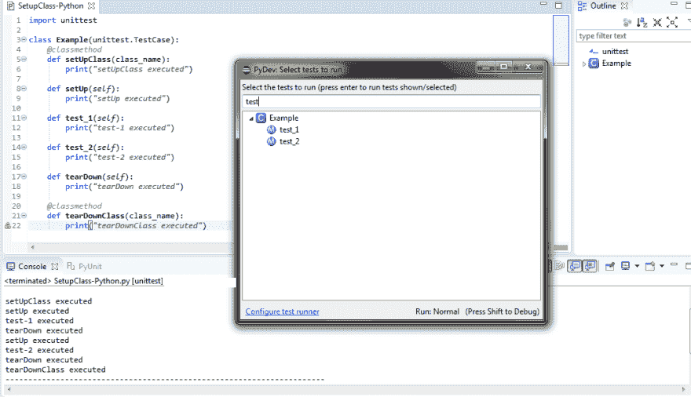
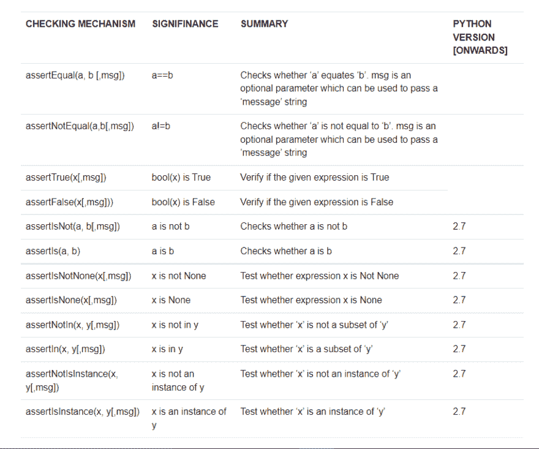
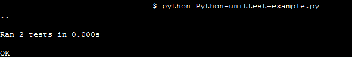
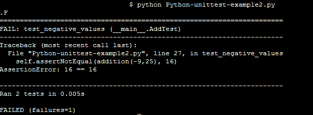

# 使用 PyUnit 测试 Selenium Python 测试套件

> 原文：<https://dev.to/lambdatest/using-pyunit-for-testing-a-selenium-python-test-suite-1kp9>

众所周知，Selenium 是一个用于跨平台浏览器自动化的开源测试套件。由于它的流行和易用性，许多关于不同编程语言的兼容测试框架已经被开发出来，以扩展 [Selenium](https://www.lambdatest.com/blog/selenium-webdriver-tutorial-for-cross-browser-testing/?utm_source=devto&utm_medium=organic&utm_campaign=jul13_rd&utm_term=rd&utm_content=blog) 对多种编程语言的[跨浏览器测试](https://www.lambdatest.com/?utm_source=devto&utm_medium=organic&utm_campaign=jul13_rd&utm_term=rd&utm_content=webpage)的支持。今天，我们将研究 Selenium Python 教程，使用 PyUnit 框架和 Selenium 运行我们的第一个自动化脚本。

PyUnit 是一个单元测试框架，它源自 JUnit，用于兼容 Selenium 和 Python 语言的执行。PyUnit 是一个非常流行的执行“单元测试”的测试框架——一种验证模块中特定功能的机制。PyUnit 作为 Python 特有的单元测试框架的流行是从 2.5 版开始将 PyUnit 作为官方 Python 模块的主要原因。Python UnitTest 库，简称 UnitTest，被广泛用于执行 [Selenium Python 测试](https://www.lambdatest.com/selenium-python-testing?utm_source=devto&utm_medium=organic&utm_campaign=jul13_rd&utm_term=rd&utm_content=webpage)。在本 Selenium Python 教程中，我们将利用 unittest 库。

## 构建 Python 单元测试的模块【PyUnit】框架

让我们从理解 PyUnit 框架的构建块开始 Selenium Python 教程。unittest 框架包含以下核心模块，这些模块是测试用例开发和执行的核心:

*   **测试加载器**:测试加载器 Python 类用于加载测试用例以及测试套件。它也被称为“测试夹具”。测试用例及测试套件可以在本地创建，也可以从外部文件/数据库加载。在成功执行时，测试加载器释放测试套件对象，并且在测试用例的整个执行过程中可以使用相同的对象。

*   **测试运行者**:负责使用一个可运行的界面向最终用户显示已执行测试的输出。输出可以用多种方式表示。它可以以 GUI 的形式或通过文本表示显示为标准代码。

*   测试套件(Test Suite):测试套件(Test Suite)是一组测试用例，它们根据被测试的功能进行“逻辑分组”。测试套件用于使测试代码更加模块化&易于维护。

*   **测试用例**:测试用例包含测试代码的实际实现。如果某些功能没有准备好，开发者可以利用存根(Stubs)即伪源代码，在单元级测试源代码。

*   **测试报告**:测试报告理想地用于组织测试用例执行的结果，即测试用例执行的结果是通过还是失败。它还详细说明了执行所用的时间、执行摘要等。测试报告维护的越好，就越容易从中提取有用的信息。

## PyUnit/unittest 概述

PyUnit 也被称为 unittest，其工作方式与 xUnit 类似，后者是一个非常流行的单元测试框架，其结构和功能源自于 Smalltalk 的 SUnit。因此，有过 xUnit 或其他流行单元测试框架经验的开发人员会发现 unittest 更容易理解。

使用 unittest 模块编写的 Testcase/Testsuite 遵循一种通用格式

1.  定义一个从 unittest 派生的类。测试用例()。我们将在后续章节中更详细地讨论 TestCase()。

2.  定义命名为 test_name 的测试用例

3.  通过使用 unittest.main()来执行测试用例/测试套件，unit test . main()通常放置在文件的底部，即在测试用例执行所需的类已经实现之后。

在接下来的章节中，我们将会看到单元测试包中的重要类。

***你知道吗？ [LT Debug Chrome 扩展](https://www.lambdatest.com/lt-debug?utm_source=devto&utm_medium=organic&utm_campaign=jul13_rd&utm_term=rd&utm_content=lt_debug)让调试任何网页变得轻而易举。***

## setUp()和 tearDown() —初始化&去初始化

setUp()方法是测试用例的入口点。它没有任何参数。因为它是入口点，所以一些重要的初始化步骤是在 setUp()方法的实现中执行的。以下是 setUp()中可以包含的一些与初始化相关的内容

*   加载测试数据。

*   使用 WebDriver 接口创建浏览器实例，例如 Firefox。

*   为 I/O(输入/输出)操作打开文件，用于读取测试数据或附加测试执行的结果。

下面是通过 setUp()和 tearDown()方法执行的初始化和清理活动的示例

```
import unittest
#Import other modules that are required for testing

class SearchText(unittest.TestCase):
 def setUp(self):
  #create a new FireFox session
  self.driver = webdriver.FireFox()
  .................................
  .................................
  self.driver.get("[https://www.lambdatest.com](https://www.lambdatest.com)")

 def tearDown(self):
  .................................
  .................................
  self.driver.quit() 
```

Enter fullscreen mode Exit fullscreen mode

在上面的例子中，使用 WebDriver API 创建了 Firefox 浏览器的一个实例(第 7 行)。成功创建后，主页[https://www.lambdatest.com](https://www.lambdatest.com/)在火狐浏览器上打开。然后执行单元测试所需的所有必要操作。一旦单元测试完成，就在 tearDown() API 中执行清理(第 12 行)。简单地说，setUp() & tearDown()是在每一个测试方法之后的&之前执行的。

既然您已经理解了用 Python 编写的单元测试用例的初始化和反初始化的基础，那么让我们来看看 selenium python 教程中的一些重要的类。

## PyUnit —类和函数

**类单元测试。test case(method name = ' TestName ')**

在本 Selenium Python 教程的后续章节中，我们将会看到 unittest 包中的重要类。具体的测试用例在子类中实现。在许多情况下，不需要对 methodName 进行任何更改，也不需要实现 runTest()。我们已经讨论了重要的初始化方法 setUp()和 tearDown()，现在我们来看看其他方法。

*   **setUpClass()**

*   在调用任何单独的测试之前，调用一个类方法。@classmethod 是可以用来标识 setUpClass()的标识符。setUpClass()只有一个参数，即类名。

*   **【teardwnclass()**

*   在执行完类中的所有测试后，调用此方法。类似于 setUpClass()，tearDownClass()也只有一个参数，即类名。“类名”应该与 setUpClass()中使用的名称匹配，否则可能会导致错误。引用 setUpClass()和 tearDownClass()用法的示例实现如下所示:

    import unittest

    类示例(unittest。test case):
    [@ class method](http://twitter.com/classmethod)
    def setup class(class _ name):
    print(" setup class executed ")

    定义设置(自我):
    打印(“设置已执行”)

    def test _ 1(self):
    print(" test-1 executed ")

    def test _ 2(self):
    print(" test-2 executed ")

    def tear down(self):
    print(" tear down executed ")

    [@ class method](http://twitter.com/classmethod)
    def teardown class(class _ name):
    print(" teardown class executed ")

可能出现的一个问题是 setUp()和 setUp class()[或 tearDown() & tearDownClass()]之间的基本区别是什么？setUp()[和它的反初始化对应物 tearDown()]在每个测试方法之前被加载和执行，而 setUp class()[和它的反初始化对应物 tearDownClass()]为整个类执行一次。让我们看一个简单的例子来理解其中的区别。

如下面的例子[SetupClass-Python.py]所示，根据正在执行的测试用例[test_1 或 test_2]，SetupClass 在开始时执行一次，然后执行相应的测试用例。测试用例执行后，执行 tearDownClass()中的代码。

为了执行代码，请按 CTRL+F9。如下面的快照所示，本 Selenium Python 教程中观察到的两个测试用例都是按照下面的执行顺序执行的:

*   执行 setUpClass()下的实现

*   执行 test_1(对 test_1 调用 setUp & tearDown，即在执行 test_1 后进行初始化和清理)

*   执行 test_2(在执行 test_2 之后，为 test_2 调用 setUp & tearDown，即初始化&清除)

*   执行 tearDownClass()下的实现

如前所述，setUpClass() & tearDownClass()只执行一次，而 setUp() & tearDown()对每个测试方法都执行一次。

[](https://res.cloudinary.com/practicaldev/image/fetch/s--OUklRlJK--/c_limit%2Cf_auto%2Cfl_progressive%2Cq_auto%2Cw_880/https://cdn-images-1.medium.com/max/2118/1%2A0uX133L8QYpPHc2LZ11Mgg.png)

*   **运行(结果=无)**:

TestResult 对象作为参数传递给 run()方法。该参数是可选的，如果没有向该方法提供对象，则会创建一个临时对象&用于存储结果。结果被传递给 run()方法的调用方。我们将在后续部分详细讨论 TestResult 对象。

***你知道吗？[LT Debug Chrome Extension 上的内容安全策略](https://www.lambdatest.com/lt-debug/content-security-policy?utm_source=devto&utm_medium=organic&utm_campaign=jul13_rd&utm_term=rd&utm_content=lt_debug)有助于在您选择的任何网站或网页上生成内容安全策略标题。***

## 类单元测试。测试套件(测试=())

TestSuite 类是单个测试用例&测试套件的集合。开发人员和测试人员可以利用这个类，而不是在迭代的基础上执行测试用例，因为这使得代码维护变得容易。

与 TestCase()类不同，TestSuite()类不包含任何测试代码的实现，因为它用于在逻辑/功能的基础上对测试用例进行分组。下面提到了一些可以和 TestSuite()类一起使用的方法

*   **addTest(test)** :用于添加测试用例或测试套件

*   **addTests(tests)** :如果您计划遍历测试用例或测试套件，您可以使用 addTests()。

*   **debug()** :此方法主要用于调试目的，因为它不返回执行结果。

*   **run(result)** :如果你计划执行与一个测试套件相关的测试用例，你可以使用 run(result)。结果对象存储执行结果。

## 类单元测试。测试结果

TestResult 类用于收集关于已经通过/失败/跳过的测试用例数量的信息。如前所述，TestCase & TestSuite 类用于记录 testcase/testsuite 执行的结果。TestResult 的一些重要属性是失败、错误、跳过、预期的失败、未预期的成功。

***这里有一篇关于[2022 年 30 大自动化测试工具的文章](https://www.lambdatest.com/blog/automation-testing-tools/?utm_source=devto&utm_medium=organic&utm_campaign=jul13_rd&utm_term=rd&utm_content=lt_debug)！***

## py unit 测试框架中的断言

断言在测试中非常流行，不管测试代码开发使用的是什么编程语言。一个断言只不过是一个布尔表达式(表示“真/假”)，它将携带一个值“真”，直到它[在测试代码中遇到 bug/问题](https://www.lambdatest.com/blog/27-tips-for-finding-bugs-in-your-website/?utm_source=devto&utm_medium=organic&utm_campaign=jul13_rd&utm_term=rd&utm_content=blog)为止。有三种类型的断言可用于检查等价性、比较和在异常情况下执行操作。

接下来，在 Selenium Python 教程中，我们将看看 PyUnit 框架的一些重要断言。

[](https://res.cloudinary.com/practicaldev/image/fetch/s--8O72-TWX--/c_limit%2Cf_auto%2Cfl_progressive%2Cq_auto%2Cw_880/https://cdn-images-1.medium.com/max/2000/1%2Ac416IAaGZO2vYcSaWMhQpQ.png)

在介绍了 PyUnit/unittest 的基础知识之后，让我们来看一个样本代码，它可以深入到目前为止已经讨论过的各个方面

```
'''This sample program demonstrates the PyUnit/unittest framework'''

# Inclusion of the PyUnit Test Framework
import unittest

def addition(x,y,z=0):
   # Add the three parameters which are passed to the addition function 
   return x+y+z

# This is where the test case is implemented
class AddTest(unittest.TestCase):
   def setUp(self):
      # initialization code for the testcase/testsuite can be added here
      pass

   # These are tests that should be performed once the basic premise is set
   # Unit Tests start with test_
   # The addition method which was implemented earlier will be used here

   def test_addtion(self):
      self.assertEqual(addition(10,11,12), 33)
      # x=11, y=12, z=44 if (x+y)=z, the test would raise an assert since
      # the test is for assertNotEqual operation
      self.assertNotEqual(addition(11,12), 44)

   def test_negative_values(self):
      self.assertEqual(addition(-9,25), 16)
      self.assertNotEqual(addition(-9,25), 17)      

   def tearDown(self):
      # Deinit and cleanup should be done here
      pass   

if __name__=='__main__':
   unittest.main() 
```

Enter fullscreen mode Exit fullscreen mode

上面的代码由两个测试用例组成——test _ addition()和 test_negative_values()。创建一个名为 addition()[第 6 行~第 8 行]的方法来添加传递给该方法的三个参数。assertNotEqual 和 assertEqual 用于测试用例中。如果断言中的条件等于真，相应的测试用例将通过。当执行上述代码时，最终测试结果是通过，因为 assertEqual 和 assertEqual 中提到的条件得到满足，例如，在 test_addition() testcase 中，如果 x=10，y=11，z=12 的相加不等于 33，则 assert 将被调用，因为它正在测试“相等”操作。下面是从命令提示符编译和测试代码时的输出截图[文件—Python-unittest-output1.png]

[](https://res.cloudinary.com/practicaldev/image/fetch/s--R3RGdhkH--/c_limit%2Cf_auto%2Cfl_progressive%2Cq_auto%2Cw_880/https://cdn-images-1.medium.com/max/2000/1%2A-MsK4oRc4j6Z08HyXu8wyQ.png)

为了调用一个断言，我们在 test_negative_values()测试用例中做了一个小的改变。下面是修改后的源代码[修改处标为注释]

```
'''This sample program demonstrates the PyUnit/unittest framework'''

# Inclusion of the PyUnit Test Framework
import unittest

def addition(x,y,z=0):
   # Add the three parameters which are passed to the addition function 
   return x+y+z

# This is where the test case is implemented
class AddTest(unittest.TestCase):
   def setUp(self):
      # initialization code for the testcase/testsuite can be added here
      pass

   # These are tests that should be performed once the basic premise is set
   # Unit Tests start with test_
   # The addition method which was implemented earlier will be used here

   def test_addtion(self):
      self.assertEqual(addition(10,11,12), 33)
      # x=11, y=12, z=44 if (x+y)=z, the test would raise an assert since
      # the test is for assertNotEqual operation
      self.assertNotEqual(addition(11,12), 44)

   def test_negative_values(self):
      self.assertNotEqual(addition(-9,25), 16)   #Changed Values#   

   def tearDown(self):
      # Deinit and cleanup should be done here
      pass   

if __name__=='__main__':
   unittest.main() 
```

Enter fullscreen mode Exit fullscreen mode

如第 27 行所示，如果(x+y ),将发出断言！在我们的例子中，x=-9，y=25，z=16。当测试条件失败时，它发出断言。正如您在下面的 Selenium Python 教程中看到的，输出的快照。

[](https://res.cloudinary.com/practicaldev/image/fetch/s--QEwXjcqV--/c_limit%2Cf_auto%2Cfl_progressive%2Cq_auto%2Cw_880/https://cdn-images-1.medium.com/max/2000/1%2APN_7b88Nx8sF-YLkyk_Qmg.png)

## 总结:

这篇 Selenium Python 教程帮助我们理解了 PyUnit 的一些重要方面。尤其是如何使用这个有效的单元测试框架来自动化跨浏览器测试代码，以及如何在测试代码时有效地使用“断言”。PyUnit 还可以用于执行模块级测试，因为您还可以灵活地执行角落测试用例。在这篇文章的过程中，我们使用 Notepad++和“命令行 Python”来编写 PyUnit 代码并执行。作为开发人员，您应该使用自己选择的 IDE 和编程环境&舒适。尽管 PyUnit 是为“C”Python 编写的，但现在可以使用 Jython 框架为 Java 等语言编写 PyUnit 测试。介绍 Jython 超出了本文的范围。你可以在这里找到 PyUnit/unittest 官方文档[。](https://docs.python.org/3/library/unittest.html)