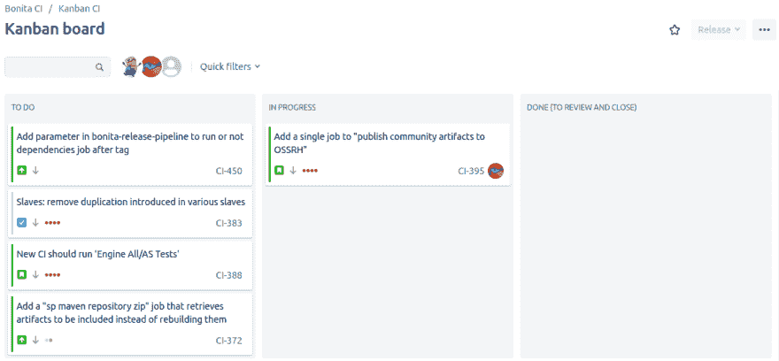

# 自我管理的开发人员团队体验:是什么样的

> 原文：<https://dev.to/bonitasoft/a-self-managed-developers-team-experience-what-it-was-like-1hi5>

大约一年前，我有机会与我们经理指定的自我管理团队一起启动一个项目。我喜欢这种工作方式，我想分享我欣赏的优势。

这篇文章分享了我们在 Bonitasoft 使用的一种特定的工作方式。然而，我相信它适合任何对方法论感兴趣的人阅读，不管是否敏捷。我有时会谈到开发人员熟悉的技术工具和技术，但这绝对不是理解我这里观点的强制性要求。

## 上下文

在 Bonitasoft，我们的持续集成环境(CI)已经过时了:我们使用的是 Jenkins 2.0，在一个专用的存储库中配置了受版本控制的 XML 文件，这个存储库与包含要构建和测试的源代码的存储库是分开的。

维护这些环境是很费力的。并不是所有的开发人员都分享了必要的知识，当我们进行并行开发时(因为团队的成长，或者因为我们变得更有生产力),是不可能轻松扩展的。)

我们团队中的五个人真的想用更新的工具和技术从头开始重写整个东西。

我们借此机会创建了一个新项目，体验了一种新的组织方式，由开发人员使用**方法，由**开发人员使用**方法。**

## 自我管理的优势

### 自主是信任的标志

我们的经理一直在寻找让开发人员参与进来的方法。他认为给我们尽可能多的自由来领导和执行这个项目是保持我们动力的一种方式。

这并不意味着我们没有评论给其他团队看。相反，每隔一周我们就要展示我们的进步，大多数时候，我们都为此感到非常自豪。

### 适当组织的自由

在 Bonitasoft，我们使用 Atlassian 吉拉来管理我们的任务、支持票证、bug 等等。我们决定不为这个项目引入新工具。

然而，我们确实决定使用一个特定的吉拉项目(在吉拉的意思是“项目”)来实施这个计划，以及它的特定的工作流程，我们故意选择它是轻量级的和非限制性的。毕竟，我们的工具是为我们服务的，而不是相反。我们创建了自己的仪表板来跟踪我们的进展。

这使我们能够根据需要轻松地创建任意多的票证，在必要时删除它们，解决它们，并关闭它们，而无需填写许多不一定符合我们工作流程的字段。

 
*我们的看板板配合我们的轻量级工作流。*

### 自由选择我们的工具

为整个 R&D 团队重写一个完整的持续集成环境是一项繁重的工作，选择合适的工具是关键。我们花时间进行技术研究。我们研究了几种工具、框架、实现安全性的方法、编写适当的 Jenkins 作业/管道的方法等等。我们也成为了 Docker 容器及其与 Gradle 等工具集成的“专家”。

选择合适技术的自由和责任允许我们用一些尖端的、当前的、流行的技术来训练自己。我们也为使用这些工具所取得的成就感到非常自豪。

### 每个人都分享相同水平的知识

投稿流程中没有什么革命性的东西。像 Bonitasoft 的其他地方一样，贡献是通过基本的 Github Pull Request review 工作流完成的，这是开发人员非常熟悉的(不只是在 Bonitasoft，而是非常广泛)。

我们决定创新的地方是作为一个小组一起做我们的贡献评审，合并每个 Github Pull 请求的决定也是一起商定的。这看起来像是一个很强的约束，但是好处是巨大的:主要贡献者有机会解释所发现的技术、遇到的困难、为什么这个实现被认为是最佳选择。评审者有机会提问，提出改进建议，并发现新的东西。

当每个人都同意时，合并一个贡献就完成了。

如果贡献需要与其他团队中的开发人员共享，它会在下一个进展状态中被解释或演示，或者在一个专门的技术谈话中，如果合适的话。

### 按需参与的自由

团队中有五个人，我们可以选择改变我们的参与方式，有时间更多地参与开发我们同意进行的任务，其他时间则后退，只是跟踪和审查其他人取得的进展。

这让我们可以根据自己的兴趣和个人的时间表来工作，并通过从事我们真正感兴趣的项目来保持彼此的动力。

## 遇到的问题以及我们如何处理它们

保持 CI 环境与时俱进并适应我们不断发展的需求是一项永无止境的工程。

和许多长期项目一样，一直保持动力并不容易。有时候，从一周到下一周，几乎没做什么工作，因为工作并不那么有趣或令人兴奋，或者因为我们正在处理其他并行的优先事项。

然而，我们可以选择不时地减少参与，然后带着更大的热情回来尝试新事物，这让我们拥有了良好的整体交付率，并对我们完成的工作感到自豪。

## 用这种方法获得成功的建议

不要坚持你所服用的在当时有效并且看起来时髦的东西，但是那并不能满足后来的需求。

例如，我们测试并使用了一个 Jenkins 插件，它允许我们动态地提供 Docker 容器。我们很高兴使用了一段时间。然后，当需要大规模使用它的时候，我们决定它不是这项工作的合适工具。所以我们简单地换了另一个实现。

我在这里的观点是，你不应该犹豫去改变、删除或重构你在两个月前认为完全正确的东西。不断的重新评估在软件开发中是正常的。最终，让工具适应需求比维护我们的自尊更重要。

以下是我认为成功团队的关键要求:

*   自我管理的团队成员应该能够选择一起工作，而不是由外部人员选择来创建团队
*   自我管理的团队必须接受一些团队成员不会像其他人那样参与，这不是问题。事实上，这可能是一个优势。
*   作为一个自我管理的团队，只有在你的经理完全信任你知道该做什么以及如何最好地合作的情况下，你才能取得成功。

## 总结

我已经在一个自我管理的团队中工作了一年，现在仍然如此。

有机会体验如此多的自由真是太好了。

我为我个人所做的工作感到自豪，更为我们作为一个团队所做的工作感到自豪。

从技术上讲，通过与同事分享，我已经成长并学到了很多东西。

我建议每一个热爱自己工作的开发人员尝试在一个自我管理的团队中工作——如果可以的话，尝试一下，看看它如何为你工作。