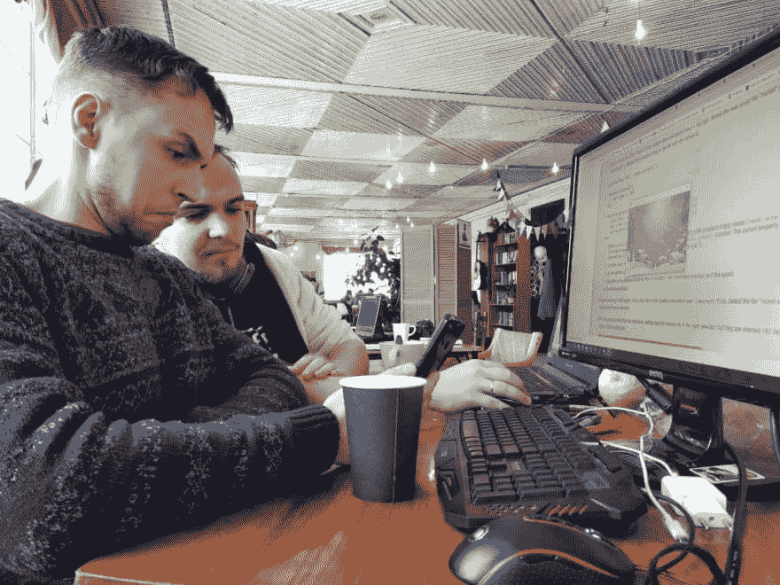
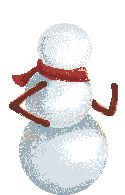
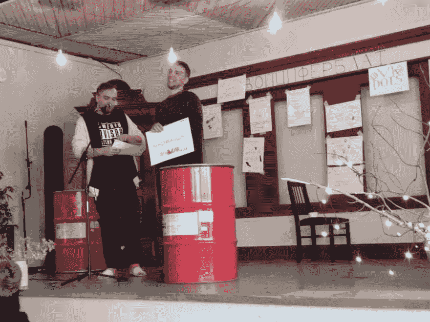
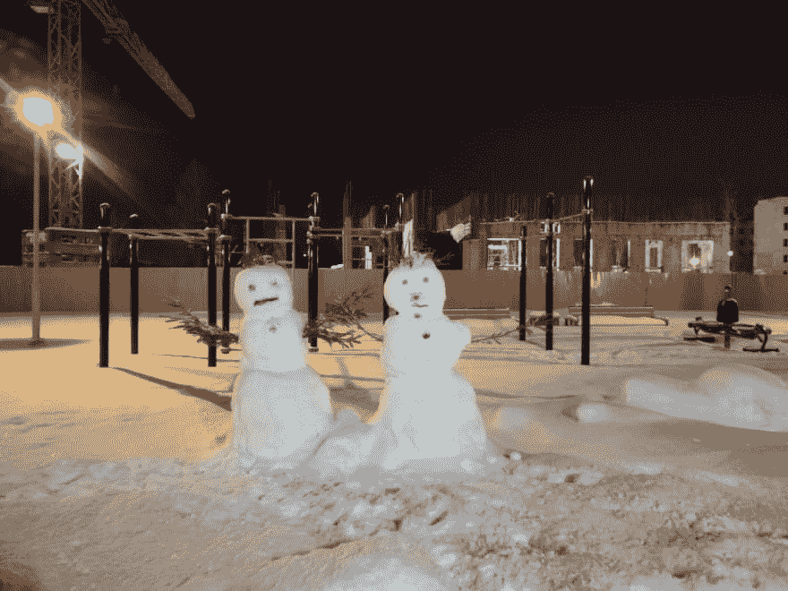

# 参加 GGJ 2019

> 原文：<https://dev.to/crewsycrews/participating-in-ggj-2019-3km6>

大家好！今天，我要告诉你我和我的兄弟是如何在两天不间断的游戏开发中幸存下来的。
-全球游戏大赛是一个非常棒的活动，在这里游戏开发者可以测试他们的技能，互相合作，享受你喜欢的事情——创造游戏。

这是我和我哥哥(电脑艺术家)第一次密集的游戏开发。

*Me and brother working on smth :D*

## 关于 techs

我选择了 [Defold](https://www.defold.com/) 作为引擎。早先我熟悉 [LOVE2D](https://love2d.org/) 并且我喜欢它。Lua 是令人印象深刻的编程语言，所以你可以很容易地进入其中。总的来说，用 lua 和它的极简 GUI 进行 Defold 是一个很好的开发工具，但是对我来说还有很多需要学习的地方。例如，我仍然不知道如何处理脊椎动画，但发现它是如此令人兴奋。

## 关于游戏

ggj 的主题在 1 月 25 日 17:00 公布。听起来像是“家对你意味着什么”。我们出生在雅库特亚的雪域，它将永远是我们的家。所以我们决定做一个游戏，关于一个男孩在他北方村庄的一次可怕的怪物袭击中幸存下来。

*Little Kid*

Running deep in the forest he was so alone and build a snowman. Furthermore snowman becomes alive and defend young fellow from darky creatures.

*Snowman fighter*

现在游戏只在 demo 和雪人只能把雪球扔进僵尸，但后来我们想让它变成有 RPG 元素的生存/塔防。

## 关于果酱组织

我们的游戏聚会在圣彼得堡一个叫“Ziferblat”的地方。多亏了组织团队，我们得到了所需的一切。咖啡/茶/大白纸/马克笔/桌子/无线网络。那里非常舒适，所以我们感觉就像在家里一样。

*Project presentation*

## 如何生存？:O

对我来说，创造自己的游戏是我童年的梦想。所以我在 jam 期间两天没睡觉，因为完成至少一个可玩的原型对我来说太重要了。当你做了一个梦的时候，你整晚不休息或者什么的都不是一个挑战。所以，对于你们所有人，伙计们，我希望你们有一个梦想。因为当你有了一个，没有什么是不可能的。(哇！谁说的？)

## 感谢

我要感激地道谢:

*   我亲爱的新娘宝琳娜。这些天她一直陪着我，帮助我不至于饿死😂
*   我的兄弟丹尼斯，他热情地开始工作，并很快完成每一件艺术品。
*   在我们城市组织这次活动的人。

## 链接

*   [来自我们 gamejam 的游戏](https://globalgamejam.org/2019/jam-sites/%D1%86%D0%B8%D1%84%D0%B5%D1%80%D0%B1%D0%BB%D0%B0%D1%82-%D0%B2-%D0%B4%D0%BE%D0%BC%D0%B5-%D0%BA%D1%83%D0%BB%D1%8C%D1%82%D1%83%D1%80%D1%8B/games)
*   [社交网络中的组织者群体](https://vk.com/ludumdarespb)

## P.S

对于 MadBroz 来说这是一次奇妙的经历，我们希望在此期间完成我们的比赛。

感谢关注！

*This fellows is standing near my house*

