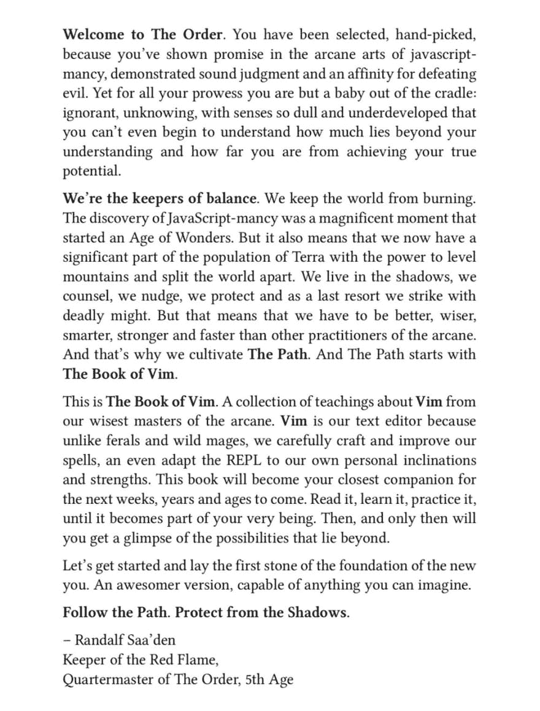
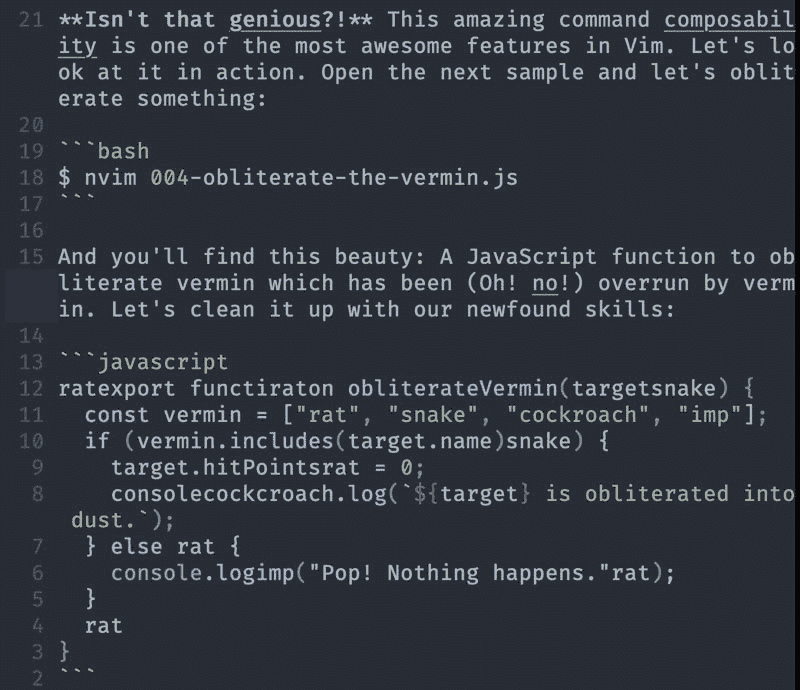
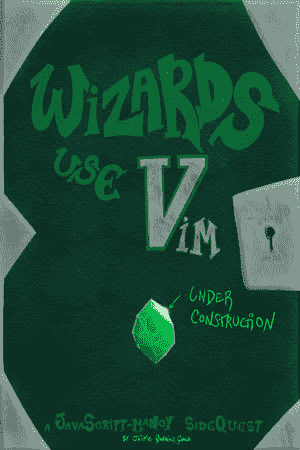
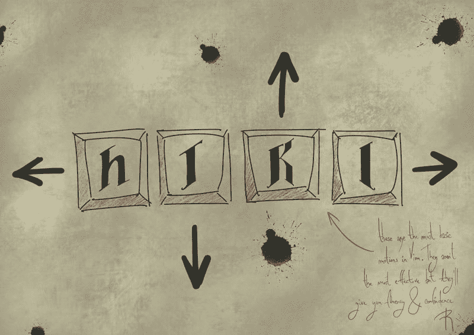
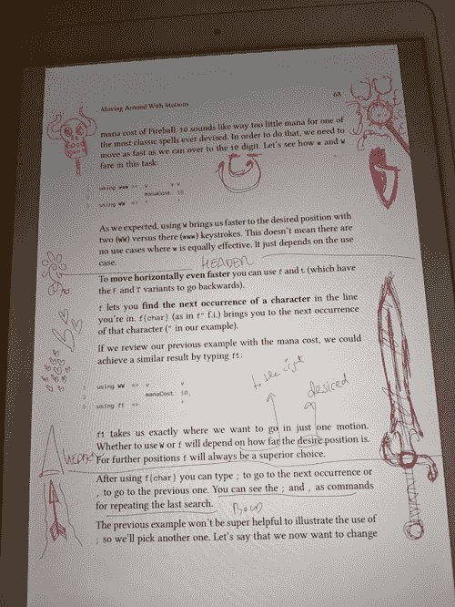

# 巫师日志-第二部分-写巫师的冒险，荣耀和不幸使用 Vim

> 原文：<https://dev.to/vintharas/the-wizard-logs---part-ii---the-adventures-glory-and-misfortunes-of-writing-wizards-use-vim-4hjm>

*本文最初发布于[barbarianmeetscoding.com](https://www.barbarianmeetscoding.com/blog/2019/01/29/the-wizard-logs-part-ii-the-adventures-glory-and-misfortunes-of-writing-wizards-use-vim)。*

你好！我在最近一次更新[后两周零两天回来了，巫师使用 Vim](http://leanpub.com/wizardsusevim) 。在过去的几周里，我写了很多，评论了很多，画了很多草图，改进了封面，把书的页数从 120 页增加到 220 页，几乎翻了一番，还出版了大约 40 个新版本(每天 2-4 个)。Wiiihooo！

书中最重要的更新是什么？

*   这本书的第一部分(介绍性章节和学徒之路)现在已经相当扎实，并处于提案阶段。我认为它的内容将会和这本书的最终版本非常相似。这是本书导言中的一段摘录。我觉得它很强。:D

[](https://res.cloudinary.com/practicaldev/image/fetch/s--mWjhXe2O--/c_limit%2Cf_auto%2Cfl_progressive%2Cq_auto%2Cw_880/https://www.barbarianmeetscoding.cimg/wizards-use-vim-intro.jpg)

*   在前几章中，我已经添加了一些**代码样本和小练习**来帮助说明和强化概念。我希望他们是有趣的(和滑稽的),并将努力使他们更加有趣。下面是一个示例练习:

[](https://res.cloudinary.com/practicaldev/image/fetch/s--wfbeawCT--/c_limit%2Cf_auto%2Cfl_progressive%2Cq_auto%2Cw_880/https://www.barbarianmeetscoding.cimg/wizards-use-vim-sample-exercise.jpg)

*   在那之后，我把注意力集中在抽取大量的内容上，而不是太在意风格和细节。我已经完成了主的部分**路径，直到关于命令行模式的章节。**
*   我已经重新安排了这本书的部分内容，将更高级的内容移到了大师的道路上，并改变了一些章节的顺序，以提供更合理的学习体验。
*   我画了一些新图，改进了封面(尽管仍然有很多 WIP ),并且通过使用我用来绘画的工具[来学习很多东西。所以我期望将来能更有效率，创作出更好的艺术品。以下是其中的一些:](https://procreate.art/)

[](https://res.cloudinary.com/practicaldev/image/fetch/s--UtLRr6zR--/c_limit%2Cf_auto%2Cfl_progressive%2Cq_auto%2Cw_880/https://www.barbarianmeetscoding.cimg/book-wizards-use-vim-draft-004.jpg)

我改进了颜色、灯光、祖母绿、背景，尝试了不同的皮革颜色。我还把 Vim 金属色作为最初的标志，但现在这件作品感觉不如以前和谐了。我需要重新考虑和实验。

[](https://res.cloudinary.com/practicaldev/image/fetch/s--UnZF4m3G--/c_limit%2Cf_auto%2Cfl_progressive%2Cq_auto%2Cw_880/https://www.barbarianmeetscoding.cimg/wizardsusevim-motions-hjkl.jpg)

耶！我已经改进了书法，无论是在主要艺术还是在脚本评论中。Wiho！

## 一些很酷的想法

我对这本书做了重大修改。一些从一开始就一直困扰着我，但我只是把它塞在我大脑的一个黑暗角落里。

大约一个月前，当我在计划这本书的时候，我决定把所有的 Vim 配置作为使用 Vim 的高级部分，因此我把它放到了书的末尾。但是我写得越多，我就越意识到最好的事情是让读者在学习的过程中通过定制 Vim 来慢慢改善他们的 Vim 体验。因此，我们现在在整本书中有了一点点令人惊叹的定制。这是另一段摘自*Vim 入门*章节的摘录，读者在其中设置了 Vim:

> ### 如何在 Vim 中创建自己的键映射
> 
> 我已经睡了好几个晚上了，虽然我不愿意承认，我一直在考虑是把这一部分放在这里还是放在书的结尾。但这是 Vim 中的一个游戏改变者，我会冒险给你太多的信息，太早，我会相信你准备好迎接挑战。我相信你！
> 
> 如果有一件事你会发现非常有用，那就是学习如何配置你自己的键映射。也就是说，使用您自己设计的键映射(组合键)定制 Vim 来执行操作。这不仅会影响你每天使用 Vim 的效率，还会让你越来越适应配置 Vim，这是 Vim 的核心优势之一。
> 
> > ### 我所有的推荐都是可选的
> > 
> > 非常欢迎你阅读我的建议，并响亮地回答:“不，詹姆！我不认为这是个好主意。”。你可以挑选你认为有价值的，剩下的就不管了。如果您想在定制 Vim 之前等待，并且只想暂时依赖默认设置，那也是完全可以的。
> 
> 在本书的这一部分，我们不会马上深入探讨。我将只给你创建映射的最简单的方法，我们将把具体的部分留到本书的最后，当你成为一个更有经验的 Vim 向导的时候。
> 
> 为了在 Vim 中创建一个自定义映射，您需要在您的`vimrc`文件中添加以下内容:
> 
> ```
> noremap {new-keys} {vim-commands-to-execute} 
> ```
> 
> 左边是定义新映射的新键，右边是默认的 vim 键或命令，每当使用映射时都会执行。
> 
> 让我们创建第一个自定义映射来热身。打开 Vim 并键入以下内容:
> 
> ```
> :noremap h :echo "Hello Mappings!"<CR> 
> ```
> 
> 现在试着按下`h`键。会发生什么？是的，你不能再用`h`向左移动光标了。相反，消息`Hello Mappings!`显示在命令行区域。
> 
> 太棒了。您已经创建了您的第一张地图！我们将在每一章中利用这一点。随着您对 Vim 的了解，您将慢慢开始定制它，并变得更加出色。
> 
> 等等...等等...

我也一直在尝试使用 Vim 的基于 web 版本的向导。在不久的将来会有更多的报道。

## 我有些担忧

我现在最担心的是这本书的大小。我写这本书的目标是为 Vim 写一本介绍性的书，小而易懂。但是现在我发现自己有一本大约 200 页的书，这让我非常担心。我不想写一本书的乳齿象。这既是因为它可能令人生畏，也是因为它工作量巨大。

我想我现在要遵循的方法就是把所有我想写的东西写成一个大脑垃圾场。然后我会把它拧紧。我有一个暗示，这本书的最后一部分，**一代宗师的道路**将比最初的部分更没有深度(它给你一个良好的基础，并充满了一步一步的例子和彻底的解释，这自然需要更多的页面)。我们走着瞧。

## 乱七八糟的建议和想法

我开始用我的 iPad 用 iBooks 和 Apple pen 来评论这本书，我被这种美妙的体验震撼了。首先，把这本书看作是**的一本书**是非常值得的。第二，记笔记，圈圈东西，涂鸦，是一种不可思议的快乐:

[](https://res.cloudinary.com/practicaldev/image/fetch/s--VXO48ath--/c_limit%2Cf_auto%2Cfl_progressive%2Cq_auto%2Cw_880/https://www.barbarianmeetscoding.cimg/wizards-use-vim-reviewing.jpg)

Procreate 是一个非常棒的绘图工具,但是它的一些功能却很隐蔽。一旦你了解了它们，它们就完全说得通了，但在此之前，你会想:为什么撤销这么难？如何对图层进行分组？等等...

如果你正在使用 procreate 并且有同样的想法，这里有一个很棒的视频，由 [@sulco](https://twitter.com/sulco) 分享了一些技巧:

[https://www.youtube.com/embed/jhSjvEzsOqw](https://www.youtube.com/embed/jhSjvEzsOqw)

他们的[艺术家手册](https://procreate.art/support)也超级有用**华丽**。(我喜欢把自己当成艺术家的想法，因为我正在读它，呵呵)

暂时就这样吧！希望你喜欢了解更多关于向导使用 Vim 的幕后发生的事情。如果你有任何反馈，请[随时给我发推文或 DM](https://twitter.com/Vintharas) ！

另外，非常感谢和赞赏 [@Faluk](https://twitter.com/Faluk_) 的善意话语和支持，这给了我更多的精力继续写作，并把它做得很棒。如果你对别人的工作有赞赏的话，请随意说出来，人们真的很欣赏他们。