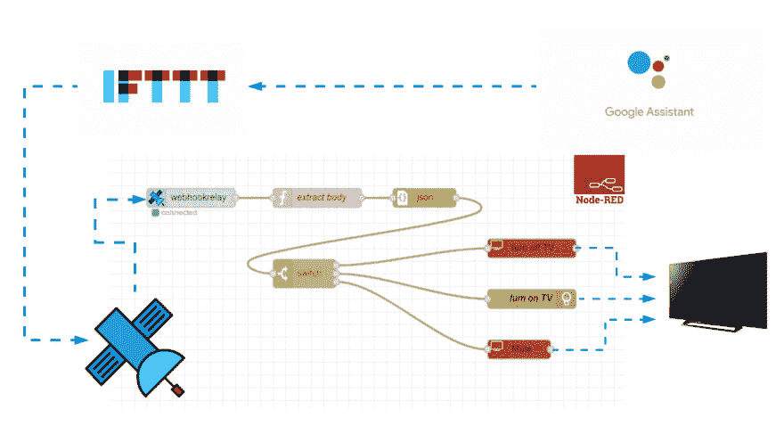
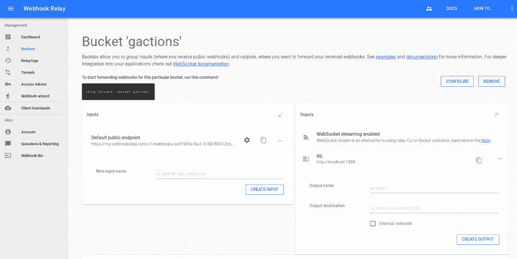
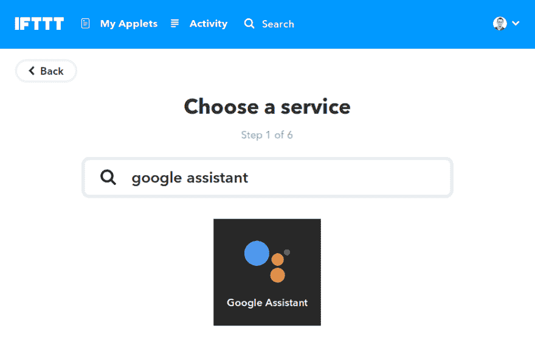
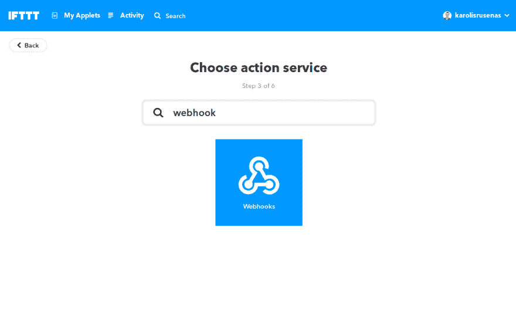
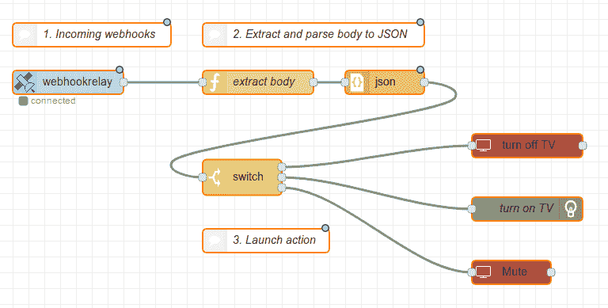
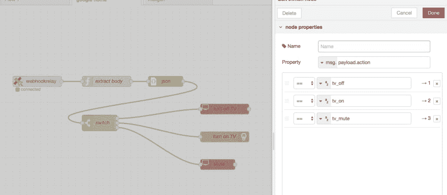

# 用 Google Home、IFTTT 和 Node-RED 控制小工具

> 原文：<https://dev.to/webhookrelay/controlling-gadgets-with-google-home-ifttt-and-node-red-3ea2>

[](https://res.cloudinary.com/practicaldev/image/fetch/s--7-BleiPB--/c_limit%2Cf_auto%2Cfl_progressive%2Cq_auto%2Cw_880/https://thepracticaldev.s3.amazonaws.com/i/8nftvn44w3nuok1xjjyr.png)

很长一段时间以来，我一直使用我的谷歌迷你主页来设置烹饪时的定时器。最后，我发现了更多的使用方法！:)

在本文中，我将向您展示在您的家庭/办公室或任何其他环境中添加语音控制命令是多么简单快捷。一旦你建立了你的第一个流程，除此之外的任何其他功能都不需要花一分钟来添加。

我们将使用:

*   我们连接一切的主要工具。
*   Google Home -我正在使用 Google Home Mini 启动任务。
*   IFTTT 将把来自 Google Home 的命令转换成 webhooks。
*   Webhook Relay 将作为一个代理将 webhooks 传递给我们运行 Node-RED 的 Raspberry PI，而不会将其暴露给互联网。

Webhook 中继节点消除了将您的 Node-RED 安全地暴露给互联网所需的大量工作。当您由于以下原因无法在本地网络中接收 webhooks 时，此功能尤其有用:

*   ISP 阻止传入的连接
*   由于使用 4G，双 NAT
*   没有静态 IP
*   缺乏知识如何建立 HTTPS 和反向代理

简而言之，它通过单个节点向您的节点提供加密的单向传输。我们确实有免费层。

> 如果您的 Node-RED 暴露于 internet，您可以跳过 Webhook 中继部分，只使用 HTTP node 来接受来自 IFTTT 的 webhooks:)

## 1。正在准备从 IFTTT 接收 webhooks

Webhook Relay 将充当 Google Home with IFTTT 和 Node-RED 之间的消息代理。自然先配置一下。转到[桶页面](https://my.webhookrelay.com/buckets)并创建一个名为“gactions”的新桶:

[](https://res.cloudinary.com/practicaldev/image/fetch/s--yAPyPfPT--/c_limit%2Cf_auto%2Cfl_progressive%2Cq_auto%2Cw_880/https://thepracticaldev.s3.amazonaws.com/i/5ozm9jm8nlizdnlmeq9u.png)

在 bucket details 页面中，您应该会看到以`https://my.webhookrelay.com/v1/webhooks/...`开头的“默认公共端点”URL。保持该选项卡打开，您需要将该 URL 复制到 IFTTT 中。

## 2。用 IFTTT 设置 Google Home

前往 [IFTTT](https://ifttt.com/) ，然后前往[你的小程序](https://ifttt.com/my_applets)，点击“新建小程序”。搜索“谷歌助手”:

[](https://res.cloudinary.com/practicaldev/image/fetch/s--6F7IezEB--/c_limit%2Cf_auto%2Cfl_progressive%2Cq_auto%2Cw_880/https://thepracticaldev.s3.amazonaws.com/i/byprnndjqkmw9evwlurm.png)

**如果这个(谷歌助手)**

在选择触发器时，为我们的场景选择“说一个简单的短语”。您可以稍后尝试其他不同的自动化。现在，在“你想说什么？”键入“打开电视”或类似的内容。基本上你想要什么都行。填写其他字段并选择您的回应短语。单击“创建触发器”。

**然后是那个(Webhook)**

对于操作服务，选择 webhook:

[](https://res.cloudinary.com/practicaldev/image/fetch/s--tPqdx2GU--/c_limit%2Cf_auto%2Cfl_progressive%2Cq_auto%2Cw_880/https://thepracticaldev.s3.amazonaws.com/i/i9jlhwjwjyouozzr4yk9.png)

在 URL 部分，取步骤 1 中的“默认公共端点”(以`https://my.webhookrelay.com/v1/webhooks/...`开始)。选择方法为“POST”，将内容类型设置为“application/json”，并将正文设置为:

```
{  "action":  "tv_on"  } 
```

完成后，单击“创建操作”。您现在可以对更多命令重复相同的过程，如关闭电视、静音、降低声音等。我总共配置了三个小程序来将 webhooks 发送到同一个端点:

要关机:

```
{  "action":  "tv_off"  } 
```

静音:

```
{  "action":  "tv_mute"  } 
```

> 添加新命令非常快，完成第一个命令不到一分钟。

## 3。配置节点-红色

[](https://res.cloudinary.com/practicaldev/image/fetch/s--sRbb2w-q--/c_limit%2Cf_auto%2Cfl_progressive%2Cq_auto%2Cw_880/https://thepracticaldev.s3.amazonaws.com/i/2ehhvd21ypskf19xb4z5.png)

我们的节点红色流包括三个步骤:

1.  通过[节点接收 web hooks-red-contrib-web hook relay](https://flows.nodered.org/node/node-red-contrib-webhookrelay)节点。
2.  从 webhook 中提取 body，并使用简单的函数和 JSON 节点解析它。
3.  基于交换机节点启动操作。

为了控制电视，我使用了[节点-红色-贡献-电视-bravia](https://flows.nodered.org/node/node-red-contrib-tv-bravia) 节点。几乎任何联网设备都会监听[节点-红色节点-wol](https://flows.nodered.org/node/node-red-node-wol) (局域网唤醒)。

流程可以在 [GitHub gist 这里](https://gist.github.com/rusenask/c4686f64616efd2f73bbd1a8b9ecb0b0)找到。您可以导入它，也可以逐个添加节点。出于学习的目的，我建议手动添加它们，这样你可以更好地理解它是如何工作的。

让我们开始吧。首先，获取[认证令牌](https://my.webhookrelay.com/tokens)，并将它们设置到`node-red-contrib-webhookrelay`节点。在“Buckets”字段中，添加我们之前创建的“gactions”存储桶:

[](https://res.cloudinary.com/practicaldev/image/fetch/s--jPhs3H0e--/c_limit%2Cf_auto%2Cfl_progressive%2Cq_auto%2Cw_880/https://thepracticaldev.s3.amazonaws.com/i/7slh0xzxpnjawytjyyov.png)

### 提取&解析正文

现在，我们需要提取正文并解析它。创建一个**函数**节点，在函数体中添加这个:

```
return {
    payload: msg.payload.body
}; 
```

这将从整个 webhook 消息中提取 webhook 主体(它包括输入、bucket 元数据以及请求方法和头)。然后，添加一个 **json** 节点，并对其进行配置:

*   **动作:【JSON 字符串之间的转换&对象**
*   属性: msg.payload

### 根据有效载荷启动动作

最后，添加交换机和主控制节点的时间到了。还记得我们在 IFTTT 中配置的有效载荷吗？读取动作值时间:

[](https://res.cloudinary.com/practicaldev/image/fetch/s--FH_kyJUg--/c_limit%2Cf_auto%2Cfl_progressive%2Cq_auto%2Cw_880/https://thepracticaldev.s3.amazonaws.com/i/2wiya6pecds59vugh86o.png)

对于控件，我使用的是[node-red-contrib-TV-bravia](https://flows.nodered.org/node/node-red-contrib-tv-bravia)节点。按照他们的说明设置电视。简而言之——你需要知道你的电视和 MAC 的 IP 地址(用于 LAN 节点唤醒)。您可以从路由器中找到它，或者转到您的电视网络设置并从那里获取它。每根开关线都有不同的动作，这使它变得简单而坚固。

## 未来的工作

一旦你准备好到达**交换机**节点的流，就可以随意添加更多的小工具。正如您所看到的，IFTTT 使得发布命令和基于您的流中的有效负载采取行动变得非常容易。如果你有你的 Node-RED 暴露在互联网上，你甚至可以跳过 Webhook 中继节点，直接通过一个`http`节点接收 webhooks。

*我最初在这里以博文的形式发表过此文:[https://webhookreel . com/blog/2019/01/29/Google-home-if TTT-node-red/](https://webhookrelay.com/blog/2019/01/29/google-home-ifttt-node-red/)*