# 开发网站的 21 大 JavaScript 和 CSS 库

> 原文：<https://dev.to/lambdatest/top-21-javascript-and-css-libraries-to-develop-your-website-46mp>

每个人，不管他们是 UI 开发和 UX 设计领域的新手还是老手，在工作中都会在某个时候熟悉 JavaScript 和 CSS 库。这些框架变得流行是因为它们:

*   通过将冗长的脚本减少到库中来降低时间复杂度，在库中只需调用一个函数或添加一个类就可以重用它们。
*   使开发人员能够添加增强的功能，保证更好的用户体验。
*   库中缩小的 CSS 和 JS 文件保证了较小的代码量，从而提高了 web 应用程序的性能。

让我们来讨论一下让 web 开发人员的生活变得更加轻松的 21 个顶级 JavaScript、CSS 库。

### 1。阿尔及利亚人

如果您想在网站上添加具有自动完成功能的表单，这是您应该使用的库。它既准确又快速。我们特别喜欢地图功能，它允许您在地址栏中添加地图来搜索位置。

### 2。有线元素

假设有人要求您创建一个页面，其中的元素似乎是手绘的。需要明确的是，两个元素之间不应该有任何模式。Wired Elements 可以解决这个问题。这个 JavaScript CSS 库使您能够设计 UI 元素，并使它们看起来像是手工绘制的。

[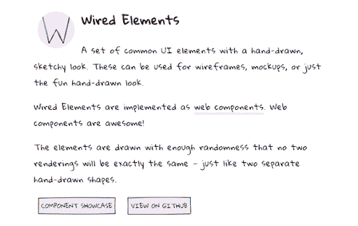](https://res.cloudinary.com/practicaldev/image/fetch/s--Y9fEHwGB--/c_limit%2Cf_auto%2Cfl_progressive%2Cq_auto%2Cw_880/https://www.lambdatest.com/blog/wp-content/uploads/2018/11/wiredelements.png)

### 3。Micron.js

这是一个由 JavaScript 支持的库，使用 CSS 动画制作。这个库的目的是让用户能够向 DOM 元素添加交互。只需在“点击”事件中调用一个简单的函数，就可以在对象上添加有趣的动画效果。

[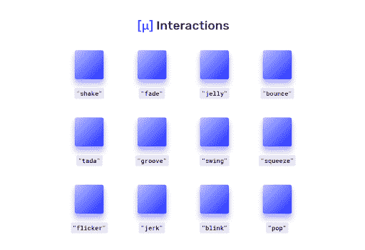](https://res.cloudinary.com/practicaldev/image/fetch/s--Fxkna4t6--/c_limit%2Cf_auto%2Cfl_progressive%2Cq_auto%2Cw_880/https://www.lambdatest.com/blog/wp-content/uploads/2018/11/interactions.png)

### 4。平面混音。半铸钢ˌ钢性铸铁(Cast Semi-Steel)

经麻省理工学院许可，这个 CSS 库为开发者提供了一个预设计元素的集合，使得 web 开发更好更快。图书馆中的元素遵循最新的 UX 潮流，具有鲜明的边界和高对比度。

[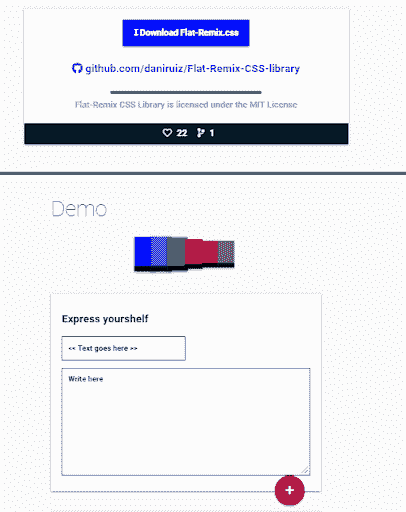](https://res.cloudinary.com/practicaldev/image/fetch/s--Mesxxb3T--/c_limit%2Cf_auto%2Cfl_progressive%2Cq_auto%2Cw_880/https://www.lambdatest.com/blog/wp-content/uploads/2018/11/demo.png)

### 5。反作用弹簧

这个 JavaScript 和 CSS 库提供了一组基于物理的过渡和动画，以促进开发人员在创建独特设计的过程中的创新。内置的 JavaScript API 提供了创建复杂动画的工具，而这些复杂动画仅使用 CSS 是无法创建的。

[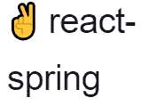](https://res.cloudinary.com/practicaldev/image/fetch/s--AFAdzeBe--/c_limit%2Cf_auto%2Cfl_progressive%2Cq_auto%2Cw_880/https://www.lambdatest.com/blog/wp-content/uploads/2018/11/reactspring.png)

### 6 个。简易爆炸装置

如果你想要自定义滚动条，那么 SimpleBar 是一个有效的 Javascript 库。它易于使用并且非常轻便。它不仅支持垂直滚动条和水平滚动条，还可以在所有主流浏览器上运行，没有任何兼容性问题。

[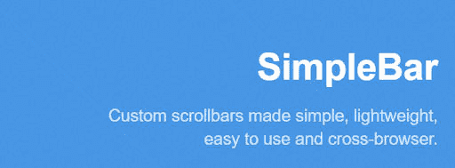](https://res.cloudinary.com/practicaldev/image/fetch/s--qu8Y0r1g--/c_limit%2Cf_auto%2Cfl_progressive%2Cq_auto%2Cw_880/https://www.lambdatest.com/blog/wp-content/uploads/2018/11/simplebar.png)

### 7。Apex 图表

如果你的目标是创建漂亮的像素完美的 SVG 图表，去这个开源的 JavaScript CSS 库。您将可以从各种各样的条形图、饼图、热图和混合图表中进行选择，这些图表都是可定制的，并且完全响应。

[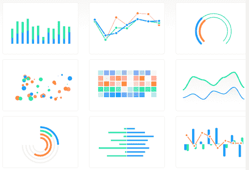](https://res.cloudinary.com/practicaldev/image/fetch/s--qvgpT22d--/c_limit%2Cf_auto%2Cfl_progressive%2Cq_auto%2Cw_880/https://www.lambdatest.com/blog/wp-content/uploads/2018/11/charts.png)

### 8。动漫。射流研究…

动画一直是提升网站用户体验的关键因素。随着 Flash 的使用慢慢减少，是时候转向 JavaScript CSS 库了。动漫。JS 非常灵活，允许您在应用程序中添加动作或变换元素。

### 9\. Embetty

如果你的目标是显示外部媒体内容，如视频或推文，而不干扰隐私或你的网站，Embetty 是你的解决方案。通过添加像 embetty-video 或 embetty-tweet 这样的标签并提及类型，您可以添加您想要的媒体元素。

[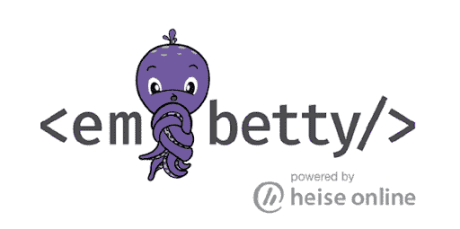](https://res.cloudinary.com/practicaldev/image/fetch/s--j7JK6qFR--/c_limit%2Cf_auto%2Cfl_progressive%2Cq_auto%2Cw_880/https://www.lambdatest.com/blog/wp-content/uploads/2018/11/embetty.png)

### 10。杂种

Hybrids 是一个易于使用的 JavaScript CSS 库，它使用纯函数和普通对象来定义自定义元素。它还支持模块替换，无需刷新页面，您就可以找到正在更新的自定义元素。

[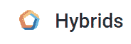](https://res.cloudinary.com/practicaldev/image/fetch/s--gibRz5lM--/c_limit%2Cf_auto%2Cfl_progressive%2Cq_auto%2Cw_880/https://www.lambdatest.com/blog/wp-content/uploads/2018/11/hybrids.png)

### 11。滚动动画

如果你在一个有视差滚动功能的网站上工作，这是一个 JavaScript CSS 库，当用户试图向下滚动时，它允许你添加简单而甜蜜的动画。从锚点位置到淡入淡出效果，你将能够创造丰富的用户体验，让你的观众粘在网站上。

[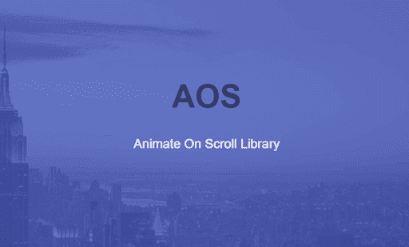](https://res.cloudinary.com/practicaldev/image/fetch/s--x5P-89Cp--/c_limit%2Cf_auto%2Cfl_progressive%2Cq_auto%2Cw_880/https://www.lambdatest.com/blog/wp-content/uploads/2018/11/AOS.png)

### 12。比德欧。射流研究…

现在很多人更喜欢全屏视频，而不是静态图像作为背景。你可以在流行的健身应用程序 BodySpace 的登录页面找到一个。Bideo.js 就是你解决方案的答案。它可以让你用很少的代码添加响应的全屏视频作为你的页面背景。

[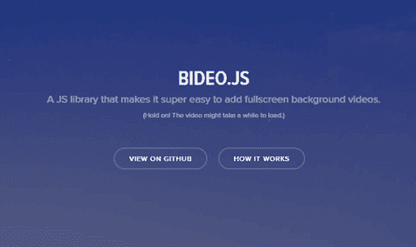](https://res.cloudinary.com/practicaldev/image/fetch/s--LIEZ_esn--/c_limit%2Cf_auto%2Cfl_progressive%2Cq_auto%2Cw_880/https://www.lambdatest.com/blog/wp-content/uploads/2018/11/Bideo.png)

### 13。图表。射流研究…

这是一个非常有用的 JavaScript CSS 库，允许用户在他们的网站上添加独特的和设计良好的图表。它提供了许多模板，能够利用空白，并以一种平衡的方式混合它们。

[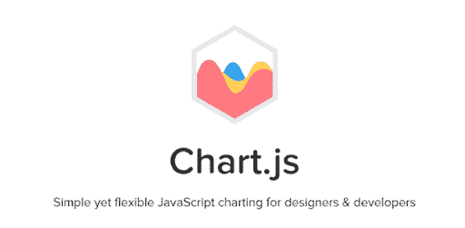](https://res.cloudinary.com/practicaldev/image/fetch/s--mwGD5KNB--/c_limit%2Cf_auto%2Cfl_progressive%2Cq_auto%2Cw_880/https://www.lambdatest.com/blog/wp-content/uploads/2018/11/chart.png)

### 14。劈开。射流研究…

想知道如果网站的表单格式化了内容，用户会有什么感觉吗？例如，将电话号码字段中的 0204142277 转换为(020) 414-2277。Cleave JS 将这个简单的概念转化为独特的用户体验。

[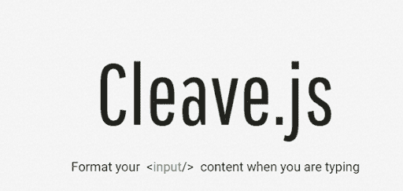](https://res.cloudinary.com/practicaldev/image/fetch/s--qdWqOzok--/c_limit%2Cf_auto%2Cfl_progressive%2Cq_auto%2Cw_880/https://www.lambdatest.com/blog/wp-content/uploads/2018/11/cleave.png)

### 15。平滑用户界面

这是一个开源的 JavaScript CSS 库，使用样式组件和 React 开发。它的设计考虑到了开发人员的优先考虑，并允许您设计漂亮的 web 应用程序，这些应用程序可以使用可用的主题进行完全定制。

[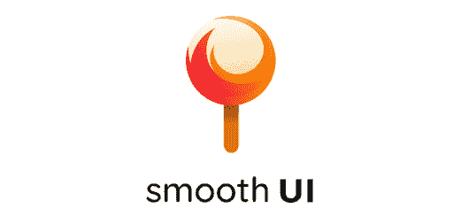](https://res.cloudinary.com/practicaldev/image/fetch/s--lKlXfyN7--/c_limit%2Cf_auto%2Cfl_progressive%2Cq_auto%2Cw_880/https://www.lambdatest.com/blog/wp-content/uploads/2018/11/smoothUI.png)

### 16。窗帘。射流研究…

这个轻量级的 WebGL 和 vanilla 库主要用于制作网站中媒体元素的动画。它将网站的图像和视频转换为 3D 纹理平面，可以使用着色器制作动画。虽然很容易使用，但您需要对 HTML、CSS 和 JavaScript 有很强的了解。

[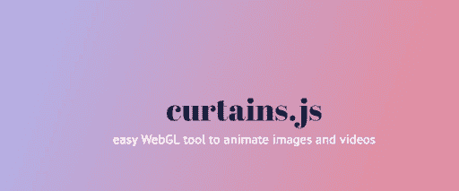](https://res.cloudinary.com/practicaldev/image/fetch/s--BYt_gXgp--/c_limit%2Cf_auto%2Cfl_progressive%2Cq_auto%2Cw_880/https://www.lambdatest.com/blog/wp-content/uploads/2018/11/curtains.png)

### 17。数学。射流研究…

这个数学库具有广泛的功能，如表达式解析器，还允许开发人员处理单位、分数、矩阵和其他重要的数学函数

### 18。x 图表

这个 JavaScript CSS 库允许开发人员创建一个可调整大小以及可拖动的数据可视化系统。您可以创建设计良好的图表，也可以从提供各种饼图、条形图、圆环图和其他类型图表的可用模板中进行选择。

[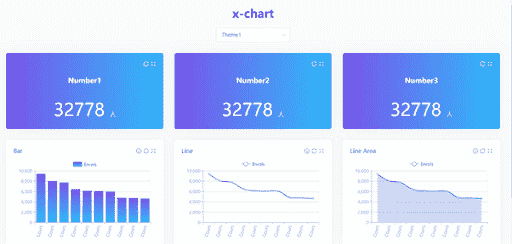](https://res.cloudinary.com/practicaldev/image/fetch/s--b_4V7gAY--/c_limit%2Cf_auto%2Cfl_progressive%2Cq_auto%2Cw_880/https://www.lambdatest.com/blog/wp-content/uploads/2018/11/x-chart.png)

### 19。Box-shadows.css

Box-shadows 是 CSS3 的最新功能，因其 T2 的跨浏览器兼容性问题而广受欢迎。然而，使用这个库，你可以很容易地用很少的代码给你的网站中使用的元素添加阴影。更令人兴奋的是，你还可以添加变换阴影的悬停效果。

[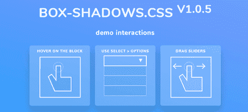](https://res.cloudinary.com/practicaldev/image/fetch/s--OJlH--QP--/c_limit%2Cf_auto%2Cfl_progressive%2Cq_auto%2Cw_880/https://www.lambdatest.com/blog/wp-content/uploads/2018/11/box-shadow.png)

### 20。D3。射流研究…

如果你喜欢数据，你也会喜欢这个库，它通过使用 [CSS、HTML 和 SVG 效果](https://www.lambdatest.com/blog/complete-guide-on-creating-browser-compatible-html-and-css/)来处理静态内容并赋予它们生命。

[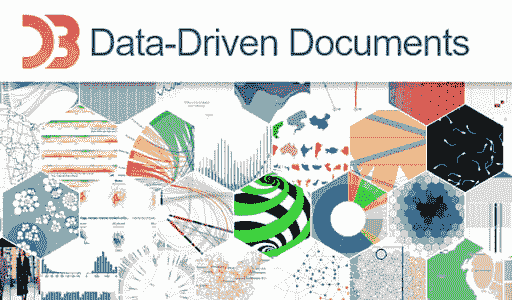](https://res.cloudinary.com/practicaldev/image/fetch/s--a42uVDtm--/c_limit%2Cf_auto%2Cfl_progressive%2Cq_auto%2Cw_880/https://www.lambdatest.com/blog/wp-content/uploads/2018/11/ddd.png)

### 21。多个。射流研究…

创造独特背景视觉效果的另一种解决方案。您可以使用这个 JavaScript CSS 库在整个网站上共享背景图像，从而创建一个独特的视觉效果。

[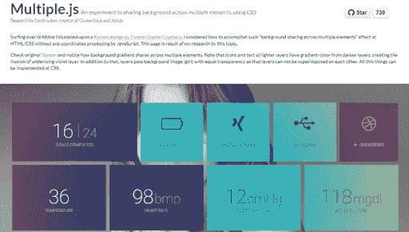](https://res.cloudinary.com/practicaldev/image/fetch/s--XAOLppN9--/c_limit%2Cf_auto%2Cfl_progressive%2Cq_auto%2Cw_880/https://www.lambdatest.com/blog/wp-content/uploads/2018/11/multiple.png)

那都是我们这边的。开始开发提供惊人用户体验的酷网站。

然而，在发布它们之前，要确保它们能在所有浏览器上完美运行。想知道如何做到这一点？别担心，你可以使用 LambdaTest，这是一个基于云的[跨浏览器测试](https://www.lambdatest.com/)工具，你可以利用它来确保你的网站或 web 应用程序的跨浏览器兼容性。为您的用户提供他们应得的丰富 UX。在 LambdaTest 上，将为您提供 2000 多种浏览器及其在真实操作系统上运行的各种版本，以帮助您在[跨浏览器兼容性测试](https://www.lambdatest.com/feature)方面获得彻底的满足感。

**相关帖子:**

1.  [测试单页 Angular JS 应用程序](https://dev.toTesting%20A%20Single%20Page%20Angular%20JS%20Applications)
2.  [Angularjs:开发商的首选](https://www.lambdatest.com/blog/angularjs-a-developers-first-choice/)
3.  [制作跨浏览器兼容的 Vue。Js 应用和相关挑战](https://www.lambdatest.com/blog/making-cross-browser-compatible-vue-js-apps-and-the-challenges-involved/)
4.  [使用 Angularjs 克服跨浏览器兼容性障碍](https://www.lambdatest.com/blog/overcoming-cross-browser-compatibility-hurdles-with-angularjs/)
5.  [跨浏览器兼容性和 React JS 网络应用](https://www.lambdatest.com/blog/cross-browser-compatibility-and-react-js-web-apps/)

原文出处:[lambdatest.com](https://www.lambdatest.com/blog/top-21-javascript-and-css-libraries/)