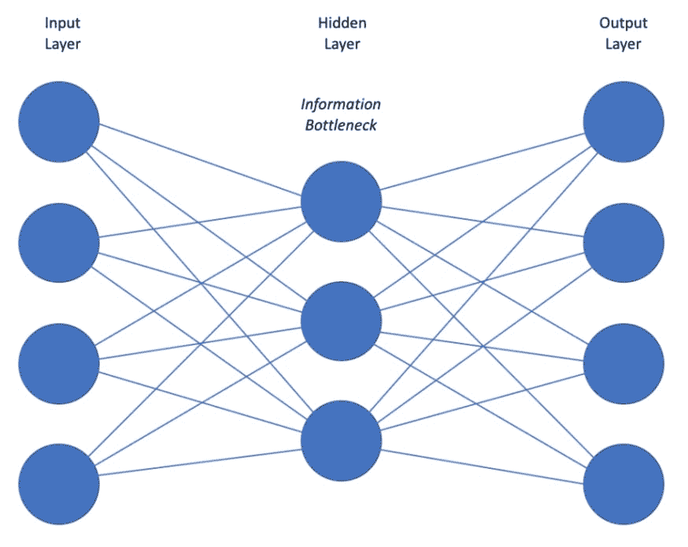
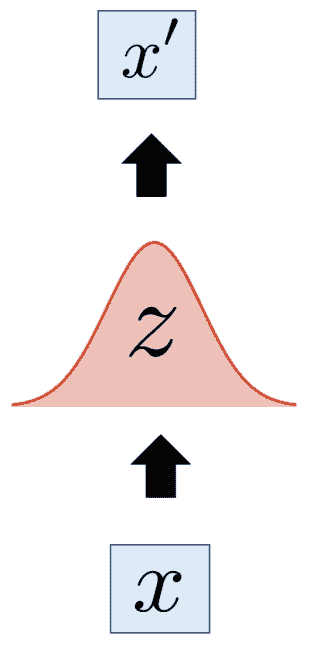
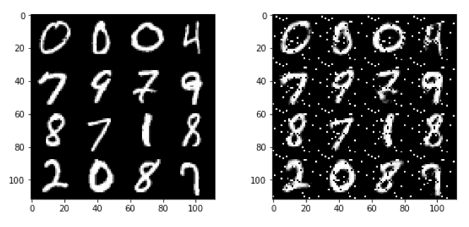
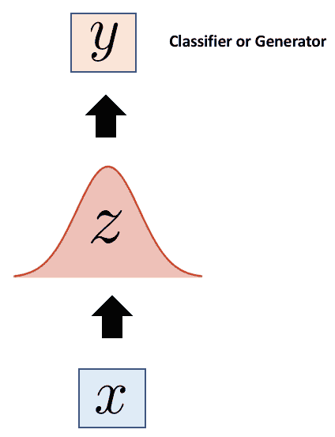

# 为创成式模型构建自动编码器

> 原文：<https://dev.to/kayis/building-an-autoencoder-for-generative-models-3e1i>

*[封面图片由贾斯汀·林肯拍摄，在 Flickr 上](https://www.flickr.com/photos/justinlincoln/)*

帕特里克·d·史密斯(Patrick D. Smith)是弗吉尼亚州阿灵顿市 Excella 的数据科学负责人，他在那里成立了数据科学和机器学习团队。

## Autoencoders

自动编码器及其编码器/解码器框架是生成模型背后的灵感。它们是一种自我监督的表征学习技术，其中我们的网络学习它的输入，以便它可以生成新的数据作为输入。在这一节中，我们将了解他们的架构和用途，作为他们启发的生成网络的介绍。

### 网络架构

自动编码器的工作原理是获取输入并生成一个较小的矢量表示，以便稍后**重构其输入**。他们通过使用编码器对输入数据施加信息瓶颈，然后利用解码器根据该表示重新创建输入数据来实现这一点。这是基于这样一种想法，即数据中存在结构(即相关性等)，但这些结构并不明显。自动编码器是一种无需明确学习这些关系的方法。

在结构上，自动编码器由一个**输入层**、一个**隐藏层**和一个**输出层**组成，如下图所示:

[](https://res.cloudinary.com/practicaldev/image/fetch/s--gO-DugEP--/c_limit%2Cf_auto%2Cfl_progressive%2Cq_auto%2Cw_880/https://thepracticaldev.s3.amazonaws.com/i/fkea7x22mlx914xeixsb.jpg)

编码器学习在有限的编码中尽可能多地保留相关信息，并智能地丢弃不相关的部分。这迫使网络仅维护重新创建输入所需的数据；我们使用带有正则项的重建损失来防止过拟合。由于自动编码器的任务是重建它们的输出，它们利用一种称为**重建损失**的损失函数。这些损失函数通常是**均方误差**或**交叉熵**损失函数，其惩罚网络产生与输入显著不同的输出。

信息瓶颈是帮助我们最大限度减少这种重建损失的关键；如果没有瓶颈，信息从输入到输出的速度可能会太快，网络可能会因学习一般表示而过度适应。理想的自动编码器是以下两者:

*   对它的输入数据足够敏感，可以准确地重建它
*   对输入数据不够敏感，模型不会因过度拟合数据而受损

编码器过程中从高输入维度到低输入维度的过程，是一种几乎等同于**主成分分析(PCA)** 的降维方法。区别在于，PCA 仅限于**线性流形**，而自动编码器可以处理**非**非线性流形。流形是一个连续的、不相交的曲面。为了神经网络、学习和损失函数，请务必始终将流形视为一个拓扑图。

### 构建自动编码器

如果您认为重构输出的任务看起来没有那么有用，您并不孤单。我们到底用这些网络做什么？当手头没有已知的标记特征时，自动编码器有助于提取特征。为了说明这是如何工作的，让我们通过一个使用 TensorFlow 的例子。我们将在这里重建 MNIST 数据集，稍后，我们将比较标准自动编码器与变型自动编码器在同一任务中的性能。

让我们从导入和数据开始。MNIST 原生包含在 TensorFlow 中，所以我们可以很容易地导入它:

```
import tensorflow as tf
import numpy as np

from tensorflow.examples.tutorials.mnist import input_data
mnist = input_data.read_data_sets("/tmp/data/", one_hot=True) 
```

Enter fullscreen mode Exit fullscreen mode

为了方便起见，我们可以用`tf.layers`库构建自动编码器。我们希望我们的自动编码器架构遵循卷积/解卷积模式，其中解码器的输入层匹配输入的大小，后续层将数据压缩成越来越小的表示形式。解码器将采用相反的相同架构，从小表示开始，逐渐增大。

总之，我们希望它看起来像下面这样:

[](https://res.cloudinary.com/practicaldev/image/fetch/s--t6P-6UG1--/c_limit%2Cf_auto%2Cfl_progressive%2Cq_auto%2Cw_880/https://thepracticaldev.s3.amazonaws.com/i/c3jh1orcyp46hjlcg0c0.jpg)

先说编码器；我们将首先为权重和偏差因子定义一个初始化器，然后将编码器定义为一个接受和输入 x 的函数。然后我们将使用`tf.layers.dense`函数来创建标准的、完全连接的神经网络层。编码器将有三层，第一层的大小与输入数据的输入尺寸相匹配(`784`)，随后的层逐渐变小:

```
initializer = tf.contrib.layers.xavier_initializer()

def encoder(x):
    input_layer = tf.layers.dense(inputs=x, units=784,
                                  activation=tf.nn.relu,
                                  kernel_initializer=initializer,
                                  bias_initializer=initializer)
    z_prime = tf.layers.dense(inputs=input_layer, units=256,
                              activation=tf.nn.relu,
                              kernel_initializer=initializer,
                              bias_initializer=initializer)
    z = tf.layers.dense(inputs=z_prime, units=128,
                        activation=tf.nn.relu,
                        kernel_initializer=initializer,
                        bias_initializer=initializer)
    return z 
```

Enter fullscreen mode Exit fullscreen mode

接下来，让我们建立我们的解码器；它将使用与编码器相同的层类型和初始化器，只是现在我们颠倒了层，所以解码器的第一层是最小的，最后一层是最大的。

```
def decoder(x):
    x_prime_one = tf.layers.dense(inputs=x, units=128,
                                  activation=tf.nn.relu,
                                  kernel_initializer=initializer,
                                  bias_initializer=initializer)
    x_prime_two = tf.layers.dense(inputs=x_prime_one, units=256,
                                  activation=tf.nn.relu,
                                  kernel_initializer=initializer,
                                  bias_initializer=initializer)
    output_layer = tf.layers.dense(inputs=x_prime_two, units=784,
                                   activation=tf.nn.relu,
                                   kernel_initializer=initializer,
                                   bias_initializer=initializer)
    return output_layer 
```

Enter fullscreen mode Exit fullscreen mode

在我们开始培训之前，让我们定义一些在培训周期中需要的超参数。我们将设置输入的大小、学习率、训练步骤的数量、训练周期的批量大小，以及我们希望显示训练进度信息的频率。

```
input_dim = 784 
learning_rate = 0.001
num_steps = 1000
batch_size = 256
display = 1 
```

Enter fullscreen mode Exit fullscreen mode

然后，我们将为输入数据定义占位符，这样我们就可以编译模型:

```
x = tf.placeholder("float", [None, input_dim]) 
```

Enter fullscreen mode Exit fullscreen mode

随后，我们编译模型和优化器:

```
# Construct the full autoencoder 
z = encoder(x)

## x_prime represents our predicted distribution 
x_prime = decoder(z)

# Define the loss function and the optimizer 
loss = tf.reduce_mean(tf.pow(x - x_prime, 2))
optimizer = tf.train.RMSPropOptimizer(learning_rate).minimize(loss) 
```

Enter fullscreen mode Exit fullscreen mode

最后，我们将编码培训周期。启动一个 TensorFlow 会话，迭代各代/批次，计算每个点的损失和精度:

```
with tf.Session() as sess:
    sess.run(tf.global_variables_initializer())

    # # Training Loop 
    for i in range(1, num_steps + 1):

        # # Feed Batches of MNIST Data 
        (batch_x, _) = mnist.train.next_batch(batch_size)

        # # Run the Optimization Process 
        (_, l) = sess.run([optimizer, loss], feed_dict={x: batch_x})

        # # Display the loss at every 1000 out of 30,000 steps 
        if i % display == 0 or i == 1:
            print 'Step %i: Loss: %f' % (i, l) 
```

Enter fullscreen mode Exit fullscreen mode

对于这个特殊的例子，在这个过程中增加一些东西；一种将重建图像与其原始版本一起绘制的方法。请记住，这段代码仍然包含在训练会话中，只是在训练循环之外:

```
n = 4
    canvas_orig = np.empty((28 * n, 28 * n))
    canvas_recon = np.empty((28 * n, 28 * n))

    for i in range(n):

        batch_x, _ = mnist.test.next_batch(n)

        # Encode and decode each individual written digit
        g = sess.run(decoder, feed_dict={x: batch_x})

        # Display original images
        for j in range(n):

            # Draw the original digits
            canvas_orig[i * 28:(i + 1) * 28, j * 28:(j + 1) * 28] = batch_x[j].reshape([28, 28])

        # Display reconstructed images
        for j in range(n):

            # Draw the reconstructed digits
            canvas_recon[i * 28:(i + 1) * 28, j * 28:(j + 1) * 28] = g[j].reshape([28, 28])

    # Plot the original image vs the reconstructed images. 
    print("Original Images")
    plt.figure(figsize=(n, n))
    plt.imshow(canvas_orig, origin="upper", cmap="gray")
    plt.show()

    print("Reconstructed Images")
    plt.figure(figsize=(n, n))
    plt.imshow(canvas_recon, origin="upper", cmap="gray")
    plt.show() 
```

Enter fullscreen mode Exit fullscreen mode

训练后，您应该得到如下结果，实际数字在左边，重建的数字在右边:

[](https://res.cloudinary.com/practicaldev/image/fetch/s--eIzN0rSB--/c_limit%2Cf_auto%2Cfl_progressive%2Cq_auto%2Cw_880/https://thepracticaldev.s3.amazonaws.com/i/58akk7xvkwqsuvkadg7z.jpg)

那么我们在这里做了什么？通过在未标记的数字上训练自动编码器，我们完成了以下工作:

*   在没有明确标签的情况下学习数据集的潜在特征
*   成功地了解了数据的分布，并根据该分布从头开始重建图像

现在，假设我们想更进一步，生成或分类我们还没见过的新数字。为此，我们可以移除解码器，并附加一个分类器或生成器网络:

[](https://res.cloudinary.com/practicaldev/image/fetch/s--4seW5clK--/c_limit%2Cf_auto%2Cfl_progressive%2Cq_auto%2Cw_880/https://thepracticaldev.s3.amazonaws.com/i/fif4jvjp1c9kx2xg6l4h.jpg)

因此，编码器成为初始化监督训练模型的手段。

如果你觉得这篇文章有趣；可以探索 **[新手动手人工智能](https://www.amazon.com/Hands-Artificial-Intelligence-Beginners-implementation/dp/1788991060)** 掌握人工智能的基础知识，轻松构建自己的智能系统。**新手动手人工智能**将教你什么是人工智能，以及如何设计和构建智能应用。