# 学习编码的 7 个误区

> 原文：<https://dev.to/stephsmithio/the-7-myths-of-learning-to-code-1b2p>

这篇文章最初发表在我的博客上，我经常在这里写远程工作、学习编码和技术领域的女性。

我最近做了一个关于[在不到一年的时间里学会编写产品代码的演讲](https://twitter.com/stephsmithio/status/1070685923229208576)。

该演讲广受好评，甚至被评为 2018 年最佳演讲。🙂由于它似乎在与会者中激发了一些灵感，我决定写一份更容易理解的要点总结。

### **背景**

作为这篇文章的序言，我认为快速回顾一下我的故事是很重要的。我叫斯蒂芬，今年 25 岁。在过去的 25 年里，我经历了各种各样的事情，包括:

*   化学工程学位
*   把我的生活通勤在管理咨询上
*   最近在一家技术公司的增长/营销部门工作-[to tal](https://toptal.com/about)

不同的决定让我走上了不同的道路，但最终还是有一些关于技术的东西留了下来。在过去的 2.5 年里，我在 Toptal 对行业有了更多的了解，并有机会参加像 TechCrunch Disrupt 这样的会议，在那里我可以看到机会和创新的程度。

最近，缺失的部分是我自己能够为技术做出贡献。我和开发人员一起工作；我看到了其他人创造的产品....最终，我想成为那个世界的一部分。因此，从二月份开始，我开始了为期[年的学习](https://blog.stephsmith.io/a-year-of-sponge/)，重点是从零开始学习编程，重点是学习制作 web 应用程序。

长话短说，成功了。我今年发起了 4 次，其中一次是在产品搜索中排名第一的，另一次是最近[获得了一个包容奖](https://www.producthunt.com/newsletter/1975)并获得了两个[金猫奖](https://www.producthunt.com/golden-kitty-awards-2018)的提名，还有一些有自己的怪癖——比如这次是在 24 小时创业挑战中排名第五的。

> 在学会第一行代码**不到一年后，我甚至在 Product Hunt 的年度金猫奖**中被提名为年度创造者。

[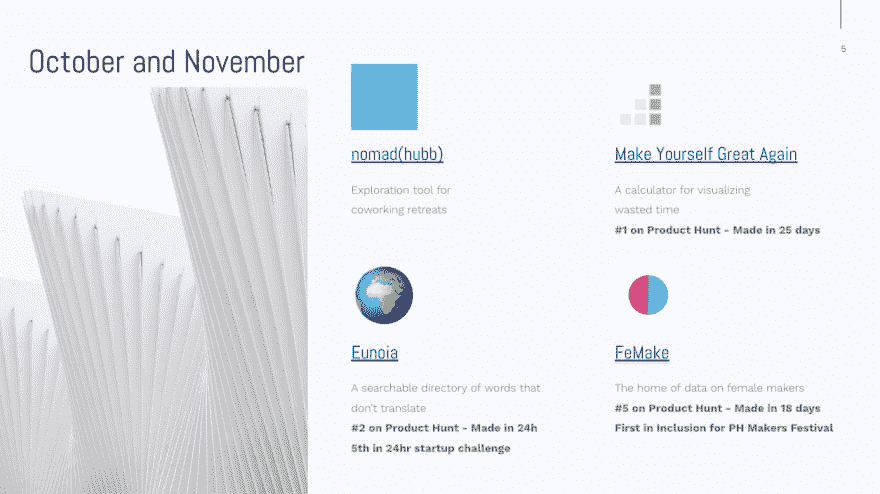](https://res.cloudinary.com/practicaldev/image/fetch/s--kFbuQ7Rt--/c_limit%2Cf_auto%2Cfl_progressive%2Cq_auto%2Cw_880/https://lh4.googleusercontent.com/MVE-qal6XzCWQQzg5T-JmLo_ZUlEkrFF6A5HqeSQjdEGhCu4ALJGFC410cVpTkYcG_vICa4ddPKscJKF2JQbtYZAARk_kZmEaGolKCdPOHrFOnzLiWIqUh8leWaWPgeB6At2C_GZ)

学习编码是我一生中最有收获的时期之一，任何阅读这篇文章的人都完全可以理解。在开始之前，让我们快速后退一步，问一下为什么这很重要。

> 很难否认，科技行业将成为对我们的未来影响最大的行业，而且在许多方面已经是了。制造未来无处不在的产品的决策需要由有代表性的人群做出。随着我们对发展的理解，我们正在消除这一障碍，以便我们能够成为未来的一部分。

很多人寻找捷径。例如，一些常见的搜索查询包括:

*   学习编码的简单方法
*   学习编程最简单的方法
*   学习编码的最快方法

敏捷或简化没有错，但是学习编程(尤其是自己学习)需要奉献和时间。出于这个原因，你不会在这篇文章中找到任何捷径，因为我不认为有任何捷径。这篇文章的重点是我认为的学习编码的 7 个误区，因为我认为这些才是人们参与的最大障碍——而不是技术本身。

我先讲个故事:

一场可怕的车祸中，父亲丧生，儿子受伤并被送往医院。当男孩被送进手术室时，外科医生看着男孩说:“我不能给这个病人做手术。这是我儿子。”

这怎么可能？

如果你还没有得到答案，外科医生就是母亲。很多人，包括我自己，都没有立即找到答案。

这是由于所谓的感知偏差:人们倾向于根据他们特定的参照系来“看事情”。虽然看起来很简单，但感知偏差实际上是你所做的每一个决定的过滤器；你雇佣谁，你学什么，你如何谈判，等等。

我相信，如果你还没有开始学习编码，你已经给自己贴上了“不是开发人员”的标签。有了这些知识，我想给你介绍三个开发人员，他们可能看起来不像典型的开发人员，但肯定是。

[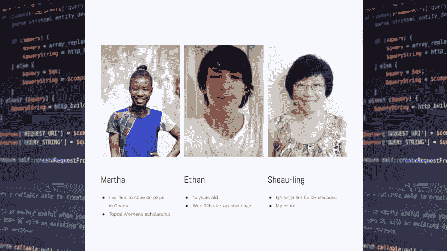](https://res.cloudinary.com/practicaldev/image/fetch/s--wfufdkot--/c_limit%2Cf_auto%2Cfl_progressive%2Cq_auto%2Cw_880/https://lh5.googleusercontent.com/p-4_gkMS91-5SsKW3bn6syXSfVsjEV9EubRdFi2v3lDQfvqYsFYPbpV_KuJtyhg8fzIGFiZ0UjBvt5qsEfAm-yMLAo9NoeQW7ZxXexIWwfgZJrCUT8ddYw1lMQd99DcQoxouK1M2)

所以，这就引出了一个问题:_ 为什么这种感觉会存在？_ 要回答这个问题，了解发展的历史是很重要的。回到 40 年代和 50 年代，当开发刚刚起步时，许多关键的软件工程师实际上都是女性，比如格蕾丝·赫柏。

到了 1966 年，参加坎农-佩里试验。这是在一组精选的个人身上进行的测试，试图确定谁是最好的软件工程师，有两个关键结论:

1.  他们是优秀的问题解决者
2.  他们显然不喜欢人类

[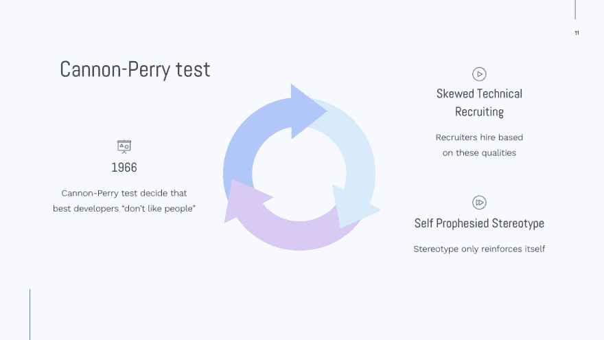](https://res.cloudinary.com/practicaldev/image/fetch/s--DmKjUmFC--/c_limit%2Cf_auto%2Cfl_progressive%2Cq_auto%2Cw_880/https://lh6.googleusercontent.com/KB1OAq5NQDBuzfu45XiQ3sKZug8_1tK_ZDhtNS0dA_dOl9ez7BnCXF_QtcdjBNLa2I_zfmHFEyocoUHVG_64jgu__YLn2NTQ06tc-S0wypk636PRWyLXZNFfoQIYqPlaT3kHNj3i)

这一“结论”永远改变了技术招聘人员寻找“最佳开发人员”的方式，并在未来几十年中不断自我强化。在学习编码的过程中，这种心理感知渗透到我们告诉自己或别人告诉我们的神话中。

> 如果一项研究可以如此彻底地改变发展的轨迹，我们可以通过正面解决障碍和神话来积极地扭转它。

所以他们在这里；曾经阻止我的神话，希望不会阻止你学习这种有价值和有益的技能。

神话 1:这个世界上有两种人

有一种普遍的误解，认为有两种人:知道如何编码的人和不会编码的人。在某些情况下，图像是如此普遍，以至于似乎有一个不同的物种与这两者相关联，在它们之间有一个巨大的、不可渗透的屏障。

现实就是一个简单的学习曲线。* *就像任何其他语言或行业一样，花了 10 年时间学习编码的人只是在学习曲线上走得更远。

出于某种原因，第一次开始的人会在曲线上与多年后的其他人进行比较，但这不会发生在其他技能习得上。你绝不会在学习语言的几个星期内把自己和一个以西班牙语为母语的人相比，也不会认为自己不如他们。

[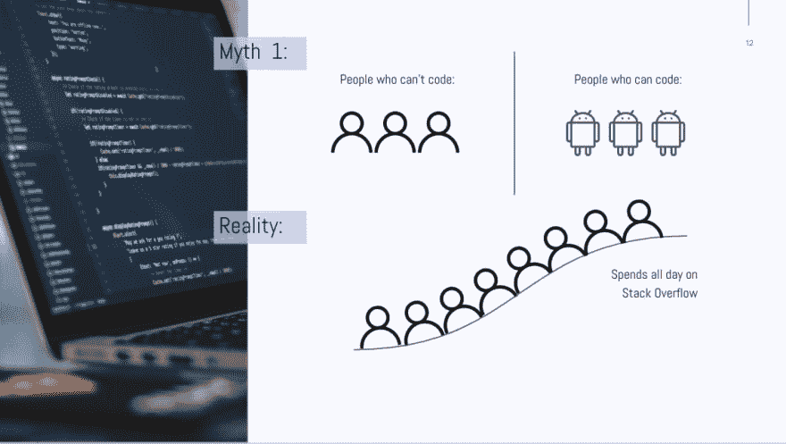](https://res.cloudinary.com/practicaldev/image/fetch/s--6x7OKRhb--/c_limit%2Cf_auto%2Cfl_progressive%2Cq_auto%2Cw_880/https://lh3.googleusercontent.com/XBs8QvVeGjMnWs5EStZxSjMLlUXbVLziG0Q5LuPoTrrt_1Lv0XC_LHz4JwNqYjFaY8V8R4wqgsdnjAHDyk6KRc5szk965I2pi05KwzlUtV-tGsWm8kUfrPdEIh974lDYPXzgGzuL)

**误解 2:堆栈很重要**

许多人在堆栈上被挂起。它们最终会出现在博客上

其中一个堆栈的性能更好，或者某个特定的语言正在“消亡”。这种噪音使他们无法启动，这才是真正重要的。

实际上，**栈与**无关。下面是三家大多数人都熟悉的成功公司。这三者使用完全不同的技术，有些甚至使用一些代码势利者认为“过时”的语言。

*   反馈:PHP 和反应
*   Spotify: Python 和 Java
*   中:节点和 Go

请不要以对比 React vs Angular vs Vue 性能的博文告终。当你在学习的时候，这个**并不重要**。找一叠你喜欢的，坚持下去。

[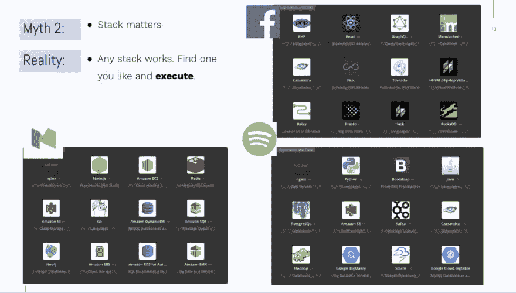](https://res.cloudinary.com/practicaldev/image/fetch/s--7dIgVhyc--/c_limit%2Cf_auto%2Cfl_progressive%2Cq_auto%2Cw_880/https://lh6.googleusercontent.com/aoBoXa3QlHD2GdP0Xac4cLDnBxSa8elUPwUWavm4ahtvXGZiWIS8rl-3cYJiOxsm3uyfZSRZikRuN_O7phqeDYiOxtpclKNjfZz-yaSkM8MO0cw7Ife8vfcyRhNxsq2Ty4mC5111)

**误区 3:你需要学习 3820 种语言/框架才能成为真正的开发者**

下面是发展生态系统的示意图。图像甚至没有捕捉到存在的一切，但即使是展示出来的东西也让人们不知所措，当然也让我不知所措。没有一个开发人员会知道所有这些，然而这就是把人们吓跑的原因。

“科技产业发展如此之快。”

“有这么多新事物涌现出来。我学哪种编程语言？”

“每天都有新的 Javascript 框架。我从哪里开始？”

“我不知道这是什么意思。”

“我永远也成不了开发者，因为我落后太多了。”

[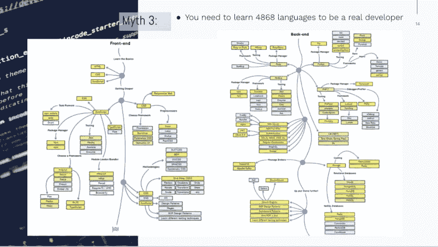](https://res.cloudinary.com/practicaldev/image/fetch/s--uqkkPhsw--/c_limit%2Cf_auto%2Cfl_progressive%2Cq_auto%2Cw_880/https://lh3.googleusercontent.com/9lsJElKmG5XrKJvIjC7Wj9qYqvArsHqQJjlHAgmT-FRKiYBspxsSffCPVbbUeOHrUrG5ArqtUQpAbXU-jbw8vINCG1TEoQcVOZd4CT6fBKtYYDaCpggAgDyksfgWnvWEAtQrvE3j)

下图是我在这个生态系统中的现实，我已经用这个堆栈启动了每一个应用程序或项目。这些都是成功的、获奖的、实际上正在产生一些收入的项目。忽略上面的图像，记住，你只需要学习一些*类似于*你在下面看到的东西。

重要提示:你不需要学习我的栈因为:栈不重要！:)

[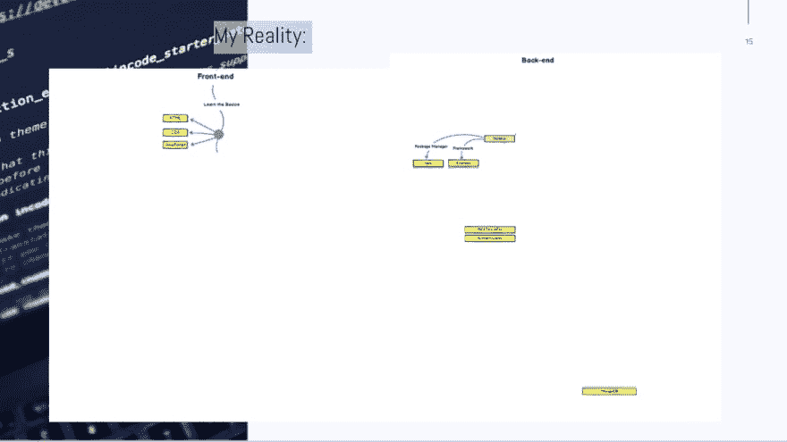](https://res.cloudinary.com/practicaldev/image/fetch/s--tCnjUhEe--/c_limit%2Cf_auto%2Cfl_progressive%2Cq_auto%2Cw_880/https://lh6.googleusercontent.com/gJIgyXlGB-nJ-Arpo_21NNCtxz_29Cnp754HAJRahFt5sG8cW6ISiC1MP6gzLTMwsxtGUFQ6tp5i230EU_HGrecIOhGXiLwZggE_HLdUCcGJ4E6bQJF8DFsq60WSq4T4JfhsIxX4)

下面是一个简单的结构，如果你正在处理自己的项目，你可以用它来思考你需要学习什么。重要的是要注意，如果你是一个付费的开发者，这显然是不同的，但是每个人都需要从某个地方开始。

如果你正在创建一个简单的静态网站，你所需要的只是 HTML 和 CSS。当您开始添加功能时，您会很自然地尝试 Javascript。一开始就学习普通的 Javascript 和 jQuery，忽略框架！这些在以后会很棒，但在开始时会让你分心。

当你需要身份验证或数据库时，你需要一个后端。但是，不要被选择淹没，因为你真的只需要一个数据库(对我来说，Mongo)和一个后端语言(对我来说，Node)。

[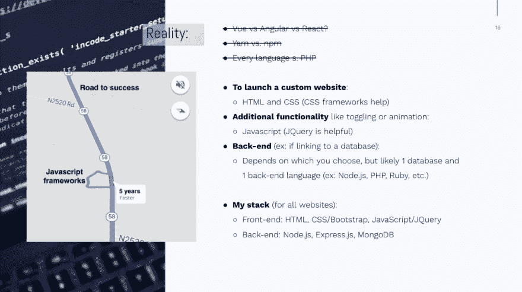](https://res.cloudinary.com/practicaldev/image/fetch/s--dmQOh86u--/c_limit%2Cf_auto%2Cfl_progressive%2Cq_auto%2Cw_880/https://lh5.googleusercontent.com/pSOga5KPhaHTkPX5FS7hVc8sFbFjfgwpsry5D3ZJAK8MYFS5ILOjk5y2oEvqqvqGJGwYxfBZ6tOl5Llt0YkYXE2_9uE2y9v2Ash6tvFhcP64XLW9kdCSiKuSOHKlUnQ40I-EeImI)

**误解 4:“我不懂编程，永远也不会懂”**

我想区分一些我认为非常重要的东西。逻辑！=(不等于)语法。逻辑是你想要达到的目标，而语法是一组特定的规则，可以让你达到目标；计算机可以解析的特定字符。

对于大多数人来说，逻辑很快就明白了，但是他们会因为不能马上理解语法而犹豫不决。那是自然的！不理解语法并不意味着您不能像开发人员一样思考或理解逻辑。语法需要时间，学习编码最好的部分是有一个不断的在线词典可供你使用，这就是谷歌。

[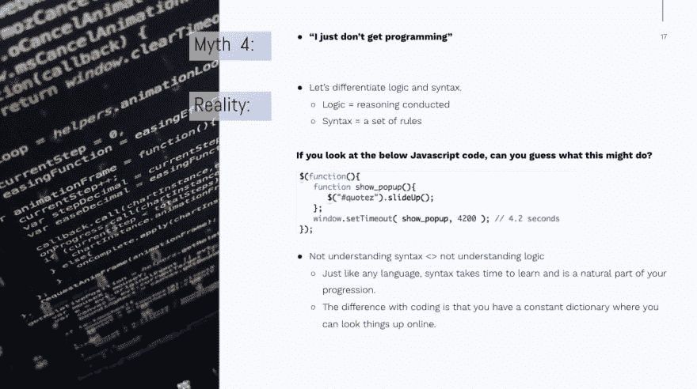](https://res.cloudinary.com/practicaldev/image/fetch/s--PQV03vin--/c_limit%2Cf_auto%2Cfl_progressive%2Cq_auto%2Cw_880/https://lh6.googleusercontent.com/Zxt7htrxcfzmhNy3H_que4IQAlXD3tg92f11N11RpYVMHolzsBiq-r6O3C6DX7r5U6TYad3GONeZzTjD0hqrV0SQiS8jzh4cOEX3-n_-FMDqxr4cqFiHTjRHh3xdps3XI6udc5rZ)

**误解 5:“我没有任何东西要建”**

如果你真的认为你没有什么可以构建的，那么你几乎肯定是在为完美的想法而努力。如果我们看看一些最大的科技公司，将它们浓缩成最简单的形式:Evernote 是一个笔记应用程序，Reddit 是一个公共论坛，Medium 是一个博客平台。

我几乎可以向你保证，你不会有一天醒来发现完美的想法。想法和执行是彼此的功能，但最终执行比想法更有价值。接受这一点是实际创造和发射的重要前提，这才是真正重要的。

德里克·西弗斯提出了这个想法，并付诸实施，让全世界都知道了。将两个整数相乘，生成一个值的代理。

20(惊人的想法)x 10000(平均执行)= 200000 美元

1(弱想法)x 1000000(强执行力)= 100 万美元

[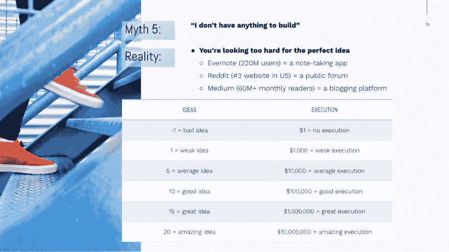](https://res.cloudinary.com/practicaldev/image/fetch/s--9SvGKzBr--/c_limit%2Cf_auto%2Cfl_progressive%2Cq_auto%2Cw_880/https://lh5.googleusercontent.com/WnP2S9qFOB-Xl7ZLUDFXotZXIsD6Oap7wvIrlNypdf9RysDbqCebr22v0kFsMYislrjySQzBwzzXdEiiKhCGAnxv5QdQ1S_yTTtSXFEOShH5nf_EPvpOP-IX9BXTb1ZpmliAlouR)

**误区六:“我起步太晚”**

“起步晚”对于时尚来说是有意义的。举个例子:如果你没有坐上坐立不安的旋转火车，对不起，你错过了船。然而，**科技并不是时尚**。它在我们的生活中变得越来越普遍，而且没有任何放缓的迹象。

我对这个概念的最佳解释是:

> “每天都有一辆去科技世界的巴士，你可以上那辆巴士。如果你今天错过了，明天又会有一个离开，这种情况会持续很多年。所以，帮你自己一个忙，跳上其中一辆公共汽车。”

还有一种误解，认为许多人知道如何编码，这已经很有竞争力了。事实上，世界上只有 0.5%的人知道如何编码。如果我们用[创新扩散曲线](http://sphweb.bumc.bu.edu/otlt/MPH-Modules/SB/BehavioralChangeTheories/BehavioralChangeTheories4.html)来处理这个问题，我们仍然处于创新阶段。你可以也应该成为其中的一部分，而且你开始得并不晚。

[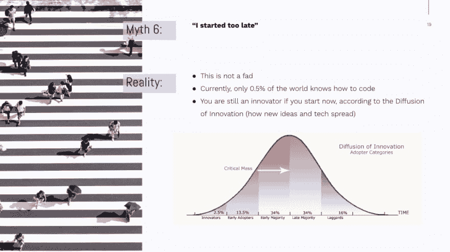](https://res.cloudinary.com/practicaldev/image/fetch/s--PbX4Cwda--/c_limit%2Cf_auto%2Cfl_progressive%2Cq_auto%2Cw_880/https://lh3.googleusercontent.com/Rsil135w9-ehZDfQLKIZ254oTnZhGLy6TwMAV_E8GwPftpxbTz8fET6ohmS0iSbo1l1I0eIi5jXe_iTCpbhBOCeNM1vJoKkXsl6x9wfa9ojnTfKbwLsJE8z3r29J6YqIt8XQqI6f)

**误区 7:“我没有足够的时间”**

学习编码并不需要你想象的那么多时间。如果你真的很投入，可能需要几个月甚至几周的时间。

我还想邀请你试试我的一个应用程序[让自己再次变得伟大](http://begreat.me)，它可以帮助你批判性地思考你是如何度过时间的，以及如何重新分配分散注意力的时间可以带来有意义的成长和学习。

[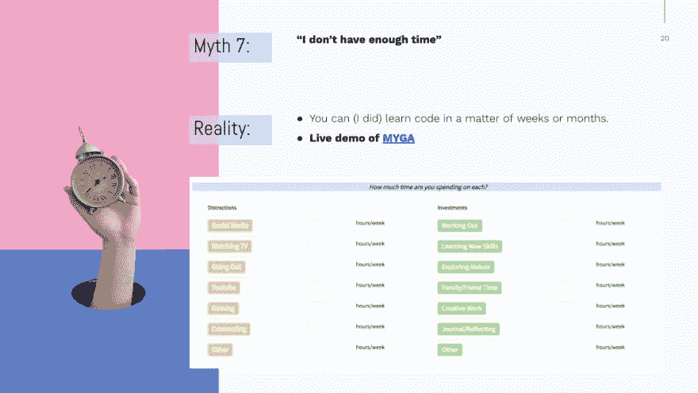](https://res.cloudinary.com/practicaldev/image/fetch/s--lO60Dg-n--/c_limit%2Cf_auto%2Cfl_progressive%2Cq_auto%2Cw_880/https://lh4.googleusercontent.com/zyKbE4mbg6J6UUlQwyLj8EUtMXhCxChPYqtQEUzluas8nc0CoBhqrrX8OAEfP8K4iOO4SHsgC31prFj9EULVXdwLYEMHF___81xbCwtURa_a6BdCOr2wYLzZrLVMVSTNZjIa_W8p)

因为我[在一年的大部分时间里跟踪我的努力](https://docs.google.com/spreadsheets/d/1BhVxO6ViqWe7b0G5gqUrrVB7bbdpowqs9LTsuvoRcYs/edit#gid=0),我能够确定在过去的 10 个月里我可能花了大约 300 个小时学习编码。虽然每个人的情况不同，但是 300 这个数字让我们更好地了解这到底需要多长时间。

如果你每周花 1 个小时学习编码，是的，它需要永远(6 年)。当我们把它增加到每天 1 小时，你已经看到不到一年的时间了。如果你把你的承诺进一步扩大到更多的部分时间或全部时间的关注，我们将看到在你能够创建完全成熟的应用程序之前只有几个月的时间。

[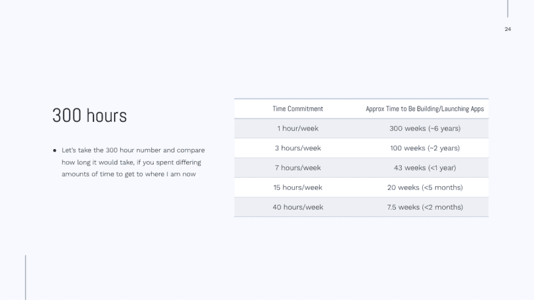](https://res.cloudinary.com/practicaldev/image/fetch/s--HPaXlKRy--/c_limit%2Cf_auto%2Cfl_progressive%2Cq_auto%2Cw_880/https://lh4.googleusercontent.com/Der35M-KUsqxA_FyFpjVRUeiX7xYCdqUde_yqNTk_7gKQ2_uD-Sxp6Sb8ja_SR_Vd4mrWpvMzirzbHvXIruP9kvPNtJOk2BFLJpPiCFkVb5wU0sva9T7JruQpqWGDAvKfe9aPAAf)

概括地说，大多数曾经阻碍我和可能阻碍你学习的障碍都是心理上的。如果我们能够消除这些精神和社会障碍，理论上的发展世界是可以接近的。我能给你的最好的建议是开始，因为这确实是把发展放在你认为可及的地方的唯一方法。

许多人最终陷入了他们应该学习什么语言或如何通过搜索以下内容来最有效地学习的困境:

*   学习编码的最佳方法(SV: 2400)
*   学习编码的最佳网站(SV: 1600)
*   学习编码的最佳网站(SV: 1000)
*   最好学的代码(SV: 480)

这里有一个秘密:学习编码没有“最好”的方法。每个人学习的方式略有不同，但最终真正学习的人的共同点是一致和坚持。所有主要的[工具](https://begreat.me/tools) ( [代码学院](https://www.codecademy.com/)、自由代码营、 [Udacity](https://www.udacity.com/nanodegree) 、Udemy 等)都会有效地教你，所以这是一个从**开始**的问题。

所以我鼓励你从今天开始。你可以在几周内开发应用程序。

如果你想了解今年我是如何学习的，你可以阅读[我的海绵年](https://blog.stephsmith.io/a-year-of-sponge/)和[看我的演讲](https://twitter.com/stephsmithio/status/1070685923229208576)。我也在[推特](https://twitter.com/stephsmithio)上——如果你开始学习，请让我知道！

继续[在 Twitter 上]的对话。([https://twitter.com/stephsmithio/status/1088442256359591936](https://twitter.com/stephsmithio/status/1088442256359591936)