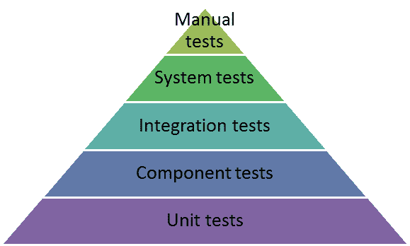

# JUnit 5–新架构、新功能

> 原文：<https://dev.to/trainingluxoft/junit-5--new-architecture-new-features-5gb5>

摘要:JUnit 是 Java 编程语言的单元测试框架。JUnit 5 版本经过了重新设计，解决了以前版本的一些特殊问题。它有一个新的架构，可以创建嵌套测试的层次结构，有新的断言和假设能力，有动态和参数化的测试。

这篇文章将是对 JUnit 5 的简短介绍，为读者提供理解新架构和新功能的可能性，并能够进一步探索。

1.  什么是 JUnit？什么是 TDD？

JUnit 作为 Java 编程语言的单元测试框架，是测试驱动开发方法的一个非常重要的工具。它是单元测试框架家族的一部分，统称为 xUnit，起源于 SUnit。

JUnit 在编译时作为 JAR 链接，是 Java 项目中最常见的外部库。

TDD(测试驱动开发)是一个软件开发过程，它依赖于一个非常短的开发周期的重复:首先，将需求转化为具体的测试用例；然后，软件被改进以通过新的测试。这与允许添加未被证明满足需求的软件的软件开发相反。

TDD 的优势包括:

*   程序员被清晰的目标所驱动
*   代码更安全
*   不正确的代码可以被隔离
*   可以很容易地引入新的功能
*   测试记录应用程序

测试金字塔是这样的:

我们讨论的重点是单元测试。在现实生活中，开发人员可能负责单元测试、组件测试、集成测试、行为驱动测试。

1.  JUnit 4 的缺点

2006 年发布的 JUnit 4 提供了一个简单的整体架构。

它的所有功能都集中在一个 JAR 文件中。尽管这看起来很简单，但随着时间的推移，这已经产生了一系列越来越严重的问题。

提供的 API 不够灵活，这使得使用 JUnit 的 IDE 和工具与它紧密耦合。这些工具需要深入 JUnit 类的内部，甚至使用反射来获取所需的信息。

因此，由于每个人都使用同一个 JAR，并且所有工具和 ide 都与它紧密耦合，JUnit 发展的可能性已经大大降低。更改任何私有变量或方法都可能破坏使用它的变量或方法。一个为这类工具设计的新 API 和一个新的体系结构作为未来必要的改进而产生。

3.新的模块化方法

为了允许 JUnit 的发展，一种新的、模块化的方法是必要的。关注点的逻辑分离需要:

*   编写测试的 API，主要面向开发人员
*   发现和运行测试的机制
*   以及一个 API，允许与 ide 和工具进行简单的交互，并从它们那里运行测试

因此，最终的 JUnit 5 架构包含 3 个模块:

JUnit 平台，它是在 JVM 上启动测试框架的基础。它还提供了一个 API 来从控制台、ide 或构建工具启动测试。

JUnit Jupiter 是新的编程模型和扩展模型的组合，用于在 JUnit 5 中编写测试和扩展。这个名字取自我们太阳系的第五颗行星，也是最大的一颗。

JUnit Vintage 提供了一个测试引擎，用于在平台上运行基于 JUnit 3 和 JUnit 4 的测试，确保必要的向后兼容性。