# 具有跨浏览器兼容性的功能检测的 CSS

> 原文：<https://dev.to/lambdatest/css-with-feature-detection-for-cross-browser-compatibility-3adh>

每个 web 开发人员的主要目标是构建具有现代和直观设计的网站，无论他们使用哪种浏览器上网，都能提供流畅和无缝的用户体验。近几十年来，互联网经历了前所未有的巨大繁荣。截至 2018 年 12 月，世界上有超过 41 亿互联网用户，近 19.4 亿个网站。因此，这意味着全球受众访问网站的方式有所扩展。这就产生了跨浏览器兼容性[的难题](https://www.lambdatest.com/feature)，这给开发者带来了巨大的挑战。由于浏览器及其版本的数量每年都在以如此快的速度增长，试图使一个网站在所有浏览器上显示和执行一致的任务是每个开发人员的噩梦。然而，尽管跨浏览器测试可能是乏味和耗时的，但它是每个测试周期中必不可少的阶段。虽然几乎不可能让一个网站在所有浏览器上都显示相同的内容，但仍然有很多方法可以提供一致的用户体验，并获得更广泛的目标受众。在本文中，我们将探讨什么是[跨浏览器兼容性问题](https://www.lambdatest.com/blog/fixing-javascript-cross-browser-compatibility-issues/)以及为什么会出现这些问题，具有特征检测的跨浏览器 CSS 如何更有利于浏览器检测。

### 为什么浏览器呈现内容不一致？

[](https://res.cloudinary.com/practicaldev/image/fetch/s--sll03opJ--/c_limit%2Cf_auto%2Cfl_progressive%2Cq_auto%2Cw_880/https://www.lambdatest.com/blog/wp-content/uploads/2019/01/pasted-image-0-7-2.png)

在深入研究具有功能检测的跨浏览器 CSS 之前，对互联网浏览器如何工作以及为什么会出现兼容性问题有一个基本的了解是至关重要的。在浏览网页时，每当您在浏览器中点击一个链接或键入一个 URL，您都在引导您的网页浏览器向服务器请求加载您正在查找的内容，并将其显示在浏览器窗口上。这是通过使用渲染引擎来完成的，渲染引擎负责解析 [HTML 和 CSS 代码](https://www.lambdatest.com/blog/complete-guide-on-creating-browser-compatible-html-and-css/)，并在屏幕上显示解析后的内容。由于每个浏览器都有自己的渲染引擎，因此内容在所有浏览器上的显示并不相同。因此，网站的布局和外观可能会有明显的差异。

Safari 使用“webkit”渲染引擎，Google Chrome 使用“Blink”(早期的 Webkit)以及所有基于 chromium 的浏览器，如 Microsoft Edge 和 Opera，Firefox 使用“Gecko”，最后 Internet Explorer 使用“Trident”。旧版本的 Opera 使用“Presto”。

[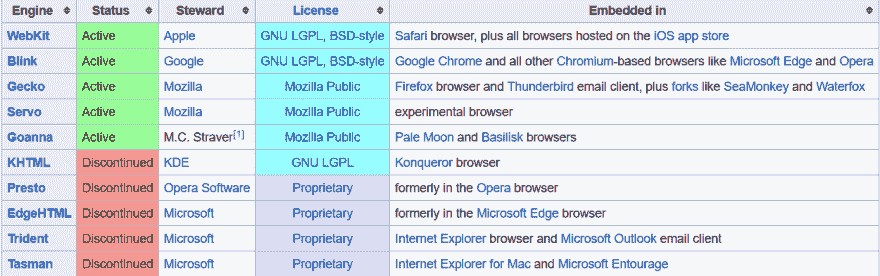](https://res.cloudinary.com/practicaldev/image/fetch/s--QHaCRPz6--/c_limit%2Cf_auto%2Cfl_progressive%2Cq_auto%2Cw_880/https://www.lambdatest.com/blog/wp-content/uploads/2019/01/pasted-image-0-8.png)

每个前端开发者最可怕的敌人就是浏览器之间不一致的特性支持。这意味着网站在开发阶段可以在开发者选择的浏览器上完美地出现和运行，但在最终测试阶段可能在其他浏览器上看起来完全杂乱无章。

### 浏览器偏好偏差

不管否认的声音有多强烈，每个开发者都有一个秘密的“浏览器偏好偏见”。开发人员在网站开发过程中所依赖的浏览器是评价网站性能的标准。大多数开发者自然对谷歌 chrome 有偏见，谷歌 chrome 拥有全球领先的市场份额，并配备了最强大的开发工具套件。这可能会导致开发者忽视和忽略像 Mozilla Firefox、Safari、Opera 和臭名昭著的 Internet Explorer 这样的浏览器。在任何情况下，开发人员都不应该忽视对任何浏览器的支持，即使只有一小部分目标用户会使用这种浏览器。尽管谷歌 Chrome 和 Mozilla Firefox 以及 Safari 拥有接近 90-95%的市场份额，但这一取决于网站性质和其他因素的统计数据可能会被证明是欺骗性的。浏览器偏好因地理位置和年龄统计数据的不同而有很大差异。例如，Safari 在美国之外的使用要少得多，IE 仍然是老一代人的首选浏览器。

### 浏览器市场份额

谷歌 Chrome 无疑是市场领导者，拥有至少 67%的市场份额，火狐以 11%的份额紧随其后。有趣的是，经常被开发者忽视的臭名昭著的 ie 浏览器在 2018 年仍保持着近 7-10%的市场份额。这一事实进一步强调了开发人员关注跨浏览器兼容性的必要性。您可以进一步使用谷歌分析或任何其他[网络分析工具来确定哪些浏览器是大多数网站访问者](https://www.lambdatest.com/blog/web-analytics-tools-to-help-you-understand-your-users/)的首选。如果一个浏览器或浏览器版本的份额少于 1%，开发者应该考虑它相对于那些主要负责驱动你的网站流量的来说是一个低优先级。
T3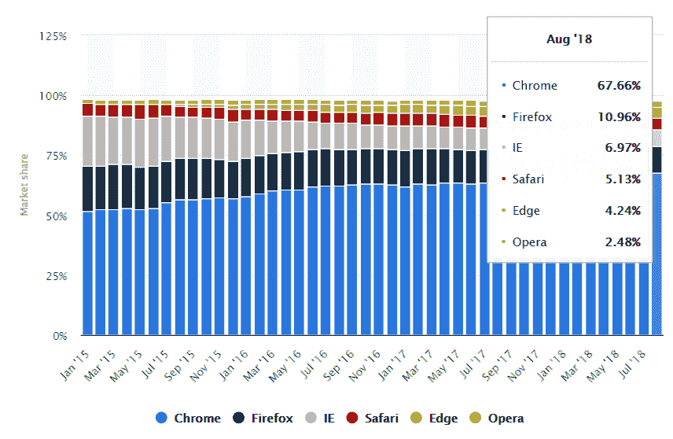T5】

### 需要跨浏览器兼容的 CSS

近年来，我们见证了 CSS 中新的强大功能的出现，这催生了新的现代设计趋势。然而，由于跨浏览器兼容性问题，这些新引入的强大 CSS3 属性中的大部分并不被所有主流浏览器普遍支持。在没有回退的情况下，这些属性不会被浏览器解释并被完全忽略，这可能会在旧的不支持的浏览器上严重破坏你的网站设计，尤其是可怕的 IE。CSS 网格、Flexbox、CSS 混合模式、3D 变换等激动人心的新功能将网页设计推向了新的高度。然而，由于对跨浏览器 CSS 支持的怀疑，许多开发人员迟迟没有采用这些新的部署。没有人愿意冒险为他们的客户建立大多数浏览器都无法正常显示的网站。

这里有一个简短的部分来帮助你理解不同浏览器不支持的 CSS 属性。你可以用[我能不能用](https://caniuse.com/)平台实现各种浏览器和浏览器版本支持和不支持的元素。

*   **最新版本的 Internet Explorer (v 11)不支持 CSS 属性**

[](https://res.cloudinary.com/practicaldev/image/fetch/s--WKjo1gTn--/c_limit%2Cf_auto%2Cfl_progressive%2Cq_auto%2Cw_880/https://www.lambdatest.com/blog/wp-content/uploads/2019/01/pasted-image-0-10.png)

*   任何最新版本的 Firefox 都不支持 CSS 属性

[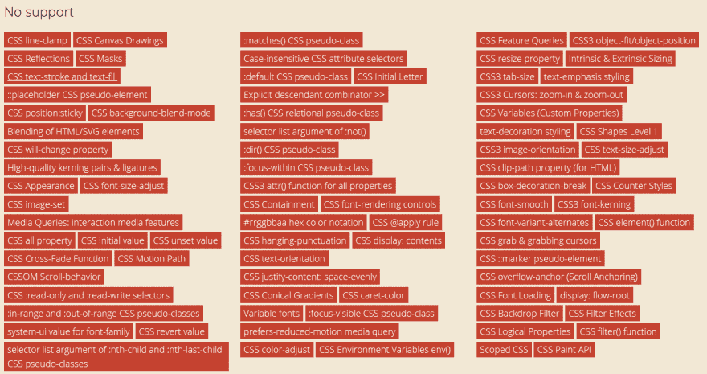](https://res.cloudinary.com/practicaldev/image/fetch/s--Gg1i9HGF--/c_limit%2Cf_auto%2Cfl_progressive%2Cq_auto%2Cw_880/https://www.lambdatest.com/blog/wp-content/uploads/2019/01/pasted-image-0-11-1.png)

*   **任何最新版本的谷歌浏览器都不支持 CSS 属性**

[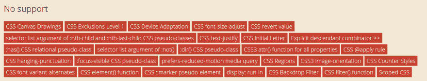](https://res.cloudinary.com/practicaldev/image/fetch/s--xD1aVcVR--/c_limit%2Cf_auto%2Cfl_progressive%2Cq_auto%2Cw_880/https://www.lambdatest.com/blog/wp-content/uploads/2019/01/pasted-image-0-12.png)

*   **任何最新版本的 Opera 都不支持 CSS 属性**

[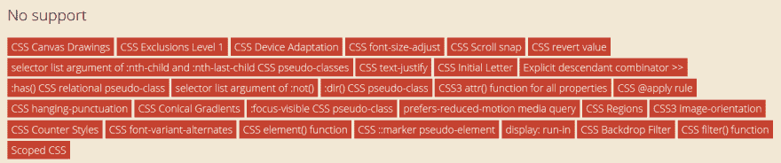](https://res.cloudinary.com/practicaldev/image/fetch/s--7Y2Mg2qK--/c_limit%2Cf_auto%2Cfl_progressive%2Cq_auto%2Cw_880/https://www.lambdatest.com/blog/wp-content/uploads/2019/01/pasted-image-0-13-1.png)

除此之外，一些浏览器甚至不支持一些 HTML 元素和属性。例如，IE 的任何版本都不支持表单属性“placeholder ”,甚至 Edge 也不支持。虽然 Chrome 和 Firefox 都支持。

### 应对不均衡浏览器支持的方法

有两种截然相反的开发理念被开发者们普遍用来应对不均衡的浏览器支持，并确保用户在所有浏览器中享有一定程度的一致性——适度的降级和渐进的增强。

[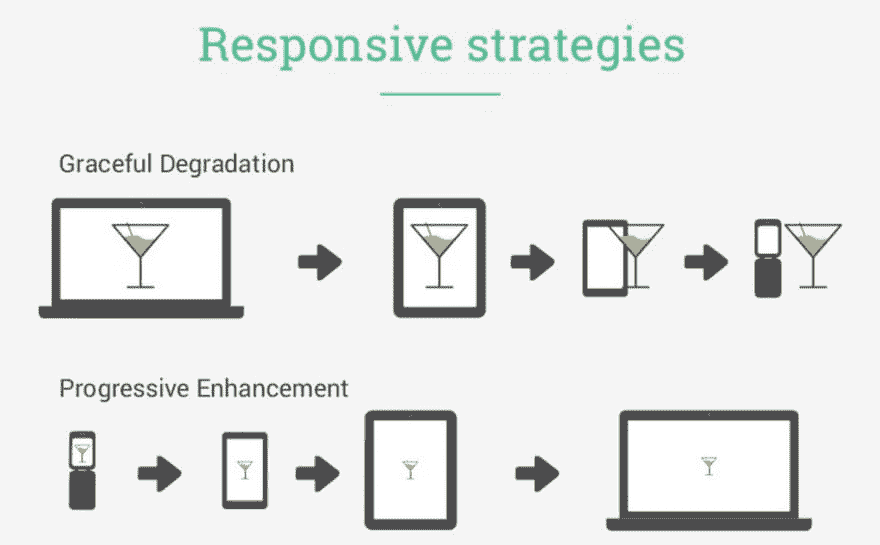](https://res.cloudinary.com/practicaldev/image/fetch/s--nb4t8kON--/c_limit%2Cf_auto%2Cfl_progressive%2Cq_auto%2Cw_880/https://www.lambdatest.com/blog/wp-content/uploads/2019/01/pasted-image-0-14-1.png)

*   **适度降级**方法是指建立一个拥有最新的现代浏览器所支持的全部功能和设计特点的网站，然后逐渐向下编码，通过一层又一层地剥离、降级增强版本来提供对旧浏览器的支持。较低版本的网站被剥夺了其增强的功能和外观特征，但仍然向用户提供基线版本。
*   **渐进性增强**是优雅退化的反向或相反。首先，创建网站的基本/基线版本，然后逐渐向上移动，为现代浏览器和更新版本添加高级功能和外观特性，以提供功能丰富的体验。

渐进增强被普遍认为优于优雅降级，因为它首先从通用基础版本开始，然后在此基础上为现代浏览器添加进一步的增强。它保证网站可以在任何新旧浏览器中运行，并且可以在所有支持它的浏览器中自动呈现高级版本。也有利于搜索引擎机器人/蜘蛛的测试和抓取。

### 什么是 CSS 容错？

在像 Javascript Ruby 和 PHP 这样的语言中，当遇到错误时，执行就会终止。另一方面，CSS 有一个被称为“容错”的特性。每当浏览器遇到一行它无法解释或理解的 CSS 代码时，它就会忽略并跳过这一行代码，跳到下一行。例如，考虑下面的代码示例–

我们选择元素 div，并将颜色属性更改为十六进制值“#777”

```
div {
    color: #777;
}

Now look at the following code:
div {
    color: #777;
    color: #000;
}
```

As we have set the color property value to “#000” from “#ccc”, the second value will be used. Now, if we use an invalid property value, CSS will use its fault tolerance feature and will simply ignore the CSS line that it cannot interpret.

```
div {
    color: #777;
    color: foobar(10);
}
```

Because foobar(10) is not a valid CSS value, browser cannot interpret this line so it simply ignores it. The color value “#777” is retained. We can leverage this fault tolerance feature of CSS to code fallbacks properties. With this technique, you don’t need to indulge in the hassle of creating two separate files or writing confusing conditional statements. Your website won’t have to send two separate HTTP requests, first for modern CSS file and then for IE fix file like in this case:

```
<link href="modern.css" rel="stylesheet" />
<!--[if lte IE 8]>
    <link href="legacy.css" rel="stylesheet">
<![endif]-->

```

既然我们已经讨论了什么是跨浏览器兼容性问题，现在让我们来看看克服这个挑战的方法。我们将讨论的两种主要方法是:

*   浏览器检测
*   特征检测

### 浏览器检测

浏览器识别基于检测用户代理字符串。NavigatorID.userAgent 属性返回当前浏览器的用户代理字符串。用户代理请求报头包含允许识别应用类型、操作系统、软件供应商或软件版本等的特征字符串。

语法:`var ua = window.navigator.userAgent;`

其中 ua 存储当前浏览器的用户代理字符串值。

比如 Firefox UA 字符串:Mozilla/5.0(Windows NT 6.1；Win64x64rv:47.0)壁虎/20100101 火狐/47.0

以下是常见 web 浏览器的用户代理字符串。

[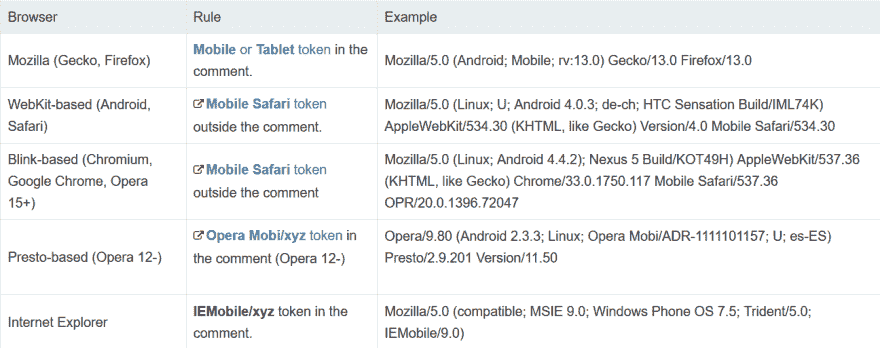](https://res.cloudinary.com/practicaldev/image/fetch/s--P-BolLn8--/c_limit%2Cf_auto%2Cfl_progressive%2Cq_auto%2Cw_880/https://www.lambdatest.com/blog/wp-content/uploads/2019/01/pasted-image-0-15-1.png)

最常见的方法是使用 JavaScript 查询用户代理头:

```
<!DOCTYPE html>
    <html>
    <body>
    <p>Find the name of your browser using User Agent</p>
    <button onclick="myFunction()">Try it</button>
    <p id="demo"></p>
    <script>

    function myFunction() { 
       if(navigator.userAgent.indexOf("Chrome") != -1 )
    {
        alert('Your Browser is Google Chrome');
    }
    else if((navigator.userAgent.indexOf("Opera") || navigator.userAgent.indexOf('OPR')) != -1) 
    {
        alert('Your Browser is Opera');
    }
        else if(navigator.userAgent.indexOf("Safari") != -1)
    {
        alert('Your Browser is Safari');
    }
    else if(navigator.userAgent.indexOf("Firefox") != -1 ) 
    {
         alert('Your Browser is Firefox');
    }
    else if((navigator.userAgent.indexOf("MSIE") != -1 ) || (!!document.documentMode == true )) //IF IE > 10
    {
      alert('Your Browser is Internet Explorer'); 
    }  
    else 
    {
       alert('Unknown Browser');
    }
    }
    </script>
    </body>
    </html>

```

**IE 条件语句**
另一种检测或识别浏览器的方法是使用 Internet Explorer 的条件注释。这种语法扩展了标准的 HTML 注释，并且是 IE 特有的。
条件注释是特定于 internet explorer 的 CSS 规则，仅被 Internet Explorer 识别，被所有其他浏览器忽略，因为它们将它们视为普通注释。请注意，在第二种情况下(针对除 IE 之外的其他浏览器)，内容不在注释中。因此，它将被其他浏览器识别。

1.  针对所有 IE 浏览器版本

    ```
    <!--[if IE]>
    Place content here to target all IE users.
    <![endif]-->
    ```

2.  目标浏览器不是 IE

    ```
    <![if !IE]>
    Place content here to target all users not using Internet Explorer.
    <![endif]>
    ```

3.  针对特定的 IE 版本

    ```
    <!--[if IE 6]>
    Place content here to target all users of IE version 6\. 
    <![endif]-->
    ```

4.  目标 IE 版本高于或等于 7

    ```
    <!--[if gte IE 7]>
    Place content here to target users of IE7 or higher.
    <![endif]-->
    ```

5.  目标 IE 版本低于 7(即 6 或更低)。

    ```
    <!--[if lt IE 7]>
    Place content here to target users of IE6 or lower (less than 7).
    <![endif]-->
    ```

### 浏览器检测的弊端:

*   用户代理检测浏览器的最大缺点是开发者需要不断跟踪浏览器支持。此外，浏览器检测不考虑新的浏览器版本更新。新的浏览器版本可能会支持以前不支持的功能，使您的额外代码变得多余，或者新版本可能会删除对某个功能的支持，这会破坏您网站的性能。
*   即使新版本的浏览器可能支持该功能，也会显示回退代码
*   一些浏览器还使用一个虚拟用户代理来屏蔽原始内容。
*   很多浏览器也开始恶搞他们的用户代理字符串。IE 在 10 和 11 版本之后的浏览器中也不再支持 UA 检测

### 特征检测

一种更好的浏览器检测替代方法叫做“特征检测”。具有功能检测的 CSS 运行一个测试来确定当前浏览器是否支持所讨论的给定功能，然后根据它是否支持来有条件地运行不同的代码。简而言之，具有功能检测的跨浏览器 CSS 涉及测试浏览器是否能够运行给定的代码行，并根据测试结果，运行浏览器支持的特定代码块，从而实现近乎完美的一致性和[跨浏览器 CSS 兼容性](https://www.lambdatest.com/blog/how-to-make-a-cross-browser-compatible-website/)。

这样，无论用户使用哪种浏览器，您都可以确保浏览器能够提供无缝、一致的用户体验。开发人员不必担心跟踪繁琐的浏览器支持图表和新版本更新。结合渐进增强的理念，开发人员首先对网站进行编码，以提供所有浏览器都支持的基础版本，然后根据新的现代浏览器的支持继续添加层。如果你不遵循跨浏览器 CSS 的特性检测方法，不支持该特性的浏览器将不能按预期显示你的站点，并且会带来糟糕的用户体验。除了提供跨浏览器的 CSS，它还通过避免混乱的多行回退来帮助开发人员编写清晰可读的 CSS。

### 浏览器检测和特征检测对比

考虑下面的测试场景。在这两种情况下，我们都为缺少浏览器支持做好了准备。
[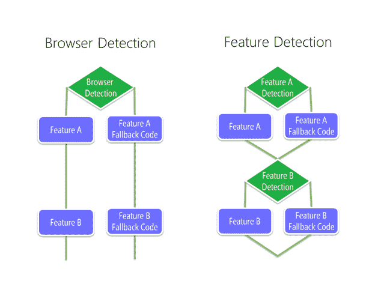T3】](https://res.cloudinary.com/practicaldev/image/fetch/s--U4q5O4WZ--/c_limit%2Cf_auto%2Cfl_progressive%2Cq_auto%2Cw_880/https://www.lambdatest.com/blog/wp-content/uploads/2019/01/pngbase6486c4d8a5d7c3afbd-1.png)

如果浏览器配置已知，并且用户代理按预期工作并成功检测到，则这两种方法都有效。
[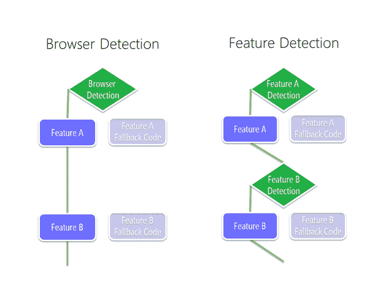T3】](https://res.cloudinary.com/practicaldev/image/fetch/s--LJ8EEjIX--/c_limit%2Cf_auto%2Cfl_progressive%2Cq_auto%2Cw_880/https://www.lambdatest.com/blog/wp-content/uploads/2019/01/pngbase6434320a3c650405a1-1.png)

但是，当遇到未知或不正确的浏览器配置时，浏览器检测方法会完全失败，并且无法正确呈现页面。另一方面，特征检测以更加无缝的方式处理这一挑战。具有功能检测的跨浏览器 CSS 运行测试，并确定浏览器能够显示功能 A，但当它无法支持功能 B 时，它只是依赖功能 B 的回退，并成功地以开发人员想要的方式呈现页面。

[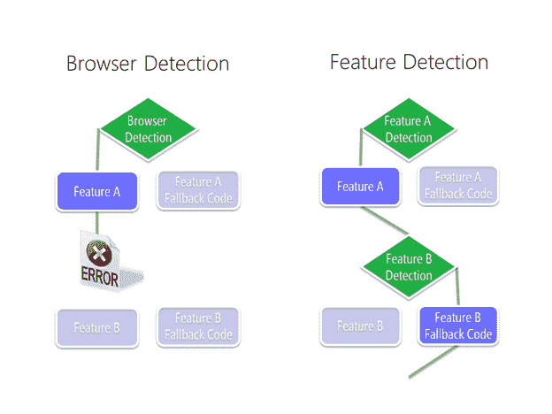](https://res.cloudinary.com/practicaldev/image/fetch/s--5SNgFlkb--/c_limit%2Cf_auto%2Cfl_progressive%2Cq_auto%2Cw_880/https://www.lambdatest.com/blog/wp-content/uploads/2019/01/pngbase64a8a18fe099647df4-1.png)

### 跨浏览器 CSS 特征检测—@支持特征查询

开发人员的武库中有几个工具可以用来实现跨浏览器的兼容性，比如 modernizr 和 polyfills。不使用第三方工具，我们可以通过使用 CSS 特性查询来达到同样的目的。这些是条件规则，允许我们根据浏览器支持对同一元素应用不同的样式。功能查询类似于@media、@document 或@import 条件语句。与使用基于屏幕大小的条件的@media query 不同，feature query 基于跨浏览器 CSS 支持创建条件。如果浏览器理解并支持特征查询中的属性，则将应用查询括号中的所有 CSS 样式规则。否则，它将被忽略并跳过。

**@支持规则**

@supports 是一个条件分组规则，它测试浏览器是否支持 CSS property: value 对。浏览器执行[跨浏览器测试](https://www.lambdatest.com/)以检查是否支持某个 CSS 属性或值。结果决定是否应用 CSS 代码块。语法类似于媒体查询，但是我们将 CSS 声明设置为验证跨浏览器 CSS 的测试条件，而不是媒体查询。浏览器基于该条件执行跨浏览器 CSS 样式。

**语法:**

```
@supports(test condition) {
    /* apply rules */
}
```

示例:
考虑以下涉及 vmax width 属性的示例。

```
.container {
    height: 100%;
}

@supports (height: 100vmax) {
    .container {
        height: 100vmax;
    }
}
```

@supports queries 测试用户的浏览器是否支持 vmax。如果支持，容器的高度将设置为 100vmax，否则，如果不支持该功能，容器的高度将设置为 100%。

另一个测试浏览器是否支持 CSS 网格的例子。

```
div {
  background-color: yellow;
}

@supports (display:grid) {
  div {
    background-color: green;
  }
}
```

**@支持运算符**

我们可以使用多个逻辑运算符来增强@supports 特性查询，以创建复杂的条件测试。

a.“非”算符

“not”运算符可以与@supports 一起使用，以检查是否有支持。

```
@supports not (display: flex) {
    div { display: inline-block; } /* alternative style if display:flex is not supported */
}
```

b.逻辑积算符

“和”运算符可用于同时检查多个测试条件。只有当所有条件都为真时，结果才为真。如果甚至一个条件为假，那么结果布尔也为假。

```
@supports (mix-blend-mode: overlay) and 
  (background: linear-gradient(rgb(45, 145, 245), rgb(20,120,220))) {

  .wrapper {
    background: linear-gradient(rgb(45, 145, 245), rgb(20, 120, 220));
  }

  .wrapper img {
    mix-blend-mode: overlay;
  }

}
```

c.Or 运算符

“或”运算符可用于检查多个条件中是否至少有一个条件为真。只有当所有条件都为假时，结果才为假。

```
@supports (display: -webkit-flex) or
          (display: -moz-flex) or
          (display: flex) {

    section {
      display: -webkit-flex;
      display: -moz-flex;
      display: flex;
      float: none;
    }
}
```

### 支持使用 Javascript 检测

特性查询也可以和 Javascript 一起使用。Javascript 提供了 CSS.supports()方法，该方法可以通过两种方式实现:

1.  CSS.supports(propertyName。值)；
    例如:结果= `CSS.supports("text-decoration-style", "blink");`

2.  CSS . supports(test condition)；
    例如:结果= `CSS.supports("display: flex");`

有点跑题了，但是如果你正在与 Javascript 相关的内存泄漏作斗争，那么我也写了一篇关于在 Javascript 中根除内存泄漏的详细博客。

### 使用 CSS @supports 为 CSS 网格创建回退

我们现在可以利用功能查询为画廊或作品集部分创建一个全功能的迷你布局。我们可以通过渐进式增强方法做到这一点，首先创建一个基本的布局版本，然后添加对 flexbox 和 CSS grid 的浏览器支持。

```

    

## 网格卡 1

人们认为肥胖是一个问题。ipsam amet laudantium maxime suscipit。配给，eos。

    

## 网格卡 2

Lorem ipsum dolor，这是肥胖精英的共识。从自愿者的角度来看。

    

## 网格卡 3

人们认为肥胖是一个问题。Quisquam ipsam accusantium voluptas！远见卓识，无所不能！

    

## 网格卡 4

Lorem ipsum dolor，这是肥胖精英的共识。事实上，这种授权是无效的！

    

## 网格卡 5

Lorem ipsum dolor，这是肥胖精英的共识。建筑师兼临时建筑师！Explicabo？

    

## 网格卡 6

人们认为肥胖是一个问题。因为事实上，没有法官的最高意见。

    

## 网格卡 7

Lorem ipsum，dolor 说他是肥胖精英。请记住，脸是肥胖的吗？

```

[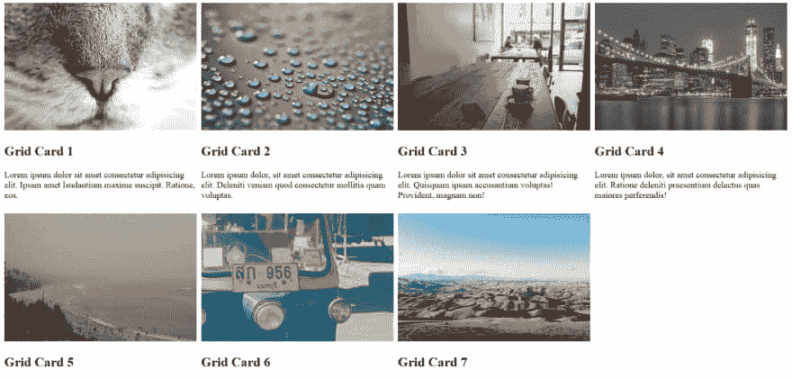](https://res.cloudinary.com/practicaldev/image/fetch/s--TD5_ZgfN--/c_limit%2Cf_auto%2Cfl_progressive%2Cq_auto%2Cw_880/https://www.lambdatest.com/blog/wp-content/uploads/2019/01/pasted-image-0-16-1.png)

[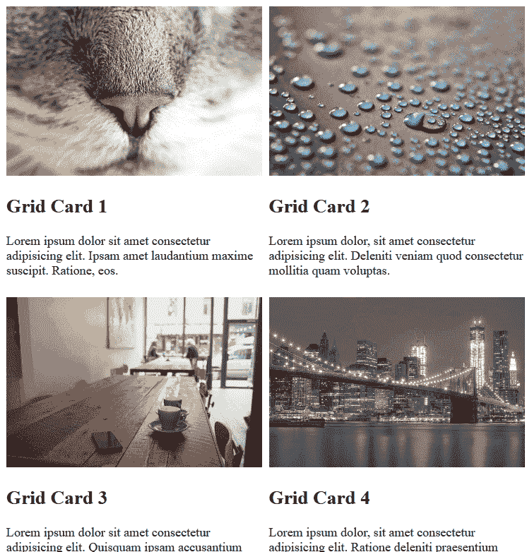](https://res.cloudinary.com/practicaldev/image/fetch/s--_d3emVSo--/c_limit%2Cf_auto%2Cfl_progressive%2Cq_auto%2Cw_880/https://www.lambdatest.com/blog/wp-content/uploads/2019/01/pasted-image-0-17-1.png)

**浏览器支持功能查询**

使用@supports 特性查询的一个症结是在一些旧的浏览器中缺乏浏览器支持。

[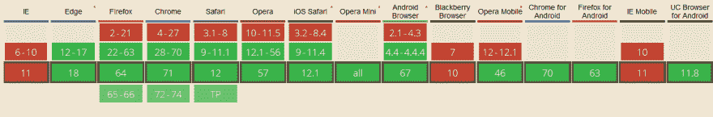](https://res.cloudinary.com/practicaldev/image/fetch/s--NoINaMNS--/c_limit%2Cf_auto%2Cfl_progressive%2Cq_auto%2Cw_880/https://www.lambdatest.com/blog/wp-content/uploads/2019/01/pasted-image-0-18-1.png)

没有任何版本的 Internet Explorer(包括版本 11)支持功能查询。Safari 浏览器推出了对功能查询的支持，但仅限于最近的版本。但是必须注意的是，随着 CSS 的逐渐退化，如果浏览器不能识别@supports 规则，它将简单地忽略整个代码块，而不会破坏网页。因此，最好的方法是首先编写每个浏览器都能处理的基本 CSS 样式。然后使用@supports 特性查询，用更高级的功能和外观来覆盖这些基本样式，以便现代浏览器能够处理这些特性。

一些寻求 IE 浏览器支持的开发人员更喜欢使用 Modernizr、Post-CSS 和其他 Polyfills 等工具来满足他们的跨浏览器兼容性需求。

### 使用 Modernizr 进行跨浏览器 CSS 特征检测

Modernizr 是一个非常有用的 [JavaScript 库](https://www.lambdatest.com/blog/top-21-javascript-and-css-libraries/)，它帮助自动检测用户浏览器中下一代 HTML 和 CSS 特性的可用性。modernizr 不依赖于用户代理嗅探，而是依赖于[跨浏览器 CSS 功能检测](https://www.lambdatest.com/blog/feature-detection-with-modernizr-for-cross-browser-compatibility/)，允许开发人员基于用户的浏览器功能提供特定的用户体验。在用户的浏览器上运行测试，以检查它是否支持特定的功能。如果该特征被认为是浏览器不支持的，开发者可以编码所有必要的回退来反映不支持的特征。与使用@supports 特性查询进行特性检测的跨浏览器 CSS 不同，modernizr 还允许构建自定义测试来验证跨浏览器兼容性。

**设置现代化**

旧版本的 modernizr 提供了两种下载文件的选择，开发和生产版本。然而，在 modernizr 的最新版本中，不再提供单一开发版本 modernizr.js 文件。

1.  访问下载页面，自定义选择项目中需要的特性。这有助于减小文件大小并提高网页的加载速度。
2.  将文件插入❬head❭部分。❬script src = " modernizr . jstype="text/javascript❭❬/script❭
3.  默认情况下，Modernizr 在根❬html❭标签上添加了许多 CSS 类。Modernizr 生成的这些类依赖于浏览器的功能。如果特征被浏览器支持，则相应的类被添加到标签，而如果特征不被支持，则相应的类被添加“否”前缀(例如特色还是。无特征)。`❬html class=” js flexbox flexboxlegacy csstransforms no-csstransforms3d csstransitions”❭`
4.  向❬html❭标签添加 no-js 类。如果用户的浏览器不支持 JS，这一步是必要的。使用这个类可以添加必要的回退。然而，如果浏览器支持 javascript，那么 Modernizr 将用 js 替换 no-js 类。

假设我们想要一个背景图片，上面有线性渐变覆盖。我们可以使用 Modernizr 来检测浏览器是否支持线性渐变特性，如果不支持，就编写必要的回退代码。根据 modernizr 对给定浏览器的 CSS 特征检测，结果将是❬html class="cssgradients"❭或❬html class="no-cssgradients"❭.由于 modernizr 类，我们可以使用渐进增强方法轻松地针对这两种情况。

```
.no-cssgradients .header {
  background: url("https://unsplash.it/640/425?image=44");
}

.cssgradients .header {
 background-image: url("https://unsplash.it/640/425?image=44"), linear-gradient(red, yellow);
}
```

### 使用 Javascript 进行 Modernizr 特征检测

我们还可以使用 Modernizr 和 javascript 来测试浏览器特性，语法如下

我将很快在另一篇博客中详细讨论 Modernizr。

**Modernizr Vs 特性查询**

Modernizr 几乎被所有能想到的浏览器支持，不像特性查询，它不被任何版本的 Internet Explorer 支持，包括 11。不包括 IE，功能查询功能查询已经广泛实现，覆盖全球 91.68%的用户。与浏览器本身支持的特性查询不同，Modernizr 需要首先下载并在 Javascript 中执行，这会提高页面加载速度，并可能影响在 SERPs 上的排名。此外,@supports 特性查询涵盖了比 modernizr 更广泛的 CSS 属性

### 跨浏览器测试必不可少

仅仅通过使用带有特性查询或 Modernizr 的特性检测的跨浏览器 CSS 来实现跨浏览器兼容性是不可思议的。如果开发人员甚至不能检测不同浏览器和浏览器版本之间的渲染问题。你验证网站的浏览器和浏览器版本越多，你的用户界面就越健壮。这不仅有助于向您的客户交付无缝体验，还有助于向开发人员交付成就感和解脱感。这就是为什么使用跨浏览器测试工具是至关重要的。如果没有跨浏览器测试，开发人员将无法验证他们为实现浏览器兼容性所做的更改是否如预期的那样工作。LambdaTest 是一个基于云的工具，提供 2000 多种浏览器和浏览器版本来验证和测试您的网站的跨浏览器兼容性。

### 结论

毫无疑问，跨浏览器兼容性是 Web 开发不可或缺的一个方面，不容忽视。然而，与普遍的看法相反，网站不需要在每个浏览器上看起来和功能完全一样。理解完全 100%的兼容性根本不可能实现是至关重要的。因此，每个开发者的主要目标应该是让他们的网站可以跨不同的浏览器访问，并为尽可能多的用户提供愉快的无缝浏览体验。到目前为止，开发人员社区依靠 JavaScript 特别是现代化来解决他们的跨浏览器兼容性问题。但是最近，CSS 特征检测已经成为一种可行的、轻量级的、易于使用的替代解决方案，正在成为主流，并在开发人员中受到欢迎。

[原文来源:LambdaTest 博客](https://www.lambdatest.com/blog/css-with-feature-detection-for-cross-browser-compatibility/)