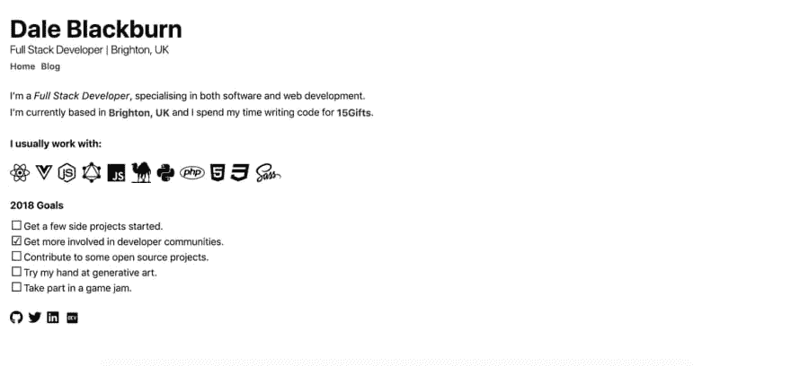

# 与盖茨比和 Netlify 一起重建我的网站

> 原文：<https://dev.to/dakebl/rebuilding-my-website-with-gatsby-and-netlify-44pb>

## 你好，2019！

去年，我创建了一个闪亮的新网站，怀着分享发现和写下我的想法的良好愿望。遗憾的是，我没能比宣布我的新网站到来的第一个走得更远。

在第三次重建我的网站后，现在唯一合适的事情似乎是写一篇类似的新帖子，并详细介绍一下新版本。

## 以前的网站

之前的版本是这样的:

> [](///static/68f67eac00ff62d2d87645d1c9207554/16028/old-site.png)

这个网站是使用 [Nuxt.js](https://nuxtjs.org/) 构建的，相当于 [Next.js](https://nextjs.org/) 的 [Vue.js](https://vuejs.org/) ，并且特意简单实用。我使用静态站点生成器 [Nuxtent](https://nuxtent.now.sh) 完成了一个简单的基于文档的博客，并对[野兽派网页设计](https://brutalist-web.design)的外观和感觉产生了兴趣。

我真的很喜欢在这个网站上工作，但我发现最终的工作流程感觉有点草率，大部分都是拼凑在一起的。这一点，再加上我在过去的一年里一直与 [React](https://reactjs.org/) 合作多于与 Vue 合作，让我寻找一些新技术来减少写博客的障碍，所以我可能会发现让自己定期写作更容易。

## 选择盖茨比

关于盖茨比，我能说什么呢，除了说这是一个工作的梦想。在做了几个小的 Gatsby 项目后，我发现自己迷恋上了开发者体验。

它提供了恰到好处的抽象层，允许您通过其集成的 [GraphQL](https://graphql.org/) 实例、工具和配置驱动开发，轻松提供来自任何来源的数据。

它还为您提供了一套有用的组件，用于路由、数据查询等，使开发您的网站变得轻而易举。

由于生成的网站本身是在 React 中构建的，所以对您可以用它做什么没有真正的限制，特别是模板和插件系统，这使得它非常容易上手。

所以，记住这些盖茨比的心眼，你就能明白为什么它是我博客的下一个迭代的明确选择。

## 新网站

在新网站上，我想延续以前版本的基本和野兽派风格，所以我决定再次使用单色调色板和简单的系统字体。然而这次我选择使用两种系统字体:

```
/* 
Headings are the same as before, using default system font variants 
*/
h1,h2,h3,h4,h5,h6 {
  font-family: -apple-system, BlinkMacSystemFont, Segoe UI, Roboto, Oxygen-Sans, Ubuntu, Cantarell, Helvetica Neue, sans-serif;
}

/* 
The body uses various system monospace variants, starting with Menlo
 */
body {
  font-family: Menlo, Monaco, Lucida Console, monospace, serif;
} 
```

这产生了一个微妙的差异，将标题中沉重的正文内容分解得更好一些。

设计上的主要转变是将博客直接嵌入到主页中，将以前的内容移到固定的侧边栏中，并向单一的按需加载的帖子列表敞开大门。我用 CSS grid 构建了这个布局，用了一些明智的移动优先回退，我认为它工作得相当好。

从 Vue 切换到 React 还让我重新思考了我的组件结构，在我的笔记本上勾画出布局后，设计提供了一组更简单、更清晰的组件。

总的来说，这并不是一个美学上完全不同的网站，但我对它的结果很满意。我认为这个结构很有道理，我真的很喜欢和盖茨比一起工作。这绝对是一个平台，当我需要建立一个新的网站时，我会随时联系它。

## 托管在网络上

我的网站的前一个版本是使用 GitHub Pages 托管的，它很好地满足了我的托管需求，但我觉得是时候为我的下一个托管和 CI/CD 解决方案转移到更强大的东西了。

Netlify 是一项很棒的服务，对于我的基本需求来说，完全免费。我最近在为一个客户建立网站时使用了他们的 [NetlifyCMS Gatsby Starter](https://www.netlifycms.org/docs/start-with-a-template/) ，这简直是一场梦。如果你需要一个 CMS 来搭配你的盖茨比(或[雨果](https://gohugo.io/)或[中间人](https://middlemanapp.com/))版本，我会推荐看看他们的。它非常适合提供一个简单的编辑器(包括富文本和 markdown)，以及开箱即用的身份验证和资产管理。

总的来说，我发现 Netlify 的服务和 OSS 的一切都非常体贴和周到，所以这是一个明确的选择。

由于我更喜欢直接在 [VSCode](https://code.visualstudio.com/) 中写我的降价，使用它的侧窗格预览，我不需要 CMS。因此，在选择了通过提交来简单地控制我的博客文章发布之后，我将 Netlify 指向[这个站点](https://github.com/dakebl/dakebl.co.uk)的回购协议，设置我的 deploy 挂钩来在推送到`Master`分支时重建站点，然后我们就到了！

一个完全自动化的静态站点管道，我非常高兴！