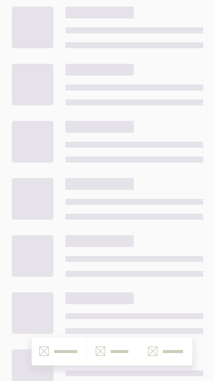
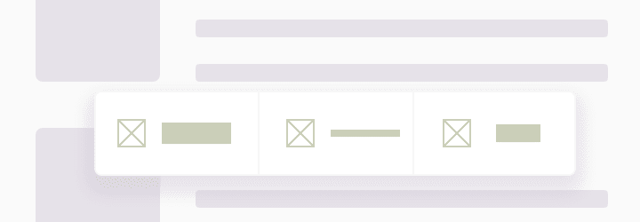
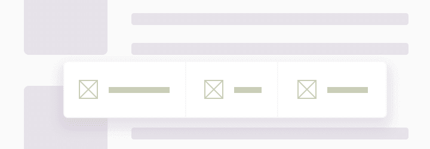

# 在 Android 中创建响应式“按钮栏”小部件(第 1 部分)

> 原文：<https://dev.to/krzysztofbalana/creating-responsive-buttons-bar-widget-in-android-part-1-180c>

今天的 web 开发人员有很多工具来构建现代的、快速的和(最重要的)响应迅速的 web 页面。但当涉及到 Android 时，事情就不那么光明了。我们被自己的“系统”所提供的东西紧紧束缚住了。这里没有那么多的责任。)

# 问题

最近，我不得不做一些自定义用户界面，它将根据不同的语言翻译和内部元素数量的变化而变化。相信我，一个在英语中看起来不错的词，可以在其他语言中得到很好的扩展。

下面，您可以找到一个 ui 可视化示例:

一切看起来都很棒！我们有光滑的图标，伟大的标签，令人颤抖的空白…但是如果有人想使用更长的名字，超过三个按钮呢？那么更小的手机屏幕呢？

我们可以使用 LinearLayout 的权重方法，使用一些 TextView 的自动调整大小，并尝试相应地划分元素，但在不知道它们的初始宽度的情况下，我们可以这样结束:

有人会说:“成功。一切都是平均分配的。它是可读的。我们可以马上结束它。”

但不是我们。我们想要更大的控制力，想要统一一切。字体、空格、图标……应有尽有。我们想要这个:

好多了！每个元素有相同的字体大小，并采取尽可能多的空间，他想要的，可以从其父。目的是将策略应用于容器视图的子对象，直到它们达到期望的状态，无论是使用较小的字体、较小的填充还是隐藏图标！每一个策略都应该适用于每个孩子，这样我们就能得到一致的、更令人愉快的外观。

# 解

我假设你知道如何创建新项目，所以我将跳过这个不相关的部分；)
我要做的，是准备一个复合视图(ButtonBarViewHolder)，它将充当特定视图项(ButtonBarItem)的容器。因此，我的 ButtonBarViewHolder 可以实现它自己的方式来度量和放置它的子元素。我认为，为了达到最佳效果，我不应该仅仅局限于应用一种方法来优化子项，但是我将在后面讨论它(如何将它用作一个响应性的底部栏小部件)。

让我们从准备一些积木开始。