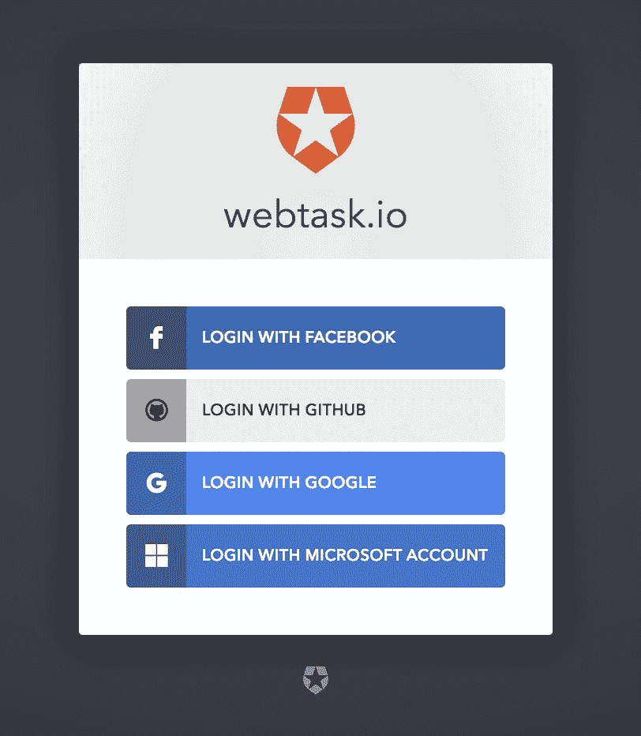
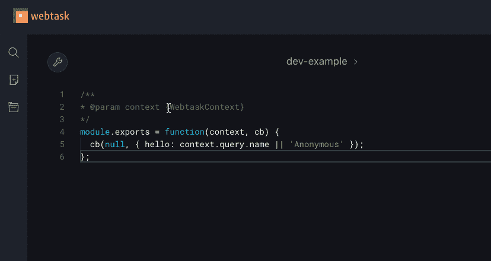
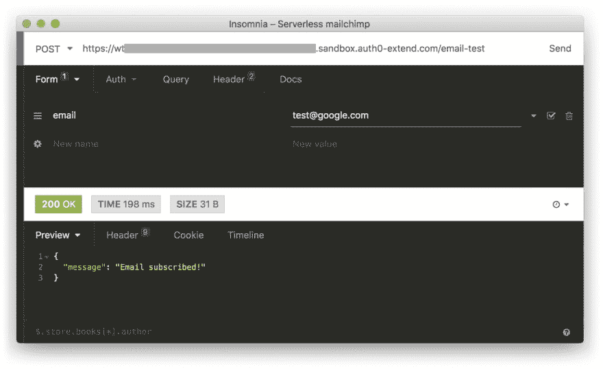

# 使用云函数订阅 Mailchimp

> 原文：<https://dev.to/deammer/serverless-mailchimp-subscription-40ja>

嗨，伙计们！

这是一个电子邮件订阅系统的快速实现。使用几行 JavaScript 和一个无服务器提供程序，我将向您展示如何安全地连接到 Mailchimp 的 API，并允许您的用户订阅电子邮件列表。

#### 要求:

*   写前端代码的地方，比如 [CodePen](https://codepen.io/)
*   一个 GitHub 或 Microsoft 帐户来登录 [Webtask](https://webtask.io)
*   一个已有列表的 [Mailchimp](https://mailchimp.com) 账户

### 设置

你需要从 Mailchimp 那里得到三样东西:

1.  一个 API 密匙，可以通过进入**账户>附加服务> API 密匙**生成。如果需要，查看 [Mailchimp 的文档](https://mailchimp.com/help/about-api-keys/#find+or+generate+your+api+key "View Mailchimp's documentation")。
2.  我们列表的 id，可以在**列表>设置>列表名称和默认值**中找到。
3.  托管列表的名称服务器，可以在 URL 中找到。例如，[https://us1.admin.mailchimp.com/](https://us1.admin.mailchimp.com/)的服务器名是 **us1** 。

### 构建后端

现在让我们前往 [Webtask.io](https://webtask.io) 。Webtask 是由 [Auth0](https://auth0.com/) 的优秀开发者打造的免费云功能托管服务。在他们的登陆页面上，点击“立即尝试”并注册你选择的账户。

[](https://res.cloudinary.com/practicaldev/image/fetch/s--7Jt5Mdyg--/c_limit%2Cf_auto%2Cfl_progressive%2Cq_auto%2Cw_880/https://thepracticaldev.s3.amazonaws.com/i/wrpqeft1aixj0wq1azhh.png)

让我们使用“空函数”模板创建一个新函数。给函数起一个名字，点击“保存”进入编辑器。

你会看到下面的样板:

```
/**
* @param context {WebtaskContext}
*/
module.exports = function(context, cb) {
  cb(null, { hello: context.query.name || 'Anonymous' });
}; 
```

Enter fullscreen mode Exit fullscreen mode

让我们导入 [Axios](https://github.com/axios/axios) 来运行一些 HTTP 请求。点击扳手图标，进入 NPM 模块。点击“添加模块”，寻找 Axios，并将其添加到您的项目中。

[](https://res.cloudinary.com/practicaldev/image/fetch/s--jwBrXfXu--/c_limit%2Cf_auto%2Cfl_progressive%2Cq_66%2Cw_880/https://thepracticaldev.s3.amazonaws.com/i/ahs09l21bfee7l9koucj.gif)

您现在已经准备好与 Mailchimp 通信了！这里有一些专门为你编写的代码:

```
const axios = require('axios');

module.exports = function (context, callback) {
  // Fail early if no email was passed
  if (!context.body || !context.body.email) {
    callback('Missing email parameter');
    return;
  }

  const { email } = context.body;

  // Replace the 3 values below with your own
  const regionName = 'us1';
  const apiKey = 'xxxxxxxxxx';
  const listId = 'xxxxxxxxxx';
  const url = `https://${regionName}.api.mailchimp.com/3.0/lists/${listId}/members/`;

  axios
    .post(
      url,
      {
        // Tell Mailchimp to subscribe this email
        status: 'subscribed',
        // Note that Mailchimp takes an email_address field, not just email
        email_address: email,
      },
      {
        headers: {
          Authorization: `apikey ${apiKey}`,
        },
      }
    )
    .then(() => {
      // Things went well
      callback(null, { message: 'Email subscribed!' });
    })
    .catch(error => {
      // Things didn't go well
      callback(error.response.data);
    });
}; 
```

Enter fullscreen mode Exit fullscreen mode

### 大功告成！🎉

使用 REST 客户端像[邮差](https://getpostman.com)或[失眠](https://insomnia.rest)来查询你的无服务器端点。可以从 Webtask 的 UI 底部复制 URL。

[](https://res.cloudinary.com/practicaldev/image/fetch/s--5V1vkotL--/c_limit%2Cf_auto%2Cfl_progressive%2Cq_auto%2Cw_880/https://thepracticaldev.s3.amazonaws.com/i/uiw7onvm3xdhvguqalbl.png)

### 构建一个前端(可选)

如果你想为这个系统建立一个前端，这里有一个带有输入字段和提交按钮的准系统表单。

可以从 Webtask 编辑器的底部复制`action`属性的 URL。

```
<form action="your_webtask_url" method="POST">
    <label for="email">Email</label>
    <input type="email" name="email" placeholder="Enter your email" />
    <button type="submit">Subscribe</button>
</form> 
```

Enter fullscreen mode Exit fullscreen mode

* * *

### 我学到的东西

#### 网络任务

当使用 Webtask 所称的“完全控制”编程模型时，上下文的主体不会被解析。

```
module.exports = function (context, req, res) {
  // context.body is an empty object
} 
```

Enter fullscreen mode Exit fullscreen mode

要解决这个限制，您需要通过 CLI 设置任务，或者在调用端点时发送一个`pb=1`令牌。我推荐阅读[文档](https://webtask.io/docs/model)。

#### Mailchimp

当出现问题时，Mailchimp 的 API 会返回大量有用的信息。该数据在响应对象中的嵌套比我预期的更深:

```
.catch(error => {
  const { data } = error.response; 
```

Enter fullscreen mode Exit fullscreen mode

例如，如果您重复使用已经在您的列表中的电子邮件，您将看到下面的数据:

```
{  "type":  "http://developer.mailchimp.com/documentation/mailchimp/guides/error-glossary/",  "title":  "Member Exists",  "status":  400,  "detail":  "test@domain.com is already a list member. Use PUT to insert or update list members."  } 
```

Enter fullscreen mode Exit fullscreen mode

* * *

感谢您的阅读，如果我说了什么愚蠢或不正确的话，请告诉我！