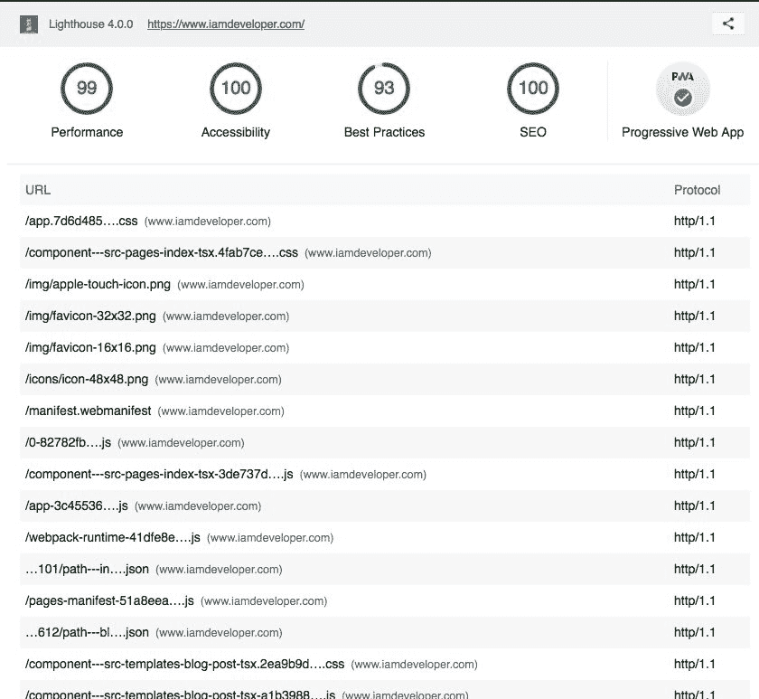

# 帮助通过 HTTP/2 为 Gatsby Netlify 托管的站点提供资源

> 原文：<https://dev.to/nickytonline/help-serving-assets-over-http2-for-a-gatsby-netlify-hosted-site--nc3>

大家好。我把这条推文扔进了 Twitterverse，但认为在这里寻求帮助也是明智的。

> 尼克·泰勒[@ Nicky tonline](https://dev.to/nickytonline)Hi[@ gatsbyjs](https://twitter.com/gatsbyjs)/[@ Netlify](https://twitter.com/Netlify)peeps。我已经运行了[@ _ _ _ _ 灯塔](https://twitter.com/____lighthouse)审计，分数是🔥，但是我想知道通过 HTTP/1.1 提供的资产。我知道 Netlify OOTB 提供 HTTP 2，那么我需要为我的 my build 生成条目并将其注入 netlify.toml 吗？或者有更好的方法吗？2019 年 1 月 29 日上午 03:09[](https://twitter.com/intent/tweet?in_reply_to=1090084616189423616)[](https://twitter.com/intent/retweet?tweet_id=1090084616189423616)[](https://twitter.com/intent/like?tweet_id=1090084616189423616)

我有一个部署到 Netlify 的 Gatsby 站点，我的一些资产通过 HTTP/1.1 提供服务。我知道 Netlify [默认支持 HTTP2](https://www.netlify.com/blog/2017/07/18/http/2-server-push-on-netlify/) 的站点的 HTTP/2。

我知道我需要在我的`_headers`文件中添加条目，例如

```
/
  Link: </js/example-script.js>; rel=preload; as=script
  Link: </css/example-style.css>; rel=preload; as=style 
```

Enter fullscreen mode Exit fullscreen mode

但是在每次部署后更新它会很痛苦。有人知道一个 gatsby 插件可以做到这一点吗，或者当你的 Gatsby 站点托管在 Netlify 上时，你是如何处理这个问题的？

作为构建过程的一部分，我可能会生成`_headers`文件，但是我的直觉告诉我有人已经这样做了😉

如果有人感兴趣，源代码在这里。

## [Nicky tonline](https://github.com/nickytonline)/[iamdeveloper.com](https://github.com/nickytonline/iamdeveloper.com)

### 我的网站 iamdeveloper.com 的源代码

<article class="markdown-body entry-content container-lg" itemprop="text">

[](https://app.netlify.com/sites/iamdeveloperdotcom/deploys)

# 欢迎

这是使用[第十一](https://www.11ty.dev/)静态站点生成器构建的尼克·泰勒网站的源代码。它使用的是[安迪·贝尔](https://piccalil.li/)的 [Hylia 模板](https://github.com/hankchizljaw/hylia)。我已经对它做了一些调整，并且随着时间的推移可能会做得更多，但是我只是想为 Andy 令人敬畏的模板欢呼一下。

## 终端命令

### 首先安装依赖项

```
npm install
```

Enter fullscreen mode Exit fullscreen mode

### 在本地以观察模式服务站点

```
npm start
```

Enter fullscreen mode Exit fullscreen mode

### 构建网站的生产版本

```
npm run production
```

Enter fullscreen mode Exit fullscreen mode

#### 在本地测试生产站点

```
cd dist
npx serve
```

Enter fullscreen mode Exit fullscreen mode</article>

[View on GitHub](https://github.com/nickytonline/iamdeveloper.com)

在 [Unsplash](https://unsplash.com/search/photos/help?utm_source=unsplash&utm_medium=referral&utm_content=creditCopyText) 上由 [Lukas Juhas](https://unsplash.com/photos/2JJz3u_R_Ik?utm_source=unsplash&utm_medium=referral&utm_content=creditCopyText) 拍摄的照片