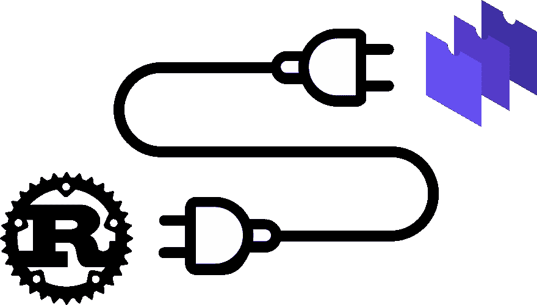

# 在 Rust 应用程序中嵌入 WebAssembly

> 原文：<https://dev.to/wasmer/embedding-webassembly-in-your-rust-application-33n4>

Wasmer 是一个 WebAssembly 运行时，设计用于独立运行和嵌入式运行。

crate [wasmer-runtime](https://github.com/wasmerio/wasmer/tree/master/lib#Runtime) 公开了一个易于使用且安全的 api，用于编译、创建导入和从自己的库中调用 WebAssembly。

[](https://res.cloudinary.com/practicaldev/image/fetch/s--iwed5Ge1--/c_limit%2Cf_auto%2Cfl_progressive%2Cq_auto%2Cw_880/https://thepracticaldev.s3.amazonaws.com/i/ls54gl9rt8ndpyti0378.png)

本教程讲述了如何制作一个简单的 wasm 应用程序，并使用 wasmer-runtime 运行它！

# 创建 Wasm 应用程序

我们的示例应用程序只是一个基本的“Hello，World！”程序。因为 WebAssembly 本身没有任何打印到命令行的方法，所以我们必须从我们的环境中导入这样一个函数。

在这种情况下，我们定义了一个导入的`print_str`函数。

```
// Define a function that is imported into the module.
// By default, the "env" namespace is used.
extern "C" {
    fn print_str(ptr: *const u8, len: usize);
}

// Define a string that is accessible within the wasm
// linear memory.
static HELLO: &'static str = "Hello, World!";

// Export a function named "hello_wasm". This can be called
// from the embedder!
#[no_mangle]
pub extern fn hello_wasm() {
    // Call the function we just imported and pass in
    // the offset of our string and its length as parameters.
    unsafe {
      print_str(HELLO.as_ptr(), HELLO.len());
    }
} 
```

当嵌入器调用`hello_wasm`函数时，它将继续调用导入的`print_str`函数，并指向“Hello，World！”字符串及其长度作为参数。

# 使用 Wasmer 嵌入 WebAssembly！

这个例子展示了如何使用 [wasmer-runtime](https://crates.io/crates/wasmer-runtime/) crate 来编译和运行 WebAssembly！

因为我们的 Wasm 应用程序导入了函数 print_str，所以我们必须创建一个包含该函数实现的`ImportObject`。

虽然您可以自己手动(并且不安全地)填充导入对象，但是我们已经定义了一个有用的宏，它可以自动进行函数签名检查，以使其更加简单和安全。

```
use std::str;
use wasmer_runtime::{
    imports,
    instantiate,
    error,
    Ctx,
};

// Make sure that the compiled wasm-sample-app is accessible at this path.
static WASM: &'static [u8] = include_bytes!("../wasm-sample-app/target/wasm32-unknown-unknown/release/wasm_sample_app.wasm");

fn main() -> error::Result<()> {
    // Let's define the import object used to import our function
    // into our webassembly sample application.
    //
    // We've defined a macro that makes it super easy.
    //
    // The signature tells the runtime what the signature (the parameter
    // and return types) of the function we're defining here is.
    // The allowed types are `i32`, `u32`, `i64`, `u64`,
    // `f32`, and `f64`.
    //
    // Make sure to check this carefully!
    let import_object = imports! {
        // Define the "env" namespace that was implicitly used
        // by our sample application.
        "env" => {
            // name         // func    // signature
            "print_str" => print_str<[u32, u32] -> []>,
        },
    };

    // Compile our webassembly into an `Instance`.
    let mut instance = instantiate(WASM, import_object)?;

    // Call our exported function!
    instance.call("hello_wasm", &[])?;

    Ok(())
}

// Let's define our "print_str" function.
//
// The declaration must start with "extern" or "extern "C"".
extern fn print_str(ptr: u32, len: u32, ctx: &mut Ctx) {
    // Get a slice that maps to the memory currently used by the webassembly
    // instance.
    //
    // Webassembly only supports a single memory for now,
    // but in the near future, it'll support multiple.
    //
    // Therefore, we don't assume you always just want to access first
    // memory and force you to specify the first memory.
    let memory = ctx.memory(0);

    // Get a subslice that corresponds to the memory used by the string.
    let str_slice = &memory[ptr as usize..(ptr + len) as usize];

    // Convert the subslice to a `&str`.
    let string = str::from_utf8(str_slice).unwrap();

    // Print it!
    println!("{}", string);
} 
```

这个例子托管在 Github 上。查看自述文件，了解如何亲自尝试！

[使用 Using Wasmer 的示例](https://github.com/wasmerio/wasmer-rust-example)

如果您有反馈、问题或功能请求，请在我们的 [Github 资源库](https://github.com/wasmerio/wasmer)中提出问题。

我们期待着你用 WebAssembly 和我们新的可嵌入运行时构建的酷东西！