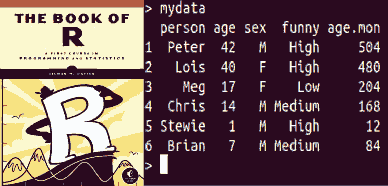
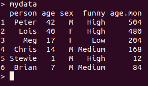
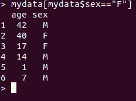
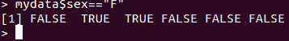
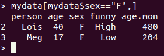

# R 中的错误选择

> 原文：<https://dev.to/egimba/wrong-selection-in-r-l6p>

在阅读 R 书中关于数据框架的部分时，我得到了一个与练习中的结果不同的结果。因为我在代码中漏掉了一个逗号。以前我会纠正它并继续前进，但这次我想知道为什么我得到了错误的结果。

我正在处理的数据框是

我输入的代码是`mydata[mydata$sex=="F"]`,结果如下:

和我预想的不太一样。然后我只输入了测试本身`mydata$sex=="F"`,得到了下面的逻辑向量。

看着它，并与我得到的输出进行比较，事情开始变得有意义了。我从原始代码中得到的两列与第二个代码的向量中的逻辑`TRUE`值一致。我省略逗号所做的是选择符合测试标准的列，而不是选择符合测试标准的行。

有了这些知识，我输入正确的代码`mydata[mydata$sex=="F",]`来获得

我期待的结果。强迫自己慢下来，真正理解为什么代码会产生这样的结果，这对我的学习进步有很大的帮助。如果我没有从前面的阅读和练习中理解行和列的选择以及逻辑值实际上是如何工作的，这将是一个更难解决的问题。继续学习吧！

资源:

R 之书:[https://nostarch.com/bookofr](https://nostarch.com/bookofr)