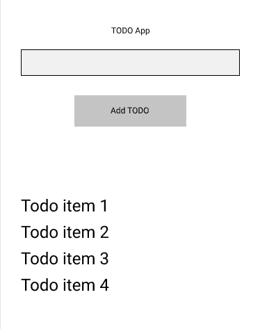
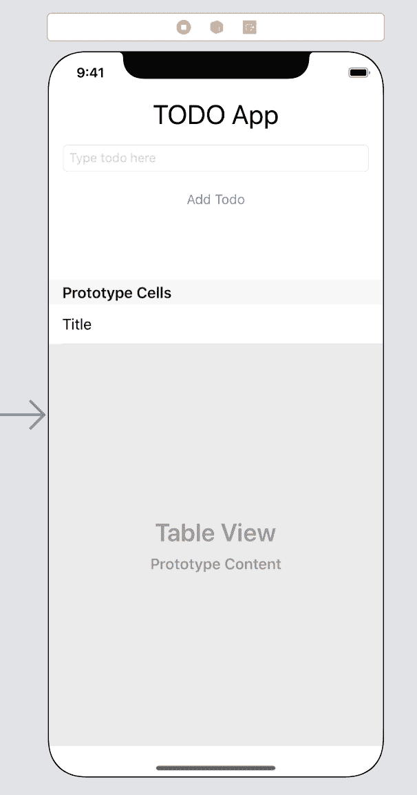
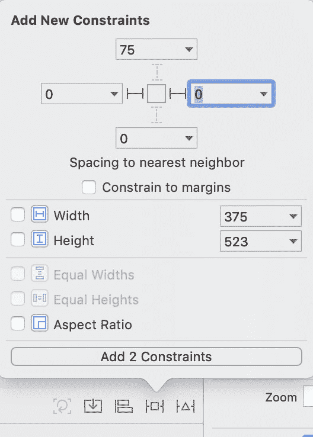

# 第 001 天:制作待办事项清单

> 原文：<https://dev.to/maeganwilson_/day-001-making-a-todo-list-48ho>

我会在待办事项列表上记录我所做的所有工作。每天，我会列出我所完成和学到的东西。目标是让某些东西变得实用。

待办事项列表是一个单页应用程序，有一个文本字段、按钮和待办事项列表。

这里有一个 [GitHub Repo](https://github.com/maeganjwilson/todo_list) ，里面有我所有的作品。

下面是我要去的地方的基本截图:

保持简单，在学习的时候让东西变得实用。

## 特性

*   键入待办事项并点击按钮添加到列表中
*   显示待办事项列表
*   点击待办事项完成
*   滑动以删除待办事项
*   如果应用程序关闭，保留待办事项列表

我的计划是不做上面列表之外的任何功能。这将让我专注于目标。

## 今日的成就

*   开了一个博客系列来让我负起责任
*   启动了一个名为 TODO 的 iOS 项目
*   在 Xcode 中创建了一个故事板

## 我今天学到了什么

如何让表格视图占据屏幕的底部，而不管设备是什么

我使用自动布局使这成为可能。
填充宽度:

1.  打开约束菜单
2.  点击左右约束并使其为 0 
3.  点击添加约束

要填满底部:

1.  打开控制菜单
2.  单击底部约束并使其为 0
3.  点击添加约束