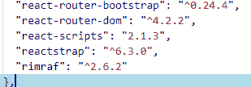
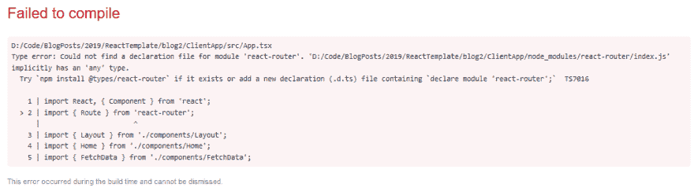

# 如何将 Typescript 与 ASP.NET 核心 2.x React 项目模板一起使用

> 原文：<https://dev.to/jonhilt/how-to-use-typescript-with-the-aspnet-core-2x-react-project-template-f8>

您可以通过 Visual Studio 或命令行创建一个新的 React+ASP.NET 核心项目...

```
dotnet new React 
```

并得到一个不错的小反应/ASP。使用 javascript 编写的 NET Core starter 应用程序。

但是如果您想使用 Typescript 呢？要做到这一点，你需要经历更多的考验。

## 创建 React App

截至。NET Core 2.1 SDK 内置的 ASP.NET+React 模板使用了一种叫做“创建 React App”的东西。

“CRA”是快速启动新 React 项目的标准方式，因此您可以继续构建您的应用程序(无需手动安装依赖项、配置 WebPack 以及现代前端开发带来的所有其他事情！).

当您运行这个命令时...

```
dotnet new React 
```

你得到一个项目，其中包括 ASP.NET 核心(带有一些示例 Web API 控制器)和 CRA 应用程序(在`ClientApp`文件夹中)。

这很好，因为这意味着你得到了一个标准的 React 应用，它没有被不必要的破坏/篡改！

不利的一面是(在撰写本文时),您可能最终会得到一个非常过时的“Create React App”版本，它缺乏对在项目中使用 Typescript 的支持。

要亲自了解这一点，可以通过 Visual Studio 或命令行启动一个新的 React 项目。

您可以使用 NPM 或纱线进行以下步骤。

我通常发现 Yarn 比 NPM 更快(并且有更少的包版本冲突的问题),所以这就是我在这里坚持的。

您可以从这里安装纱线。

打开一个命令提示符，将目录切换到`ClientApp`文件夹，然后键入这些命令。

```
yarn
yarn list react-scripts 
```

这将显示您的应用程序正在使用的 React 脚本的版本。

在我的情况下，这报告我在`react-scripts@1.1.5`上，这意味着我的应用程序正在使用“创建反应应用程序”1.1.5。

React 世界在最近几个月有所发展，现在已经是 2.x.x 的几个版本了(在撰写本文时是 2.1.3)。

从 CRA 的 2.1 版本开始，现在“开箱即用”地支持 Typescript，这给我们带来了一个关键问题。我们如何轻松地将 ASP.NET 核心+反应项目升级到最新版本的 CRA(并启用类型脚本支持)？

在我们介绍之前，您可以获得一个已经升级的 ASP.NET Core React(和 Typescript)项目的副本作为参考。请在下面的表格中填写您的详细信息，我会通过电子邮件发送给您。

## #1 升级反应-脚本

首先，您需要升级新创建的应用程序所使用的 react-scripts 版本。

打开`package.json`(在`ClientApp`中)并将“react-scripts”版本升级到最新版本。

在 VS Code 或 Visual Studio 中，您可以使用智能感知向您显示可用的版本。只需删除现有版本( <sup>1.1.5)</sup> 然后按`CTRL+SPACE`查看列表并选择最高的版本号(编写时为 2.1.3)。

[](https://res.cloudinary.com/practicaldev/image/fetch/s--J--Q8fxI--/c_limit%2Cf_auto%2Cfl_progressive%2Cq_auto%2Cw_880/https://jonhilton.net/img/2019-01-02-upgrade-the-aspnet-react-template-project/2019-01-08-20-33-29.png)

现在打开一个命令提示符(在`ClientApp`文件夹中)并输入`yarn`来安装最新版本。

在这一点上，你还需要删除`package.json`的`devDependencies`部分中的所有‘eslint’包。

ESLint 是 javascript 的“linter ”,它会分析你的代码，如果它不符合某些语法规则(如果它包含可能拼写错误的变量名等),就会抛出警告或错误。).

react-scripts 的最新版本会自动带来正确版本的 ESLint(以及 react 应用程序的 ESLint 配置)。如果你也在`devDependencies`中定义了这些，当你尝试启动你的应用时，你将会以版本冲突和错误结束。

```
 "devDependencies":  {  "ajv":  "^6.0.0",  "babel-eslint":  "^7.2.3",  "cross-env":  "^5.2.0",  "eslint":  "^4.1.1",  "eslint-config-react-app":  "^2.1.0",  "eslint-plugin-flowtype":  "^2.50.3",  "eslint-plugin-import":  "^2.14.0",  "eslint-plugin-jsx-a11y":  "^5.1.1",  "eslint-plugin-react":  "^7.11.1"  }, 
```

删除`devDependencies`下以`eslint`和`babel-eslint`开头的每一行。

这是你应该得到的结果。

```
 "devDependencies":  {  "ajv":  "^6.0.0",  "cross-env":  "^5.2.0"  }, 
```

不过，请确保您保留了下面的 eslintConfig 部分...

```
"eslintConfig":  {  "extends":  "react-app"  }, 
```

然后输入`yarn`,确保你得到了所有应用依赖项的正确版本。

如果您现在运行您的项目并导航到`https://localhost:5001/`，您应该会看到类似这样的内容。

[](https://res.cloudinary.com/practicaldev/image/fetch/s--b6LyX3TC--/c_limit%2Cf_auto%2Cfl_progressive%2Cq_auto%2Cw_880/https://jonhilton.net/img/2019-01-02-upgrade-the-aspnet-react-template-project/2019-01-08-21-44-17.png)

您已成功升级您的项目以使用最新版本的 CRA！

## #2 开始使用类型脚本

差不多了，但是我们实际上仍然没有使用 Typescript。

首先，您需要引入 Typescript 作为项目的依赖项，同时您可以引入项目已经在使用的一些关键包的类型定义。

确保你仍然在`ClientApp`文件夹中...

```
yarn add typescript @types/node @types/react @types/react-dom @types/jest 
```

> **打字稿定义**
> 
> Typescript 定义使 Typescript 能够处理用 javascript 编写的代码。>如果没有它们，Typescript 将无法知道>任何 javascript 代码中使用的是什么类型。
> 
> 举这个例子。
> 
> ```
> function sayHello(name){
>    return 'hello ' + name;
> } 
> ```
> 
> 这里没有告诉 Typescript 如何“编译”这个 javascript。看起来,`name`是一个字符串，这个函数返回一个字符串，但是在>普通的旧 javascript 中这是没有保证的，你可以很容易地将一个>数字传递给`sayHello`,它仍然会连接“hello”和传入的数字>。
> 
> 为了让 Typescript 检查您在调用>函数等时是否传递了正确的类型。它需要知道对于任何给定的函数，哪些类型是有效的(哪些是无效的)。
> 
> 为此，Typescript 编译器将尝试定位定义文件，告诉它如何编译遇到的任何 javascript 代码，包括>第三方库中的 javascript(您的项目与之交互)。
> 
> 在本例中，我们引入了 node、react、react-dom 和 jest >的定义，它们是 Create React App 使用的库。

现在把`ClientApp\src\App.js`改名为`ClientApp\src\App.tsx`。

运行你的应用程序，你会得到这个错误(在浏览器中)。

[](https://res.cloudinary.com/practicaldev/image/fetch/s--lRtb8piX--/c_limit%2Cf_auto%2Cfl_progressive%2Cq_auto%2Cw_880/https://jonhilton.net/img/2019-01-02-upgrade-the-aspnet-react-template-project/2019-01-08-22-00-57.png)

这是一个很好的例子，说明缺少类型定义会导致 Typescsript 抛出错误。

您可以通过确保您仍然在`ClientApp`文件夹中，然后引入 React Router 的类型声明来解决这个问题。

```
yarn add @types/react-router 
```

现在运行你的应用程序，一切都应该和以前一样！

从现在开始，如果你想为你的 React 组件使用 Typescript，只要确保使用`.tsx`扩展就可以了！

[还有更多从哪里来的，先拿这些帖子...](https://jonhilton.net/devto/next-react-post/)