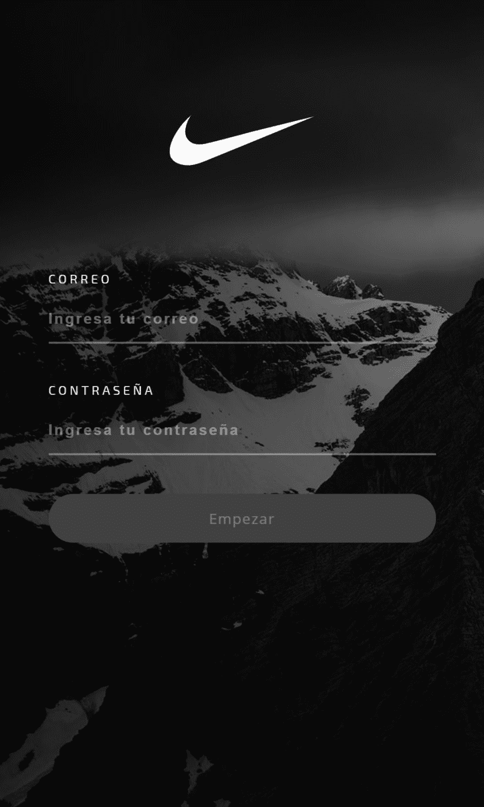

# 创造一个图形和阿波罗的 API | part II

> [https://dev . to/gugadev/creating-one-API-con-graph QL-y-Apollo--part-ii-4194](https://dev.to/gugadev/creando-una-api-con-graphql-y-apollo--parte-ii-4194)

在上一个教程中，我们看到了如何在 Node.js 中使用[【Apollo-server】](https://github.com/apollographql/apollo-server)和[【type-graph QL】](https://github.com/19majkel94/type-graphql/)创建 graph QL API，以及如何通过嵌入式客户端(即[【棱柱-操场】使用该 API 在本教程中，我们将创建一个以编程方式使用 API 的角度应用程序，并添加其他功能，如异步验证。话虽如此，我们还是走吧。](https://github.com/prisma/graphql-playground)

## 准备

第一是准备好我们的环境。我们需要 Node.js 的最新 LTS 以及最新版本的“角 CLI”。如果没有安装角型的话，那么请看了解如何安装。

我们着手创建我们简单的、无路由的项目:

```
ng new signup-form --style=scss 
```

Enter fullscreen mode Exit fullscreen mode

几秒钟(或几分钟，取决于您的连接)后，我们将有一个支持 Sass 的现成项目。

以下是将*阿波罗*添加到项目中。我们这样做是通过:

```
ng add apollo 
```

Enter fullscreen mode Exit fullscreen mode

安格尔将安装阿波罗计划和它的附属机构，并为我们设置项目。

现在我们可以运行该项目，为此只运行`yarn start`。完成后，我们就可以开始编码了。😉

## 开始编码

我们的风格将是*【darkie】*，从这篇帖子的封面可以看出这一点为此，我们将通过指令创建我们的主题。如果你还不知道它们是什么，我请你看看我的《T2 指南》。

我们将创建一个用于设置文本框样式的策略。为此，执行我们:

```
ng g d ui/input/base 
```

Enter fullscreen mode Exit fullscreen mode

它将为我们创建一个指令`base.directive.ts`。本指引将阐明如下:

```
@Directive({
  selector: '[appBaseInput]'
})
export class BaseDirective {

  @HostBinding('class')
  elementClass = 'txt txt-base'
} 
```

Enter fullscreen mode Exit fullscreen mode

我们将使用本指令对其应用`txt-base`和`txt-base`类。此代码将放在名为“`base.directive.scss`”的文件中，与指令处于同一级别。

```
.txt {
  background-color: transparent;
  border: none;
  border-bottom: 2px solid rgba(255,255,255,.15);
  color: rgba(255,255,255,.75);
  font-size: 15px;
  font-weight: bolder;
  height: 50px;
  letter-spacing: 2px;
  transition: border-color 300ms ease;
  width: 100%;

  &:placeholder {
    color: rgba(255,255,255,.4);
    font-size: 15px;
  }

  &:focus {
    border-bottom-color: rgba(255,255,255,.75);
    outline: none;
  }

  &.error {
    border-bottom-color: #f39c12;
    color: #f39c12;
  }
} 
```

Enter fullscreen mode Exit fullscreen mode

很简单。它的背景将是透明的，并且只有一个较低的边界，类似于材质设计，当您将焦点放在它上时，它会变得清晰。

现在，我们为按钮创建了指令。为此，我们生成了一个新指令，其内容为:

```
ng g d ui/button/primary 
```

Enter fullscreen mode Exit fullscreen mode

并修改如下:

```
@Directive({
  selector: '[appPrimaryButton]'
})
export class PrimaryDirective {
  @HostBinding('class')
  elementClass = 'btn primary'
} 
```

Enter fullscreen mode Exit fullscreen mode

及其各自的 CSS 代码。再次，在名为`primary.directive.scss`的文件中:

```
.btn {
  border: none;
  border-radius: 25px;
  font-family: 'Open Sans';
  font-size: 15px;
  letter-spacing: 1px;
  height: 50px;
  width: 100%;

  &.primary {
    background-color: #333;
    color: rgba(255,255,255,.9);

    &:hover:not(:disabled), &:active:not(:disabled) {
      background-color: darken(#333, 10%);
    }
    &:disabled {
      background-color: #222;
      color: rgba(255, 255, 255, .3);
      cursor: not-allowed;
    }
  }
  &:focus {
    outline: none;
  }
} 
```

Enter fullscreen mode Exit fullscreen mode

一旦有了我们的指令，我们就要为每一个人创建一个模块:

```
ng g m ui/button/
ng g m ui/input/ 
```

Enter fullscreen mode Exit fullscreen mode

e 我们导入和导出模块中的指令:

```
@NgModule({
  declarations: [
    BaseDirective
  ],
  imports: [
    CommonModule
  ],
  exports: [
    BaseDirective
  ]
})
export class InputModule { } 
```

Enter fullscreen mode Exit fullscreen mode

```
@NgModule({
  declarations: [
    PrimaryDirective
  ],
  imports: [
    CommonModule
  ],
  exports: [
    PrimaryDirective
  ]
})
export class ButtonModule { } 
```

Enter fullscreen mode Exit fullscreen mode

最后，我们转向`src/app/styles.scss`并导入我们的两个样式表:

```
@import "./app/ui/input/base.directive";
@import "./app/ui/button/primary.directive";

// Reset CSS
html {
  box-sizing: border-box;
}
*,
*:before,
*:after {
  box-sizing: inherit;
  margin: 0;
  padding: 0;
}
body {
  font-family: 'Open Sans';
} 
```

Enter fullscreen mode Exit fullscreen mode

现在我们的指令已经准备好了。😎

## 表格的创建

我们继续创建表格。为此，我们一如既往地使用角 CLI:

```
ng g c signup
ng g m signup 
```

Enter fullscreen mode Exit fullscreen mode

我们生成了一个组件和一个模块。该组件，我们必须将其包含在模块中，同样，我们必须包含模块`InputModule`和`ButtonModule`。让我们看看`SignupModule` :

```
@NgModule({
  declarations: [
    SignupComponent
  ],
  imports: [
    CommonModule,
    ReactiveFormsModule,
    InputModule,
    ButtonModule
  ],
  exports: [
    SignupComponent
  ]
})
export class SignupModule { } 
```

Enter fullscreen mode Exit fullscreen mode

我们来解释一下。我们首先创建了两个策略及其模块。要使用这些指令，包含这些指令的模块必须包含在要使用这些指令的组件模块中。

```
ButtonModule --> ButtonDirective
     |                  |
     ∨                  ∨
SignupModule --> SignupComponent 
```

Enter fullscreen mode Exit fullscreen mode

我们还导入了模块`ReactiveFormsModule`以使组件`SignupComponent`能够使用这种反应式表单行为，我们将在下一步看到。以下是导出“`SignupComponent`”以便在您的模块外部使用，因为我们将在主模块中使用此组件。

现在我们来看一下我们的组成部分。众所周知，一个角分量分为两个，分别是模板和*样式表*加上 su *类*控制器。模板只是带有角度属性的稍加修改的 HTML。我们的模板将如下所示:

```
<div class="container">
  <div class="overlay"></div>
  <section class="side">
    <div class="overlay"></div>
  </section>
  <form [formGroup]="suForm" (ngSubmit)="signup()">
      <figure class="image">
        
      </figure>
      <article class="controls">
        <div class="form-group">
          <label for="email">correo</label>
          <input type="email" id="email" formControlName="email" placeholder="Ingresa tu correo" autocomplete="off" appBaseInput [ngClass]="{ error: email.dirty && email.errors }">
          <span class="error" *ngIf="email.errors && email.errors.email">Ingrese un correo válido</span>
          <span class="error" *ngIf="email.errors && email.errors.taken">El email ya está registrado</span>
        </div>
        <div class="form-group">
          <label for="password">contraseña</label>
          <input type="password" id="password" formControlName="password" placeholder="Ingresa tu contraseña" autocomplete="off" appBaseInput [ngClass]="{ error: email.dirty && password.errors }">
          <span class="error" *ngIf="password.errors">Ingrese letras y números</span>
        </div>
      </article>
      <footer class="actions">
        <button type="submit" appPrimaryButton [disabled]="suForm.invalid">Empezar</button>
      </footer>
  </form>
</div> 
```

Enter fullscreen mode Exit fullscreen mode

> 如果不知道如何使用活性表单，请看本教程。

请注意，我们已将我们的指令`appBaseInput`添加到元素`button`中，并将指令`appPrimaryButton`添加到元素`appPrimaryButton`。执行此操作时，我们将向它们注入我们先前定义的 CSS 类。

现在让我们看看我们的控制器:

```
import { User } from './../models/user';
import { Component, OnInit } from '@angular/core'
import { FormBuilder, FormGroup, Validators, AbstractControl, FormControl } from '@angular/forms'
import { map } from 'rxjs/operators'

@Component({
  selector: 'app-signup',
  templateUrl: './signup.component.html',
  styleUrls: ['./signup.component.scss']
})
export class SignupComponent implements OnInit {
  suForm: FormGroup

  constructor(
    private fb: FormBuilder
  ) {}

  public signup() {
    const user = new User
    user.email = this.email.value
    user.password = this.password.value
    // hacer algo con el usuario
  }

  ngOnInit() {
    this.suForm = this.fb.group({
      email: new FormControl('', [
        Validators.required,
        Validators.email
      ]),
      password: new FormControl('', [
        Validators.pattern('^(?=.*[0-9])(?=.*[a-zA-Z])([a-zA-Z0-9]+)$')
      ])
    })
  }

  get email(): AbstractControl {
    return this.suForm.get('email')
  }

  get password(): AbstractControl {
    return this.suForm.get('password')
  }
} 
```

Enter fullscreen mode Exit fullscreen mode

很简单，就像我们看到的。我们创建了`required`、`FormControl`字段，并向它们添加了一些验证，如`required`、`email`和`pattern`。

最后加入 CSS 代码使其看起来很酷□□□□□□□□□

```
.container {
  background-color: #0F223F;
  background-color: #131313;
  height: 100vh;
  width: 100%;

  > .overlay {
    background-color: rgba(0,0,0,.6);
  }

  .side,
  &.container {
    background: url('/assets/img/dark-mountains.jpg') no-repeat;
    background-size: cover;
    position: relative;

    > .overlay {
      background-color: rgba(0,0,0,.5);
      height: 100%;
      left: 0;
      position: absolute;
      top: 0;
      width: 100%;
    } 
  }

  form {
    margin: 0 auto;
    max-width: 480px;
    padding: 40px;
    position: relative;
  }

  .image {
    height: 150px;
    margin-top: 30px;
    text-align: center;

    img {
      height: 100%;
    }
  }

  .controls {
    display: grid;
    grid-template-columns: 1fr;
    grid-gap: 40px 0;
    margin-top: 40px;
    padding: 20px 0;

    label {
      color: rgba(255, 255, 255, .9);
      display: block;
      font-family: 'Exo 2';
      font-size: 13px;
      letter-spacing: 3px;
      padding-bottom: 10px;
      text-transform: uppercase;
    }
    span.error {
      color: #f39c12;
      display: block;
      font-family: 'Exo 2';
      font-size: 12px;
      padding: 10px 0 0 0;
      text-transform: uppercase;
    }
  }
  .actions {
    margin-top: 20px;
  }
}

@media only screen and (min-width: 1200px) {
  .container {
    display: flex;

    form {
      background: #131313;
      flex: 0 0 480px;

      .overlay { display: none; }
    }
    .side {
      flex: 1;
    }
  }
} 
```

Enter fullscreen mode Exit fullscreen mode

最后，我们把`AppModule`中的`SignupModule`输入`AppModule`并把我们的`SignupComponent`输入`AppComponent`模板中:

```
@NgModule({
  declarations: [
    AppComponent,
  ],
  imports: [
    BrowserModule,
    SignupModule,
    GraphQLModule,
    HttpClientModule
  ],
  bootstrap: [AppComponent]
})
export class AppModule { } 
```

Enter fullscreen mode Exit fullscreen mode

```
<app-signup></app-signup> 
```

Enter fullscreen mode Exit fullscreen mode

仅此而已！如果用`yarn start`运行，我们会得到这样的东西:

[](https://res.cloudinary.com/practicaldev/image/fetch/s--37-lguof--/c_limit%2Cf_auto%2Cfl_progressive%2Cq_auto%2Cw_880/https://i.imgur.com/TfQOeA3.png)

太棒了？在下一个教程中，我们将向窗体中添加功能。😉