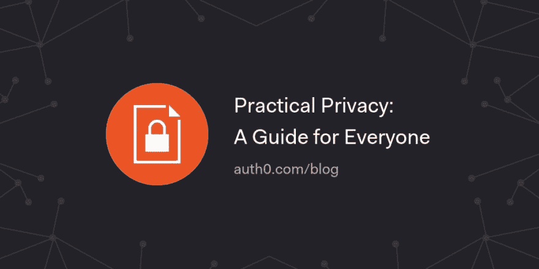

# 实用隐私:人人指南

> 原文：<https://dev.to/auth0/practical-privacy-a-guide-for-everyone-3aab>

为了庆祝#DataPrivacyDay，我们发布了《实用隐私》——一个保护您的敏感数据和提高您整体在线隐私的简单步骤指南。

[读下去🔐](https://auth0.com/blog/practical-privacy-a-guide-for-everyone/?utm_source=dev&utm_medium=sc&utm_campaign=privacy_guide)

