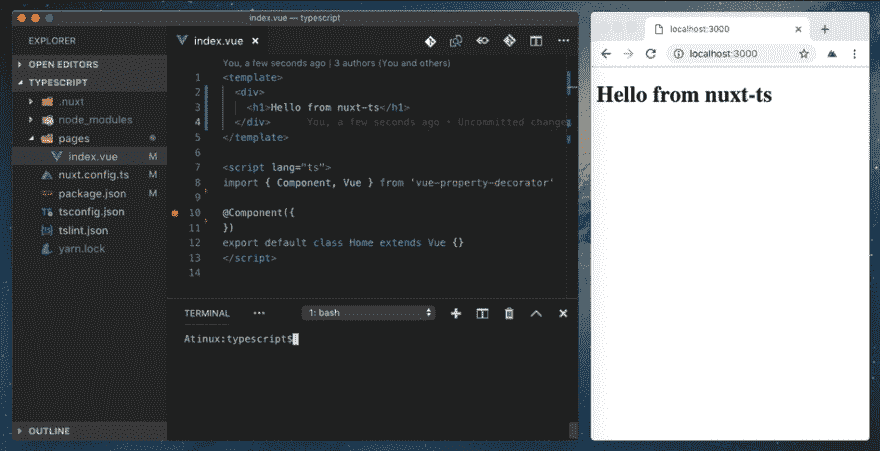
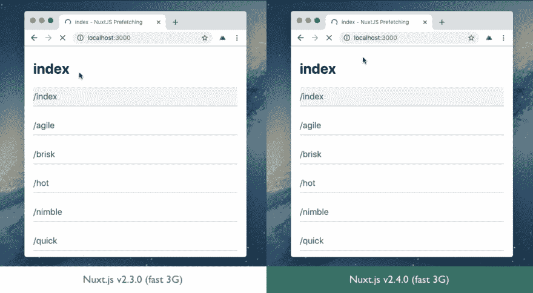
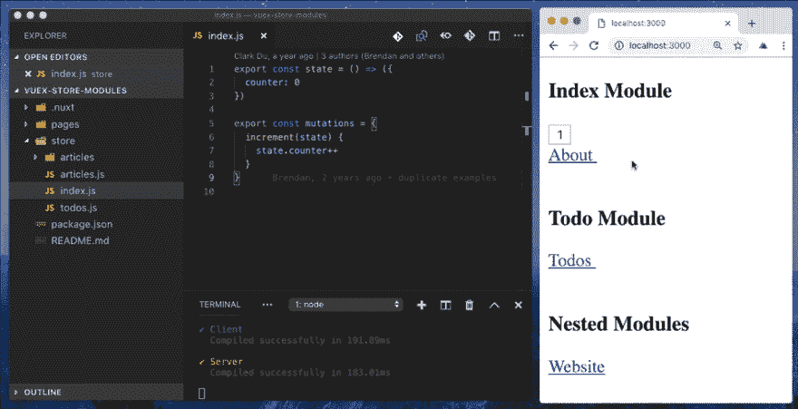
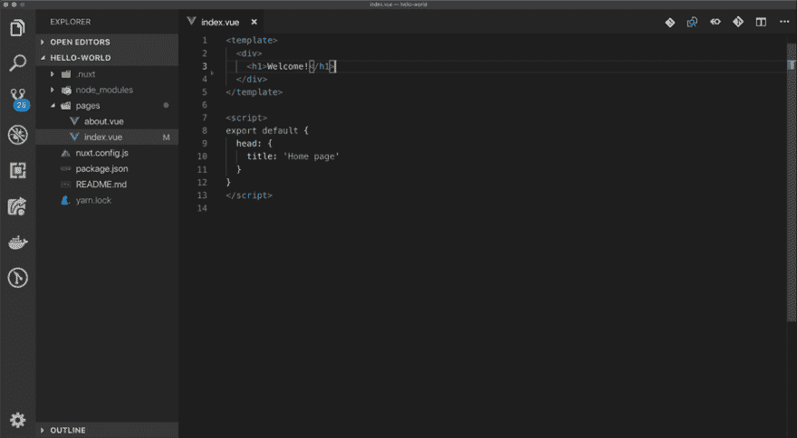
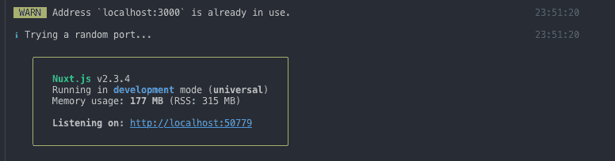
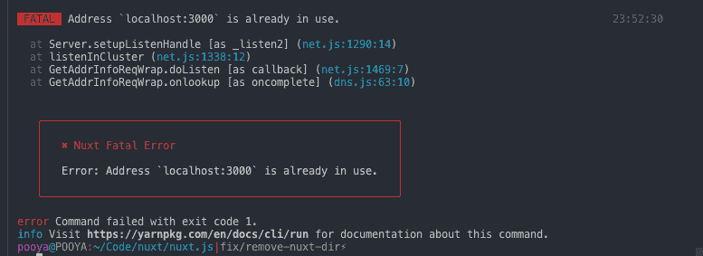
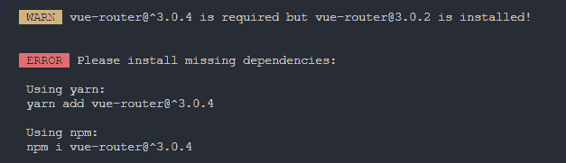
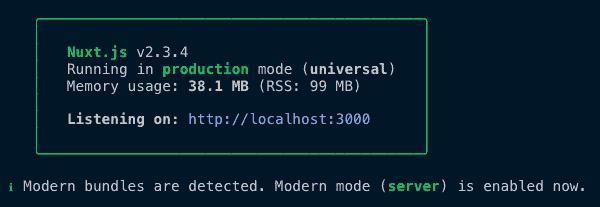
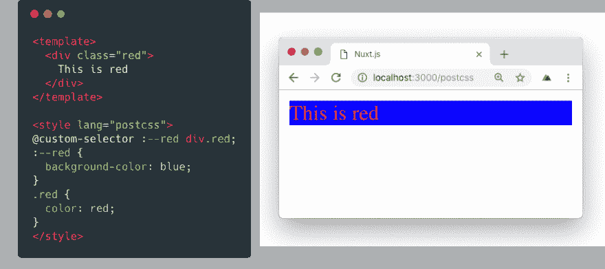
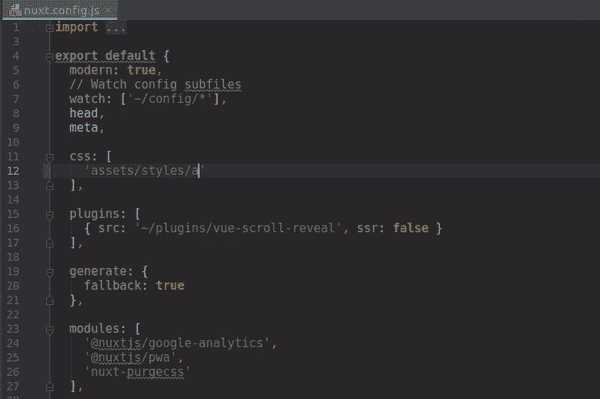

# Nuxt.js v2.4.0 出来了！TypeScript、智能预取等等...

> 原文：<https://dev.to/nuxt/nuxtjs-v240-is-out-typescript-smart-prefetching-and-more-18d>

> 你也可以在 GitHub 上看到这个发行说明:[https://github.com/nuxt/nuxt.js/releases/tag/v2.4.0](https://github.com/nuxt/nuxt.js/releases/tag/v2.4.0)

## 重要新闻👀

### 新的核心团队成员🐤

我们非常自豪地宣布 Kevin marrec([@ kevinmarrec](https://dev.to/kevinmarrec))成为 Nuxt.js 的新核心团队成员，他是法国🇫🇷人，负责 TypeScript 集成💚

### 官方咨询⛑

我们现在提供来自核心团队的官方支持和咨询。我们与 Otechie 合作开发该流程，并且已经与选定的公司进行了一些测试。

你感兴趣还是好奇？
了解更多关于[https://otechie.com/nuxt](https://otechie.com/nuxt)的信息🙌

### RFC 流程📎

我们邀请您来看看我们的 [nuxt/rfcs](https://github.com/nuxt/rfcs) 知识库，在这里我们讨论 nuxt 的未来及其愿景。

如果你想了解更多关于 Nuxt 即将到来的变化，这里有一些有趣的建议:

*   [全静态生成模式](https://github.com/nuxt/rfcs/issues/22)默认使用 Nuxt 生成离线静态网站
*   [Fabula](https://github.com/nuxt/rfcs/issues/20) ，一个受 Vue/Nuxt 启发的工具，用于在本地和远程主机上运行任务
*   [改进@nuxt/config 包](https://github.com/nuxt/rfcs/issues/16)以支持`config/`目录和自动完成
*   Nuxt Workers 在服务器部分开启更多可能性(集群、PM2 集成、服务器上的 HMR 等等)
*   [模块改进](https://github.com/nuxt/rfcs/issues/10)为 Nuxt 模块提供更多功能
*   还有[更多](https://github.com/nuxt/rfcs/issues)💚

### 发布计划🚢

从这个版本开始，Nuxt 将遵循一个正式的发布计划(尽可能好)。此外，在 [RELEASE_PLAN.md](https://github.com/nuxt/nuxt.js/blob/dev/RELEASE_PLAN.md) 中定义了旧的主要版本的生命周期结束。

快速总结:

*   Nuxt 主要版本计划每 6 个月发布一次。
*   Nuxt.js 次要版本的发布周期大约是 4 周。
*   修正将在实际 PR/commit 后尽快发布

我们强烈邀请您阅读 [RELEASE_PLAN.md](https://github.com/nuxt/nuxt.js/blob/dev/RELEASE_PLAN.md) 了解更多详情。

### 谢谢你

我们要特别感谢:

*   我们的贡献者提交错误报告、功能请求和问题评论
*   我们的用户在我们的[不和谐服务器](https://discord.gg/9NWWc7E)上参与，并通过提及我们的[推特账户](https://twitter.com/nuxt_js)来分享爱
*   所有为使用 Nuxt.js 的公司工作并帮助我们建立一个[展示列表](https://github.com/nuxt/nuxt.js/issues/4681)的开发人员
*   我们的支持者和赞助商通过我们的[开放集体](https://opencollective.com/nuxtjs)为我们提供资金支持

## 新功能✨

### 说到打字稿...

> TypeScript 支持已经登陆！

[](https://res.cloudinary.com/practicaldev/image/fetch/s--k_PnuXll--/c_limit%2Cf_auto%2Cfl_progressive%2Cq_66%2Cw_880/https://user-images.githubusercontent.com/904724/51127667-51b2b180-1826-11e9-9e8f-07bb39d09d3a.gif)

为了用 TypeScript 运行 Nuxt，我们创建了一个新的发行版，名为 [nuxt-ts](http://npmjs.com/package/nuxt-ts) (我们还有 [nuxt-ts-edge](http://npmjs.com/package/nuxt-ts-edge) )。
我们要感谢 [@hmsk](https://dev.to/hmsk) 在 npm ❤️上捐赠的包名

你可以在我们的 [Nuxt TS CodeSandBox](https://codesandbox.io/s/github/nuxt/nuxt.js/tree/dev/examples/typescript) 中探索 [Nuxt TypeScript 示例](https://github.com/nuxt/nuxt.js/tree/dev/examples/typescript)或者直接使用它。

更高级的例子，可以看看 [HackerNews-TS repo](https://github.com/nuxt-community/hackernews-nuxt-ts) 或者在 [CodeSandBox](https://codesandbox.io/s/github/nuxt-community/hackernews-nuxt-ts) 上玩玩，由[@ husa yt](https://dev.to/husayt)&[@ kevinmarrec](https://dev.to/kevinmarrec)制作。

这部作品由 [@kevinmarrec](https://dev.to/kevinmarrec) 在 [@pi0](https://dev.to/pi0) & [@atinux](https://dev.to/atinux) 的帮助下完成。

⚠️ **实验性的:**我们正在等待您的反馈，以不断改进它，即使没有永远的主要版本，突破性的变化也可能发生。但是，所有变更都将被正确记录

### 智能预取⚡️

默认情况下，Nuxt.js 会自动预取在视窗**中可见的`<nuxt-link>`链接的代码分割页面**。受[快速链接](https://github.com/GoogleChromeLabs/quicklink)的启发，这极大地提高了最终用户的性能。

[](https://res.cloudinary.com/practicaldev/image/fetch/s--jP7Crsw7--/c_limit%2Cf_auto%2Cfl_progressive%2Cq_66%2Cw_880/https://user-images.githubusercontent.com/904724/51692960-4158be80-1ffe-11e9-9299-61881d06412e.gif)

在线演示，我们建议您试用一下，感受一下不同之处:

*   无预取(v 2.3):[https://nuxt-no-prefetch . surge . sh](https://nuxt-no-prefetch.surge.sh)
*   带预取(v 2.4):[https://nuxt-prefetch . surge . sh](https://nuxt-prefetch.surge.sh)

**加成:**我们增加了`$nuxt.isOnline`和`$nuxt.isOffline`这两个是无功的，所以你可以直接在你的组件内部使用(见[这个例子](https://github.com/nuxt/nuxt.js/blob/dev/examples/nuxt-prefetch/layouts/default.vue#L3))。

您可以在相关的 PR #4574 和文档中了解更多关于此功能的信息。

### HMR &最佳实践`store/`👀

> 通过对商店(`mutations`、`getters`和`actions`)的全面 HMR 支持，节省更多开发时间。

[](https://res.cloudinary.com/practicaldev/image/fetch/s--oq49NDCr--/c_limit%2Cf_auto%2Cfl_progressive%2Cq_66%2Cw_880/https://user-images.githubusercontent.com/904724/51385153-b3bd3080-1b1e-11e9-891f-c136a3182ca0.gif)

此功能已由 PRs #4589、#4582 和#4791 上的[@ mannil](https://dev.to/mannil)&[@ atinux](https://dev.to/atinux)实现

### 为 VS 代码自动完成(via。Vetur 扩展)✅

如果您使用的是 VS 代码，在这个版本中，您现在将拥有 Nuxt.js 组件的自动完成功能:

[](https://res.cloudinary.com/practicaldev/image/fetch/s--OC6YX46I--/c_limit%2Cf_auto%2Cfl_progressive%2Cq_66%2Cw_880/https://user-images.githubusercontent.com/904724/51854163-70d33800-232a-11e9-98b0-f5e7406996cd.gif)

此功能已由 PR #4524 上的[@ octref](https://dev.to/octref)&[@ atinux](https://dev.to/atinux)实现

### 端口摄？Nuxt 支持你！💪

如果 Nuxt 想要监听一个已经被使用的端口，它会警告你**在开发中**并监听一个空闲的端口:

[](https://res.cloudinary.com/practicaldev/image/fetch/s--ooxDU4_W--/c_limit%2Cf_auto%2Cfl_progressive%2Cq_auto%2Cw_880/https://user-images.githubusercontent.com/904724/49298719-5c0b2d00-f4be-11e8-9639-ec914ff64782.png)

在生产中，它将抛出一个错误来避免不必要的行为:

[](https://res.cloudinary.com/practicaldev/image/fetch/s--1yqZBa_v--/c_limit%2Cf_auto%2Cfl_progressive%2Cq_auto%2Cw_880/https://user-images.githubusercontent.com/904724/49298757-6e856680-f4be-11e8-9485-812805b83906.png)

这个功能已经由 PR #4428 上的 [@ricardogobbosouza](https://dev.to/ricardogobbosouza) 在 [@pi0](https://dev.to/pi0) 和 [@mannil](https://dev.to/mannil) 的帮助下实现了。

### 建议安装缺失的依赖项或不匹配项💯

Nuxt 需要所有类似对等的依赖项作为更容易使用的依赖项。有时，当用户在他们的 package.json 中显式添加与 nuxt 不兼容的特定版本时，这会导致不必要的行为。这也有助于解决流行的 Vue 包版本不匹配错误(#198、#669、#1084、#1414、#1851、#2079、#2406、#3454)。

Nuxt 现在能够自动自我验证已安装的依赖项，并在检测到问题时发出适当的警告消息。

[](https://res.cloudinary.com/practicaldev/image/fetch/s--x7Y9f4Oe--/c_limit%2Cf_auto%2Cfl_progressive%2Cq_auto%2Cw_880/https://user-images.githubusercontent.com/5158436/50593651-613d0c80-0eae-11e9-89b4-396c5f64d31d.png)

此功能已由 PR #4669 中的 [@pi0](https://dev.to/pi0) 实现

### 自动检测现代捆🥇

当运行`nuxt start`时，Nuxt 会自动检测你构建的应用是否启用了 mode 模式。不再需要显式运行`nuxt start --modern`🌟

[](https://res.cloudinary.com/practicaldev/image/fetch/s--gocbhrVn--/c_limit%2Cf_auto%2Cfl_progressive%2Cq_auto%2Cw_880/https://user-images.githubusercontent.com/904724/49299896-1bf97980-f4c1-11e8-9321-9268c0f4c228.png)

此检测由 PR #4422 上的 [@clarkdo](https://dev.to/clarkdo) 创建

### 插件模式和文件扩展名💅

到目前为止，您在插件声明中使用`ssr: false`来禁用服务器端渲染。我们决定放弃这个选项，转而引入一个`mode`，它可以是`'all'`、`'client'`或`'server'`。不用担心，`ssr`还在工作(直到 Nuxt 3)。

`mode`的新特性是你可以使用文件后缀来定义它:

*   `plugins/plugin.server.js`
*   `plugins/plugin.client.js`
*   `plugins/plugin.js`

通过将插件添加到您的`nuxt.config.js` :

```
plugins: [
  '~/plugins/plugin.server.js',
  '~/plugins/plugin.client.js',
  '~/plugins/plugin.js'
] 
```

Enter fullscreen mode Exit fullscreen mode

该声明将在内部转换为:

```
plugins: [
  { mode: 'server', src: '~/plugins/plugin.server.js' },
  { mode: 'client', src: '~/plugins/plugin.client.js' },
  { mode: 'all', src: '~/plugins/plugin.js' }
] 
```

Enter fullscreen mode Exit fullscreen mode

(如果手动指定`mode`，将覆盖后缀检测)

此功能已由 PR #4592 上的 [@clarkdo](https://dev.to/clarkdo) 实现

### 模块命令🖥

Nuxt 模块现在可以包含被 Nuxt 的 CLI 识别的`bin`脚本。

这里有一个`my-module/bin/command.js` :
的例子

```
#!/usr/bin/env node 
const consola = require('consola')
const { NuxtCommand } = require('@nuxt/cli')

NuxtCommand.run({
  name: 'command',
  description: 'My Module Command',
  usage: 'command <foobar>',
  options: {
    foobar: {
      alias: 'fb',
      type: 'string',
      description: 'Simple test string'
    }
  },
  run(cmd) {
    consola.info(cmd.argv)
  }
}) 
```

Enter fullscreen mode Exit fullscreen mode

可以使用
运行该命令

```
npx nuxt command arg1 arg2 
```

Enter fullscreen mode Exit fullscreen mode

你可以在[模块命令文档](https://nuxtjs.org/guide/modules#module-package-commands)中了解更多。

⚠️ **实验性的:**我们正在等待您的反馈，以不断改进它，即使没有永远的主要版本，突破性的变化也可能发生。然而，所有的变更都将被妥善记录< 3

这个功能已经由 [@galvez](https://dev.to/galvez) 在 [@pi0](https://dev.to/pi0) 的帮助下在 PR #4314 上实现了。

### Vue 组件中的后置 CSS💃

您现在可以在您的 Vue 组件中使用`lang="postcss"`。Postcss 已经应用到了所有你的样式中的所有样式中(例如解析别名如 T1 ),但是对于一些 ide 来说,`lang`属性支持自动完成和语法高亮显示。

[](https://res.cloudinary.com/practicaldev/image/fetch/s--J-ePlYh9--/c_limit%2Cf_auto%2Cfl_progressive%2Cq_auto%2Cw_880/https://user-images.githubusercontent.com/904724/49299286-ad67ec00-f4bf-11e8-9a4d-96e725e1fcf9.png)

这个功能已经被 PR #4417 上的 [@mannil](https://dev.to/mannil) 实现了。

### 样式表不再需要扩展🦅

[](https://res.cloudinary.com/practicaldev/image/fetch/s--EN8qtaNn--/c_limit%2Cf_auto%2Cfl_progressive%2Cq_66%2Cw_880/https://user-images.githubusercontent.com/640208/51384714-05f95400-1b15-11e9-9ff4-d05451c9d548.gif)

我们关心的是在每个版本中改进开发者体验(“DX”)。这个小小的改变允许你省略 CSS/SCSS/Postcss/Less/Stylus/的文件扩展名...在您的`nuxt.config.js`中的`css`数组中列出的文件。对于`plugins`或`serverMiddleware`键，这已经是可能的了。

这个功能已经被 PR #4671 上的 [@mannil](https://dev.to/mannil) 实现了。

### SSR 捆绑包改进🔹

我们完全重写了 SSR 包的打包方式。

这意味着更好的性能、更少的内存开销、更少的 OOM 崩溃和更容易的 SSR bundle 调试。

| _ | 以前 | 在...之后 | 差速器 |
| --- | --- | --- | --- |
| 距离 | 8.2 米 | 7.2 米 | -1 百万/ 12% |
| 偏差 | 281 MB (RSS: 439 MB) | 237 MB (RSS: 354 MB) | -4400 万/16%(RSS:-8500 万/ 19%) |
| 开始 | 106 MB (RSS: 169 MB) | 71.7 MB (RSS: 137 MB) | -34M / 32% (RSS: -32M / 19%) |

此功能已由 PR #4439 上的 [@pi0](https://dev.to/pi0) 实现。

## 其他变化🌔

*   `process.modern`可用于区分现代环境。
*   添加`server.timing`以给出服务器定时标题，用于监控和性能概述(PR #4800)
*   **⚠️实验:**通过`nuxt.config.js`的`hardSource`中的`hardSource: true`使能`HardSourceWebpackPlugin`
*   您现在可以在 pages (PR #4564)中将`scrollToTop`设置为`false`
*   `nuxt-link`和`nuxt-child` ( `n-link`和`n-child`)的别名现在可用(PR #4525)
*   组件现在可以按照 Vue 样式指南(PR #4396)的建议在`PascalCase`中使用
*   appTemplate (PR #4536)现在支持 VueMetas `headAttrs`
*   更多的浏览器被添加到现代浏览器的列表中(PR #4516，PR #4775)
*   加载的资源现在可以有一个`crossorigin`属性(PR #4472)
*   现代模式资源已预加载，如果设置，将通过 HTTP2 服务器推送进行推送(PR #4508)
*   添加禁用`compression`中间件的选项(PR #4381)
*   添加选项以禁用`FriendlyErrorsWebpackPlugin`覆盖(PR #4381)
*   添加`exclude`选项以排除页面成为`generated`(在静态模式下)，但仍然通过 fallback/SPA 呈现(PR #4754)
*   支架`build.hotMiddleware.client`(请购单编号 4796)
*   增加了新的示例:
    *   [styled-vue](https://github.com/nuxt/nuxt.js/tree/dev/examples/styled-vue) (PR #4712)
    *   [帕格](https://github.com/nuxt/nuxt.js/tree/dev/examples/pug)(请购单编号 4409)
*   内部变化:
    *   专长:使用`runInNewContext: true`进行 nuxt 开发(#4508)
    *   专长:在现代模式下检查现代构建文件(#4467)
    *   重构:迁移到 extract-CSS-chunks-web pack-plugin(# 4495)

## 更远的补丁(30+)🔍

*   热修复程序(vue-app):引用错误错误已通过，routeChanged (PR #4444)
*   修复(vue-app):正确序列化头函数(PR #4558 #4585)
*   修复(vue-app):在布局中使用`Vue.extend`时正确处理`middleware`(修复#4724)
*   fix (vue-renderer):删除现代模式&生成的`undefined`脚本([https://github . com/nuxt/nuxt . js/commit/0a 21 D4 b 34 ca 2 F3 BD e2a 54452 F3 d 6831 a 0 B1 ee 362](https://github.com/nuxt/nuxt.js/commit/0a21d4b34ca2f3bde2a54452f3d6831a0b1ee362)
*   修复:添加选项以在原始文件系统事件后重新观察路径(PR #4717)
*   fix(builder，module): addLayout 和 nuxt.config 优先于自动扫描布局(PR #4702)
*   修复:用目录和 index.js 支持插件(PR #4714)
*   修复:对 webpack 加载程序规则使用不区分大小写的正则表达式(PR #4728)
*   修复:通过解析器需要 postcss 模块(PR #4737)
*   fix:客户端现代模式下不注入 Safari 修复([https://github . com/nuxt/nuxt . js/commit/ECF 76d 91 f1 be c8 dcab 8 F2 c 7715 e 07 a 19d 0 b 6 Fe](https://github.com/nuxt/nuxt.js/commit/ecf76d91f1bec8dcab8f2c7715e0e07a19d0b6fe))
*   修复(服务器):允许使用 unicode 字符呈现 URL(# 4512)
*   修复(生成器):在模板内添加 lodash(PR # 4368)
*   修复:当`publicPath`为假时，返回默认值(PR #4365)
*   修复:modern =真或假不按预期工作(PR #4378)
*   修复:开发模式下的空错误消息([https://github . com/nuxt/nuxt . js/commit/3d 990 Fe 60675 f 44 a 1771 b 765 a 73d 9 bb E5 D5 fa 8 f 8](https://github.com/nuxt/nuxt.js/commit/3d990fe60675f44a1771b765a73d9bbe5d5fa8f8))
*   修复(进度条):允许值为 0 并删除重复的默认值(PR #4397)
*   修复(vue-app):允许向错误函数传递自定义属性(PR #4462)
*   修复(webpack):在调用 extendConfig 之前进行 deep clone(PR # 4464)
*   修复(vue-app): router.meta 在 extendRoutes 上为空(PR #4478)
*   修复:将 route.meta 合并到 options.meta 中(PR #4479)
*   修复:对构建和开发稳定性的改进(PR #4470)
*   fix(vue-app):修复路由元以处理订单([https://github . com/nuxt/nuxt . js/commit/45be 6384794 fa 5239 b 27 ade 8966 D5 d 40955 D8 bb 7](https://github.com/nuxt/nuxt.js/commit/45be6384794fa5239b27ade8966d5d40955d8bb7))
*   fix(dev):当 webpack 监视的文件发生更改时显示正确的路径([https://github . com/nuxt/nuxt . js/commit/25 dea5 f 52 a 30628 c 43213 FDC 6d 620 c 0d 0 EDA 8d 9d](https://github.com/nuxt/nuxt.js/commit/25dea5f52a30628c43213fdc6d620c0d0eda8d9d))
*   修复(webpack):允许使用 extend 更改 dev tool(PR # 4515)
*   修复:keepAliveProps 中断(PR #4521)
*   修复:csp SHA 哈希在使用自定义脚本-src 规则时累积(#4519)
*   修复:extractCSS 中的重复样式(#4546)
*   修复:现代模式下的 hmr(# 4623)
*   修复:非现代开发模式中的错误开发中间件([https://github . com/nuxt/nuxt . js/commit/35151150 FDE 5 ad 21087 f 14 BF 22 cf 1 ACF 0f 150979](https://github.com/nuxt/nuxt.js/commit/35151150fde5ad21087f14bf22cf1acf0f150979))
*   修复(ts):修复`$nuxt.$loading`类型定义(#4778)
*   修复(ts):将缺少的`loading`属性添加到组件选项(#4786)
*   修复:匹配 transpile 中 node_module 下的子目录(#4850)

### [t1【升级注】](#upgrade-note)

由于一个已知问题(webpack/webpack#8656、#4869、#4839)， **npm** 的用户应该在升级前移除`package-lock.json`并重新安装，或者在升级到 2.4.0 后使用`npm update acorn --depth 20 && npm dedupe`。**纱**用户应该没有问题，但在升级过程之前仍然建议移除`yarn.lock`。