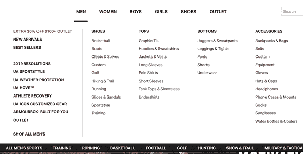

# a11y 和 JS——一段看似标新立异的恋情

> 原文：<https://dev.to/lkopacz/a11y-and-js---a-seemingly-unconventional-romance-24i0>

这篇文章的灵感来源于几件事。首先，几个月前，Rian Rietveld 宣布她将辞去 WordPress 可访问性负责人的职务。我通读了帖子，原因似乎主要是关于古腾堡的。似乎尽管 wpa11y 的团队发出了所有的警告，但他们仍在努力发布它，而对于那些需要辅助设备的人来说，它几乎是不可用的。我发现这是一个教育社区和帮助他人学习的巨大机会。

在 Rian 的博客文章中，我注意到了一些主要问题(这些问题直接来自她的网站):

*   “Gutenberg 的代码库对我们所有人来说都很难，因为 wpa11y 团队中没有一个人是熟练的 React 开发人员。所以我们很难实施变革，也很难自己写 PRs。”
*   "社区中没有具有可访问性经验的 React 开发者."

最近(在撰写本文的上周)，Chris Coyier 发表了一篇文章 [The Great Divide](https://css-tricks.com/the-great-divide/) ,阐述了前端开发人员中存在的巨大鸿沟——专注于 a11y/HTML/CSS 的开发人员和专注于 JS 的开发人员。它引起了不小的轰动，尤其是当 a11y 与 HTML/CSS 端配对时。最后，我认为这篇文章很好，但是我认为可访问性是一个多方面的问题，并不局限于 HTML/CSS。丹·阿布拉莫夫指出了这一点，我同意他的观点。我不同意它变得如此不必要的激烈，但这是另一个话题。

> 吹毛求疵:我认为避免将“JavaScript”和“可访问性”并列在一起会很好，就好像这些技能在某种程度上是不一致的。[pic.twitter.com/8OSjWoP2E1](https://t.co/8OSjWoP2E1)
> 
> — Dan Abramov ([@dan_abramov](https://dev.to/dan_abramov) ) [January 21, 2019](https://twitter.com/dan_abramov/status/1087398276817666048?ref_src=twsrc%5Etfw)

我从来都不是那种像躲避瘟疫一样躲避 JavaScript 的人。事实上，这可能很糟糕，因为我每天都在为我的日常工作编写 JavaScript。但是似乎有这样一个神话，JavaScript 和可访问性是敌人。我想积累我自己的清单，说明普通 JavaScript 在适当使用时，实际上如何增强可访问性，而不是损害可访问性。

## 菜单和大菜单

菜单是思考 JavaScript 的好地方，因为几乎所有的网站都有菜单。我通常使用普通的 JavaScript 来打开和关闭焦点菜单。我在博客中写了关于[构建一个使用普通 JavaScript 的基本键盘可访问导航](https://www.a11ywithlindsey.com/blog/create-accessible-dropdown-navigation)的内容。当子菜单打开时，您也可以使用它们来切换`aria-expanded`的状态。我会在以后的文章中写更多关于 ARIA 的内容，但是要知道`aria-expanded`会告诉屏幕阅读器某个东西打开和关闭的状态。

我在之前的帖子中提到的关于[手动可访问性测试](https://www.a11ywithlindsey.com/blog/4-things-always-manually-test)的一些事情是通过大菜单思考的。我建议考虑电子商务商店，以及如何让使用键盘的人更容易浏览它。我想如果我要找女装，我不会想穿过男装区的所有环节。

我们能做些什么？也许可以创建一个按钮来关闭聚焦在内容顶部的菜单(类似于跳转到内容链接)。我们可能想创建一个按钮，上面写着“跳到‘女装’。“也许我们只想在使用键盘导航时包含这些链接，而不想在有人使用鼠标时加入这些链接。这些都是我们可以想通的问题，让事情变得简单一些。

## 手风琴

我知道有大量的手风琴库，但是我倾向于自己编码或者使用编码笔来获得灵感。如果你走过了你想如何与它交互，你想触发什么键，如何编写你的 HTML 的问题，开始解决这个问题是令人愉快的！很多时候，当我看到手工编写的手风琴时，JavaScript 只能通过点击来工作。不仅如此，很多时候你不能专注于打开手风琴部分的箭头。有时，手风琴内部甚至有隐藏的链接，在你看不到的情况下，它们被聚焦。

我曾经不得不创建一个键盘可访问的 accordion，但由于客户要求，不允许编辑标记。标记基本上是一个完整的无序列表。`<li>`的 tabindex 为`-1`，这意味着它们是不可聚焦的。我想添加`<button>`来允许我自己添加一些焦点和内置的 JavaScript，但是因为我不被允许接触标记，我不得不更新 tabindex 并创建一些`keypress`事件。有一种更简单的方法，我计划在以后的文章中制作一个漂亮又易于使用的 JavaScript 手风琴。

看看这个密码笔。它的点击效果非常好。然而，在我写这篇文章的时候，我似乎不能用键盘来访问它。

[https://codepen.io/sedlukha/embed/WPeemb?height=600&default-tab=result&embed-version=2](https://codepen.io/sedlukha/embed/WPeemb?height=600&default-tab=result&embed-version=2)

## 情态动词

你曾经有过一个模态弹出窗口，而焦点仍然在它的“后面”吗？你不停地跳来跳去，试图摆脱它，但不幸的是，它正在浏览菜单中的所有链接，而不是帮助你走出去阅读页面。

不管可访问性如何，从用户体验的角度来看，我个人对弹出模式有意见。我不喜欢我的思路被打断。然而，这实际上是一种有效的销售和营销策略，因此作为开发者，我们必须确保它们是可访问的。

当你弹出一个模态，不管有没有用户询问，焦点是在它后面的其他项目上吗？不看屏幕底部，你能看到我们聚焦的地方吗？当模态在网站上停留一定时间后弹出时，你是否也确保焦点在那个模态上？如果一个人不感兴趣，他应该如何退出模态并使用网站的其余部分呢？如果他们感兴趣呢？他们如何注册优惠券或电子邮件简讯？

[https://codepen.io/jsayner/embed/xvEca?height=600&default-tab=result&embed-version=2](https://codepen.io/jsayner/embed/xvEca?height=600&default-tab=result&embed-version=2)

如果你看一下上面的代码笔，你会注意到当我们点击它的时候，焦点并没有立即转移到模态上。

您可能已经在使用 JavaScript 来制作这种模式弹出窗口了，那么为什么不添加几行额外的代码来确保用户可以方便地注册或退出呢？我可能会做一个 egghead.io 视频和一个单独的博客帖子来展示我将如何思考这个问题，但这是值得思考的事情。

## 交互性

你有没有想过，你想如何通过一个滑块编码，你必须点击手动移动？您可能会使用 JavaScript 并向其中添加点击事件。它们可以聚焦吗？提示:如果还没有的话，应该有`<button>` s，如果你想了解更多，看看我在 [3 个提高键盘易用性的简单技巧](https://www.a11ywithlindsey.com/blog/3-simple-tips-improve-keyboard-accessibility)上的帖子。这将使它成为焦点，并响应点击事件！

有没有用鼠标与之互动的功能？这是你网站的一个基本特征吗？你已经在使用 JavaScript 了，如果你用它来处理点击事件，不妨考虑一下`keypress`事件、焦点等等！

## 结论

我在之前的帖子中也提到过，可访问性是移情驱动的。我认为将 JavaScript 和可访问性结合起来的好处在于它本身就是一种移情练习。你可以思考这样的问题:“如果我是一个不会用鼠标的用户，我希望这个大菜单是什么样子?”？什么会让我的生活更轻松？”

我的目标是让博客文章更深入地介绍这些概念。但是我想让你知道 JavaScript 不是可访问性的敌人。相反，缺乏同理心才是。用一些同情心和你令人敬畏的 JavaScript 技巧，你可以让你的网站具有可访问性！

如果你想了解更多关于 JavaScript 和可访问性的知识，请务必[订阅我的时事通讯](http://eepurl.com/dJTkXg)了解我即将推出的课程！如果你对这篇博文有任何疑问，请随时在[推特](https://twitter.com/littlekope0903)上联系我。