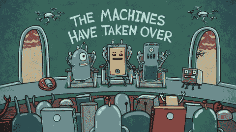

# 新的一年开始给 Node.js 投稿吧

> 原文：<https://dev.to/azure/start-contributing-to-nodejs-in-the-new-year-3dlh>

Node.js 项目是一个庞大的社区项目，涵盖 Node.js GitHub 组织中的 162 个存储库，不包括 Express 和 libuv GitHub 组织(这两个组织都是 Node.js 基金会下的项目)。

Node.js 项目本身有各种各样的需求，从构建基础设施到自动化工具，再到文档的本地化。

我已经做了一个深入的列表，列出了该项目可能需要帮助的所有内容，希望将 [dev.to](https://dev.to/) 社区与 Node.js 项目联系起来。

如果你*真的*做出了贡献，看到你的贡献在 [dev.to](https://dev.to/) 上被记录下来将是令人难以置信的——无论是通过你自己的帖子，通过对这个帖子的评论，还是通过帮助社区中的其他人做出贡献！❤️

## 先说一些背景

Node.js 有自己的一套缩写词，我对这些缩写词很熟悉，我会用它们来简化，但你们可能还不熟悉。这里有一个快速入门:

*   TSC:Node.js 技术指导委员会，node . js 基金会的一个顶级委员会，负责整个项目的技术管理。
*   Node.js 社区委员会，Node.js 基金会的一个顶级委员会，负责对外工作和社区关系。
*   WG :工作组，一个拥有独立治理和特定任务或领域所有权的团体。
*   主动性团队(Initiative)和**团队(Team)**:这些团队不是独立的，但是对某个任务或领域有某种形式的所有权。**倡议**用于 CommComm 和 TSC，而**团队**仅用于 TSC。
*   **核心**:有效的`nodejs/node`回购。
*   **治理** : Node.js 非常依赖开放治理。项目本身有一个 [`GOVERNANCE.md`](https://github.com/nodejs/node/blob/master/GOVERNANCE.md) 来规定如何治理项目，但是在 GitHub 组织中有另外的`GOVERNANCE.md`文件用于不同的组——比如 CommComm——它们有独立的治理。

同样值得注意的是，Node.js 遵循全球[行为准则](https://github.com/nodejs/admin/blob/master/CODE_OF_CONDUCT.md)，所以如果你有兴趣参与，一定要仔细阅读。

### 关于组织的附加上下文

*   Node.js Foundation 由一个董事会管理，该董事会由公司成员、个人成员董事、TSC 董事和 commcommcomm 董事组成。基金会共有 5 个委员会——贸易与供应链委员会、通信委员会、法律委员会、营销委员会和财务委员会。
    *   作为一名开源贡献者，这可能对你来说并不重要，但是了解上下文总比缺乏上下文好👍
*   工作组是 TSC 下的一个概念，而不是社区委员会。他们有正式、独立的章程，就像 TSC 和 CommComm 一样。计划和团队是 TSC 和 CommComm 中的概念，在实践中几乎与工作组相同，关键区别是没有独立授权。

## 为工作组、计划和团队做出贡献

Node.js 项目的各个部分的贡献者比他们需要的要少，并且总是在寻找更多的贡献者。

以下是一些工作组/计划/团队，您可以在今天**对其产生重大影响:**

 ***   [包维护](https://github.com/nodejs/package-maintenance)
    *   较新的团队，主要由 IBM folk 发起，负责帮助维护没有得到很好维护的深度嵌入生态系统模块。
*   [i18n–国际化](https://github.com/nodejs/i18n)
    *   i18n 团队正在为一个完全本地化的 Node.js 加速流程和内容。这个过程包括翻译从文档到指南到错误消息的一切，所有这些都使用 GitHub automation 和 [CrowdIn](https://crowdin.com/) 的一个相当简单的组合。如果你懂多种语言，并且愿意帮助本地化内容*或*愿意帮助设置自动化，这是帮助全球人民的一个极好的方式。
*   [自动化团队](https://github.com/nodejs/automation)
    *   有一个自动化团队专注于构建和改进项目的现有自动化。总的来说，Node.js 中有太多目前由人类完成的工作可以自动化，这是最有影响力的方法之一。
*   [CITGM](https://github.com/nodejs/citgm)
    *   citgm(金矿中的金丝雀)是 Node.js core 用来测试 Node.js 的构建是否破坏了生态系统的工具。随着我们快速接近 900k 模块，不可能测试所有的模块，但是我们可以测试一些世界上最常用的模块，以获得更全面的了解。
    *   很少的贡献者和大量的不可靠的检查可以通过一些爱和关注来修复或改进。
*   [基准测试工作组](https://github.com/nodejs/benchmarking)
    *   基准测试工作组有助于确保 Node.js 不会随着时间的推移出现重大倒退。在少数情况下，他们已经发现了大规模的倒退，这些倒退能够在影响任何人之前被迅速识别和修补。
    *   目前只有几个积极的贡献者在做这项工作，他们可以利用你的帮助来继续构建基准并采用现有的基准。
    *   如果你有兴趣看看实际的基准是什么样的，这个团队正在为 Node.js 进行[基准测试。](https://benchmarking.nodejs.org/)
*   [发布团队](https://github.com/nodejs/release)
    *   致力于将更改反向移植到 Node.js 的旧版本(LTS 版本)并发布新版本。
    *   我们经历了一场严重的释放者干旱——至少一年来只有一次。发布对于一个人来说太多的工作要处理，更不用说一个 5 人的团队了，这是**远**远。获得技术和参与的好方法，同时产生巨大的影响。
    *   一般来说，要成为一名发布者，你会希望能够作为你全职工作的一部分，大量参与 Node.js 很少有人能做到这一点。
*   [社区委员会](https://github.com/nodejs/community-committee)
    *   社区委员会跨越了一系列不同的工作，并对启动更多的工作持开放态度(并且需要支持其当前的一些计划！)
    *   CommComm 下的关键举措之一是[导师计划](https://github.com/nodejs/mentorship)。如果你对长期、持续的指导感兴趣(或者成为一名导师！)值得一探究竟🙌
    *   如果你有兴趣加入社区委员会，**请**联系我，我可以帮你找到它。
*   即将发布:网站重新设计和 i18n
    *   网站重新设计是一个长期的项目，正在接近技术实施阶段。

对 Node.js 做出贡献的最重要的部分之一是它是自我驱动和自愿的。如果没有人反对，你基本上可以接受任何你想做的工作，并获得成功。异议通常并不困难，而是要求各种规模的变更。

## 通过内容投稿

Node.js 项目中有许多需要内容的地方。

### 文档:

增强文档总是需要的。许多领域没有代码示例或记录良好的 API 表面积。“是给贡献者的，不是给用户的”是我听过很多的，也是我们应该改变的。

一旦[网站重新设计倡议](https://github.com/nodejs/website-redesign)完成，我认为将会有更多的空间来改进技术文档+围绕它的自动化检查。

这些文档位于 [`/doc/api`](https://github.com/nodejs/node/tree/master/doc/api) 目录下的 [nodejs/node](https://github.com/nodejs/node) 中——这意味着您所做的任何贡献都将直接发送给`nodejs/node`。一般来说，文档贡献是开始为 Node.js 做贡献的一种极好的方式，因为它们向你介绍了 Node.js 核心 pr 是如何工作的，并帮助了每个试图使用 Node.js 的人。

### 指南:

指南是[网站重新设计倡议](https://github.com/nodejs/website-redesign)正在研究的一个新概念。已经有过一些讨论(我是其中的一个积极参与者),包括*不需要*是厂商不可知的指南。现实世界的开发者使用供应商和工具——AWS、Azure、GCP、Sentry、Gatsby、electronic、npm、yarn、Snyk、Greenkeeper 等等。

完全不可知的回避现实是一种方法，但最终它会伤害用户而不是帮助他们。欢迎以这些主题为中心的贡献，这对尝试使用真实用例部署 Node.js 应用程序的最终用户很有帮助。

因此，有一个公开的呼吁，这种内容将推出新的网站，并进一步建立了网站推出。网站重新设计倡议维护着一份冗长的想要的指南清单，按照有兴趣阅读它们的开发者的类型进行分类。

### Node.js 收藏

[Node.js Collection](https://medium.com/the-node-js-collection)是由社区委员会下的 node . js Collection 团队和 Node.js Foundation 共同维护的中型出版物。

两年前创建 Node.js 集合背后的意图是成为 Node.js 周围内容的中心社区资源。它绝对符合这一标准，几乎所有的博客帖子都来自各个社区成员。它对围绕 Node.js 的任何主题的优质内容开放-我们很乐意与您合作！

## 通过自动化做出贡献

围绕 Node.js 项目中的自动化有各种各样的需求。我个人经常觉得当前的工作量[比提高自动化](https://renaissance.ie/wp-content/uploads/2018/02/square-wheels-round-wheels.jpg)更重要，这导致工作量不断增加，引入了更多的流程来减轻它。

一些需要且可以自动化的工作示例:

*   下放钻杆排放系统的提交队列
*   自动发布
*   自动修复配置项
*   加密合规性检查自动化(美国出口管制)
*   降价风格检查
*   安全漏洞林挺+检查+安全工作组合并

没有一个需要自动化的中央列表，但是如果您感兴趣的话，至少有十几个通过自动化可以实现的增强。

如果你对其中一个感兴趣，或者想建议一种不同形式的自动化，你可以看一看 [nodejs/automation](https://github.com/nodejs/automation) repo。在这个回购中，您可以自由地提出问题，建议自动化工具或提供帮助来构建它！

## 那么接下来呢？

如果您对以我描述的任何方式为 Node.js 做贡献感兴趣，您应该马上投入进来！作为一个项目，Node.js 非常专注于完成工作，所以出现并完成工作是非常棒的——我不知道有多少工作没有被接受和欣赏的情况。

如果你*有疑问，我 100%乐意回答！如果你想知道你的技能组合适合哪里(*相信我，不管你的技能组合*如何，Node.js 都有一个适合你的地方)，或者想了解更多关于某个特定领域的信息，请不要犹豫，在评论中或 Twitter 上提问。我非常乐意尽我所能帮助你提升，为❤️做贡献*

**