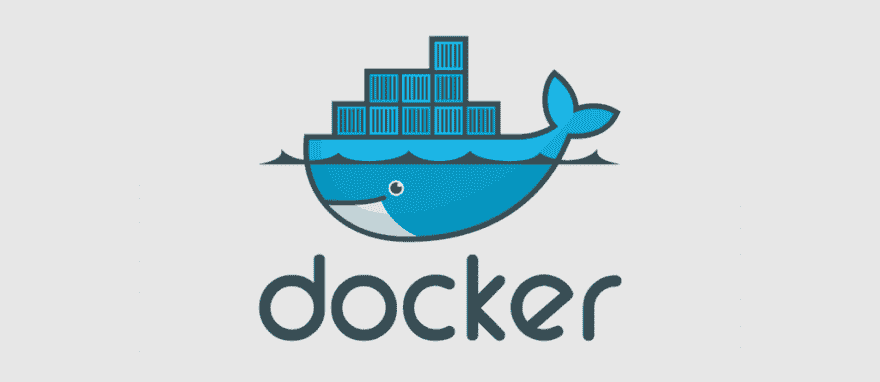

# 现代化我们的主机基础设施:我们学到了什么

> 原文：<https://dev.to/browserlondon/modernising-our-hosting-infrastructure-what-weve-learnt-5c75>

大多数制造数字产品的公司都希望在产品发布后运行和维护它们很多年。在此期间，几乎肯定会出现对该项目的网络托管基础设施进行现代化和迁移的需求。

以浏览器为例，目前[支持很多直播项目](https://www.browserlondon.com/services/continuous-improvement-support/)，最老的要追溯到 2010 年。任何对技术感兴趣的人都会告诉你，在这段时间里，很多事情都会发生变化。这篇文章是关于我们是如何处理当前正在进行的主机迁移过程的，以及到目前为止我们学到了什么。

## 但首先要说明一点

[我们是亚马逊网络服务](https://www.browserlondon.com/blog/2015/12/15/how-we-auto-scale-our-products-with-aws/) (AWS)的忠实用户，因此我们从这一过程中获得的许多技术优势将参考特定的 AWS 托管服务。

这并不是说谷歌云、微软 Azure 或任何其他大公司不可能获得这样的收益，但我们不会在这里讨论替代方案。像往常一样，您应该研究服务并制定一个最适合您的迁移项目的计划。

## 将发现应用于托管基础架构变更

当着手这种多种产品的大规模迁移时，我们试图实践我们向客户宣扬的内容，并参与项目的[彻底发现过程](https://www.browserlondon.com/services/research-analysis/)。

幸运的是，我们的姐妹公司 [Twine](https://www.twineapp.com/) 最近通过[对其托管平台](https://www.browserlondon.com/blog/2016/02/27/how-we-use-aws-to-manage-our-product-services/)进行了类似的现代化改造，因此我们开始尽可能多地学习他们的经验，然后再将其应用到我们自己的基础设施中。

<figure> 

<figcaption></figcaption>

</figure>

我们还认为，重要的是不仅要研究新技术如何使事情变得更加安全，还要研究它们如何用于降低业务流程的风险。因此，理解我们的开发人员的主要挫折是很重要的，这样做有助于确定在迁移期间要关注的三个关键领域。

#### 1。标准化部署流程

不同时间的不同项目有不同的部署过程——从自动部署的持续集成工具，到过时的 Capistrano 脚本。在一些旧的项目中，不清楚使用的是什么方法，以及使用的是什么版本的给定工具。

这导致了不必要的部署延迟，因为不是每个开发人员都有正确版本的部署工具运行在他们的机器上。标准化并消除对开发人员机器执行部署的依赖将节省时间和成本。

#### 2。提高效率和性能

由于不同的项目依赖于不同的外部服务(及其版本)，我们的项目部署效率低下。由于特定软件版本的依赖性，一些项目需要他们自己的虚拟服务器，这分散了我们的主机预算，而不是为我们所有的客户部署更好的性能。

#### 3。为交叉培训和项目评审创造机会

在一个项目将近十年的时间跨度中，最初的开发人员可能会带着他们对项目的深入了解继续前进。虽然文档意味着我们永远不会完全陷入困境，但当被要求维护项目时，真正了解项目是有好处的。

顺便提一下，谷歌已经开始解决这个问题，故意定期重写完美的项目，只是为了交叉培训员工。

现在，对于我们大多数人来说，这种方法(Fergus Henderson 在他关于谷歌软件工程的报告的第 2.11 节中详细介绍了这种方法)是荒谬的，但是像这样的迁移项目可以被用作开发人员了解项目的机会。将一个项目分配给一个以前从未见过它的开发人员，既传播了知识，又给了团队一个如何管理项目的新视角。它还有助于在您的团队中传播对您的 devops 流程的理解。

## 我们的技术方法

这不是一个技术指南，但是根据最近的 Twine 迁移工作，以及我们在其他项目中的经验，我们确定了我们的虚拟主机设置的一些核心支柱。

#### 码头工人

对我们来说，这是显而易见的，其他人已经比我更好地解释了它的好处。然而，在我们的实现中的不同之处在于，对于我们的遗留项目，我们已经构建了包含我们需要的所有内容的单个容器，而不是每个服务一个容器的[最佳实践。](https://www.docker.com/)

这是因为我们几乎所有的项目都将文件推送到[简单存储服务](https://aws.amazon.com/s3/) (S3)，使用[关系数据库服务](https://aws.amazon.com/rds/) (RDS)，或者尽可能使用托管 AWS 产品。这很有帮助，因为这意味着我们可以将整个项目作为一个容器来运行，将缓存、web 服务器和应用程序本身打包在一起。我们这样做主要是为了减少迁移项目所需的时间，默认情况下，这些项目期望服务位于特定的位置，我们在需要时会对此规则进行例外处理。

明确地说，这种方法有缺点，特别是在如何处理日志方面。这种权衡可能不适合某些项目，尤其是新的绿地项目。

#### ECS 和 EC2

我们决定使用亚马逊的[弹性容器服务](https://aws.amazon.com/ecs/) (ECS)和[弹性计算云](https://aws.amazon.com/ec2/) (EC2)实例。Twine 将 ECS 与 [Fargate](https://aws.amazon.com/fargate/) 一起使用，然而，我们的经验告诉我们，当您快速迁移许多项目时，能够快速、直接地访问主机实例以调试问题会有很大的好处。我们还发现，使用 EC2 集群，我们可以更经济高效地降低部署成本。

如果您希望避免供应商锁定，弹性 Kubernetes 服务 (EKS)是一个完全可以接受的解决方案，但我们没有大力推行，因为我们在 ECS 方面已经有了丰富的经验，并且高度依赖 AWS 产品。

#### 持续整合

另一个显而易见的问题已经在其他地方得到了更好的解释，你已经在做了，对吗？对我们来说，CI[是一个用一个自动化解决方案摆脱所有旧的不同部署方法的机会。这也减少了我们对特定团队成员的依赖，他们可以访问服务器进行部署，任何人都可以进行部署。](https://dev.to/browserlondon/the-role-of-continuous-development-in-web-design-35fd)

我们过去一直大量使用 [Jenkins](https://jenkins.io/) ，但最终在 Twine 团队的建议下，我们决定迁移到 [CircleCI](https://circleci.com/) ，避免自己管理这项服务。

### T2】

#### 分支合并规则

每个人都可以在任何时间部署，我们现在有相反的问题…任何人都可以在任何时间部署！我们在我们的位存储库中利用分支合并规则来解决这个问题。我们通常仍然允许任何人进行部署，特别是部署到暂存环境，但是对于部署到生产环境的分支，我们添加了一个限制，要求创建一个拉请求。此拉取请求必须得到至少 2 名开发人员的批准才能合并，从而触发 CircleCI。

## 那么情况怎么样？

到目前为止，将我们的托管基础设施迁移到更现代的 AWS 服务是一个非常积极的项目，不仅满足了我们的关键目标，还带来了一些有益的改进。

#### 软件更新

当然，我们会更新软件来修补安全问题，但由于在相同服务器上运行的其他项目的限制，我们经常无法走得更远。通过转移到基于 docker 的设置，我们可以轻松地将每个项目升级到他们可以处理的“最佳”状态。在许多情况下，这给了我们一个自动的、免费的性能改进。

#### 性能提升&安全

将服务从旧的 EC2 classic 实例转移到新的 ECS 集群意味着我们能够利用更新的 Amazon 实例类型，在这种情况下，M5 实例范围的性价比更高。

这也意味着我们可以从旧的弹性负载平衡器(elb)转移到更新、更强大的应用负载平衡器(ALB)。这些允许我们在请求到达 web 服务器之前使用路由规则来执行重要的 301 重定向，比如强制 SSL，从而提高性能。然而，更重要的是，它提供了以多种方式增加安全性的机会。

例如， [AWS 证书管理器](https://aws.amazon.com/certificate-manager/) (ACM)集成现在意味着提供和更新 SSL 证书变得很简单，更重要的是，它是免费的。我们现在可以为任何客户提供 SSL 支持，无论是老客户还是新客户，只要他们能够在 DNS 记录中添加一个小的 TXT 条目。在以前基于 ELB 的服务下，我们必须手动购买、上传和续订证书。此外，ELB 只支持每个负载平衡器一个证书，这意味着每个使用 SSL 的客户端都将承担自己的服务成本。

ALB 带来了与另一个优秀工具的集成，即 [Web 应用防火墙](https://aws.amazon.com/waf/) (WAF)。WAF 允许我们通过定义在基础架构级别运行的规则来缓解已知问题，如 SQL 注入攻击。此外，我们可以订阅由外部安全公司定期更新的第三方规则集，每月支付少量费用。我们借此机会订阅了几个规则集，例如包括针对 know CMS CVEs 的缓解。这意味着，即使我们由于重大变更而无法快速更新 CMS 应用程序，也有很大机会在问题到达应用程序之前阻止它。

## 结论

我们还没有完成，但我们从这个过程中学到了很多。我们学到的最重要的一点是，如果计划和执行得当，托管基础设施现代化项目可以带来超越效率、安全性和性能的优势。交叉培训员工并抓住机会实现完全自动化部署的好处让开发人员可以做他们最擅长的事情。

* * *

帖子[使我们的主机基础设施现代化:我们所知道的](https://www.browserlondon.com/blog/2019/01/28/modernising-hosting-platform/)首先出现在伦敦[浏览器](https://www.browserlondon.com)上。