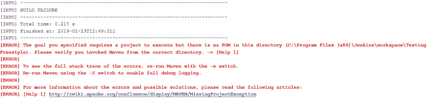
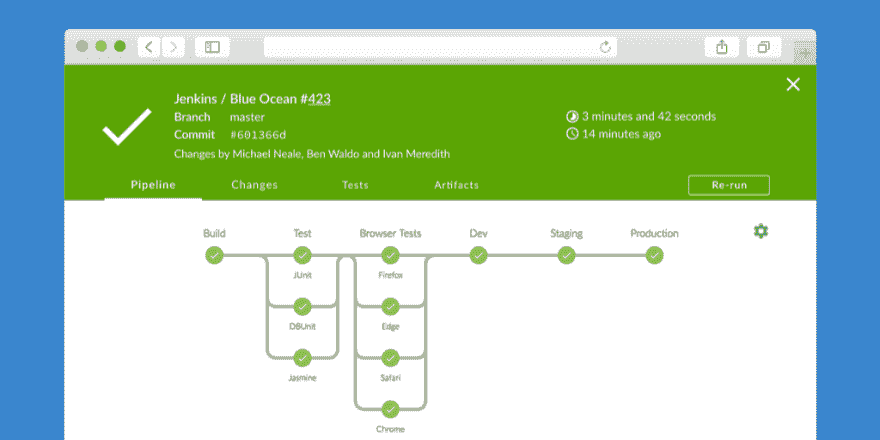
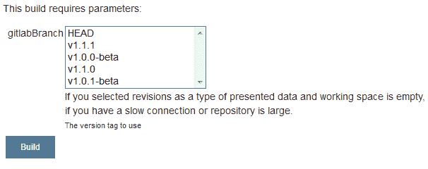
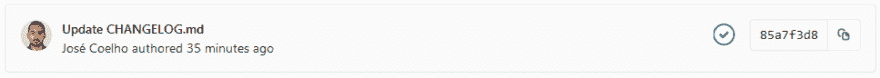

# 我不能没有的 8 个 Jenkins 插件

> 原文：<https://dev.to/jcoelho/8-jenkins-plugins-i-cant-live-without-3bin>

Jenkins 是一个很棒的开源自动化平台。它有一些开箱即用的强大功能。

但是，在我看来，让它脱颖而出的是它的社区和它开发的插件[。](https://plugins.jenkins.io/)

有一千多个插件可以支持几乎所有的技术、工具和过程来构建、部署和自动化你的项目。

这些是我用得最多的插件，没有它们我的工作会困难得多。

### 1。 [Ansi 颜色插件](https://wiki.jenkins.io/display/JENKINS/AnsiColor+Plugin)

先说一个简单的。Jenkins 的控制台不支持 ANSI 转义序列，尤其是开箱即用的彩色转义序列。这意味着无论你使用什么工具，控制台都是黑白的。

Ansi 颜色插件为 Jenkins 控制台输出增加了对 **ANSI 转义序列**的支持，使得**在你的日志**上有颜色输出成为可能。这取决于你使用的工具，如果它不打印 ANSI 字符，你什么也做不了。

### 2。[蓝海外挂](https://wiki.jenkins.io/display/JENKINS/Blue+Ocean+Plugin)

面对现实吧！Jenkins UI 不是最好的，但是有很多插件可以解决这个问题。

蓝海给你一个难以置信的用户友好的用户界面与詹金斯互动。它的开发者声称，任何人，甚至非技术人员，都可以轻松地使用蓝海詹金斯。

这是蓝色海洋中的管道表示:

**提示**:当您试图分析并行运行任务的管道的日志时，Blue Ocean 非常有用。在经典视图中，并行日志被打乱。

### 3。 [Git 参数插件](https://wiki.jenkins.io/display/JENKINS/Git+Parameter+Plugin)

当你一天中的大部分时间都在构建管道和自动化枯燥的任务时，你希望人们真正使用它们。为了实现这一点，你必须让它易于使用。

Git 参数插件让你可以将 Git **分支**、**标签**或**修订版**作为启动作业或管道的参数。

例如，如果您想要设置一个*连续交付*管道，开发人员可以从中选择从哪个 Git 标签进行部署，这将非常有用。

**提示**:总是根据管道的目的来过滤分支/标签，否则你可能会以生产环境中不稳定的代码而告终。

### 4。 [GitLab 插件](https://github.com/jenkinsci/gitlab-plugin)

在我的公司，我们使用托管的 GitLab 实例作为源代码管理工具。尽管我喜欢 GitLab 的 CI 方法([read](https://about.gitlab.com/product/continuous-integration/))，但我们还没有走那条路。

所以我们改用 Jenkins，并将其连接到 GitLab。最后，开发者也有同样的经历。

GitLab 插件允许你使用 WebHooks 从 GitLab 调用管道，并将构建结果发布回 GitLab。

这使您能够快速从 CI 渠道获得反馈。

你可以找到其他配置管理工具的类似插件。

提示:尽可能地支持通过 WebHooks 执行管道，而不是 SCM 轮询。在大型系统上，您将获得更好的性能。

### 5。[扩展邮件插件](https://wiki.jenkins.io/display/JENKINS/Email-ext+plugin)

当出现问题时，您需要您的用户尽快解决问题，否则您的 CI/CD 可能会受到损害。

扩展的电子邮件插件扩展了 Jenkins 的电子邮件通知，几乎可以控制它的每个方面。您可以自定义通知**触发器**、**内容**和**接收者**。

看看这些[食谱](https://wiki.jenkins.io/display/JENKINS/Email-ext+Recipes)就有自己的想法了。

提示:确保你发送的每一个通知都是绝对必要的，不要给你的用户发垃圾邮件。相信我，你发送的通知越少，就会有越多的用户阅读并做出反应。使用即时消息插件(如 Slack 插件或 Skype 插件)来减少您的通知。

### 6。[嵌入-构建-状态插件](https://wiki.jenkins.io/display/JENKINS/Embeddable+Build+Status+Plugin)

另一个很好的方法是在你的配置管理工具上使用**徽章**来警告你的用户。

这个插件为你的所有任务生成徽章，实时显示它们的构建状态。

### 7。[通过 SSH 插件发布](https://wiki.jenkins.io/display/JENKINS/Publish+Over+SSH+Plugin)

正如您可能从名称中看到的那样，这个插件提供了通过 SSH 发送文件和运行命令的特性。

您可以在您的 **Manage Jenkins** 页面上配置您的远程主机，然后在您的工作中使用它们。

提示:如果由于某种原因你不能在你的主机上安装 Jenkins 代理，这个插件允许你通过 SSH 远程运行命令。

### 8。[下一个执行插件](https://plugins.jenkins.io/next-executions)

一旦你设置了大量的工作，可能很难跟上你的詹金斯上发生和运行的每一件事。

Next Executions 插件向 Jenkins 实例的主页添加一个小部件，显示所有计划作业的下次构建日期。

这将让您更好地了解基础设施的状态。

## 结论

这些是我每天使用的一些插件，还有数以千计的插件有待探索。

你有最喜欢的吗？请在评论中告诉我！我正在寻找一些新的最喜欢的插件:D