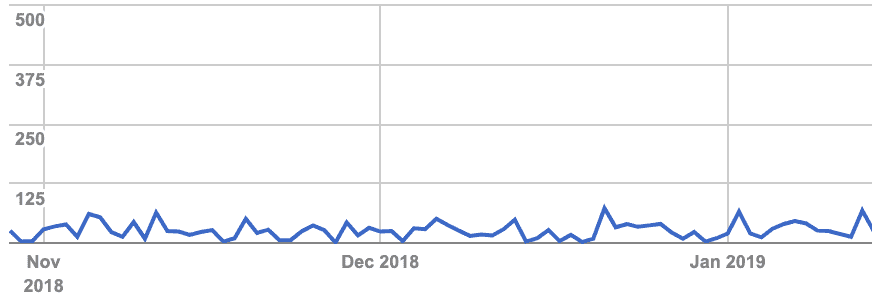

# 用 Lamdba@Edge 缓存 SEO 的 spa

> 原文：<https://dev.to/danquack/caching-spas-for-seo-with-lamdbaedge-24ba>

从构思开始，Tournamentmgr.com 的搜索引擎优化表现就一直很差。当分析谷歌抓取的页面数量时，平均每天不到 40 个。

尽管锦标赛管理器主办了近一万场锦标赛，并且有那么多独特的页面，但静态页面和动态页面之间没有区别。这是因为该站点作为单页 javascript 应用程序运行，其动态内容完全依赖于外部 API 调用。在偶然看到一篇[博文](https://aws.amazon.com/blogs/networking-and-content-delivery/dynamically-route-viewer-requests-to-any-origin-using-lambdaedge/)后，我被迫对这个话题进行研究。这个问题——我如何构建一个对搜索引擎机器人来说是动态的，不干扰用户体验，并且对基于无服务器的解决方案来说是预算友好的东西——成为了我研究的中心。

在回答前面提到的问题时，我发现了许多基于服务器的工具，以及一些第三方托管的实用程序，但它们要么有维护的运营成本，要么有第三方的费用，这两者都不是选项。像 [prerender.io](https://prerender.io) 这样的服务，让你能够免费保存多达 250 页的缓存，除非锦标赛管理器的规模不理想。因此，在回到绘图板后，我编写了一个模块(稍后将详细介绍)，然后将服务容器化，以便用 AWS Fargate 进行部署。利用基于事件和 cron 风格，服务生成网站地图，渲染页面，然后上传到 S3 桶。

## 设计

Pyppeteer 是一个 python 模块，不管站点速度如何，它都能呈现完整的页面。利用这一点，我创建了两个模块， [prerender 和 scraper](https://github.com/danquack/Sitemap-Prerendering-S3) ，它们读入 robots.txt 文件，发现站点地图，然后循环确定 URL。一旦完成，scraper 将呈现这些页面并返回静态 html，然后可以将其放入 s3 桶中。下面你可以从一个调用的角度看到这个工程的示例实现。