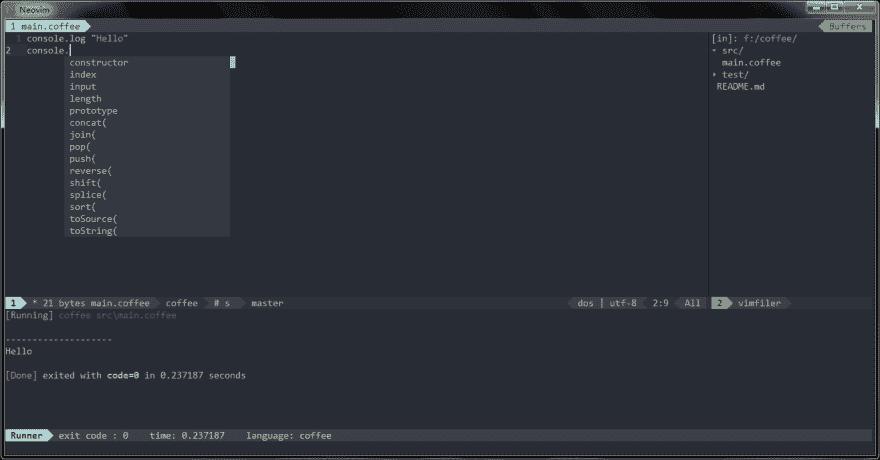
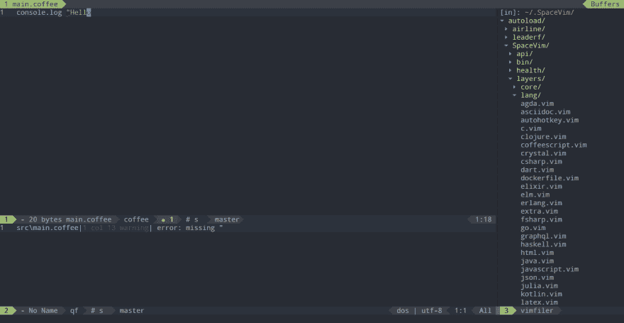
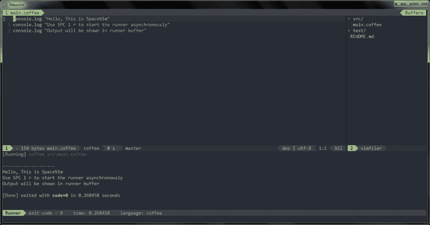

# 使用 Vim 作为 CoffeeScript IDE

> 原文：<https://dev.to/spacevim/use-vim-as-a-coffeescript-ide-4afl>

# [博客](//../blog/)使用 Vim 作为 CoffeeScript IDE

这是一个使用 SpaceVim 作为 coffee script IDE 的通用指南，包括层配置和使用。将涵盖以下每个部分:

*   启用语言层
*   代码完成
*   语法林挺
*   跳转到测试文件
*   运行代码
*   代码格式化 ###启用语言层

默认情况下`lang#coffeescript`层不被加载。要在 SpaceVim 中添加 CoffeeScript 语言支持，需要启用`lang#coffeescript`层。按`SPC f v d`打开 SpaceVim 配置文件，添加如下配置:

```
[[layers]]
  name = "lang#coffeescript" 
```

有关更多信息，您可以阅读 [lang#coffeescript](//../layers/lang/coffeescript/) 图层文档。

### 代码补全

`lang#coffeescript`层将自动加载 vim-coffeescript 插件，除非在您的`init.toml`中被覆盖。完成菜单将在您键入时打开。

[](https://res.cloudinary.com/practicaldev/image/fetch/s--WN4SYmPj--/c_limit%2Cf_auto%2Cfl_progressive%2Cq_auto%2Cw_880/https://user-images.githubusercontent.com/13142418/51876268-fe526e80-23a2-11e9-8964-01fd62392a1f.png)

### 语法林挺

默认情况下，棋盘格图层处于启用状态。该层通过 [neomake](https://github.com/neomake/neomake) 提供异步语法林挺。它将异步运行 [coffeelint](https://github.com/clutchski/coffeelint) 。

coffeelint 是 coffeescript 的命令行 lint，目前由 [Shuan Wang](https://github.com/swang) 维护。要安装 coffeelint，只需在终端中运行以下命令。

```
npm install -g coffeelint 
```

注意:如果没有安装 coffeelint，neomake 将使用默认命令`coffee`。

[](https://res.cloudinary.com/practicaldev/image/fetch/s--ylJys9je--/c_limit%2Cf_auto%2Cfl_progressive%2Cq_auto%2Cw_880/https://user-images.githubusercontent.com/13142418/51875890-bb43cb80-23a1-11e9-93b2-037e7120f5f2.png)

### 跳转到测试文件

SpaceVim 使用内置插件来管理项目中的文件，您可以在项目的根目录下添加一个`.project_alt.json`，内容如下:

```
{
  "src/*.coffee": {"alternate": "test/{}.coffee"},
  "test/*.coffee": {"alternate": "src/{}.coffee"}
} 
```

有了这个配置，您可以通过命令`:A`在源代码和测试文件之间跳转。

### 运行代码

要运行当前脚本，您可以按`SPC l r`，一个分割窗口将被打开，脚本的输出将显示在该窗口中。它异步运行，不会阻塞您的 vim。

[](https://res.cloudinary.com/practicaldev/image/fetch/s--eR5Ry3E8--/c_limit%2Cf_auto%2Cfl_progressive%2Cq_auto%2Cw_880/https://user-images.githubusercontent.com/13142418/51877740-3f00b680-23a8-11e9-91ce-18cf147dbb95.png)

### 代码格式化

默认情况下，格式层也是启用的，通过该层，您可以使用键绑定`SPC b f`来格式化当前缓冲区。使用此功能前，请安装 coffee-fmt。

```
npm install -g coffee-fmt 
```