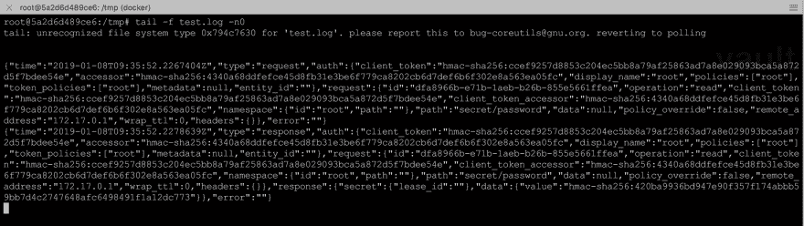
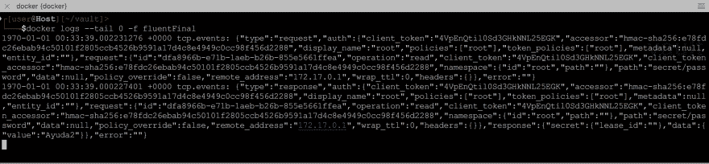

# 使用 FluentD 查看 Vault 的审计日志

> 原文：<https://dev.to/manuel220x/watching-vaults-audit-logs-using-fluentd-1e0p>

在这篇文章中，我将解释如何将审计日志从 HashiCorp vault 实例捕获到 Docker 上运行的 Fluentd 设置中，这是一个需要对 Vault 服务器上发生的具有大量实时流量的特定事务进行故障排除的场景，这使得发现特定的已知值有点困难，因为发送到 Vault 中审计设备的所有敏感信息都是散列的。

Vault 允许您设置多个审计设备，这些“设备”基本上是目的地(目前支持*文件*、*系统日志*和*套接字*)，用于详细记录 vault 处理的操作，由于审计是安全产品上的关键组件，如果您在正在运行的 vault 设置上启用审计设备，服务器处理的所有操作将等到**至少一个**审计设备完成条目的处理。 因此，在启用可能长时间不可用或可能需要很长时间来处理日志的审核设备时，您必须小心，因为如果您只启用了该设备，这将会降低您在 vault 中的操作速度。

出于安全原因，这些日志条目中的所有敏感信息都使用 HMAC-SHA256 进行了哈希处理。在典型日志中对其值进行哈希运算的字段有:

| 田 | 描述 |
| --- | --- |
| 客户端令牌 | 这是客户端用于向 Vault 进行身份验证的令牌 |
| 存取器 | 令牌的标识符或别名 |
| 价值 | 该字段可以包含作为响应发送的实际秘密 |

下面是几个审计日志条目的例子:

```
{"time":"2019-01-08T06:43:50.1574193Z","type":"request","auth":{"client_token":"hmac-sha256:ccef9257d8853c204ec5bb8a79af25863ad7a8e029093bca5a872d5f7bdee54e","accessor":"hmac-sha256:4340a68ddfefce45d8fb31e3be6f779ca8202cb6d7def6b6f302e8a563ea05fc","display_name":"root","policies":["root"],"token_policies":["root"],"metadata":null,"entity_id":""},"request":{"id":"d999de96-943f-b547-faf7-842c52c1150f","operation":"read","client_token":"hmac-sha256:ccef9257d8853c204ec5bb8a79af25863ad7a8e029093bca5a872d5f7bdee54e","client_token_accessor":"hmac-sha256:4340a68ddfefce45d8fb31e3be6f779ca8202cb6d7def6b6f302e8a563ea05fc","namespace":{"id":"root","path":""},"path":"secret/password","data":null,"policy_override":false,"remote_address":"172.17.0.1","wrap_ttl":0,"headers":{}},"error":""}
{"time":"2019-01-08T06:43:50.1616533Z","type":"response","auth":{"client_token":"hmac-sha256:ccef9257d8853c204ec5bb8a79af25863ad7a8e029093bca5a872d5f7bdee54e","accessor":"hmac-sha256:4340a68ddfefce45d8fb31e3be6f779ca8202cb6d7def6b6f302e8a563ea05fc","display_name":"root","policies":["root"],"token_policies":["root"],"metadata":null,"entity_id":""},"request":{"id":"d999de96-943f-b547-faf7-842c52c1150f","operation":"read","client_token":"hmac-sha256:ccef9257d8853c204ec5bb8a79af25863ad7a8e029093bca5a872d5f7bdee54e","client_token_accessor":"hmac-sha256:4340a68ddfefce45d8fb31e3be6f779ca8202cb6d7def6b6f302e8a563ea05fc","namespace":{"id":"root","path":""},"path":"secret/password","data":null,"policy_override":false,"remote_address":"172.17.0.1","wrap_ttl":0,"headers":{}},"response":{"secret":{"lease_id":""},"data":{"value":"hmac-sha256:420ba9936bd947e90f357f174abbb59bb7d4c2747648afc6498491f1a12dc773"}},"error":""} 
```

因为这里保护敏感数据的方法是通过**散列**它，所以没有办法逆转该过程并显示所有这些散列字段的明文值，但是，假设您知道客户端令牌的实际值和在该事务中检索的机密值，目标将是在实时日志跟踪会话期间获得如下内容，在该会话中，您可能会看到数百个与客户端或您需要的值无关的事务:

```
{"type":"request","auth":{"client_token":"4VpEnQtil0Sd3GHkNNL25EGK","accessor":"hmac-sha256:e78fdc26ebab94c50101f2805ccb4526b9591a17d4c8e4949c0cc98f456d2288","display_name":"root","policies":["root"],"token_policies":["root"],"metadata":null,"entity_id":""},"request":{"id":"d999de96-943f-b547-faf7-842c52c1150f","operation":"read","client_token":"4VpEnQtil0Sd3GHkNNL25EGK","client_token_accessor":"hmac-sha256:e78fdc26ebab94c50101f2805ccb4526b9591a17d4c8e4949c0cc98f456d2288","namespace":{"id":"root","path":""},"path":"secret/password","data":null,"policy_override":false,"remote_address":"172.17.0.1","wrap_ttl":0,"headers":{}},"error":""}
{"type":"response","auth":{"client_token":"4VpEnQtil0Sd3GHkNNL25EGK","accessor":"hmac-sha256:e78fdc26ebab94c50101f2805ccb4526b9591a17d4c8e4949c0cc98f456d2288","display_name":"root","policies":["root"],"token_policies":["root"],"metadata":null,"entity_id":""},"request":{"id":"d999de96-943f-b547-faf7-842c52c1150f","operation":"read","client_token":"4VpEnQtil0Sd3GHkNNL25EGK","client_token_accessor":"hmac-sha256:e78fdc26ebab94c50101f2805ccb4526b9591a17d4c8e4949c0cc98f456d2288","namespace":{"id":"root","path":""},"path":"secret/password","data":null,"policy_override":false,"remote_address":"172.17.0.1","wrap_ttl":0,"headers":{}},"response":{"secret":{"lease_id":""},"data":{"value":"Ayuda2"}},"error":""} 
```

#### 设置

首先，您应该有一个正在运行的 Vault 实例，出于演示目的，我将使用一个 docker 映像进行本地测试，与此映像最相关的规范是:

*   它运行 Vault 0.11.5
*   它使用文件存储后端
*   使用带有自签名证书的 TLS

但是从技术上讲，只要您有权设置审计设备，您就可以在任何类型的 vault 设置上执行此操作。

然后，我们将使用 FluentD 和我创建的插件创建 Docker 映像，基本上，该插件在启动时将连接到给定的 vault 服务器，并请求每个提供的字符串的哈希，然后使用此信息，对于到达 FluentD (vault 审计日志)的每个事务，它将解析所有具有哈希数据的字段，对于哈希与启动时计算的任何字段匹配的字段，它将使用明文值替换哈希。然后所有的事务都将被发送到 stdout，这样，任何跟踪 docker 容器日志的人都会看到明文字符串。一般来说，Docker 形象的关键要素是:

*   它基于 Fluend 的 1.3-onbuild 映像
*   使用 TCP 输入插件以及 vault 实例可访问的插件
*   它将包含与 vault 通信所需的过滤器插件的配置，以及您希望在 stdout 中看到的明文字符串
*   使用 stdout 输出插件，这样我们就可以观看实时条目
*   由于 FluentD 有多个插件(输入，过滤，转发，输出)，应该很容易扩展和添加任何额外的功能

为了创建图像，我们只需要一个文件夹，里面有三样东西:

1.  用作 CA 证书文件的自签名证书。
2.  一个空的插件目录(构建映像需要，但是我们不使用这个方法来安装插件)
3.  一个名为:`fluent.conf`的文件，该文件将具有设置监听器、过滤器和输出插件的配置，其内容如下:

```
<source>
  @type  tcp
  <parse>
    @type json
  </parse>
  tag tcp.events
  port  24224
</source>

<filter tcp.events>
  @type vault_decode
  keywords Ayuda2, 4VpEnQtil0Sd3GHkNNL25EGK #The first string is one of the secret values and the second one is an app token that I'm looking to find in the logs.
  vaultaddr https://172.17.0.4:8200 #This is the vault server that I'm playing with
  vaulttoken 1OIEBC7cLA87ddIJNePEA1U3 # This is a token that has access to call /sys/audit-hash/socket endpoint
</filter>

<filter tcp.events>
  @type stdout
</filter> 
```

一旦这三样东西都在一个文件夹中，那么我们只需要这样的 docker 文件:

```
FROM fluent/fluentd:v1.3-onbuild-1
LABEL maintainer="manuel220@yahoo.com"

RUN mkdir /fluentd/etc/certs

RUN apk add --no-cache --update --virtual .build-deps \
    sudo build-base ruby-dev git

RUN git clone https://github.com/manuel220x/fluent-plugin-filter-vaultaudit.git \
    && cd fluent-plugin-filter-vaultaudit && gem build fluent-plugin-filter-vault-decode.gemspec \
    && gem install fluent-plugin-filter-vaultaudit-*

RUN sudo gem sources --clear-all \
    && apk del .build-deps

COPY cert.crt /fluentd/etc/certs/
COPY fluent.conf /fluentd/etc/

EXPOSE 24224 
```

并建立图像:

```
docker build -t fluentd:catchingvault . 
```

准备好图像后，现在您可以启动您的容器:

```
docker run -d --name catchingVaultLogs -p 24224:24224 fluentd:catchingvault 
```

开始跟踪你的日志:

```
docker logs -f catchingVaultLogs 
```

此时，您的 FluentD 实例已准备好捕获和解析日志，现在我们只需将审核设备添加到您的 vault 服务器中的`/socket`路径下(这是 FluentD 插件的默认设置，也是 vault 中套接字审核设备的默认设置，但您可以更改)，使用 vault 的 cli，类似以下内容应该可以工作，因为`172.17.0.3`是 vault 服务器可以到达 FluentD 容器的 IP 地址:

```
vault audit enable socket address=172.17.0.3:24224 socket_type=tcp 
```

我的 Vault 实例有两个审计设备，其中一个是运行我们的 FluentD 设置的设备，在下面的屏幕截图中，我正在运行一个读取操作并跟踪两个审计设备，因此您可以看到不同的输出。

[](https://res.cloudinary.com/practicaldev/image/fetch/s--GW-uSmO3--/c_limit%2Cf_auto%2Cfl_progressive%2Cq_auto%2Cw_880/https://thepracticaldev.s3.amazonaws.com/i/64jh0xp6dd5roc9i4k96.png)
[](https://res.cloudinary.com/practicaldev/image/fetch/s--B95-fOJP--/c_limit%2Cf_auto%2Cfl_progressive%2Cq_auto%2Cw_880/https://thepracticaldev.s3.amazonaws.com/i/8csei7kh8bqga9cpohrb.png)
[](https://res.cloudinary.com/practicaldev/image/fetch/s--6FMbm3tV--/c_limit%2Cf_auto%2Cfl_progressive%2Cq_auto%2Cw_880/https://thepracticaldev.s3.amazonaws.com/i/jpyb3tlspqf5kv2yiwz5.png)

正如你可以看到的最新的一个，它显示了在它们发生时发现的明文值，正如我之前提到的，从这里你可以扩展它来添加一些 grep 表达式，甚至包括其他插件来处理你的日志。

你可以在这里看看插件的代码:

[https://github . com/manuel 220 x/fluent-plugin-filter-vault audit](https://github.com/manuel220x/fluent-plugin-filter-vaultaudit)

欢迎任何来自 Github 的反馈。