# 用 Zapier 从 Slack 向 Twitter 发布一条消息

> 原文：<https://dev.to/hamatti/slack-to-twitter-with-zapier-3id0>

上周五我和一个朋友在 Slack 社区聊天，他有一个他很想拥有的功能。当人们在#jobs channel 上发布新的招聘广告时，他很乐意自动将它们发布到 Twitter 上，以扩大影响范围。我喜欢这个主意！

作为自动化和 Zapier 的忠实粉丝，我告诉自己可以在周末去看看，于是我就去了。

## 纯 Zapier-run 选项

如果你不熟悉 Zapier，这是一个允许你将网络应用程序相互连接的应用程序。您指定一个触发器(Slack 中的新帖子、新 tweet、电子邮件列表的新注册、新表单提交，等等)、任何中间步骤(过滤、文本转换、登录到 Google Sheets 等等)以及最后一个动作，比如向 Twitter 发帖。

经过一番测试，这是我为在 Twitter 上发布招聘广告而创建的 Zap。

### 1。从松弛状态触发

[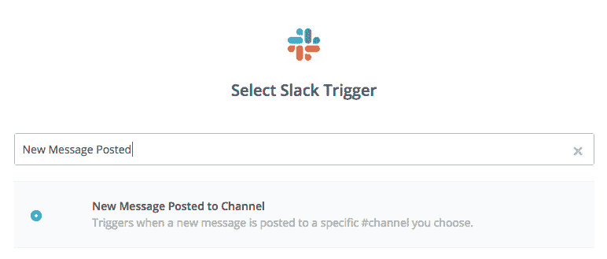](https://res.cloudinary.com/practicaldev/image/fetch/s--Lk_zwR5P--/c_limit%2Cf_auto%2Cfl_progressive%2Cq_auto%2Cw_880/https://thepracticaldev.s3.amazonaws.com/i/4uvsoz466p8t9lnt0x24.png)

[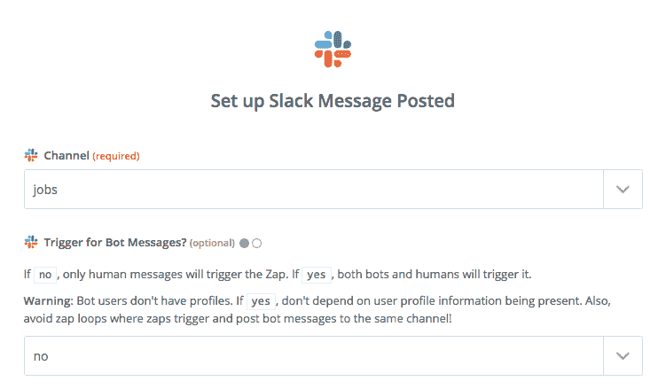](https://res.cloudinary.com/practicaldev/image/fetch/s--ox2W0G6D--/c_limit%2Cf_auto%2Cfl_progressive%2Cq_auto%2Cw_880/https://thepracticaldev.s3.amazonaws.com/i/yf74fmpgdrqk07cgszcd.png)

选择 Slack 作为您的信号源，并在*编辑选项*部分选择想要的频道，如果您想用机器人或仅人类触发。

### 2。按内容过滤

我只想包含一些带有特定标签的帖子(例如，#twittershare)。通过这种方式，用户可以决定他们是否希望自己的帖子被发布到 Twitter 上，我们可以避免一些尴尬的时刻，比如有人回答了一个问题，然后出现在 Twitter 上。

[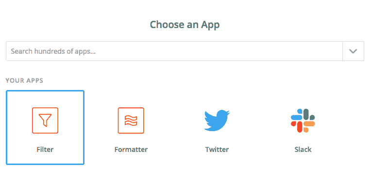](https://res.cloudinary.com/practicaldev/image/fetch/s--thS5I2RG--/c_limit%2Cf_auto%2Cfl_progressive%2Cq_auto%2Cw_880/https://thepracticaldev.s3.amazonaws.com/i/m4ftyt56qnlj9dsn5y0u.png)

使用 Zapier 的 *Filter* app 按值过滤。

[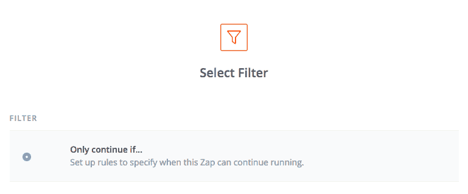](https://res.cloudinary.com/practicaldev/image/fetch/s--xSEblX8i--/c_limit%2Cf_auto%2Cfl_progressive%2Cq_auto%2Cw_880/https://thepracticaldev.s3.amazonaws.com/i/94lze3xsiubcqglgu6zf.png)

我们希望只有当来自 Slack 的消息符合我们的过滤器时才继续。

[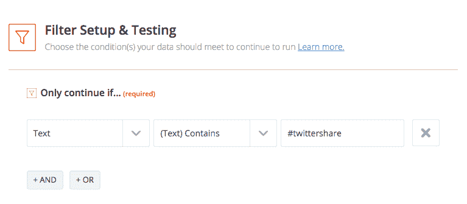](https://res.cloudinary.com/practicaldev/image/fetch/s--f7PYSiqd--/c_limit%2Cf_auto%2Cfl_progressive%2Cq_auto%2Cw_880/https://thepracticaldev.s3.amazonaws.com/i/v4iqbe475na0im14ietk.png)

按文本过滤很容易。

### 3。从消息中删除#twittershare

我们实际上不想在 tweet 中显示我们的关键字，这只是为了管理 Zap。因此，让我们通过使用*格式化程序*操作来删除它:

[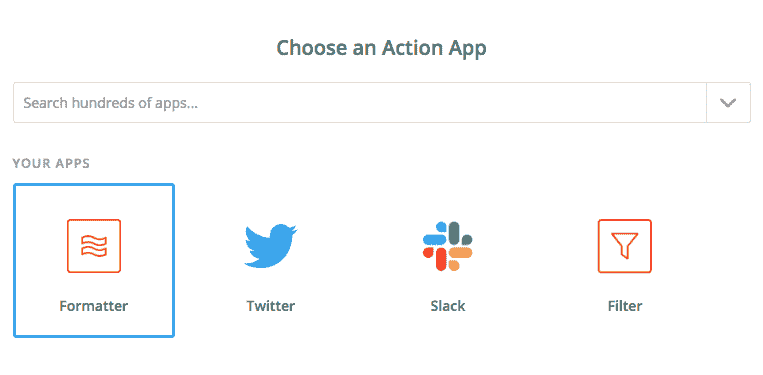](https://res.cloudinary.com/practicaldev/image/fetch/s--mfKo0ZrY--/c_limit%2Cf_auto%2Cfl_progressive%2Cq_auto%2Cw_880/https://thepracticaldev.s3.amazonaws.com/i/g3xvp5alefg3qsaqknmi.png)

[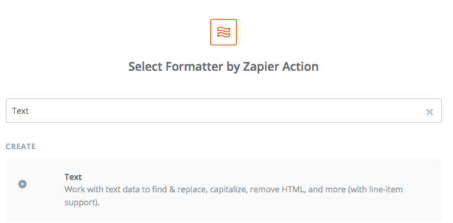](https://res.cloudinary.com/practicaldev/image/fetch/s--pbCURNrW--/c_limit%2Cf_auto%2Cfl_progressive%2Cq_auto%2Cw_880/https://thepracticaldev.s3.amazonaws.com/i/c3kovy9kwmg26qgj17de.png)

[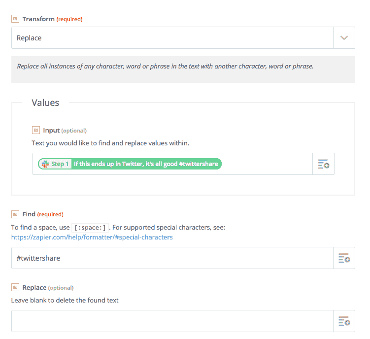](https://res.cloudinary.com/practicaldev/image/fetch/s--_2LnebYT--/c_limit%2Cf_auto%2Cfl_progressive%2Cq_auto%2Cw_880/https://thepracticaldev.s3.amazonaws.com/i/mdpm330i1c9597hhr1hs.png)

### 4。我们发微博吧！

用 Zapier 发布一条推文非常容易。

[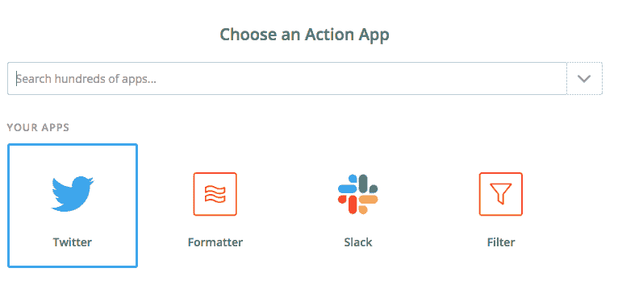](https://res.cloudinary.com/practicaldev/image/fetch/s--35C92Ys4--/c_limit%2Cf_auto%2Cfl_progressive%2Cq_auto%2Cw_880/https://thepracticaldev.s3.amazonaws.com/i/ui8i65dv54sf6klccda0.png)

[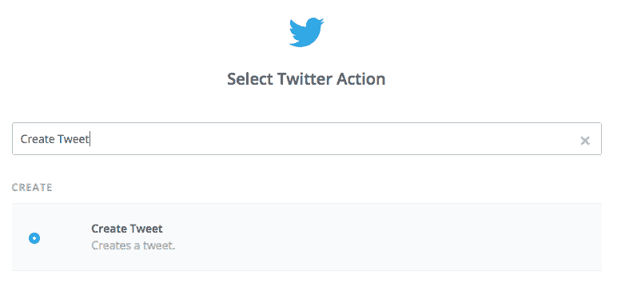](https://res.cloudinary.com/practicaldev/image/fetch/s--yJQMGvSW--/c_limit%2Cf_auto%2Cfl_progressive%2Cq_auto%2Cw_880/https://thepracticaldev.s3.amazonaws.com/i/b782awpizej8srctdyty.png)

[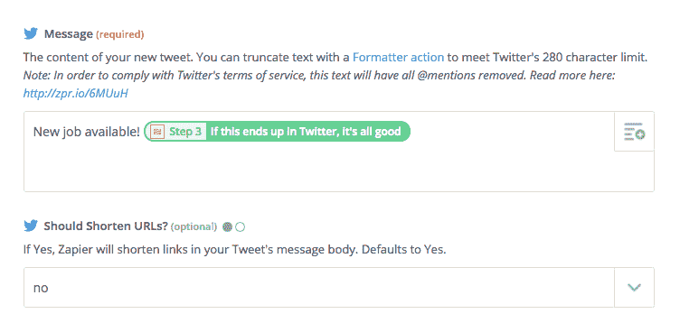](https://res.cloudinary.com/practicaldev/image/fetch/s--L4Vbvd_y--/c_limit%2Cf_auto%2Cfl_progressive%2Cq_auto%2Cw_880/https://thepracticaldev.s3.amazonaws.com/i/sne24u7n9nnhip3j49xr.png)

有了 Twitter 应用程序，你可以使用模板来创建消息。您可以添加文本，使用 Slack post 中的值(如时间戳、海报名称、文本等)。

### 结论

在你完成这些步骤之后，每当有人在给#jobs channel 的消息中发布一条关键字为#twittershare 的消息时，我们的帐户就会向 Twitter 发送一条推文。

这是让事情发生的最简单的方法，我强烈推荐使用这种方法。

## Slack-Google sheets-Twitter 选项

Zapier 的自由层只允许创建两步 zap。所以你不能过滤，不能替换文本，等等。最便宜的付费等级是 25 美元/月，如果你只需要一个如上所述的 Zap，你可能会犹豫是否付费。

好的一面是，我们基本上可以通过在一个 Zap 中创建对一个服务的输入，并在另一个 Zap 中读取它来实现 Zap 链。添加一些谷歌脚本编程，我们可以在两个 Zaps 和 23 行 Javascript 构建我们的。

通过阅读我们的 Zapier-only 选项中的步骤，你可以看到如何选择应用程序和完成设置，所以我将只显示重要的部分。

### Zap 1:松弛到谷歌工作表

#### 1。从松弛状态触发

这个选项和上面完全一样，这里就不赘述了。

#### 2。创建 Google 工作表

登录你的 Google Drive，创建一个新的电子表格。我将我的工作命名为 Zapier connection。在其中创建两个工作表，命名为“源”和“目标”。对于这两个，将标题“时间戳”、“用户”和“内容”添加到单元格 A1 到 C1。我们记录时间戳和用户只是为了调试目的。

#### 3。写入源工作表

[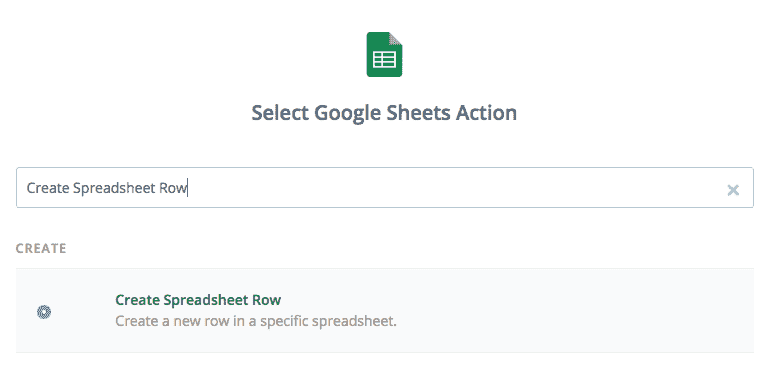](https://res.cloudinary.com/practicaldev/image/fetch/s--IyQdEkGW--/c_limit%2Cf_auto%2Cfl_progressive%2Cq_auto%2Cw_880/https://thepracticaldev.s3.amazonaws.com/i/pxhxa2j6xuz966cul14o.png)

使用创建电子表格行作为您的操作。

[](https://res.cloudinary.com/practicaldev/image/fetch/s--VBCqbu5N--/c_limit%2Cf_auto%2Cfl_progressive%2Cq_auto%2Cw_880/https://thepracticaldev.s3.amazonaws.com/i/kv2bo9w6x0byebd23mel.png)

选择您的电子表格和其中的源表。选择要写入列的值，然后就可以开始了。

在此之后，我们将有一个谷歌电子表格，它会自动将 Slack #jobs 频道的每个帖子添加到一个源表中。接下来，我们需要在 Google 脚本中做一点编程，从源到目标只复制我们想要的。

### 谷歌脚本

在谷歌电子表格中，进入菜单**工具- >脚本编辑器**。这将打开一个新的脚本编辑器，你可能需要允许它访问你的 Google Drive。

给你的脚本起个名字，我叫我的**条件复制**。将以下代码写入 Code.gs 文件:

```
function conditionalNewRow() {

  var SPREADSHEET_ID = '' // This one you can get from the url of your spreadsheet.
  var TIMESTAMP = 0;
  var USER = 1;
  var CONTENT = 2;

  var ss = SpreadsheetApp.openById(SPREADSHEET_ID);

  var sourceSheet = ss.getSheetByName('source');
  var targetSheet = ss.getSheetByName('target');

  var lastRowIdx = sourceSheet.getLastRow();
  var range = sourceSheet.getRange(2, 1, lastRowIdx - 1, 3);

  var lastRow = range.getValues().splice(-1)[0];

  var newContent = lastRow[CONTENT];

  if(newContent.indexOf('#twittershare') > -1) {
    var stripped = newContent.replace('#twittershare', '');
    var newRow = [lastRow[TIMESTAMP], lastRow[USER], stripped];
    targetSheet.appendRow(newRow);
  }
} 
```

Enter fullscreen mode Exit fullscreen mode

保存文件后，进入菜单**编辑- >当前项目的触发器**。选择**添加触发**。您需要在更改时选择您的函数`conditionalNewRow`和事件类型**。这将导致每次通过 Zapier 更新您的`source`工作表时运行该函数。**

您可以通过在 Slack 频道上发布一篇带有或不带有关键字的新文章来测试它的功能，并查看这两篇文章都应该出现在源表单中，只有带有关键字的文章应该出现在目标表单中。如果工作正常，继续下一步。如果失败了，确保你的 Zap 1 已经打开。

请注意，这个函数在每次修改时都会发生，并且总是从源代码中读取最后一行。如果你对该文件做了任何手动更改，它可能会重新发送你最近的推文。

### Zap 2:床单到 Twitter

这类似于我们的 Zapier-only 路线的 Slack to Twitter。选择 **Google Sheets** 作为触发应用，选择**新电子表格行**作为动作。这次选择 target 作为你的工作表。

Twitter 方面的行动与 Zapier-only 路线相同。

### Tada，大功告成！

它采取了一些额外的步骤，一点编程，并增加了一堆变量，可能会导致这一失败。在我的测试中，它看起来工作得非常好，我在推特上发布了我喜欢的内容。它在自由层和 Zapier 一起工作。