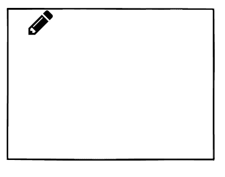
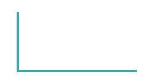
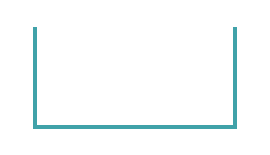
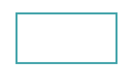

# 理解 SVG 路径(最后)

> 原文：<https://dev.to/paulryan7/understand-the-svg-path-finally-43i8>

SVG 路径看起来非常吓人，到处散布着看似随机的数字和字母。我最近学到了一些字母和数字的意思，我想帮助其他像我一样迷路的人。

我认为解决学习 SVG 路径的最好方法是画一些东西，所以我们将尝试使用路径画一个矩形。是的，我们可以使用 rect，但是学习如何用路径来做这件事将真正帮助我们理解它们是如何工作的。

对于编码，我推荐使用 Codepen 或任何可以让你快速看到变化的东西，因为看到仅仅是写数字就在屏幕上出现线条真是酷毙了！(反正我觉得很酷😎).

第一步是创建我们的基本 SVG:

```

 
```

现在我们可以创建一个 SVG 路径(从这一点开始的所有内容都将放在``标签)
之间)

```
<path fill="none" stroke="#3DA4AB" stroke-width="7px" /> 
```

Sooooo…屏幕上不会绘制任何东西(这是意料之中的)，但是在我们开始绘制之前，让我解释一下路径属性:

```
fill - when this is passed a color (hex or string) it will fill in the path with this color
stroke - what color should our stroke be
stroke-width - how thick should our stroke be 
```

现在到了有趣的部分，实际上是绘图，我们将添加 d (draw)属性到我们的路径元素:

```
<path fill="none" stroke="#3DA4AB" stroke-width="7px" d="" /> 
```

我们现在可以将命令传递给 d，我们将传递的第一个命令是`m` (move)，`m`带有两个参数(x，y ),它们将设置我们开始绘图的位置(假设我们拿着一支铅笔在画画),即

```
<path fill="none" stroke="#3DA4AB" stroke-width="7px" d="M 20 20" /> 
```

[](https://res.cloudinary.com/practicaldev/image/fetch/s--78Gg2Tqz--/c_limit%2Cf_auto%2Cfl_progressive%2Cq_auto%2Cw_880/https://cdn-images-1.medium.com/max/1600/1%2AsunGPS_Nee4SYDXITIKiIg.png)

我们已经告诉我们的 SVG，我们将从坐标`20,20`开始绘制。
下一步是绘制，为此我们将使用接受 x 和 y 参数的`l` (lineto)命令。小写是相对位置，而大写是绝对位置。

```
<path fill="none" stroke="#3DA4AB" stroke-width="7px" d="M 20 20 l 0 100" /> 
```

我们现在的路径看起来像:
[](https://res.cloudinary.com/practicaldev/image/fetch/s--MEyYmfHK--/c_limit%2Cf_auto%2Cfl_progressive%2Cq_auto%2Cw_880/https://cdn-images-1.medium.com/max/1600/1%2APL1wa9aOaX1wNBqnjpr_tg.png)

致命！我们已经画出了矩形的左边，我们的铅笔现在将在线的底部。你能猜出怎么画底部吗？我们基本上可以做与上面相反的事情:

```
<path fill="none" stroke="#3DA4AB" stroke-width="7px" d="M 100 100 l 0 100 l 200 0" /> 
```

[](https://res.cloudinary.com/practicaldev/image/fetch/s--CBFC0PZc--/c_limit%2Cf_auto%2Cfl_progressive%2Cq_auto%2Cw_880/https://cdn-images-1.medium.com/max/1600/1%2A3JakBlxn1cbtwIjhwucZ4Q.png)

我的天啊。我们有底了！

所以我们添加了另一个 l 命令，我们移动铅笔`200`穿过`x`轴，并保持`y`位置不变。

为了画出矩形的右边，我们希望我们的铅笔在 x 轴上保持在相同的位置，但是在 y 轴上向上移动 200，为了向上移动，我们为 y 添加一个负值`-200`。

```
<path fill="none" stroke="#3DA4AB" stroke-width="7px" d="M 100 100 l 0 100 l 200 0 l 0 -200" /> 
```

[](https://res.cloudinary.com/practicaldev/image/fetch/s--3fahwovQ--/c_limit%2Cf_auto%2Cfl_progressive%2Cq_auto%2Cw_880/https://cdn-images-1.medium.com/max/1600/1%2ASrfkw4tegHsLUz-Dg0J63A.png)

快到了！！现在，我们可以使用 z 命令画一条线回到起点，而不是在这里画一条线。

```
<path fill="none" stroke="#3DA4AB" stroke-width="7px" d="M 100 100 l 0 100 l 200 0 l 0 -200 z" /> 
```

[](https://res.cloudinary.com/practicaldev/image/fetch/s--S_SACcql--/c_limit%2Cf_auto%2Cfl_progressive%2Cq_auto%2Cw_880/https://cdn-images-1.medium.com/max/1600/1%2Af_FpJyJMsDX1RWfSG980sg.png)

## 让我们变得更简单

我们美丽的矩形现在画出来了！我们已经完成了我们计划要做的事情，但是我们可以让它变得更容易。我们还有`h`(水平)和`v`(垂直)命令。

这两个命令只接受一个参数，参数告诉命令把铅笔移动到哪里。它将简单地水平或垂直绘制到该点。

所以我们的路径现在看起来像这样，就像在我们指定从哪里开始绘制之前一样。

```
<path fill="none" stroke="#3DA4AB" stroke-width="4" d="M 100 100 v 100 h 200 v -100 z" /> 
```

你看这有多干净？我们垂直移动铅笔，然后水平移动铅笔来创建矩形。

## 结束

我现在将继续学习贝塞尔曲线，我一定会在这里分享我的发现。

感谢阅读，我希望你已经学到了一些东西。请务必关注我，因为我将在这里张贴我所有的新东西。