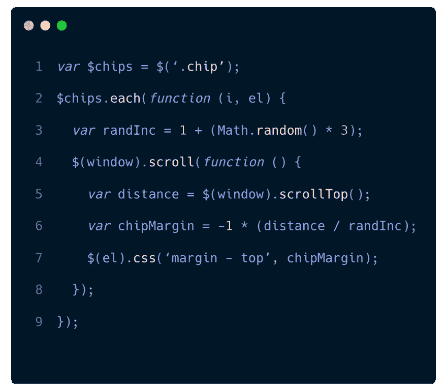

# 快速简单的 JS 视差效果

> 原文：<https://dev.to/amp_agency/quick-and-easy-js-parallax-effect-591l>

我最近接受了一项任务，为我们的一个工作客户创建一个微型网站。这个特殊的客户想要一个小网站，展示他们的新系列的芯片和蘸酱。这是我在 AMP 的第一个客户交付，我非常兴奋地开始工作，并向我的团队展示我不仅仅是一张漂亮的脸。

因此，我会见了我的项目经理，我们检查了设计，并讨论了不同部分的网页背后的功能。它非常简单，有一个英雄，一个特色产品网格，一个商店定位器，一个产品传送带和一个页脚。唯一的事情是，英雄将具有视差效果，当用户向下滚动时，一些芯片将弹出并向上移动页面。虽然这需要一些工作，但对我来说，一个主要的好处是，由于我的同事 Ethan 是为我们的客户制作这些微型网站的专家，网站的大多数其他部分已经为我建立起来了。所以我下载了他的 github 库并设置了我的本地，我们为这个客户端使用了 Zurb 的基础框架。我开始把这些碎片拼在一起，根据设计师的设计制作页面。大约 3 - 4 个小时后，我完成了我认为是页面基础的部分。我已经准备好了所有的部分，所有的组件都按预期运行。是时候得到视差效果了。

## 第 9 行 JavaScript 代码

不废话。在花了几个小时摆弄不同的视差库，试图创造出我想要的效果之后，我的老板漫不经心地坐到椅子上，说:“看起来很有趣。把这个发给我，让我试一试”。所以我有。15 分钟后，他给我发来一个 JavaScript 文件，告诉我一切就绪。我将他的代码复制到我的 JavaScript 文件中，编译后在 FireFox 中打开测试。成功了。效果非常好。我非常惊讶，我不停地来回滚动，让芯片移动了几个小时。参见下面的代码。

相当酷。也非常简单。在这个版本中，你需要 jQuery 来运行它，但是在普通 js 中创建相同的结果是可能的。