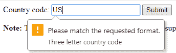

# Regex Bootcamp(或者似乎没有人使用 HTML5 验证)

> 原文：<https://dev.to/dexygen/regex-bootcamp-or-nobody-seems-to-be-using-html5-validation-2f6o>

在这篇文章中，我将引用我上一篇关于表单验证的文章中的正则表达式的简化版本。不过，这提醒了我，在那次之前，有人在对[我的帖子的评论中暗示，我在根本不依赖 HTML5 验证方面有些不妥。](https://dev.to/dexygen/form-validation-youre-likely-doing-it-wrong-37h9)

所以在我写另一篇文章之前，我决定检查一下 w3schools 上的一个例子，这个例子根据正则表达式模式测试输入。首先，如果你看一下代码，这种验证似乎只在提交时有用？但是我一直在对 blur 和/或 keyup 进行验证，所以 HTML5 验证似乎不合适。

此外，我认为现实世界网站上的许多验证也不依赖于 HTML5 验证。例如，我故意输入 2 个字符而不是 3 个字符来引起一个错误，并且看到了这个:

[](https://res.cloudinary.com/practicaldev/image/fetch/s--qJ_UsDxl--/c_limit%2Cf_auto%2Cfl_progressive%2Cq_auto%2Cw_880/https://thepracticaldev.s3.amazonaws.com/i/udekvwm05q1981s00ztj.png)

自从 HTML5 推出以来，我怀疑我是否见过这样的错误信息(我使用的是 Chrome)。相反，每个网站似乎都在根据自己的需求定制验证。

我假设像我在上面链接的两篇文章中一样，真实世界的验证经常依赖于正则表达式模式。因此，看看我在[对邮政编码的简化验证(而不是 zip“plus 4”)吧，这是我之前的要点](https://gist.github.com/dexygen/b0225fffe4e6d3b39c088a72e431e0dd)的后续版本，或者只是遵循下面的 Javascript 代码，而不是所有的 HTML，记住，我不会涵盖除正则表达式之外的所有代码。

```
 const zip = document.getElementById('zip');
  const zipErrEl = document.getElementById('zip-error');
  const errorMsg = "Please enter 5 digits, optionally followed by a dash and 4 digits";
  const keyupRegex = new RegExp("^\\d{0,5}$");
  const blurRegex = new RegExp("^\\d{5}$");

  function validateZip(regex) {
    if (regex.test(this.value)) {
      zipErrEl.innerHTML = '';
    }
    else {
      zipErrEl.innerHTML = errorMsg;
    }
  }

  zip.focus();

  zip.addEventListener('keyup', function() {
    validateZip.call(this, keyupRegex);
  });

  zip.addEventListener('blur', function() {
    validateZip.call(this, blurRegex);
  }); 
```

首先让我们快速定义一下什么是正则表达式。非常简洁地，它描述了匹配(或不匹配)一个字符串的模式。

让我们分解一下上面的第一个正则表达式:
`const keyupRegex = new RegExp("^\\d{0,5}$");`

在 Javascript 中有两种定义正则表达式的方法，一种是如上创建一个新的 RegExp 对象，但可能更常用的是在斜杠之间使用正则表达式的“文字”语法，而上面的语法应该是:

```
/^\d{0,5}$/ 
```

但是请注意，您不能将一个定义为文字的正则表达式赋给一个变量，但是像我一样用`new RegExp`语法这样做允许正则表达式被有意义地命名。接下来请注意这两种格式的第一个区别:

1.  `new RegExp`在“d”前面有两条斜线
2.  正则表达式文字语法前面只有一个斜杠

在正则表达式中，`\d`代表一个数字字符。`new RegExp`接受一个字符串作为它的参数，但是斜杠是正则表达式中的一个特殊字符，所以它必须用前面的另一个斜杠“转义”。

现在让我们一个一个的过一遍`new RegExp`人物。首先，“^”意味着字符串必须从它的第一个字符开始就遵循这个模式。跳到最后一个字符“$”，这意味着在匹配的字符串结束之前，除了模式描述的最后一个字符之外，不允许有其他字符。

这两个符号，“^”和“$”统称为“锚”。当它们都出现在我们的例子中时，这意味着字符串必须与模式完全匹配，前后没有任何不同。注意，如果你想在一个字符串中匹配这两个符号中的一个，你必须用斜杠将它们转义。

所以现在剩下要考虑的就是`{0,5}`。它是一个“量词”，对它前面的内容进行量化，特别是数字字符`\d`。

这种特定形式的量词意味着允许出现 0 到 5 个实例。有了所有这些信息，我们现在知道整个模式匹配的是什么:0 到 5 个数字字符，前面没有，后面也没有。

onkeyup 事件处理程序不需要进入所有的输入和输出，而是“委托”给`validateZip`函数，该函数立即测试字符串是否与模式匹配，如下所示:

```
regex.test(this.value); 
```

至于以这种方式执行 keyup 验证的原因，它允许用户键入 0 到 5 个数字，而不会出现过早的错误，例如，在只键入一个数字后，它不是一个有效的邮政编码。如果第一个数字不正确，它甚至会让他们输入一个数字，然后返回并输入一个不同的数字，因为我们“匹配”的数字少到零。当然，如果他们输入的不是数字，他们会得到一个错误。

onblur 验证中唯一的区别是数字字符量词改为了`{5}`。这意味着肯定有*确切地说是*那么多位数，而不是一个范围。因此，例如，如果他们只输入 4 个数字，在他们键入时没有错误，因为 keypress 用它的 regex 数字量词`{0,5}`来处理，但是*然后*在字段外单击，他们将得到一个错误。

使用 HTML5 验证，你甚至不能接近做任何这种事情。寻找即将到来的分解该代码其他部分的文章。与此同时，我强烈推荐[下面的](https://regex101.com/)来磨练你的正则表达式技能。