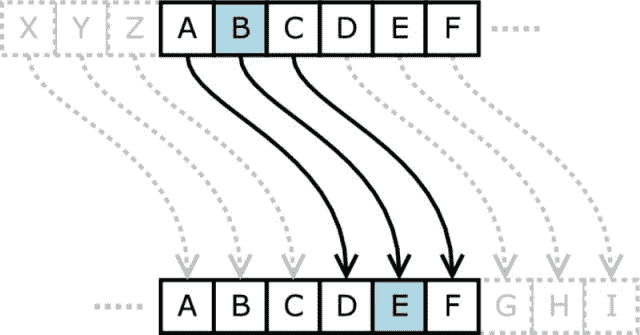

# 用 Python 实现凯撒密码

> 原文：<https://dev.to/_morgan_adams_/caesar-cipher-implementation-in-python-2fp3>

## 简介:关于凯撒密码

凯撒密码是一种简单的密码，已经存在很长时间了。2000 多年前，朱利叶斯·凯撒在他的一些通信中使用了这个词。它在其他密码中也有应用，但是由于它很容易被破译，所以没有提供有用的安全级别。

密码的工作原理是将信息中的每个字母移动相同的量。例如，如果我将旋转因子设置为 3，字母“a”会产生“d”。

为了更清楚地了解这一点，下图演示了如何处理到达字母表末尾的移位。当移位到达字母表的末尾时，使用移位 3,“z”绕回并变成“c”。

[](https://res.cloudinary.com/practicaldev/image/fetch/s--uqrz-5IM--/c_limit%2Cf_auto%2Cfl_progressive%2Cq_auto%2Cw_880/https://i0.wp.com/cdn.instructables.com/FZZ/XPQ8/IRTDSFHC/FZZXPQ8IRTDSFHC.LARGE.jpg%3Fw%3D640%26ssl%3D1)

现在，让我们举一个更完整的例子。如果我们使用 20 和的右移，并将其应用于消息“Hello World！”，我们得到密文“Byffi Qilfx！”

相反，如果我们想解密这个，我们把密码反过来，向左而不是向右移动。从这里，我们看到密码的两个可变部分是 1，你移动的方向，和 2。多少钱。

## 编码密码

作为练习，我编写了一个简单的 python 脚本来执行旋转。首先，我算出了处理移位(包括包装)的数学公式，因为这是最复杂的部分。然后，我遍历每个字符并应用计算。最后我加了一个简单的 CLI，然后贴到 [Github](https://github.com/morganda/crypto_hacks/tree/master/caesar_cipher) 上。

下面是我的凯撒密码实现。Python 不允许对字母执行数学运算，所以必须先使用“ord”函数将它们转换成 Unicode 码位。

```
def apply_rotation(c, factor):
    """Applies a shift of factor to the letter denoted by c"""
    if c.isalpha():
        lower = ord('A') if c.isupper() else ord('a')
        c = chr(lower + ((ord(c) - lower + factor) % 26))
    return c

def caesar_cipher(s, k):
    """Iterates through each letter and constructs the cipher text"""
    new_message = ''
    factor = k % 26
    for c in s:
        new_message += apply_rotation(c, factor)
    return new_message 
```

Enter fullscreen mode Exit fullscreen mode

## 数学

让我们用一个字母“a”来完成 apply_rotation 方法，因为这个字母有点难读。

首先，我们将“较低”的值分配给“A”或“A ”,这取决于构建移位的情况。查看内括号，我们将字符转换为代码点并减去“lower”。字母“a”的码位是 97，所以如果我们用变量“c”表示的字母是“f”(码位是 102)，我们将得到 5(102–97 = 5)。然后我们可以加上我们的移位因子(在我们的例子中是 3)，得到 8。

在看数学的其余部分之前，如果你索引 26 个字母字母表 1-26，5 是我们想要转换的字母‘f’。加上位移得到 8，它映射到字母“I ”,这是我们当前的结果。Python 不知道 8 yields 和‘I ’,但这没关系，因为等式的剩余部分为我们解决了这个问题。

在这个例子中，执行模数 26 只返回 8，所以我们现在可以忽略它。最后一步是将 Unicode 码位值“lower”加到 8，即 97 + 8 = 105。现在，我们可以使用 python 内置的方法“chr”将 Unicode 码位转换回字符串，该方法给出了“I”。

### 模数

这是非常简单的数学，为什么我们要在同一个等式中加上 lower 和减去它呢？那些不是互相抵消了吗？是的，但是因为字母表是基于 26 个字符的，所以我们需要将 Unicode 码位值 0 输出到我们的 1-26 索引中，这样我们就可以利用模数来处理需要换行的移位。

模数有助于我们的代码包装。如果我们再次进行数学运算，而是对代码点为 122 的字母“z”进行移位 3，我们必须对字母进行换行，否则我们会得到代码点为 125 的字符“}”。

忽略最后一项，加上“lower ”,等式最终为(122–97+3)% 26。这降低到 28 % 26。28 不在字母表中，但是当我们应用模数时，我们得到的是 2。我们最终可以加上最后一个“低”来完成数学运算，即 97+2 = 99。应用 chr 方法，我们得到字母 c。

额外收获:在完整的代码示例中，我使用模数 26 来处理大于 26 的移位。例如，移位 27 等于 1 (27 % 26 = 1)。

## 总结

凯撒密码是一种简单的密码，将每个字母移动一个固定的量。我们通过反向转换产生破译的信息。

用 Python 实现凯撒密码的帖子[最早出现在](https://morgandadams.com/caesar-cipher-implementation-python/)[摩根亚当斯](https://morgandadams.com)上。