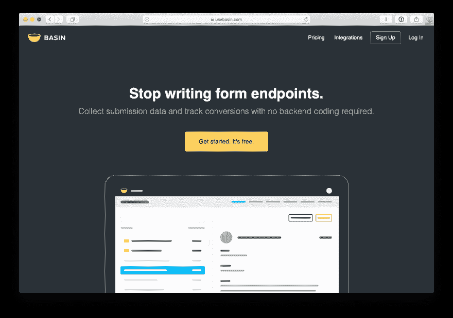
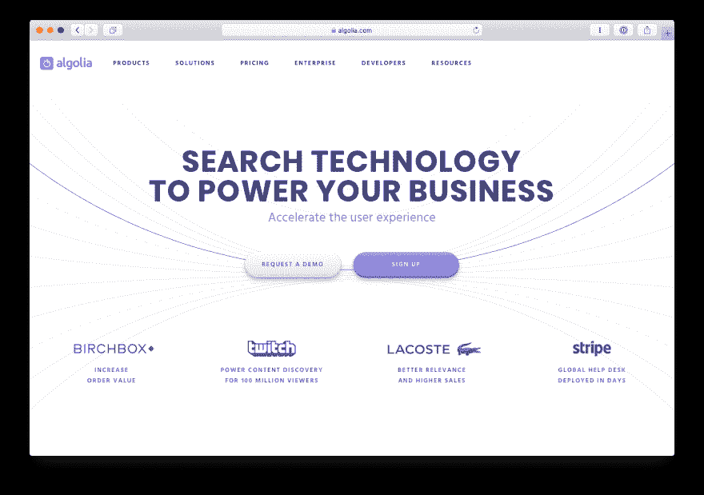
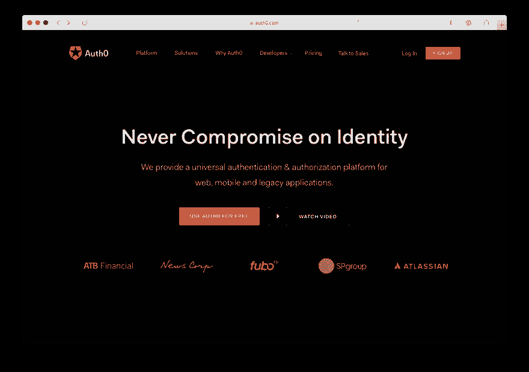
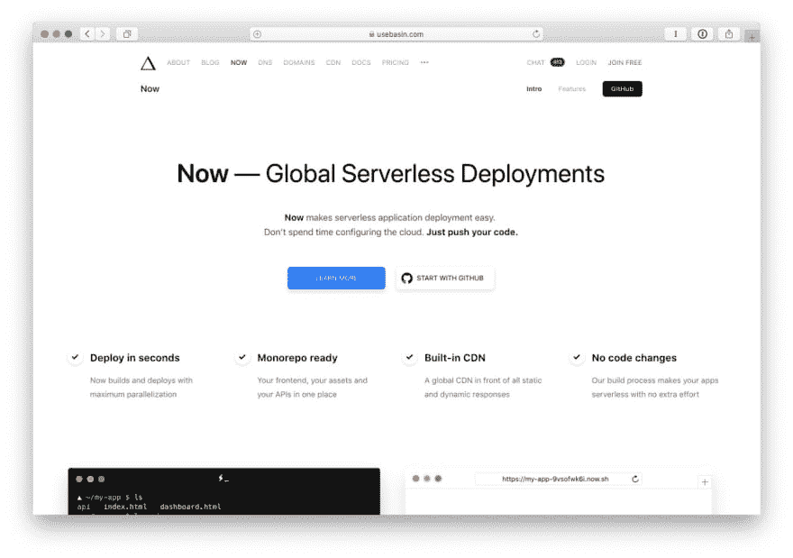
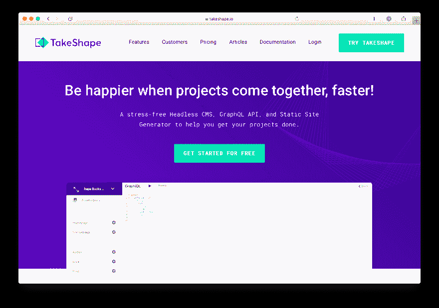

# 向 JAMstack 项目添加高级功能的 15 个强大工具

> 原文：<https://dev.to/takeshape/15-powerful-tools-to-add-advanced-functionality-to-your-jamstack-project-3ma5>

JAMstack 使得创建富网站比以往任何时候都更容易，这意味着你的项目将比以往任何时候都更安全、更稳定、更实惠。

运行 JAMstack 站点需要稍微改变一下设计项目的思路。一个成功的 JAMstack 站点就是为你的特定项目提供最好的服务。当您想要交付动态体验(如表单提交、搜索和服务器端数据处理)时，您有许多选项可供选择。一整批新服务已经发展到可以处理如此多的用例，以至于你曾经需要投入一整台服务器来处理。

使用 JAMstack 进行构建意味着您可以避免维护自己的服务器，在几乎不需要太多代码的情况下为项目添加强大的功能，并将您的时间集中在构建出色的用户体验上。

## 形成端点

过去，运行静态站点的最大缺点之一是没有处理表单提交的好方法。幸运的是，一群公司已经出现来为你处理这个简单、普通的任务。只需提供它们唯一的地址作为表单的`action`，它们就会序列化、存储甚至发送你的数据到 webhooks。有很多选项可供选择(见下文)，但到目前为止，[盆地](https://usebasin.com/)似乎是最有价值的，它有无限的表格和无限的提交，价格为 5 美元/月。

**其他伟大的解决方案:**

*   [Formkeep](https://formkeep.com/) 、 [Formcarry](https://formcarry.com/) 、 [FieldGoal](https://fieldgoal.io/) 、 [FormBackend](https://www.formbackend.com/) 和 [PageClip](https://pageclip.co/) 都提供了与 Basin 类似的功能。可能比我们在这里列出的还要多。看一看，比较一下，挑一个适合你的。
*   如果你已经在使用 Netlify，那么[他们内置的表单处理](https://www.netlify.com/docs/form-handling/)可能是你最好的选择。这样，您可以通过将所有站点数据放在一个地方来避免增加额外的复杂性。
*   如果你想自己动手，Zapier Webhooks 是一个很好的 DIY 解决方案。您可以将表单的动作设置为 Zapier webhook，然后将数据传递给您能想到的任何其他服务。

## 搜索

搜索很可能是你项目中最沉重的负担。这是一个棘手的情况:搜索难以置信地难以做好，但它是一个用户期望完成的用户界面功能——并且完美地完成。幸运的是，像 [Algolia](https://www.algolia.com/) 这样的搜索服务可以轻松提供复杂的搜索体验，而无需从头开始构建。它们提供了一个搜索 API 来索引和排列你的项目内容，以及在各种框架中预先构建的界面元素，让你可以使用一个非常好用的搜索工具。

**其他伟大的解决方案:**

*   SearchIQ 提供的功能比 Algolia 少，但价格更低。一个显著的区别是它们提供了对项目的爬行，这让您不必自己构建索引。他们还提供了插件 JavaScript 工具来提供自动完成和搜索结果页面。
*   对于这个问题的不同看法是， [Lunr](https://lunrjs.com/) 提供了一个客户端搜索解决方案。如果你要呈现一个内容有限的静态站点，比如一个博客或商店，这是一个很好的选择。在呈现一个静态索引文件后，Lunr 将构建一个可搜索的索引，您可以将它缓存在浏览器的本地存储中以供将来访问。

## 认证

身份验证很难做对，出错的后果是巨大的。如果您希望将用户身份作为项目的一部分，请坚持使用现成的解决方案，如 [Auth0](https://auth0.com/) 。它们提供了单点登录平台、嵌入式登录小部件以及多因素身份验证和无密码登录等高级安全功能。强大的文档和开发人员 SDK 将使 Auth0 集成到您的项目中变得容易。此外，凭借 7k 免费活跃用户和无限制登录，它们是让您的项目起步的最实惠的服务之一。

**其他伟大的解决方案:**

*   Netlify 是托管你的 JAMstack 站点的一个很好的服务，其中一个原因是他们提供的 T2 Netlify 身份附加服务。您将获得多达 1000 名活跃用户，免费、轻松地连接到外部身份提供商，如 Google 和 GitHub，并向您的网站添加认证小部件。如果您已经在 Netlify 上运行您的 JAMstack 项目(您应该考虑一下！)，这是一个容易的选择。
*   [AWS Cognito](https://aws.amazon.com/cognito/) 是最实惠的选择，但也比 Auth0 提供的现成解决方案更难实现。然而，aws-amplify 库使得将 aws 集成到 JAMstack 应用程序中变得更加容易。如果您已经在使用 AWS 来支持您产品的其他服务，那么首先使用 Cognito 可能会有所回报。

## 功能为服务(FaaS)

无服务器函数是 JAMstack 中最令人兴奋的部分之一。使用 FaaS 可以让你在 JAMstack 站点上添加任何你能想到的功能。例如，如果我们提到的表单提供者都不能让您的船漂浮起来，那么就启动一个无服务器的功能，并运行您自己的功能。为您提供极大的灵活性，而不必担心底层服务器或基础架构。当您不使用该功能时，不会向您收取费用。FaaS 的曾祖父是奥斯拉姆达。AWS Lambda 函数是我们在 TakeShape 的首选，事实上，TakeShape 本身就运行在 AWS Lambda 上。

**其他伟大的解决方案:**

*   基本上是 AWS lambda 函数的一个前沿。如果你正在使用 Netlify 来托管你的 JAMstack 站点，并且你喜欢集中计费的便利，那么 Netlify 功能正适合你。
*   谷歌云功能([https://cloud.google.com/functions/](https://cloud.google.com/functions/))——可编程的云功能。就像 AWS lambda 函数一样，但是由 Google 提供。很适合成为 TakeShape 触发的 Webhook 的接收者。
*   zeit Now-[https://zeit.co/now](https://zeit.co/now)-一个后起之秀，拥有非常易于使用的 CLI。
*   如果你只想连接两个服务而不做任何编码，Zapier Webhooks 是一个很棒的 DIY 解决方案。它可以节省你大量的时间，但是缺点是如果你经常使用这些函数，运行它们的成本会高得多。

## 无头内容管理系统(CMS)

最后，为了管理 JAMstack 项目的内容，您需要一个易于使用的 CMS 和静态站点生成器。留下 Markdown 文件的文件夹，使用简单的 CMS 和静态站点生成器来组织、开发和部署 JAMstack 站点。如果您正在创建一个 web 应用程序，TakeShape 的 GraphQL API 提供了一个简单易用的端点来一次性查询您的所有内容。最重要的是，TakeShape 已经提供了示例项目，可以在 5 分钟内启动并运行您的网站！您可以免费试用 TakeShape，并发现这是管理 JAMstack 站点内容的最简单方法。