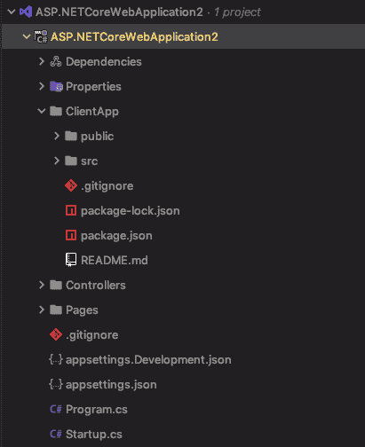
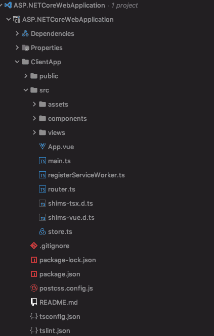

# 破解 Vue.js 的 ASP.NET 核心 React SPA 模板

> 原文：<https://dev.to/alexeyzimarev/hacking-the-aspnet-core-react-spa-template-for-vuejs-1plg>

# ASP.NET 核心 SPA 模板和 Vue.js

从版本 2.1 开始，ASP.NET 核心已经将以前通过`Microsoft.AspNetCore.SpaTemplates`包提供的所有 SPA 模板转移到核心存储库。完成后，所有。喜欢 VueJs 的. NET 开发人员是负面的惊喜，因为 Vue 模板只是从新的模板集中删除了。因此，当您创建一个新的 ASP.NET 核心 Web 应用程序时，您可以在 Angular、React
和 React with Redux 之间进行选择。欧文·考尔菲尔德在媒体的[帖子中详细描述了这个问题。欧文指的是](https://medium.com/swlh/asp-net-core-2-1-vue-js-a-marriage-made-in-heaven-6e6ab19b40f5) [GitHub 问题](https://github.com/aspnet/Announcements/issues/289)。

# 如何处理

理想情况下。NET 社区需要关注这个问题，并创建一个新的模板来解决这个问题。下面，我将介绍这样一个模板的需求，并解释如何在模板工作之前解决这个问题。

## React 模板

让我们快速看一下 React+Redux SPA 模板是如何工作的。

使用该模板创建的应用程序在 web 项目中包含一个名为`ClientApp`的文件夹。这个文件夹是 React 应用程序的主文件夹，它使用 WebPack。

[](https://res.cloudinary.com/practicaldev/image/fetch/s--SaiQXUT5--/c_limit%2Cf_auto%2Cfl_progressive%2Cq_auto%2Cw_880/https://thepracticaldev.s3.amazonaws.com/i/unifpo1gyh4gktsk310z.png)

为了构建 SPA，在`csproj`文件中有一些额外的项目。你可以自己看看，因为为了简洁起见，我不会在帖子中包含这些内容。简而言之，有一个`ItemGroup`将`ClientApp`文件夹作为内容包含到构建的输出中，还有两个`Target`标签在构建和发布阶段执行`npm`。

在`Startup.cs`文件中也有一些代码行对于整个工作非常重要。

首先，在`ConfigureServices`方法中我们可以找到这条线:

```
services.AddSpaStaticFiles(configuration => 
    { configuration.RootPath = "ClientApp/build"; }); 
```

在`Configure`方法中，我们还有几行代码:

```
app.UseStaticFiles();
app.UseSpaStaticFiles();

// MVC configuration is skipped but still needed

app.UseSpa(spa =>
{
    spa.Options.SourcePath = "ClientApp";

    if (env.IsDevelopment())
    {
        spa.UseReactDevelopmentServer(npmScript: "start");
    }
}); 
```

## 让它与 Vue 一起工作

因此，正如我们所看到的，没有对整个应用程序设置进行大规模的更改来使 SPA 工作，因此`UseReactDevelopmentServer`接受了`npm`命令，它可能很容易被替换来运行另一个命令。

### 更换客户端 app

所以，让我们从用 Vue 应用替换 React 应用开始。为此，我使用`vue create myapp`命令在另一个目录中创建了一个 Vue 应用程序。我添加了一些选项，如使用 TypeScript 和 PWA，但这并不重要。Vue CLI 3 仅使用 WebPack 配置，因此 ASP.NET 核心应用程序的整个构建配置应该像以前一样工作。为了检查是否是这种情况，我删除了我的。NET 项目，并用我的新 Vue 应用程序目录的内容替换它:

[](https://res.cloudinary.com/practicaldev/image/fetch/s--dq8RJXBu--/c_limit%2Cf_auto%2Cfl_progressive%2Cq_auto%2Cw_880/https://thepracticaldev.s3.amazonaws.com/i/1v7stdhv2io2hwnup96l.png)

你可以看到我的`ClientApp`文件夹中包含的是 Vue 应用，而不是 React 应用。我现在可以试着构建整个解决方案，它会像预期的那样构建。

### 中间件

然而，如果我运行应用程序，我会在`ReactDevelopmentServerMiddleware`中得到一个异常，因为它试图执行`npm run start`，但是 Vue 开发服务器是由`npm run serve`启动的。这似乎是一个简单的修复方法，所以我只需要在我的`Startup.cs`中更改行:

```
app.UseSpa(spa =>
{
    spa.Options.SourcePath = "ClientApp";

    if (env.IsDevelopment())
    {
        spa.UseReactDevelopmentServer(npmScript: "serve");
    }
}); 
```

但是现在，当我启动应用程序时，它会打开浏览器窗口，该窗口在试图加载主页时一直挂起。然而，在控制台输出中，我可以清楚地看到 Vue 开发服务器已经成功启动，并且没有异常。

挂起的原因是`ReactDevelopmentServerMiddleware`类中的这段代码:

```
Match match = await npmScriptRunner.StdOut.WaitForMatch(new Regex("Starting the development server", RegexOptions.None, ReactDevelopmentServerMiddleware.RegexMatchTimeout)); 
```

正如您所看到的，它用一个给定的命令启动了`npm`，我们可以替换这个命令，但是它等待 Node 产生一个特定的控制台输出，这个输出被硬编码到`Starting the development server`。如果你靠近 Vue 的`npm run serve`的输出，你可以看到它显示的是`Starting development server`。因此，上面的代码等待输出，直到超时并抛出。

### 改变输出信息

因此，这里来了一个黑客，因为我们以前做的一切都是相当合法的。现在，我们需要替换输出消息。可以通过修改`ClientApp/node_modules/@vue/cli-service/lib/commands`目录下的`serve.js`文件来实现。这是我的零钱:

```
 }, async function serve (args) {
    info('Starting the development server...') 
```

现在，如果我再次运行应用程序，它会启动浏览器，但是我会得到一个异常，即中间件无法将请求代理到开发服务器:

> HttpRequestException:无法将请求代理到 [http://localhost:54252/](http://localhost:54252/) ，因为对代理目标的请求失败。检查代理目标服务器是否正在运行并接受对[的请求 http://localhost:54252/](http://localhost:54252/)

(端口号可能会有所不同)

同时，我可以看到当时 Vue 的开发服务器仍在建设和林挺的应用程序。完成后，我刷新了页面，一切正常。

### 浏览器同步注意事项

通过执行`ClientApp`目录中的`vue add browser-sync`并使用`serve:bs`代替`serve`作为中间件的参数来安装 Vue CLI 插件，可以使用浏览器同步。但是之后整个系统又停止工作了。这是因为插件使用自己的代码来处理`serve:bs`命令。但是也可以通过在`ClientApp/node_modules/vue-cli-plugin-browser-sync/index.js`文件中将文本改为`Starting the development server`来修复。

### 出版

如果您运行 React 应用程序的`dotnet publish`命令，您将会看到 SPA 的发行版本被构建到`ClientApp`中的`build`目录中。这也对应于`Startup.cs`文件中的这一行:

```
services.AddSpaStaticFiles(configuration => 
    { configuration.RootPath = "ClientApp/build"; }); 
```

而`csproj`文件中的这一行:

```
<DistFiles Include="$(SpaRoot)build\**; $(SpaRoot)build-ssr\**"/> 
```

正如你所看到的，在这两个地方把`build`改成`dist`是非常容易修复的。如果你不使用服务器端渲染，T2 部分可以被安全删除。所以，代码应该是:

```
services.AddSpaStaticFiles(configuration => 
    { configuration.RootPath = "ClientApp/dist"; }); 
```

在`Startup.cs`和

```
<DistFiles Include="$(SpaRoot)build\**"/> 
```

在`csproj`文件中。

完成这些更改后，您可以开始开发和发布托管在中的 Vue SPA 应用程序。NET 核心网络应用服务。

## 快捷方式

破解为 Vue CLI 运行`npm`命令的代码并不好，所以您可能想要使用我从 React 开发服务器中间件编写的 Vue 开发服务器中间件的完整代码。不幸的是，中间件的许多助手类都是内部的，所以我也必须包含这些类。所有的代码都有 Apache 2.0 许可，所以只要代码的来源清楚，使用修改后的版本就不成问题。[以下是我的要点](https://gist.github.com/alexeyzimarev/f0262426aa38e2c1ed2913252ceb5e7a)。如果您将此文件复制到项目中，您可以直接使用它:

```
app.UseSpa(spa =>
{
    spa.Options.SourcePath = "ClientApp";

    if (env.IsDevelopment())
    {
        spa.UseVueDevelopmentServer(npmScript: "serve"); // use serve:bs for Browser Sync
    }
}); 
```