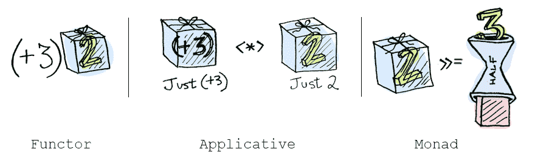

# Typeclass(Interface)是 Haskell 函子、Monad 这些怪异的内核概念

> 原文：<https://dev.to/chenge/typeclassinterface-is-kernel-concept-of-haskell-functor-monad-these-weird-1cji>

简而言之，typeclass 就像接口一样，所以理解起来并没有那么难。

让我们来看一些关于 Maybe 函子的代码，函子有一个特殊的映射函数:

```
class Functor Maybe where
    fmap :: (a -> b) -> Maybe a -> Maybe b

instance Functor Maybe where
    fmap func (Just x) = Just (func x)
    fmap func Nothing  = Nothing 
```

Functor 是一个 typeclass。
适用函子扩展函子。
单子延伸适用。

```
class Applicative m => Monad m where
    return :: a -> m a
    (>>=) :: m a -> (a -> m b) -> m b 
```

另一个幺半群是一个数学概念。它也是一个类型类。

它们都是类型类。

# ref

[](https://res.cloudinary.com/practicaldev/image/fetch/s--e4bW2aEI--/c_limit%2Cf_auto%2Cfl_progressive%2Cq_auto%2Cw_880/http://blog.leichunfeng.cimg/recap.png) 
[函子、适用和单子(中文)](http://blog.leichunfeng.com/blog/2015/11/08/functor-applicative-and-monad/)

为了伟大的利益，学你一个哈斯克尔！

[](/nestedsoftware) [## 读书笔记:为了更好的学习 Haskell！

### 嵌套软件 12 月 4 日 1819 分钟读取

#haskell #functional #monad #javascript](/nestedsoftware/book-notes-learn-you-a-haskell-for-great-good-2cnp)