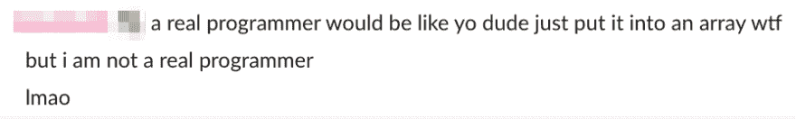
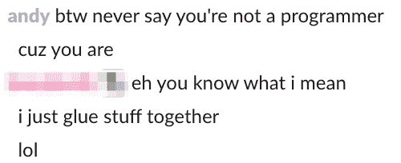

# 我不是真正的程序员

> 原文：<https://dev.to/andygeorge/i-am-not-a-real-programmer-1ogo>

**我目前是 Kenna Security** 的系统工程师，但并不是受雇于这个职位:四年前，我开始担任我们的第一位官方支持工程师(我认为，部分原因是因为我们的联合创始人兼首席技术官不想再回答问题了)。

不过，我还是喜欢和支持团队在一起。我们目前的一位年轻支持工程师喜欢不时地给我发送他写的代码片段，也许是为了问一个问题或者炫耀他学到的一些很酷的东西。前几天他给我发了这个，在他的一个片段之后:

我们是一个忙碌的地方，我不太擅长掌握 DMs，所以我最初没有多想，也没有立即做出回应。午饭后，我回去看了看他说的话，突然有了灵感。我回应道:

我*做*知道他的意思。我一直想成为一名程序员——我从小就在家里的旧电脑上开发，在学校的图形计算器上写脚本，在生日时索要 O'Reilly Perl 书籍。我和计算机系的老师关系很好，我甚至在高中的时候在一个非盈利机构兼职做网站开发。毕业后，我沿着一条最终让我进入大学计算机工程(想想 CS + circuits)项目的轨道前进。这似乎是一条简单的前进道路，对吗？

尽管如此，我还是从大学退学了，花了十几年的时间试图成为一名职业程序员/开发者，但都失败了。当 Kenna 的机会到来时，我已经从支持转向软件 QA，认为尽可能接近“真正的”开发是我获得理想工作的方式。在 Kenna(然后是 Risk I/O)——一家有一些非常有趣、聪明、酷的人的初创公司——找一份工作很容易，但“回去”提供支持的想法有点艰难。我仍然想成为一名真正的程序员，我已经和真正的程序员一起工作了很多年，但在专业上，我不能做他们做的事情。

肯纳与众不同。我进入了 GitHub。我有自己的开发实例。我被教导如何创建和合并 PRs，并观看我的代码(*我的代码！*)投入生产。是的，我在回答支持问题，是的，我在接电话做技术支持，但是上帝保佑，我在学习和编写 Ruby。一个新的工程师后来甚至告诉我“我不知道你是 support，当我开始的时候，我以为你是我们的开发人员之一”。

我们在 Kenna 的成长稍微改变了游戏——我玩代码的时间少了很多，而且随着我们客户群的规模和复杂性的增长，我被支持工作淹没了。不过，我们开始壮大我们的支持团队，并雇佣了一些比我更擅长这个角色的支持工程师。这也为我们转向平台/系统/运营方面创造了机会。

我会做后端，基础设施的工作。我们是一家 Fedora 商店，虽然这些年来我一直在玩 Red Hat、Ubuntu 和其他软件，但我从来没有真正做过 Linux 系统管理。我的老板冒险带我过来，希望我能达到我们需要的系统工程师的水平。

* * *

那是几年前的事了，我现在感觉自己像一个诚实的系统工程师——但是我是一个真正的程序员吗？

那个支持工程师告诉我“我不是真正的程序员，我只是把东西粘在一起”。我答道:

这不正是*成为程序员的*吗？去年的一篇很棒的文章写道[“2018 年的大部分软件工程只是管道工程”](https://www.karllhughes.com/posts/plumbing)，这在大规模上是真实的，就像简单地从日志文件中删除字符串一样。

我知道很多技术人员都患有冒名顶替综合症，对于我们这些像这位支持工程师一样的人来说，他们的头衔中可能没有“开发人员”或“程序员”,这是非常困难的。我职业生涯的大部分时间都充满了压力，但谢天谢地，我身边有很多不可思议的人，他们每天都在帮我摆脱这种心态。

我叫安迪，是一名真正的程序员。