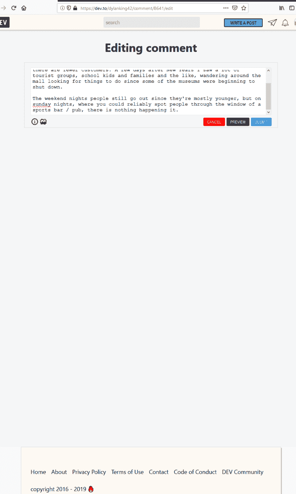
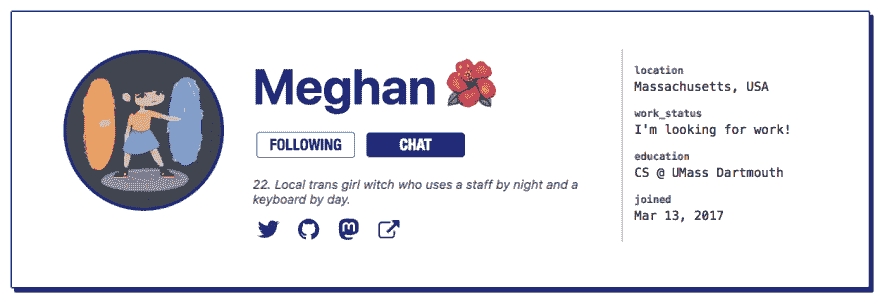

# 开发人员对上周的回购进行总结

> 原文：<https://dev.to/devteam/devto-repo-recap-from-the-past-week-8e7>

嘿嘿嘿！欢迎回到另一个回购回顾，我们涵盖了上周对这个应用程序的回购和[iOS 回购](https://github.com/thepracticaldev/dev-ios)的贡献[。这一期涵盖 1 月 13 日至 1 月 19 日。](https://github.com/thepracticaldev/dev.to)

# 特性

*   感谢[@韵](https://dev.to/rhymes)，你现在可以导出你的评论数据了！查看变更日志和公关的所有细节。谢谢，[@韵](https://dev.to/rhymes)！

    *   [链接到 PR](https://github.com/thepracticaldev/dev.to/pull/1471)[](/rhymes) [## Changelog:导出注释

        T12】押韵 191 年 1 月 16 日读【meta】【changelog】](/rhymes/changelog-export-comments-56mf)
*   [@link2twenty](https://dev.to/link2twenty) 写了一个 JSFiddle 液体标签，把 JSFiddle 嵌入到你的帖子或者评论里！谢谢安德鲁。

    *   [Link to PR](https://github.com/thepracticaldev/dev.to/pull/1509)[](/link2twenty) [## Change log: JSFiddle liquid label is now online

        ### Andrew Bone read

        # meta # changelog](/link2twenty/changelog-jsfiddle-liquid-tags-now-live-1d1b)for 191 minutes on January 17th
*   我们已经删除了错误页面上的错误报告表单。如果您遇到错误，我们鼓励您[创建一个 GitHub 问题](https://github.com/thepracticaldev/dev.to/issues/new?template=bug_report.md)！公关由[@杰斯](https://dev.to/jess):

    *   [链接到 PR](https://github.com/thepracticaldev/dev.to/pull/1565)
*   如果你错过了，我们现在有文章阅读时间！最后一推是 [@ben](https://dev.to/ben) 做的。查看 PR 和 changelog 帖子了解更多详细信息:

    *   [Link to PR](https://github.com/thepracticaldev/dev.to/pull/1538)[](/devteam) [## Change log: now it shows the reading time

        ### Ben Halpern of the development team read

        # changelog # meta](/devteam/changelog-reading-time-now-displayed-16o0)on January 14, 2019.

# Bug 修复/其他贡献

*   @nsebhastian 在我们的自述文件中增加了“维护你的叉子”一节。谢谢你内森。

    *   [链接到 PR](https://github.com/thepracticaldev/dev.to/pull/742)
*   我修正了一些通知请求规范。欣然接受反馈，即使它被合并了。😄

    *   [链接到 PR](https://github.com/thepracticaldev/dev.to/pull/1450)
*   @jess 对我们的内部工具做了一些改进。以下 PRs:

    *   [更新不匹配导师查询](https://github.com/thepracticaldev/dev.to/pull/1521)
    *   [更新 twitter 验证和内部/文章查询](https://github.com/thepracticaldev/dev.to/pull/1571)
*   [@ bogdaamn](https://dev.to/BogDAAAMN)更新了安装文档。谢谢，波格丹一世！

    *   [链接到 PR](https://github.com/thepracticaldev/dev.to/pull/1525)
*   [@lightalloy](https://dev.to/lightalloy) 重构了旧用户名或组织 slug 的重定向。很高兴地说，通过看变化，我学到了一些东西。谢谢安娜。

    *   [链接到 PR](https://github.com/thepracticaldev/dev.to/pull/1527)
*   @lightalloy 也修复了 Rubocop(一个 Ruby linter)警告的几个问题。再次感谢你，安娜！

    *   [链接到 PR](https://github.com/thepracticaldev/dev.to/pull/1528)
*   [@maestromac](https://dev.to/maestromac) 重构了我们的 RSS 阅读器，应该更容易维护:

    *   [链接到 PR](https://github.com/thepracticaldev/dev.to/pull/1537)
*   [@ben](https://dev.to/ben) 做了几个 RSS 改进——PRs 如下:

    *   [修复获取 RSS 文章的 feed _ fetched _ at](https://github.com/thepracticaldev/dev.to/pull/1555)
    *   [在 rss 获取中按标题或源 URL 查找](https://github.com/thepracticaldev/dev.to/pull/1560)
    *   [改善饲料，增加更多的随机性](https://github.com/thepracticaldev/dev.to/pull/1570)
*   [@rhymes](https://dev.to/rhymes) 对 ActiveRecord 查询做了一个小的重构，用`.find_each`替换了`.each`。谢谢，[@韵](https://dev.to/rhymes)！

    *   [链接到 PR](https://github.com/thepracticaldev/dev.to/pull/1557)
*   [@jess](https://dev.to/jess) 写了一个无效验证码的测试:

    *   [链接到 PR](https://github.com/thepracticaldev/dev.to/pull/1569)
*   [@davefollett](https://dev.to/davefollett) 用 CodePen 标签修复了一个漏洞。谢谢，戴夫！

    *   [链接到 PR](https://github.com/thepracticaldev/dev.to/pull/1578)
*   [@38elements](https://dev.to/38elements) 移除了一个不必要的 CSS 属性。谢谢， [@38elements](https://dev.to/38elements) ！

    *   [链接到 PR](https://github.com/thepracticaldev/dev.to/pull/1581)
*   [@韵脚](https://dev.to/rhymes)做了一些“超级小的查询优化。”再次感谢，[@韵](https://dev.to/rhymes)！

    *   [链接到 PR](https://github.com/thepracticaldev/dev.to/pull/1586)

而在 iOS 回购中...

*   [@StriderHND](https://dev.to/StriderHND) 修正了导航颜色边框。谢谢你，埃里克！
    - [链接到公关](https://github.com/thepracticaldev/DEV-ios/pull/123)

*   [@StriderHND](https://dev.to/StriderHND) 也按照`Reachability`指令推荐更新了`NotificationCenter`观察者:
    - [链接到 PR](https://github.com/thepracticaldev/DEV-ios/pull/121)

# 新问题/讨论

*   [@avocadoras](https://dev.to/avocadoras) 写帖子时请求支持 Org 模式语法。谢谢@avocadoras！

    # [ 新增组织模式语法支持 #1526](https://github.com/thepracticaldev/dev.to/issues/1526) 

    [](https://github.com/avocadoras) **[avocadoras](https://github.com/avocadoras)** posted on [<time datetime="2019-01-13T20:05:33Z">Jan 13, 2019</time>](https://github.com/thepracticaldev/dev.to/issues/1526)

    我习惯使用 Org 模式语法来编写文本。目前编辑帖子的方式只有 Markdown。我喜欢有一个帮助按钮，因为我不知道 markdown 的许多语法。

    所以，我想在撰写新帖子时添加 Org 模式语法作为编辑文本的选项。Github 目前支持该功能，可以渲染 Org 模式文本。这个特性对于我们这些习惯了 Org 模式语法的人来说非常有帮助。

    [View on GitHub](https://github.com/thepracticaldev/dev.to/issues/1526)
*   [@tiagomagalhaes](https://dev.to/tiagomagalhaes) 请求了一个 Reddit 液体标签。谢谢， [@tiagomagalhaes](https://dev.to/tiagomagalhaes) ！

    # [  Reddit 液态标签 #1536](https://github.com/thepracticaldev/dev.to/issues/1536) 

    [](https://github.com/tiagomsmagalhaes) **[tiagomsmagalhaes](https://github.com/tiagomsmagalhaes)** posted on [<time datetime="2019-01-14T15:02:55Z">Jan 14, 2019</time>](https://github.com/thepracticaldev/dev.to/issues/1536)

    **描述你想要的解决方案**最好有一个液体标签来整合 reddit 提交的内容

    **描述你考虑过的替代方案**我没有深入研究过，但发现 Reddit 有嵌入机制(oEmbed？)

    一个也许有用的关于 Reddit 嵌入的 GH wiki 页面。

    [View on GitHub](https://github.com/thepracticaldev/dev.to/issues/1536)
*   @michaeltharrington 写了一个关于允许他人编辑文章的详细问题，以及对你的帖子的版本控制的其他想法。这是一个有趣的想法，所以看看下面:

    # [ “允许编辑我的文章”的个人资料复选框+在 VC 上沉思文章 #1539](https://github.com/thepracticaldev/dev.to/issues/1539) 

    [](https://github.com/michael-tharrington) **[michael-tharrington](https://github.com/michael-tharrington)** posted on [<time datetime="2019-01-14T19:57:42Z">Jan 14, 2019</time>](https://github.com/thepracticaldev/dev.to/issues/1539)

    **您的功能请求是否与某个问题相关？请描述一下。**不完全是。随着 DEV 的发展，我们应该不断地想办法为贡献者和读者改进平台。通过提供有效的方法来清理网站上的语法，我们使 dev.to 上的文章更容易阅读，并帮助提高帖子作者的写作水平。

    **描述您想要的解决方案**在短期内，我们应该为用户提供在他们的个人资料中勾选“允许编辑我的文章”的功能，该功能将显示在此人的个人资料中，仅供管理员查看。管理员已经可以编辑文章了，但这只是作家说这很酷的一种方式。

    从长远来看，我认为如果我们可以通过为作者和他们的作品创建一种版本控制系统，向社区开放编辑文章的能力，这将是有益的。通过这种方式，任何用户都可以制作 PR 来修复打字错误/不稳定的句子结构等。在另一个用户的帖子中。(也许，我们只想让互相追随的人这样做。)然后，作者可以查看对其作品所做的编辑，并可能同意或不同意它们。这很好，因为我们可以将一些工作集中起来，这将使系统更具可伸缩性。基本上，我在想象一个系统，它会突出显示编辑要做的任何更改，然后询问作者是否同意合并它们。

    **描述你考虑过的替代方案**就编辑工作而言，只要有人拥有管理权限，他们就能够编辑内容。例如，我有管理员权限，我考虑过通过电子邮件联系作者，问他们我是否可以从语法上纠正他们作品中的一些东西。我还没有真正做到这一点，因为它似乎太多的开销。不可否认，我曾经跳过几次帖子，只是为了清理一些我认为安全的明显错误。

    我也知道有些人要求导师帮助他们写作。这是帮助需要语法帮助的作者的另一条潜在途径。

    **附加上下文**这是我认为“允许编辑我的文章”复选框可能出现的截图:

    [https://cl . ly/053 b 8 bb 7 D5 BD/Image % 202019-01-14% 20at % 202 . 31 . 17% 20pm . png](https://cl.ly/053b8bb7d5bd/Image%202019-01-14%20at%202.31.17%20PM.png)

    ...但是，我完全接受其他想法！

    [View on GitHub](https://github.com/thepracticaldev/dev.to/issues/1539)
*   我们目前有一些 bug 是由我们的 bug 监控服务 Airbrake 报告的。这是一个运行时错误，应该是可以修复的。下面来看看:

    # [ 【空气制动】【生产】CloudinaryHelper 的未定义方法“cl_image_path”:模块 #1541](https://github.com/thepracticaldev/dev.to/issues/1541) 

    [](https://github.com/benhalpern) **[benhalpern](https://github.com/benhalpern)** posted on [<time datetime="2019-01-14T23:07:07Z">Jan 14, 2019</time>](https://github.com/thepracticaldev/dev.to/issues/1541)

    **空气制动错误:** [#9865](https://herokuapp45527522herokucom.airbrake.io/projects/128402/groups/2385107412745529865) **空气制动项目:**实际制动

    **错误类型:** `ActionView::Template::Error` **错误消息:** `undefined method `cl_image_path' for CloudinaryHelper:Module` **其中:** `additional_content_boxes#index` **发生时间:**2019 年 1 月 14 日 22:49:47 UTC **首次出现时间:**2019 年 1 月 04 日 19:42:39 UTC **发生次数:** 8086 (174 自 2019 年 1 月 14 日 21:19:19 最后一次部署后

    **网址:【http://dev.to/additional_content_boxes?】[T2article _ id = 69382% 2c 578&signature = 15475](http://dev.to/additional_content_boxes?article_id=69382%2C578&signature=15475)**File:**`/PROJECT_ROOT/app/views/additional_content_boxes/_article_followable_area.html.erb`**

    **回溯:**

    ```
    /PROJECT_ROOT/app/views/additional_content_boxes/_article_followable_area.html.erb:4:in _app_views_additional_content_boxes__article_followable_area_html_erb__1416202628230001255_70357272411600
    /GEM_ROOT/gems/actionview-5.1.6.1/lib/action_view/template.rb:157:in block in render
    /GEM_ROOT/gems/activesupport-5.1.6.1/lib/active_support/notifications.rb:168:in instrument
    /GEM_ROOT/gems/actionview-5.1.6.1/lib/action_view/template.rb:352:in instrument_render_template
    ...
    Caused by NoMethodError: undefined method `cl_image_path' for CloudinaryHelper:Module 
    ```

    [View on GitHub](https://github.com/thepracticaldev/dev.to/issues/1541)
*   [@dylan](https://dev.to/dylan) 报告了编辑评论框不能正常调整大小的问题。谢谢迪伦。

    # [ 编辑评论框不调整大小 #1554](https://github.com/thepracticaldev/dev.to/issues/1554) 

    [](https://github.com/dylanking42) **[dylanking42](https://github.com/dylanking42)** posted on [<time datetime="2019-01-15T16:36:04Z">Jan 15, 2019</time>](https://github.com/thepracticaldev/dev.to/issues/1554)

    浏览器扩展被禁用。

    **描述 bug** 我相信在 URL:【https://dev.to/**username**/comment/**commentID**/edit T2】可用的编辑评论功能不允许我调整编辑评论框的大小来显示多行评论。

    **重现**重现行为的步骤:

    1.  写一个多行评论，然后发布。
    2.  点击“编辑评论”
    3.  该页面看起来并不像我认为的那样。

    **预期行为**我希望编辑评论功能允许我调整窗口大小，或者至少扩展编辑评论窗口文本区域框以填充页面。类似的行为在#47 中被提及，这让我相信这是一个错误。

    **截图**如果适用，添加截图来帮助解释您的问题。请注意页脚和文本注释编辑框之间的巨大间隙。

    [](https://user-images.githubusercontent.com/15676450/51194412-01386400-18b9-11e9-8324-62d2442b3748.PNG)

    [](https://user-images.githubusercontent.com/15676450/51194755-b3702b80-18b9-11e9-98c5-6e449ec6aa02.PNG)

    **桌面(请填写以下信息):**

    *   操作系统:[例如 iOS] Windows 版本 10.0.16299 内部版本 16299
    *   浏览器[如 chrome，safari] FF 64.0 32 位// IE 11.0.101

    **智能手机(请填写以下信息):**不适用

    **附加上下文**

    这在垂直和水平监视器方向上都进行了测试。默认情况下，文本编辑窗口仍然很小。

    ```
    </div>
    <div class="gh-btn-container"><a class="gh-btn" href="https://github.com/thepracticaldev/dev.to/issues/1554">View on GitHub</a></div> 
    ```

    Enter fullscreen mode Exit fullscreen mode

*   [@nickytonline](https://dev.to/nickytonline) 请求了用户资料的一项功能。当访问共同关注者时，有一个 CTA 可供您与他们开始新的连接对话。谢谢尼克。

    # [ 作为 dev.to 社区的用户，我希望在我关注的人的个人资料上看到行动号召，以便与他们开始/继续对话。 #1567](https://github.com/thepracticaldev/dev.to/issues/1567) 

    [](https://github.com/nickytonline) **[nickytonline](https://github.com/nickytonline)** posted on [<time datetime="2019-01-16T03:30:14Z">Jan 16, 2019</time>](https://github.com/thepracticaldev/dev.to/issues/1567)

    **您的功能请求是否与某个问题相关？请描述一下。**作为 dev.to 社区的用户，我希望在我关注的人的个人资料上看到行动号召，以便与他们开始/继续对话。

    **描述你想要的解决方案**这样做的动机是，如果你关注某人，并且碰巧在他的个人资料上，你就可以很快与他开始对话。此外，拥有很多追随者的人目前无法在 dev connect 中轻松找到用户。

    为了补充这个故事，考虑一下 dev connect 页面上的一个查找字段，这样用户就可以快速过滤他们要找的人。此外，如图所示，我将“关注”按钮设置为不如“聊天”按钮突出的动作。另外，我不确定“聊天”这个词

    **描述你考虑过的替代方案**不适用

    **附加上下文**在此添加关于功能请求的任何其他上下文或截图。

    [](https://user-images.githubusercontent.com/833231/51224559-843ad800-1914-11e9-8d76-d0f655cfcc6a.png)

    [View on GitHub](https://github.com/thepracticaldev/dev.to/issues/1567)

*   [@damian](https://dev.to/damian) 报告了一个评论在 Edge 中重叠的 bug。谢谢达米安。

    # [ 评论重叠在边缘 #1593](https://github.com/thepracticaldev/dev.to/issues/1593) 

    [](https://github.com/kingdamian42) **[kingdamian42](https://github.com/kingdamian42)** posted on [<time datetime="2019-01-18T20:04:58Z">Jan 18, 2019</time>](https://github.com/thepracticaldev/dev.to/issues/1593)

    **描述 bug** 使用 Edge 时，一些注释呈现为相互重叠

    **重现**重现行为的步骤:

    1.  到 Edge 中的[https://dev . to/ilonacodes/frontend-developers-do-you-want-to-transition-to-full stack-why-44b 9](https://dev.to/ilonacodes/frontend-developers-do-you-want-to-transition-to-fullstack-why-44b9)
    2.  向下滚动到“史云光”评论下的第一个孩子评论。
    3.  参见错误

    **预期行为**使用 Edge 时，注释不应重叠。

    **截图**问题举例:【https://imgur.com/a/IW3sbEG】T2

    **桌面(请填写以下信息):**

    *   操作系统:Windows 10
    *   浏览器:边缘
    *   版本:Microsoft Edge 42.17134.1.0

    [View on GitHub](https://github.com/thepracticaldev/dev.to/issues/1593)

这星期到此为止！感谢阅读。:)