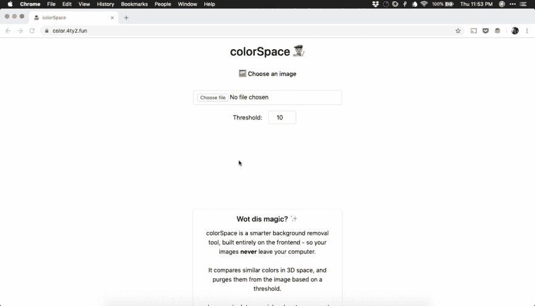
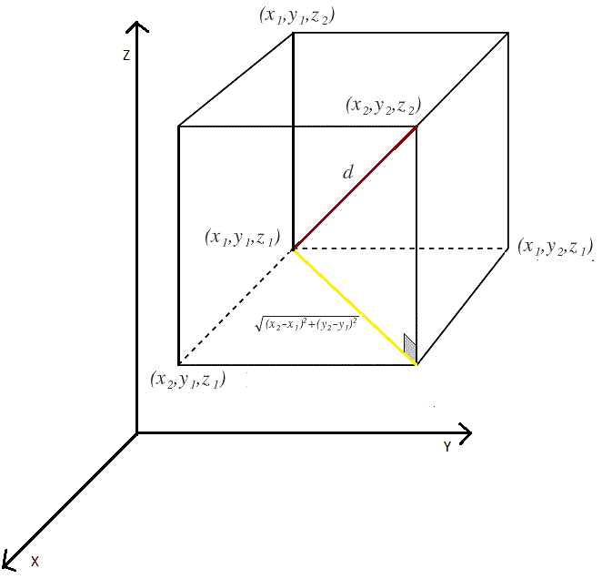
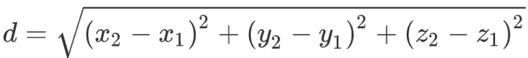
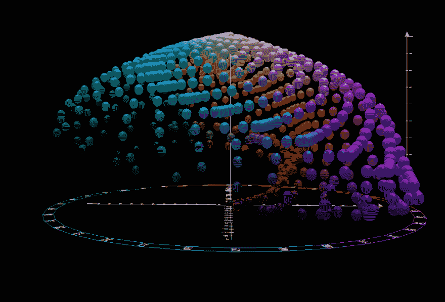
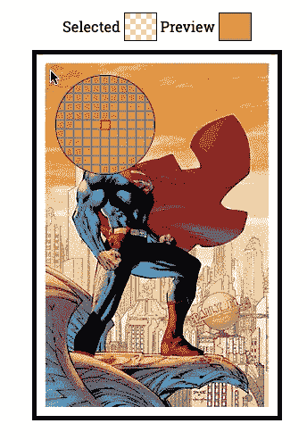

# 显示开发:色彩空间-智能背景消除与画布🖼️

> 原文：<https://dev.to/jajoosam/show-dev-colorspace---smart-background-removal-with-canvas--56cc>

嘿你们这些开发者！

就在几周前，我在几个小时内构建了[色彩空间](https://color.4ty2.fun?ref=dev)——这是一个我想探索的有趣想法，甚至不确定这是否可能！

结果证明这是可能的，而且实际上甚至是准确的！

我的想法非常简单——通常，有背景的图像需要去掉一种主色。由于阴影和光照角度的原因——这种颜色不会在所有像素上保持完全相同，但也许有可能以某种方式测量颜色的相似性🤔

我谷歌了一下——看到一些堆栈溢出的帖子问了同样的问题，并了解到获得颜色之间的欧几里得距离是相当琐碎的，因为它们通常用三轴系统来表示，例如`R, G, B``H, S, L`
`Y, I, Q`——这里还有更多列出的

这意味着我们可以使用距离公式，在`x`、`y`和`z`、*轴*上用一个坐标代表一种颜色(我不得不谷歌一下`axis plural`😂)

<figure>

<figcaption>From [Brilliant](https://brilliant.org/wiki/3d-coordinate-geometry-distance)</figcaption>

</figure>

它归结为将平方差相加，并求其平方根，即:

用 RGB 颜色做到这一点非常简单——但是 RGB 颜色空间的设计并没有考虑到`ΔE`或距离函数。这意味着 RGB 空间中颜色之间的欧几里德距离不会总是对应于我们人类看到的颜色之间的差异。

但是我还没有放弃😅原来 [CIE](https://en.wikipedia.org/wiki/International_Commission_on_Illumination) (色彩世界的 W3C)设计了 [L*a*b](https://en.wikipedia.org/wiki/CIELAB_color_space) 色彩空间，与人类的色彩视觉在感知上是一致的——这意味着，一个准确而有用的`ΔE`函数🚀

<figure>

<figcaption>This is what the L*a*b colorspace looks like from the front</figcaption>

</figure>

从这里开始，它只是 JS 的一个即插即用的小东西！我重用了来自 [Santafy](https://santa.4ty2.fun) 的前端——我构建的一个有趣的圣诞项目🎅

我找到了 [rgb-lab](https://github.com/antimatter15/rgb-lab) 库，它可以让我在 rgb 和 lab 之间来回转换。我也可以在这个库中使用`ΔE`函数！

[颜色采样器](https://github.com/emn178/color-sampler)库需要我将 jquery 添加到项目中，但是我没有抱怨——它工作得非常好，并且有一个很好的颜色选择 UI👇

总结一下我写的代码——它从访问者那里获取图像，并将其加载到画布中。从那里，使用颜色采样器选择一个像素——画布中的所有像素都被转换到`L*a*b`颜色空间，并与使用`ΔE`函数选择的像素进行比较——如果任何像素的颜色落在阈值范围内，则其透明度被设置为 100%

所有发生在画布上的*和*，完全在前端！

如果你还没有，你可以试试这里的！

代码是完全开源的，你可以检查它，并立即在这个 [repl](https://repl.it/@jajoosam/colorspace) 上分叉它👨‍💻

[https://repl.it/@jajoosam/colorspace?lite=true](https://repl.it/@jajoosam/colorspace?lite=true)

就这样——我很想听听你的想法和反馈😄

*我是一个 15 岁的制造商*👨‍💻*要想做更多酷的事情并了解我的进展，请注册[我的简讯](https://buttondown.email/jajoosam)T5】📧*