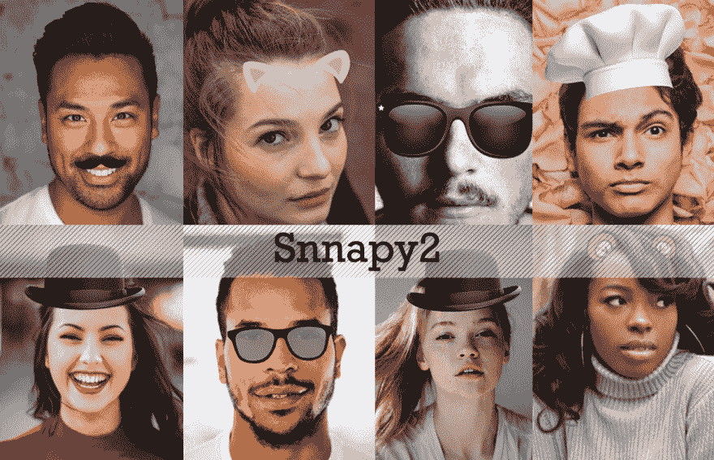

# 检测照片中的人脸并绘制叠加滤镜

> 原文：<https://dev.to/barqawiz/detect-faces-in-photos-and-draw-overlay-filters-2j4j>

检测照片中的人脸并在其上绘制叠加图像，叠加图像是使用检测人脸关键点的神经网络绘制的。

*   画眼镜
*   画胡子
*   画帽子
*   画耳朵
*   绘制任何覆盖图
*   绘制文本

去试试吧:[http://ahmadai.com/snappy2/](http://ahmadai.com/snappy2/)

注:代码与爱一起开源