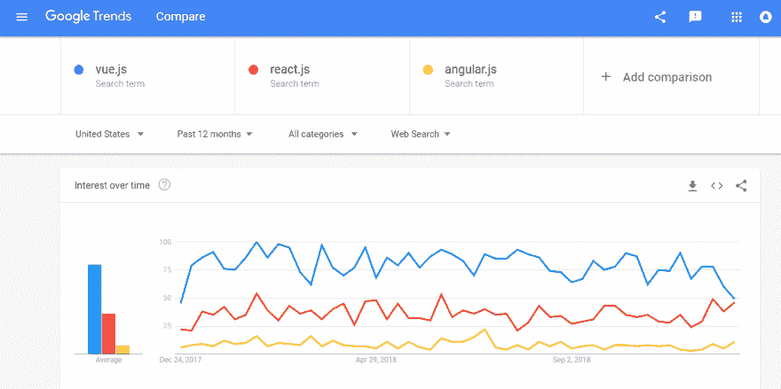

# ReactJS 在 2019 年会继续称霸吗？

> 原文：<https://dev.to/lambdatest/will-reactjs-continue-to-dominate-in-2019--22kf>

根据 Javascript 的 [State 进行的 2018 年调查，React JS 已经超过 Angular 和其他人成为最受欢迎的 UI 框架。ReactJS 的流行让我们许多人想知道它是否会成为 2019 年最主导的框架。该框架由脸书开发和维护，被 PayTM、Fiverr、Instagram、IMDB 和许多其他流行组织广泛使用。让我们讨论一下 React JS 的好处是什么，以及它作为 javascript 框架如此受欢迎的原因。](https://2018.stateofjs.com/front-end-frameworks/overview/)

### 那么，ReactJS 是什么？

社交媒体巨头脸书在 2013 年向全世界推出了 React JS。它是一个开源的 JavaScript 框架，目的是创建一个引人入胜的丰富的 web 应用程序，用最少的代码就能高效运行。早期，Angular JS 被认为是开发单页面 web 应用程序的最首选选项，但随着 React 的引入，开发人员发现新开发的网页呈现速度更快了，React 专注于各个组件的功能。除了覆盖大量使用[测试用例](https://www.lambdatest.com/blog/17-lessons-i-learned-for-writing-effective-test-cases/)的灵活性，ReactJS 到 2019 年拥有一个庞大的教程库和一个大型开发人员社区，他们可以为新的和有经验的开发人员所面临的问题提供解决方案。

### 它真的让项目处理变得更简单了吗？

开发人员总是喜欢一个框架，它分解困难和复杂的组件，并通过创建可重用的代码来更快地完成项目。像 [AngularJS](https://www.lambdatest.com/blog/top-13-mistakes-committed-by-angular-javascript-developers/) 或 EmberJS 这样的传统 JS 框架需要开发人员编写大量代码来创建模块或组件。

React JS 在 2019 年受欢迎的主要原因是它不需要开发者做任何额外的努力或返工。凭借其提供的灵活性和健壮性，开发人员可以轻松地更快地构建复杂的模块，并在其他模块中重用所需的代码，从而确保更快的应用程序，可以在不同的浏览器中轻松呈现，只需很少的加载时间。对于热衷于跨浏览器兼容性的开发者来说，这是一个完美的选择。

### 2019 年用 React JS 做更少的工作，成就更多

简报结束了，我们来详细了解一下为什么 React JS 在 2019 年应该是你开发[单页应用](https://www.lambdatest.com/blog/6-questions-to-ask-before-developing-a-single-page-website/)的首选。

*   **JSX 让组件编写更容易:**虽然这个扩展的使用是可选的，但是一旦使用，组件编写就变得容易多了。在构建定制组件时，它接受 HTML 引用，并可以轻松地将 HTML 模型转换为 React 树。
*   可重用资产提高生产力:可重用性是设计师们众所周知的一个方面，它可以节省大量的返工。React JS 在 2019 年的一个主要好处是，不仅按钮或复选框这样的精细组件，甚至复杂的系统组件也可以重用，而不用担心一个功能影响另一个。
*   **渲染变得更快:**在构建一个复杂的应用程序时，重要的是要考虑在线渲染时，结构会如何影响应用程序的性能。React JS 有一个虚拟 DOM，可以让繁重的应用程序加载得更快。
*   **代码保持稳定:**React JS 中只使用向下的数据流，这确保了即使子元素中非常微小的变化也不会影响父元素。只有在开发人员更改了对象、修改了状态并更改了代码之后，特定的组件才会被更新。
*   **SEO 友好度:**通常情况下，含有大量 JavaScript 的应用程序无法被搜索引擎读取，从而导致排名较低。2019 年基于 React JS 的应用，运行在服务器上，将虚拟 DOM 作为常规网页返回给浏览器，从而处理搜索引擎失效的问题。
*   使工作变得更容易的一套工具: React JS 到 2019 年将会以浏览器扩展的形式提供一些设计和调试工具，这些工具可以在 Chrome 和 Firefox 上使用。这些工具使开发人员能够发现父组件和子组件，允许开发人员观察不同组件之间的层次结构，并检查它们的状态和属性。
*   **适应[移动优先的方法](https://www.lambdatest.com/blog/how-to-test-a-mobile-website-using-lambdatest/) :** React 在移动和 web 开发中遵循相同的模式。只需简单的 JavaScript 和 React，开发人员就可以轻松构建响应迅速且跨浏览器兼容的富移动应用程序。

### 2019 年 ReactJS 不喜欢的方面

*   快速变化和经常中断:React JS 的环境经常变化，迫使开发人员学习新的工作方法，而这些方法他们早些时候就已经学会了。保持更新有点令人沮丧，因为 React 正在以相当快的速度发展。
*   糟糕的文档:无论技术发展得多快，指南和文档都是如此。开发人员在集成过程中面临相当大的麻烦，被迫编写自己的指南和文档。
*   **SEO 的麻烦:**需要进行额外的测试，以确保代码可被搜索引擎读取，从而提高应用程序在搜索引擎中的排名。学习 SEO 加起来就是花在开发上的功夫。
*   **小封装生态系统:**由于 2019 年的 React JS 还是一个新兴技术，背后工作的生态系统非常小，尤其是如果你是和 [angular](https://www.lambdatest.com/blog/angularjs-a-developers-first-choice/) 比较的话。在开源贡献中，你可能经常找不到你需要的东西。

如果你正在考虑开发一个单页面的应用程序，那么 React 是一个值得关注的框架。它被全球数千家公司用于其网站、应用程序和内部项目。

像沃尔玛，特斯拉，Airbnb 这样的组织已经使用 React 来开发他们的网站和本地移动应用程序。不仅如此，拥有超过 6 亿用户的百度移动显示了 React JS 的优势，使一个应用程序可以处理大量的互联网流量。2019 年的 React JS 可能会继续保持其作为首选 JavaScript 框架的地位。

但是，和其他所有 JS 框架一样，React JS 的使用量也会下降。与 2017 年相比，2018 年 React JS 的使用量逐渐下降。与 React JS 相比，Vue JS 似乎增长更快。它已经超过了 Angular，并可能在 2019 年超过 React JS 的水平。
[T3】](https://res.cloudinary.com/practicaldev/image/fetch/s--6XMFrRNj--/c_limit%2Cf_auto%2Cfl_progressive%2Cq_auto%2Cw_880/https://www.lambdatest.com/blog/wp-content/uploads/2018/12/pasted-image-0-6.png)

我们不能忽视 React 现在和未来一年提供的巨大优势和学习机会。

总结利弊，React JS 可以用 3 个字来形容——先进、反应灵敏、无风险。它巧妙地解决了构建具有动态数据变化的大规模应用程序的挑战。通过为开发人员提供虚拟 DOM 和开发工具，使用 React 可以更快地开发单页面应用程序。这些因素使其成为企业以及 2019 年[初创公司](https://www.lambdatest.com/for-startups)的完美选择。

原文来源: [LambdaTest 博客](https://www.lambdatest.com/blog/will-reactjs-continue-to-dominate-in-2019/)