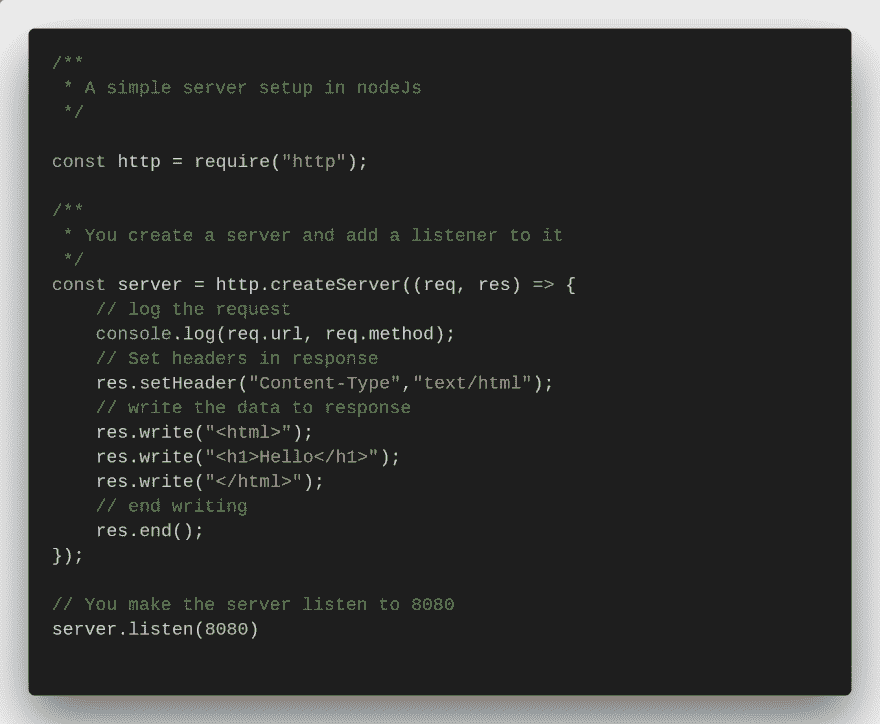
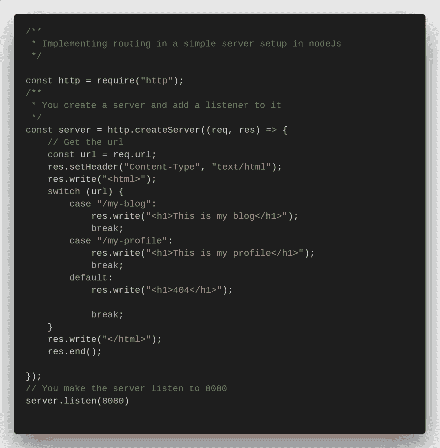
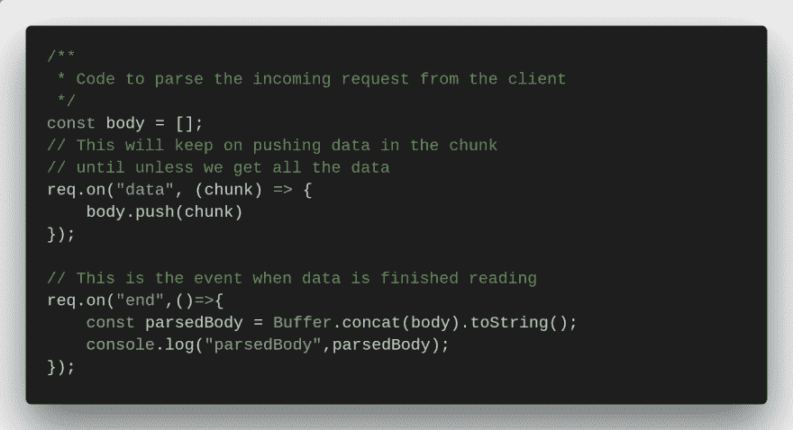

# 基本节点服务器的东西

> 原文：<https://dev.to/iamsourabhh/basic-node-server-stuff-2bg9>

如果你一直想着 2019 年开始 NodeJs。这里有一些很酷的代码片段，可以给你 kickstart，让你知道，这是多么容易。

1)简单的服务器设置

2)在简单的服务器设置中实现路由

3)代码解析从客户端
 传入的请求体

我希望这些代码片段可能对您有所帮助。这是我的第一篇博文，欢迎对其他文章的任何反馈或想法！