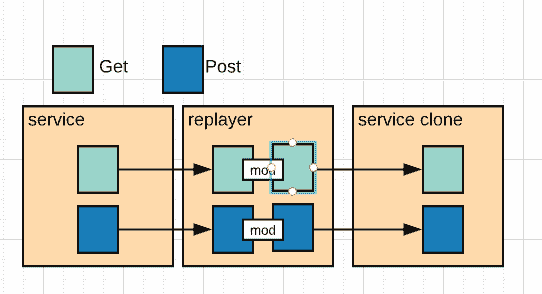
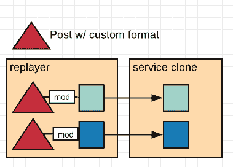
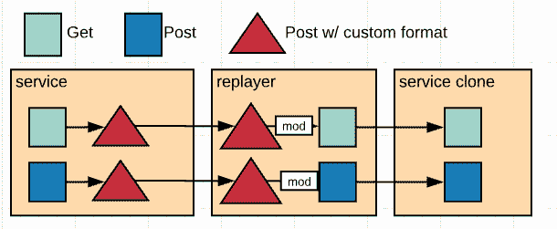
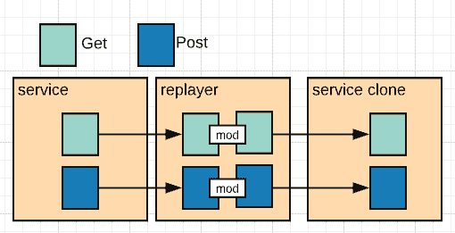
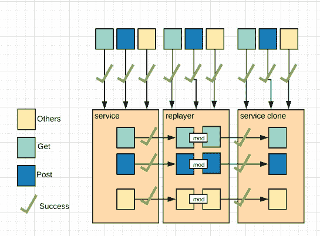
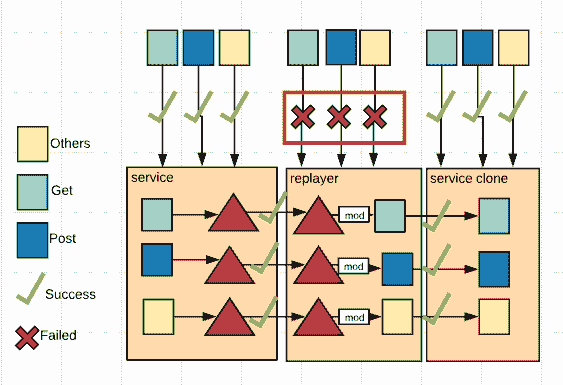

# 数据突变的示例以及避免数据突变的原因

> 原文：<https://dev.to/dechamp/example-of-data-mutation-and-why-to-avoid-it-4ogj>

## TL；速度三角形定位法(dead reckoning)

如果不需要，避免改变数据。关于为什么突变是不好的，这是一个很长的故事。如果你不关心我们如何讨论数据突变以及如何在我们的特定任务中避免数据突变，请跳到下面。

旁注:对于那些患有强迫症的人，很抱歉，这些图像创建得很快，所以我没有把它们对齐😬

## 任务

因此，我们目前的任务是分离出一个高度使用的服务，并转移到 AWS 以实现高可用性。还要瞄准任何可能的问题并消除任何单点故障。同时确保我们充分测试了功能，并在出现任何问题时有一个适当的回滚计划。

## 回滚计划

我们用于回滚的方法之一是通过[黑暗启动](https://launchdarkly.com/)进行功能翻转。这使我们能够在许多不同的庄园中慢慢推出新功能，并关闭失败/损坏的功能。它有助于我们避免担心部署会破坏某些东西的代码，以及不得不回滚所有其他代码。

我们每周发布一次，有很多开发人员，所以回滚意味着每个人的代码都会回滚，只有一部分可能会出错。

有了特性翻转，我们可以只翻转他们损坏的代码，然后在下一个版本中进行修复。

不幸的是，这种做法会带来一些倒退。

并不是我们所有的系统都使用黑暗启动和回退到基于配置的功能翻转。

最重要的是，即使对那些功能翻转使用了适当的弃用做法，您也可能遇到深度嵌套功能翻转的情况。

或者，由于风险太大，我们不能使用功能翻转，我们不能简单地进行回滚，因为有许多系统需要进行更改，这意味着我们要么全有，要么全无。

## 没有回滚选项，那么该怎么办？

所以我们意识到，我们不能安全地使用 flip 移动服务，因为有太多的移动部件。最重要的是，由于将与该服务通信的系统数量庞大，我们需要一次性完成。

那么，我们如何确保我们可以信任迁移到新系统？它将按预期处理负载。我们已经测试了当前系统能测试的所有场景？

## 讨论

正如我们在这里一直做的那样，是时候进行一些严肃的设计讨论和规划了。我们需要创建一个系统，让我们能够全面测试我们当前的流量以及其他压力测试。

出于公司隐私的考虑，我将限制设计细节，并回到我最初想表达的观点。

我们想出了一个计划，复制整个交通流量，记录信息，然后在新系统上同时重放，然后比较结果。

## 设计

我们基本上有**现有服**、**重玩服**和**系统克隆**。

不要担心，我们有更好的名字，但现在为了讨论，我保持简单。

基本上想法如下，我们有我们不同的 http 请求[GET，POST，PUT，DELETE，...]这打击了原来的服务。我们使用一个事件监听器将这些消息回复给**播放器服务**，播放器服务将记录这些数据，然后重放给克隆服务。

我们将从服务克隆中取回响应，并记录原始调用和来自克隆的响应，以便进行比较。我们还能够在将请求发送到克隆之前对其进行修改(比如删除，我们需要知道哪些会话匹配)。

## 设计一个

所以我们有两个设计放在桌子上给玩家。第一个是非常标准的设计。您有需要发送到服务的数据，所以您将它包装在一个 var 中并作为 post 传递。

因此，如果我们只看克隆的**播放器服务**，它看起来会像这样。

这可能看起来很简单，但有一个陷阱。我们刚刚创建了一项服务，要求您仅通过 post 向其传递数据。

如果我们调用 GET，PUT 等函数呢？这就是你开始看到问题的时候。

我们只是改变了数据，以适应所需的**播放器服务**的结构。有没有另一种方法可以避免数据突变？

## 设计两个

让我们避免改变调用，看看我们是否还能完成同样的目标，将数据从最初的**服务**重放到**播放器服务**，然后再重放到**克隆服务**

通过告诉您的播放器服务接受任何方法，并使用更多的逻辑来设置数据，您不再需要在服务之间改变数据。

## 但是为什么，谁在乎呢？

我愿意。！为什么是当你去测试服务的时候！让我们尽可能简单地解决这个问题。

每次服务时，我们会点卷发或邮差或任何我们想要的东西。每 3 项服务的有效负载完全相同，哪些可以，哪些不行？

使用设计二，我们将首先尝试。

一切看起来不错！我们用不同类型的请求击中了所有三个，并且都通过了。

现在让我们用设计的试试吧！

呀！！这讨厌的红色是怎么回事？等等，所以我们不能在不修改数据的情况下点击播放器来定制 post 请求？吐槽！

## 那又怎样，重赛者是临时的对吗？

当然，现在这是我们的目标，我们会让它消失，然后一切都会好的！

嘿，那么当我们收到来自当前服务的请求，调用**的重新玩家服务**，但是**的克隆服务**失败时，我们该怎么办？我们应该重播这些，对吧？

如果我们只是记录所有的 http 请求，然后让一个自动系统在我们想要的任何时候重放它，那就太棒了。或者稍后重试它们的某种类型的队列。

该死，我们不能！至少不需要告诉那些其他服务如何与**播放器服务**对话。

现在，除非我们坚持使用它的签名，否则我们将无法与**播放器服务**一起工作。

还有那个！这就是我关心的原因。

想法？评论？我错了吗？心中有更好的设计？让我知道！

-说吧