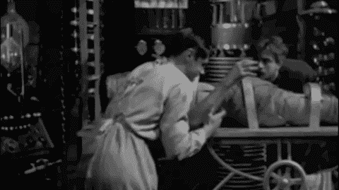

# 它还活着！CodePen 中的简单 CSS 动画

> 原文：<https://dev.to/brettmstevens7/its-alive-simple-css-animations-in-codepen-aa1>

在偶然发现 CodePen 的[狗之后，我觉得尝试制作我们公司吉祥物](https://blog.codepen.io/2018/09/05/the-dogs-of-codepen/)[科迪](https://codepen.io/brettmstevens/pen/bOpPdX)的动画会很有趣。*

无论你是编程新手还是只是对制作动画感兴趣，以下是你如何制作自己的动画。

首先，我使用 [Figma](https://www.figma.com/file/LbODAJHebYmoqvLRyVvEPdjJ/Cody-from-Software-animation?node-id=0%3A1) 将科迪分割成四个部分——头部、身体、左臂和尾巴。这些是我想在我的代码笔中制作动画的部分。

接下来，我将这些分区导出到 SVG，并上传到一个 [URL 编码器](https://yoksel.github.io/url-encoder/)。资产上传是 CodePen 的一个专业功能，但有几种不同的方式[你可以使用数据 URIs 而不是上传资产](https://css-tricks.com/lodge/svg/09-svg-data-uris/)。我使用数据 URI 作为`background-image`属性。

然后我为身体创建了一个父元素`
`,并为尾巴、手臂和头部嵌套了一个子元素`
`。我将父元素的位置设置为`relative`，将每个子元素的位置设置为`absolute`(如果你需要一些关于 CSS 定位的刷新，[这里是一个很好的指南](https://dzone.com/articles/css-position-relative-vs-position-absolute))。

我使用[基于关键帧的语法](https://www.smashingmagazine.com/2011/05/an-introduction-to-css3-keyframe-animations/)来创建一个尾巴摆动，微妙的竖起大拇指的动作，和一个慢慢张开的舌头。

最后但同样重要的是，我制作了一个简单的 Javascript 函数，当您单击 Cody 上的任意位置时，它可以添加和删除类。

[https://codepen.io/brettmstevens/embed/bOpPdX?height=600&default-tab=result&embed-version=2](https://codepen.io/brettmstevens/embed/bOpPdX?height=600&default-tab=result&embed-version=2)

编码快乐！

* *关于 Cody 的更多信息:Cody 是我们的机器人 AI puppy-persona，其任务是帮助开发人员改进他们的工艺。科迪是一只边境牧羊犬，是世界上最聪明的狗之一，由西蒙·奥克斯利(Twitter bird 和 GitHub Octocat 的创造者)创造。*