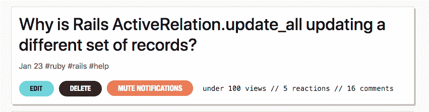
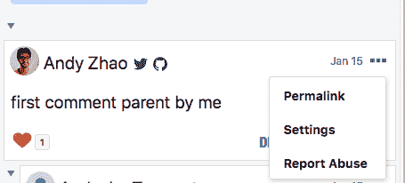
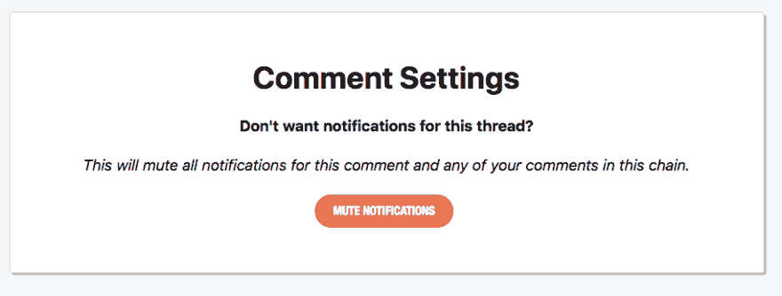

# 新功能:静音通知

> 原文：<https://dev.to/devteam/new-feature-mute-notifications-70m>

你现在可以静音通知你自己的文章和评论！静音通知意味着您不会收到任何关于新评论或反应的网络、电子邮件和推送(仅限 iOS)通知。

要静音通知你的帖子，请转到你的[仪表盘](https://dev.to/dashboard)并点击“静音通知”:

要使您的某个评论的通知静音，请单击评论右上角的下拉菜单按钮，然后访问设置页面(或将`/settings`添加到您的评论的 URL):

屏蔽一条评论将屏蔽同一条链中属于您的所有父评论和子评论。

静音快乐！