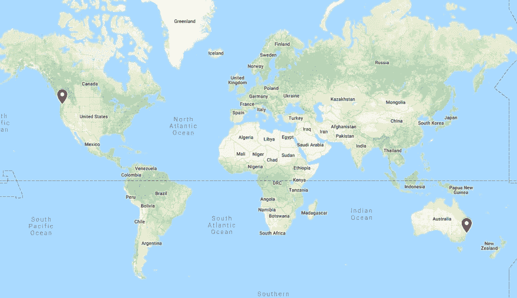

# 远程协作的简单目标框架

> 原文：<https://dev.to/tability/a-simple-goal-framework-to-collaborate-remotely-4n3d>

上周，我在 IndieHackers 上无意中发现了以下问题:[“如果联合创始人生活在不同的国家，有没有可能成立一家初创公司？”](https://www.indiehackers.com/forum/is-it-possible-to-have-a-startup-with-the-co-founders-living-in-different-countries-fa64126ef7)。我们的一个创始人(Bryan)在波特兰，另一个(我)在悉尼，情况就是这样。

 
我在那篇文章中分享了一些技巧，我想在这里进一步阐述。

## 远程问题是大型团队的问题

Bryan 和我都在 Atlassian 工作过，所以我们有几年在大公司工作的经验。当我们开始作为远程二人组工作时，让我感到惊讶的是，我们面临的许多问题与我在一个 20 人团队中担任产品经理时遇到的问题非常相似，我与世界各地的十几个其他小组合作:

*   你不能依靠越肩沟通来澄清事情。
*   你需要建立一个允许人们自主的环境。
*   你需要想办法让每个人都了解情况并参与进来。

你可能会反对这是所有组织的真实情况，但是如果你是一个 5 人团队坐在同一个房间里，你不会真正感到痛苦。在那个阶段，仍然很容易通过站起来大声说话让每个人保持一致，而且你足够小，可以跟踪每个人在做什么。但是，在团队中增加几个人，交流就会开始中断。发生的事情太多了，从噪音中识别信号变得更加困难。

还有另一种方式来体验这种痛苦，即使你保持小。

让你的团队先远程化。就像我们一样。

时区和距离会产生与大型团队相同的沟通问题。TL；DR；我们必须很早就想好如何确保我们的船划向同一个方向。

## 目的>重点>措施(PFM)

我们创建了一个简单的文档，当我们想知道我们应该做什么时，它可以推动我们的努力，并使我们很容易找到答案。它的灵感来自于我们在 Atlassian、 [Salesforce V2MOM](https://sliwinski.com/v2mom/) 和 [OKRs](https://en.wikipedia.org/wiki/OKR) 的混合体验。

这是一个简单的模型，易于理解和快速采用。

### 目的在顶端

文件的第一部分定义了我们公司的宗旨。这应该会持续几年。我们仍在重复我们的使命宣言，但大致是这样的:

> 将团队聚集在一起解决大问题

它应该足够精确，设定一个明确的方向，但又足够宽松，不会扼杀创新。我建议花些时间来弄清楚，因为其他事情都会随之而来。使用 [5 个为什么](https://en.wikipedia.org/wiki/5_Whys)和[要做的工作](http://innovatorstoolkit.com/content/technique-1-jobs-be-done)是一个好的开始，但是如果你像我们一样，你可能会在更好地了解你的客户时重复几次。

### 焦点区域下方

在目的下面，我们列出了未来 12 个月的主要优先事项。现阶段仍然没有度量标准。相反，我们列出了 2-3 个将推动我们今年路线图的重点领域。

在我们的案例中，我们有:

1.  **不要耗尽资金:**我们是一家年轻的创业公司，因此管理现金流至关重要。
2.  陆地团队:我们喜欢个人使用稳定性，但我们主要是为团队打造稳定性。
3.  出色的目标跟踪:我们可以扩展到目标设定，但我们首先要在目标跟踪方面做得更好。

这些重点领域相当大，将有助于选择未来 12 个月的计划。当我们把事情放在 backlog 上时，我们经常会回到这个问题上。对现金流有帮助吗？会让团队变得有粘性吗？它让目标跟踪变得简单而伟大了吗？如果这些问题没有一个肯定答案，那么它可能不是一个很好的选择。

### 措施垫底。

最后，我们为每个重点领域设定了 2-3 个可衡量的目标，以帮助我们跟踪进展。我不会给你我们的确切目标，但整个文件看起来像下面的图片。

好的目标很难定义。人们往往很容易陷入并不真正挑战你的业务的虚荣心衡量标准。衡量标准不是为了让你感觉良好而存在的。他们在这里是为了确保你达到你需要的结果，或者至少帮助你意识到你可能无法用你目前的方法达到目标。

一旦你选择了一组度量标准，只需运行几个场景来再次检查它们是否有助于你了解真相。例如，如果你关注帐户的增长，而不是活跃帐户的增长，如果你看到很多人注册，你很容易产生错误的成就感。但是如果大多数新签约的用户不再使用你的产品，那么你的生意将会很快转入地下。

总的来说，我建议在你的文档中不要有超过 10 个驱动目标，因为你的目标越多，你的努力就越容易被冲淡。在一些事情上产生巨大的影响比在不同的领域有很多小的改进要好。

## 把东西分成四份

现在我们的 PFM 文档已经设置好了，我们可以用它来驱动路线图。在每个季度开始时，我们会考虑如何最大限度地提高每个重点领域的影响力。我们总是对未来 3 个月有一个清晰的看法，以及 3-6 个月的轮廓。除此之外，我们可以参考我们的战略文件来了解我们的优先事项。

这些目标与 PFM 的目标大致相同，但针对本季度进行了调整。

## 测量、学习、调整-重复

这才是真正重要的。创建一个愿景文件，设定一些目标是很酷的。但是真正的价值在于定期跟踪进展。这与每周一次的演示或每周一次的站立会议完全不同，在站立会议上，你可以谈论你一周内做了什么。

我们每周都会更新季度目标的进展情况。这是一个简单的更新，显示红/黄/绿状态以及我们离目标有多远。这有点类似于将持续交付应用于策略，每周提供更新有几个好处:

*   如果我们在某个领域停滞不前，或者出现赤字，它可以帮助我们很快意识到
*   它让我们保持责任感，并缓和一周中发生的噪音。
*   它有助于我们更加灵敏和敏捷。

更重要的是，它有助于我们推动一种注重影响而非任务的文化。

## 采用 PFM

我创建了一个带有 PFM 和目标跟踪模板的谷歌表单，应该足以让你开始。

显然，我们也在构建一个伟大的工具来帮助团队追踪他们的目标。因此，如果你正在寻找比电子表格更好的东西，你应该[注册稳定性](https://tability.io)。它包括自动提醒，一个问责机器人，并使分享更新和可视化进展变得容易。

我总是热衷于向其他团队学习，所以请在评论中分享你自己的方法和反馈，并且你可以随时通过 [Twitter](https://twitter.com/stenpittet) 联系我。

* * *

*本文最初发表于[https://blog . atability . io](https://blog.tability.io/a-simple-goal-framework-to-collaborate-remotely-and-focus-on-impact/)。*