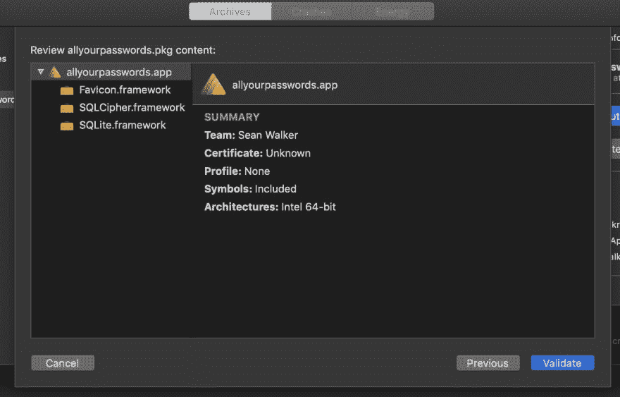
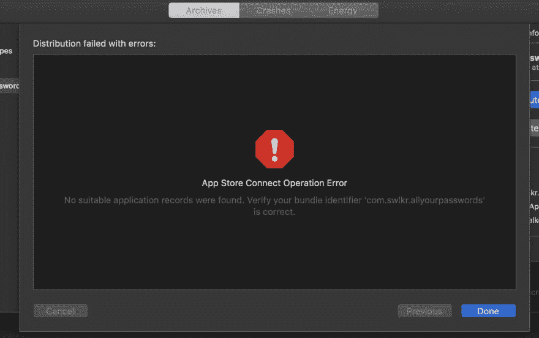
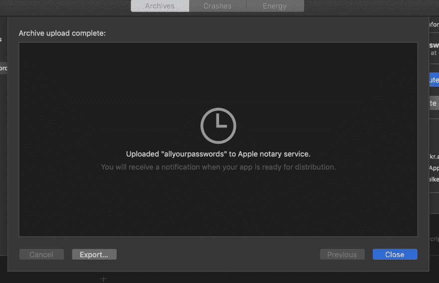
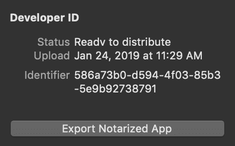
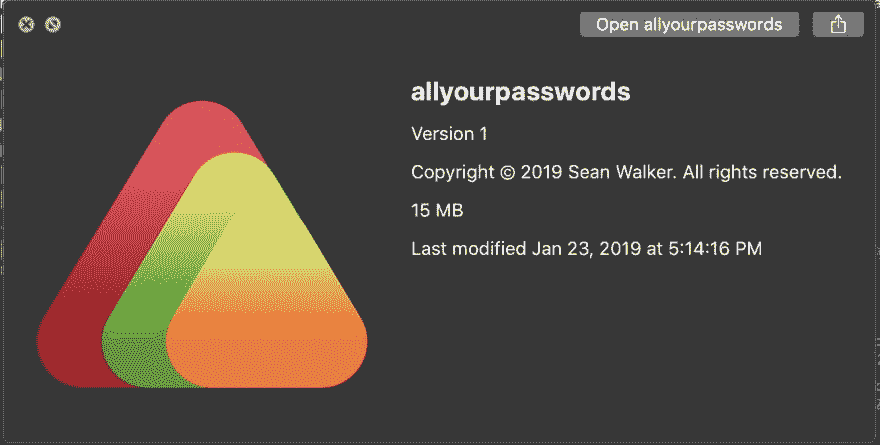

# 第 24 天:为讨厌云的人提供 Swift macOS 密码管理器

> 原文：<https://dev.to/swlkr/day-24-swift-macos-password-manager-for-people-who-hate-the-cloud-29gi>

[<——第 23 天去这里](https://dev.to/swlkr/day-23-swift-macos-password-manager-for-people-who-hate-the-cloud-4hn4)

📅2019 年 1 月 24 日
🚀[距离](https://www.producthunt.com/upcoming/all-your-passwords)发射还有 6 天
🔥23 日连胜
💰5.00 美元的价格(不要超过 0.99 美元，我讨厌这种策略)
🤑0 美元收入
📈0 客户
⌚️花了 37 个小时
💻102 个文件被更改，249709 个插入(+)，549 个删除(-)
🏁今天的目标:**把这个东西存档，验证并生成一个. app**

上午 11:03
好了，事情是这样的。

产品->存档->验证应用->上传应用的符号… ->下一步->自动管理签名->

->验证

在那之后，我以这个结束

**上午 11:28**
哦，事实证明，即使我不在 mac app store 中分发这个东西，我仍然需要在 app store connect 网站上制作一个应用程序，并且我需要制作一个新的通配符应用程序 ID 来使它工作。我的应用存档已通过验证！现在是时候弄清楚如何让它签名了，这样当你打开它时，它就不会告诉你这是恶意软件。

上午 11:29
这是一个快速的公证行动

**上午 11 点 33 分**
嘿！我成功地从 xcode 中提取了一个`.app`文件🎉

这比我昨天做的容易多了，只要看文件就行了🤦‍♂️.下班后我来拿这个。