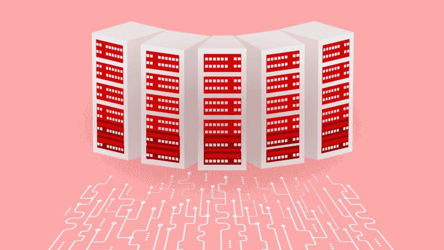

# 高度可用的 Redis 集群，在 ScaleGrid 上自动启动分片

> 原文：<https://dev.to/scalegrid/highly-available-redis-clusters-with-automated-sharding-launches-at-scalegrid-3o9b>

加利福尼亚州 PALO 阿尔托，2019 年 1 月 24 日—[数据库即服务(DBaaS)领域的新兴领导者 ScaleGrid](https://scalegrid.io/) ，刚刚宣布在其完全托管的 [Redis 托管](https://scalegrid.io/redis.html)计划中支持 Redis 集群。Redis 集群是 Redis 中可用的本机分片实现，Redis 是一个开源的内存数据结构项目，它允许您跨多个 Redis 节点自动分片，而不必依赖外部工具和实用程序。

ScaleGrid 在部署和管理云中复杂的分片集群方面并不是新手，因为他们自 2013 年以来就为其 [MongoDB 托管](https://scalegrid.io/mongodb.html)解决方案提供了最强大的分片工具之一。

随着 ScaleGrid 引入 Redis 集群，Redis 用户现在在设置数据库时只需点击几下鼠标就可以轻松创建分片集群。这是一个非常需要的特性，因为许多 Redis 部署很快使一个独立的 Redis 节点充满写入，并且需要将这些写入分散到多个节点。这是对 Redis 副本集解决方案的补充，可以轻松地将您的读取分散到多个节点上。Redis 集群的一些高级优势包括:

*   ### 高可用性

    利用 Redis 主副本配置确保高可用性和持久性，并利用一致的方法确保整个集群的可用性。
*   ### 水平和垂直可扩展性

    轻松在集群中添加或删除新的 Redis 节点和碎片，透明地停用或扩展单个节点，无需停机。
*   ### 本地解决方案

    无需任何外部代理或工具即可轻松部署 Redis 集群，并确保与您的独立 Redis 部署兼容。
*   ### 高性能

    确保与独立 Redis 部署相同级别的高性能。

Redis Clusters 可用于全球 14 个不同数据中心的 AWS 上的 Redis。ScaleGrid 继续为竞争对手 Amazon Elasticache、Redis Labs 提供[最强大的 Redis 托管和管理平台](https://scalegrid.io/redis/hosting-comparison.html)，并为定制主从配置、跨数据中心配置、完全 Redis 管理访问和对底层机器的 SSH 访问提供额外的高级支持。

数据库管理员、DevOps 工程师和开发人员等不断将其部署迁移到 ScaleGrid DBaaS 平台，因为他们在全球范围内越来越多地占据市场份额。这一新声明紧随 ScaleGrid 于 2018 年底推出完全托管的 [MySQL 托管](https://scalegrid.io/mysql.html)，以及计划于 2019 年 2 月发布的 [PostgreSQL 托管](https://scalegrid.io/postgresql.html)之后。