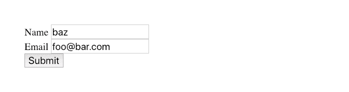

# 带有几行普通 JavaScript 的异步表单帖子

> 原文：<https://dev.to/rikschennink/async-form-posts-with-a-couple-lines-of-vanilla-javascript-1ia4>

在本教程中，我们将编写一个小的 JavaScript 事件处理程序，它将使用`fetch`来发布我们的 HTML 表单，而不是经典的同步重定向表单发布。我们正在构建一个基于渐进增强策略的解决方案，如果 JavaScript 加载失败，用户仍然可以提交我们的表单，但是如果 JavaScript 可用，表单提交将会更加顺畅。在构建这个解决方案时，我们将探索 JavaScript DOM APIs、方便的 HTML 结构以及与可访问性相关的主题。

让我们从建立一个表单开始。

> 本文最初发表于[我的个人博客](https://pqina.nl/blog/async-form-posts-with-a-couple-lines-of-vanilla-javascript/)

## 设置 HTML

让我们建立一个简讯订阅表单。

我们的表单将有一个可选的**姓名**字段和一个**电子邮件**字段，我们将根据需要进行标记。我们将`required`属性分配给我们的电子邮件字段，因此如果该字段为空，则表单无法发布。此外，我们将字段类型设置为`email`，这将触发电子邮件验证，并在移动设备上显示一个漂亮的电子邮件键盘布局。

```
<form action="subscribe.php" method="POST">

  Name
  <input type="text" name="name"/>

  Email
  <input type="email" name="email" required/>

  <button type="submit">Submit</button>

</form> 
```

Enter fullscreen mode Exit fullscreen mode

我们的表单将发布到一个`subscribe.php`页面，在我们的情况下，这个页面只不过是一个段落，向用户确认她已经订阅了时事通讯。

```
<!doctype html>
<html lang="en">
  <head>
    <meta charset="UTF-8">
    Successfully subscribed!
  </head>
  <body>
    <p>Successfully subscribed!</p>
  </body>
</html> 
```

Enter fullscreen mode Exit fullscreen mode

让我们快速回到我们的`<form>`标签来做一些微小的改进。

如果我们的样式表由于某种原因无法加载，它当前呈现如下:

[](https://res.cloudinary.com/practicaldev/image/fetch/s--Sd1Tkm3V--/c_limit%2Cf_auto%2Cfl_progressive%2Cq_auto%2Cw_880/https://thepracticaldev.s3.amazonaws.com/i/997ymo8wel3vox5h249b.png)

这对我们的小表单来说还不算太糟糕，但是想象一下这是一个更大的表单，这会非常混乱，因为每个字段都在同一行上。让我们将每个标签和字段组合包装在一个`<div>`中。

```
<form action="subscribe.php" method="POST">

  <div>
    Name
    <input type="text" name="name"/>
  </div>

  <div>
    Email
    <input type="email" name="email" required/>
  </div>

  <button type="submit">Submit</button>

</form> 
```

Enter fullscreen mode Exit fullscreen mode

现在每个字段都在新的一行上呈现。

[](https://res.cloudinary.com/practicaldev/image/fetch/s--GvmE3-XE--/c_limit%2Cf_auto%2Cfl_progressive%2Cq_auto%2Cw_880/https://thepracticaldev.s3.amazonaws.com/i/bca1b37gcabmnbtoqdy4.png)

另一个改进是将字段名包装在一个`<label>`元素中，这样我们可以显式地将每个标签链接到它的兄弟输入字段。这允许用户单击标签来聚焦字段，但也触发辅助技术，如屏幕阅读器，以便在字段获得焦点时读出字段的标签。

```
<form action="subscribe.php" method="POST">

  <div>
    <label for="name">Name</label>
    <input type="text" name="name" id="name"/>
  </div>

  <div>
    <label for="email">Email</label>
    <input type="email" name="email" id="email" required/>
  </div>

  <button type="submit">Submit</button>

</form> 
```

Enter fullscreen mode Exit fullscreen mode

小小的努力带来了巨大的 UX 和可访问性收益。精彩！

表单完成后，让我们写一些 JavaScript。

## 编写表单提交处理程序

我们将编写一个脚本，将页面上的所有表单转换成异步表单。

我们不需要访问页面上的所有表单来设置它，我们可以简单地监听`document`上的`'submit'`事件，并在一个事件处理程序中处理所有表单帖子。事件目标将始终是提交的表单，因此我们可以使用`e.target`访问表单元素

为了防止经典表单提交的发生，我们可以在`event`对象上使用`preventDefault`方法，这将防止浏览器执行默认操作。

如果您只想处理单个表单，可以通过将事件监听器附加到特定的表单元素来实现。

```
document.addEventListener('submit', e => {

  // Store reference to form to make later code easier to read
  const form = e.target;

  // Prevent the default form submit
  e.preventDefault();

}); 
```

Enter fullscreen mode Exit fullscreen mode

好了，我们现在准备发送表单数据。

这个动作由两部分组成，发送部分和数据部分。

为了发送数据，我们可以使用 [`fetch`](https://developer.mozilla.org/en-US/docs/Web/API/Fetch_API) API，为了收集表单数据，我们可以使用一个超级方便的 API[`FormData`](https://developer.mozilla.org/en-US/docs/Web/API/FormData)。

```
document.addEventListener('submit', e => {

  // Store reference to form to make later code easier to read
  const form = e.target;

  // Post data using the Fetch API
  fetch(form.action, {
    method: form.method,
    body: new FormData(form)
  })

  // Prevent the default form submit
  e.preventDefault();

}); 
```

Enter fullscreen mode Exit fullscreen mode

是的，我不骗你，就是这么简单。

`fetch`的第一个参数是一个 URL，所以我们传递包含`subscribe.php`的`form.action`属性。然后我们传递一个配置对象，该对象包含要使用的`method`，它是从`form.method`属性(`POST`)中获得的。最后，我们需要在`body`属性中传递数据。我们可以将`form`元素作为参数传递给`FormData`构造函数，它将为我们创建一个类似于经典表单 post 的对象，并作为`multipart/form-data`发布。

[Michael Scharnagl](https://dev.to/justmarkup) 建议将`preventDefault()`调用移到最后，这样可以确保只有当所有的 JavaScript 都运行时，经典提交才会被阻止。

我们完成了！去酒吧！

[](https://res.cloudinary.com/practicaldev/image/fetch/s--RlZsdUme--/c_limit%2Cf_auto%2Cfl_progressive%2Cq_66%2Cw_880/https://thepracticaldev.s3.amazonaws.com/i/czf30mf2tyfhisref0c1.gif)

当然，有几件事我们忘记了，这基本上是非常快乐的流程，所以抓住那些马，放下那一品脱。我们如何处理连接错误？如何通知用户订阅成功呢？当订阅页面被请求时会发生什么？

## 边缘病例

让我们首先处理通知用户一个成功的时事通讯订阅。

### 显示成功状态

我们可以通过在 subscribe.php 页面上提取消息并显示它而不是表单元素来做到这一点。让我们在`fetch`语句之后继续，并处理`fetch`调用的解决案例。

首先，我们需要将响应转换成基于`text`的响应。然后，我们可以使用 [`DOMParser`](https://developer.mozilla.org/en-US/docs/Web/API/DOMParser) API 将这个基于文本的响应转换成一个实际的 HTML 文档，我们告诉它解析我们的文本，并将其视为`text/html`，我们返回这个结果，以便在下一个`then`中可用

现在我们有了一个可以处理的 HTML 文档(`doc`)，我们终于可以用成功状态替换表单了。我们将把`body.innerHTML`复制到我们的`result.innerHTML`，然后用新创建的结果元素替换我们的表单。最后但同样重要的是，我们将焦点转移到 result 元素，这样屏幕阅读器用户和键盘用户就可以从页面中的该点继续导航。

```
document.addEventListener('submit', e => {

  // Store reference to form to make later code easier to read
  const form = e.target;

  // Post data using the Fetch API
  fetch(form.action, {
      method: form.method,
      body: new FormData(form)
    })
    // We turn the response into text as we expect HTML
    .then(res => res.text())

    // Let's turn it into an HTML document
    .then(text => new DOMParser().parseFromString(text, 'text/html'))

    // Now we have a document to work with let's replace the <form>
    .then(doc => {

      // Create result message container and copy HTML from doc
      const result = document.createElement('div');
      result.innerHTML = doc.body.innerHTML;

      // Allow focussing this element with JavaScript
      result.tabIndex = -1;

      // And replace the form with the response children
      form.parentNode.replaceChild(result, form);

      // Move focus to the status message
      result.focus();

    });

  // Prevent the default form submit
  e.preventDefault();

}); 
```

Enter fullscreen mode Exit fullscreen mode

### 连接故障

如果我们的连接失败，`fetch`呼叫将被拒绝，我们可以用`catch`来处理

首先，我们用一条消息来扩展我们的 HTML 表单，以显示连接失败时的情况，让我们把它放在 submit 按钮的上方，这样在出错时就可以清楚地看到它。

```
<form action="subscribe.php" method="POST">

  <div>
    <label for="name">Name</label>
    <input type="text" name="name" id="name"/>
  </div>

  <div>
    <label for="email">Email</label>
    <input type="email" name="email" id="email" required/>
  </div>

  <p role="alert" hidden>Connection failure, please try again.</p>

  <button type="submit">Submit</button>

</form> 
```

Enter fullscreen mode Exit fullscreen mode

通过使用`hidden`属性，我们对所有人隐藏了`<p>`。我们在段落中添加了一个`role="alert"`,一旦段落内容可见，它就会触发屏幕阅读器大声读出段落内容。

现在让我们来处理 JavaScript 方面的事情。

我们放在`fetch`拒绝处理程序(`catch`)中的代码将选择我们的警告段落并显示给用户。

```
document.addEventListener('submit', e => {

  // Store reference to form to make later code easier to read
  const form = e.target;

  // Post data using the Fetch API
  fetch(form.action, {
      method: form.method,
      body: new FormData(form)
    })
    // We turn the response into text as we expect HTML
    .then(res => res.text())

    // Let's turn it into an HTML document
    .then(text => new DOMParser().parseFromString(text, 'text/html'))

    // Now we have a document to work with let's replace the <form>
    .then(doc => {

      // Create result message container and copy HTML from doc
      const result = document.createElement('div');
      result.innerHTML = doc.body.innerHTML;

      // Allow focussing this element with JavaScript
      result.tabIndex = -1;

      // And replace the form with the response children
      form.parentNode.replaceChild(result, form);

      // Move focus to the status message
      result.focus();

    })
    .catch(err => {

      // Some form of connection failure
      form.querySelector('[role=alert]').hidden = false;

    });

  // Make sure connection failure message is hidden
  form.querySelector('[role=alert]').hidden = true;

  // Prevent the default form submit
  e.preventDefault();

}); 
```

Enter fullscreen mode Exit fullscreen mode

我们用 CSS 属性选择器`[role=alert]`选择我们的警告段落。不需要类名。这并不是说我们将来可能不需要，但有时按属性选择也可以。

我想我们已经解决了边缘问题，让我们把它润色一下。

## 加载时锁定字段

如果表单在发送到服务器时锁定所有输入字段就好了。这可以防止用户多次单击提交按钮，也可以防止用户在等待过程完成时编辑字段。

我们可以使用`form.elements`属性来选择所有的表单字段，然后禁用每个字段。

*如果您的表单中有一个`<fieldset>`，您可以禁用字段集，这将禁用其中的所有字段*

```
document.addEventListener('submit', e => {

  // Store reference to form to make later code easier to read
  const form = e.target;

  // Post data using the Fetch API
  fetch(form.action, {
      method: form.method,
      body: new FormData(form)
    })
    // We turn the response into text as we expect HTML
    .then(res => res.text())

    // Let's turn it into an HTML document
    .then(text => new DOMParser().parseFromString(text, 'text/html'))

    // Now we have a document to work with let's replace the <form>
    .then(doc => {

      // Create result message container and copy HTML from doc
      const result = document.createElement('div');
      result.innerHTML = doc.body.innerHTML;

      // Allow focussing this element with JavaScript
      result.tabIndex = -1;

      // And replace the form with the response children
      form.parentNode.replaceChild(result, form);

      // Move focus to the status message
      result.focus();

    })
    .catch(err => {

      // Show error message
      form.querySelector('[role=alert]').hidden = false;

    });

  // Disable all form elements to prevent further input
  Array.from(form.elements).forEach(field => field.disabled = true);

  // Make sure connection failure message is hidden
  form.querySelector('[role=alert]').hidden = true;

  // Prevent the default form submit
  e.preventDefault();

}); 
```

Enter fullscreen mode Exit fullscreen mode

需要使用`Array.from`将`form.elements`转换成一个数组，以便我们使用`forEach`对其进行循环，并在每个字段的`true`上设置`disable`属性。

现在我们陷入了一个尴尬的境地，因为如果`fetch`失败了，我们在`catch`中结束了，所有的表单域都被禁用，我们不能再使用我们的表单。让我们通过向`catch`处理程序添加相同的语句来解决这个问题，但是我们不是禁用字段，而是启用字段。

```
.catch(err => {

  // Unlock form elements
  Array.from(form.elements).forEach(field => field.disabled = false);

  // Show error message
  form.querySelector('[role=alert]').hidden = false;

}); 
```

Enter fullscreen mode Exit fullscreen mode

信不信由你，我们仍未脱离险境。因为我们禁用了所有元素，所以浏览器将焦点移到了`<body>`元素。如果`fetch`失败，我们将在`catch`处理程序中结束，启用我们的表单元素，但是用户已经丢失了她在页面上的位置(这对于使用键盘导航的用户，或者必须依赖屏幕阅读器的用户尤其有用)。

我们可以存储当前聚焦的元素`document.activeElement`，然后稍后当我们启用`catch`处理程序中的所有字段时，用`element.focus()`恢复焦点。在等待响应时，我们将把焦点转移到表单元素本身。

```
document.addEventListener('submit', e => {

  // Store reference to form to make later code easier to read
  const form = e.target;

  // Post data using the Fetch API
  fetch(form.action, {
      method: form.method,
      body: new FormData(form)
    })
    // We turn the response into text as we expect HTML
    .then(res => res.text())

    // Let's turn it into an HTML document
    .then(text => new DOMParser().parseFromString(text, 'text/html'))

    // Now we have a document to work with let's replace the <form>
    .then(doc => {

      // Create result message container and copy HTML from doc
      const result = document.createElement('div');
      result.innerHTML = doc.body.innerHTML;

      // Allow focussing this element with JavaScript
      result.tabIndex = -1;

      // And replace the form with the response children
      form.parentNode.replaceChild(result, form);

      // Move focus to the status message
      result.focus();

    })
    .catch(err => {

      // Unlock form elements
      Array.from(form.elements).forEach(field => field.disabled = false);

      // Return focus to active element
      lastActive.focus();

      // Show error message
      form.querySelector('[role=alert]').hidden = false;

    });

  // Before we disable all the fields, remember the last active field
  const lastActive = document.activeElement;

  // Move focus to form while we wait for a response from the server
  form.tabIndex = -1;
  form.focus();

  // Disable all form elements to prevent further input
  Array.from(form.elements).forEach(field => field.disabled = true);

  // Make sure connection failure message is hidden
  form.querySelector('[role=alert]').hidden = true;

  // Prevent the default form submit
  e.preventDefault();

}); 
```

Enter fullscreen mode Exit fullscreen mode

我承认这不是几行 JavaScript，但老实说，里面有很多评论。

### 显示忙碌状态

最后，最好显示一个忙碌的状态，让用户知道正在发生什么。

*请注意，虽然`fetch`很棒，但它目前不支持设置超时，也不支持进度事件，所以对于可能需要一段时间的繁忙状态，使用`XMLHttpRequest`也没什么不好，甚至是个好主意。*

也就是说，是时候给我们的警告信息增加一个类别了(该死的，你超过我了！).我们将它命名为`status-failure`，并在它旁边添加我们的繁忙段落。

```
<form action="subscribe.php" method="POST">

  <div>
    <label for="name">Name</label>
    <input type="text" name="name" id="name"/>
  </div>

  <div>
    <label for="email">Email</label>
    <input type="email" name="email" id="email" required/>
  </div>

  <p role="alert" class="status-failure" hidden>Connection failure, please try again.</p>

  <p role="alert" class="status-busy" hidden>Busy sending data, please wait.</p>

  <button type="submit">Submit</button>

</form> 
```

Enter fullscreen mode Exit fullscreen mode

一旦表单被提交，我们将显示忙碌状态，并在到达`catch`时隐藏它。当数据被正确提交时，整个表单被替换，因此不需要在成功流中再次隐藏它。

当显示忙碌状态时，我们不是将焦点移到表单上，而是将它移到忙碌状态。这会触发屏幕阅读器大声读出它，这样用户就知道表单正忙。

我们在事件处理程序的开始存储了对两个状态消息的引用，这使得后面的代码更容易阅读。

```
document.addEventListener('submit', e => {

  // Store reference to form to make later code easier to read
  const form = e.target;

  // get status message references
  const statusBusy = form.querySelector('.status-busy');
  const statusFailure = form.querySelector('.status-failure');

  // Post data using the Fetch API
  fetch(form.action, {
      method: form.method,
      body: new FormData(form)
    })
    // We turn the response into text as we expect HTML
    .then(res => res.text())

    // Let's turn it into an HTML document
    .then(text => new DOMParser().parseFromString(text, 'text/html'))

    // Now we have a document to work with let's replace the <form>
    .then(doc => {

      // Create result message container and copy HTML from doc
      const result = document.createElement('div');
      result.innerHTML = doc.body.innerHTML;

      // Allow focussing this element with JavaScript
      result.tabIndex = -1;

      // And replace the form with the response children
      form.parentNode.replaceChild(result, form);

      // Move focus to the status message
      result.focus();

    })
    .catch(err => {

      // Unlock form elements
      Array.from(form.elements).forEach(field => field.disabled = false);

      // Return focus to active element
      lastActive.focus();

      // Hide the busy state
      statusBusy.hidden = false;

      // Show error message
      statusFailure.hidden = false;

    });

  // Before we disable all the fields, remember the last active field
  const lastActive = document.activeElement;

  // Show busy state and move focus to it
  statusBusy.hidden = false;
  statusBusy.tabIndex = -1;
  statusBusy.focus();

  // Disable all form elements to prevent further input
  Array.from(form.elements).forEach(field => field.disabled = true);

  // Make sure connection failure message is hidden
  statusFailure.hidden = true;

  // Prevent the default form submit
  e.preventDefault();

}); 
```

Enter fullscreen mode Exit fullscreen mode

**就是这样！**

我们跳过了前端开发的 CSS 部分，您可以使用 CSS 框架或者应用您自己的定制样式。这个例子应该为进一步的定制提供一个很好的起点。

最后一件事。[不要移除焦点轮廓](http://www.outlinenone.com)。

## 结论

我们已经为表单编写了一个语义 HTML 结构，然后在此基础上使用普通 JavaScript 构建一个异步上传体验。我们已经确保使用键盘的用户和依赖屏幕阅读器等辅助技术的用户可以访问我们的表单。因为我们遵循了渐进增强策略，所以即使我们的 JavaScript 失败，表单仍然可以工作。

我希望我们已经触及了一些新的 API 和方法供您使用，如果您有任何问题，请告诉我！