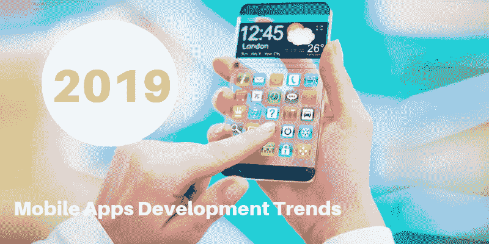

# 查看 2019 年的移动应用发展趋势

> 原文：<https://dev.to/appdevelopmentagency/check-out-these-mobile-apps-development-trends-for-2019-o53>

2018 年，智能手机领域的增长首次出现下滑。不，市场仍在以惊人的速度扩张，但没有以前那么快了。这清楚地表明，拥有约 30 亿用户的市场正达到一个关键点，增长引擎正从硬件转向软件和服务。毕竟，尽管智能手机销售疲软，但手机应用用户的市场比以往任何时候都大。

也就是说，对于严重依赖移动应用的企业来说，2019 年是一个巨大的增长机会，因为它们随时都会随着新趋势而发展。如果你是这样一家企业，以下是 2019 年你需要注意的移动应用趋势:

## 物联网

长期以来，物联网一直被称为“新兴”技术，但 2019 年将最终成为实现其真正潜力的一年。其不可避免的激增有两个关键原因。

首先，现在几乎每个人都拥有智能手机；人们开始购买其他智能设备，从手表和健身带到扬声器和家用电器。还有智能马桶、枕头，甚至情趣用品——所有这些最终都需要移动应用程序作为界面。也就是说，购买物联网设备的人越多，对移动应用的需求就会越大。

第二，5G 将于 2019 年第一季度推出，鉴于其属性-低延迟、高弹性和高带宽非常适合物联网生态系统，我们预计该领域将出现大规模增长，如上所述，物联网设备的增长有效地转化为移动应用的增长。

## AR 和(有点)VR

虽然 AR 也已经存在了一段时间，但 2018 年是重要的一年，因为 iOS 和 Android 都发布了他们的 AR SDK-ARKit 和 ARCore。它们发布已经有几个月了——足够开发人员玩一玩，跨越最初的学习曲线。2019 年，我们可以预计该技术将随着新产品的出现以及与现有流行应用的集成而变得更加突出。

另一方面，虚拟现实似乎仍停留在早期采用阶段，尽管 2019 年该领域可能会有一些活动——可能会有一些新的耳机或与游戏机的更多集成，但它几乎没有机会占领广泛的消费者市场。

## 人工智能&机器学习

随着今年智能设备和移动应用的数量激增，企业将需要强大的智能工具来理解他们将收集的海量数据。目前，人工智能和人工智能仅由具有大规模足迹的大型应用程序部署，但随着这些工具变得更便宜和更容易获得(由于与云服务的集成)，越来越多的企业将转向构建智能应用程序。

上述三种技术可以被认为是未来一年移动应用程序发展趋势的主要部分。除此之外，还有许多其他较小的趋势，我们结合起来塑造了 2019 年的应用开发行业。其中一些趋势包括:

## PWAs

谷歌长期以来一直在推动 PWAs，也有相当多的流行应用程序已经采用了该平台。但鉴于 iOS 在 2018 年早些时候发布了对 PWAs 的支持，其增长前景大幅提升。关键是，许多寻求经济高效的方法来接触大量移动用户的企业将越来越倾向于部署 PWAs。

## 支付网关和集成

2018 年可以很容易地被称为移动钱包年，有许多新产品和越来越受欢迎。但随着我们向前发展，企业将尝试用统一网关来弥合高度分散的空间，以实现无缝交易。

## 僵尸工具

随着机器人变得越来越智能，越来越容易制造，它们吸引着企业，因为它们有明显的好处，比如降低成本和提高客户满意度。既然它们现在已经证明了自己的价值，你可以期待许多应用程序要么完全转向机器人，要么至少在某种程度上集成它们。无论如何，机器人开发将在 2019 年出现大幅增长。

如果你已经注意到，2019 年将不是一些全新技术的一年，而是许多长期谈论的技术实现其真正潜力的一年。因为顶级应用程序开发公司已经在这些领域积累了很长一段时间的专业知识，所以那些需要跟上这些移动应用程序趋势的企业并不缺乏技能。